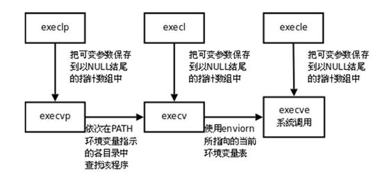

### ps ==> process status

查看系统的进程状态的命令

选项：

​    a：显示现行终端机下的所有进程，包括其他用户的进程；

​    u：显示进程拥有者、状态、资源占用等的详细信息（注意有“-”和无“-”的区别）；

​    x：显示没有控制终端的进程。通常与 a 这个参数一起使用，可列出较完整信息；

​    -e：显示所有进程；

​    -f：完整输出显示进程之间的父子关系；**PPID就是父进程PID**

​    -l：较长、较详细的将该 PID 的的信息列出；

​    -o：自定义显示的字段；

**注：ps -aux 不同于 ps aux**

具体的不同在于，-ux表示查看用户x相关的进程，**但是已经抛弃了，现在默认转化为ps aux**；所以记得要使用ps aux，这样才不会有bug；

\# ps -aux

USER        PID %CPU %MEM    VSZ   RSS TTY      STAT START   TIME COMMAND

root          1  0.0  0.1  19356   968 ?        Ss   08:29   0:00 /sbin/init

root          2  0.0  0.0      0     0 ?        S    08:29   0:00 [kthreadd]

各字段说明：

USER: 运行进程的用户

PID： 进程ID

%CPU: CPU占用率

%MEM: 内存占用率

**VSZ： 占用虚拟内存**

**RSS: 占用实际内存 驻留内存**

**TTY： 进程运行的终端**

STAT： 进程状态 man ps (/STATE)

​     R 运行

​     S 可中断睡眠 Sleep

​     D 不可中断睡眠

​     T 停止的进程

​     Z 僵尸进程

​     X 死掉的进程

​          Ss s进程的领导者，父进程

​          S< <优先级较高的进程

​          SN N优先级较低的进程

​          R+ +表示**

前台的进程组

​          Sl 以线程的方式运行

START: 进程的启动时间

TIME： 进程占用CPU的总时间

COMMAND： 进程文件，进程名

**-e（显示所有进程）和-o（自定义显示字符）配合使用**

1. ps -eo pid，stat，pri，uid --sort uid，显示这四列信息，通过uid升序排序；
2. ps aux --sort -pmem|head -15，按照内存占用率排序，显示占用率**最大**的15个进程；
3. ps -aux|sort -k4nr|head，sort表示排序，k4表示按照第四列排序，n表示根据数值排序，r表示翻转，即降序排序；
4. ps -p 252 -L，详细查看PID为252的进程的状态；
5. **实时监控进程**：使用watch -n 1 ‘ps -aux --sort -pmem’中-n表示周期，即以1为周期，不断执行‘ps -aux --sort -pmem’这个语句，动态监视系统占用；
6. pstree查看进程树；


### awk

awk的简介：

　1. awk是一种编程语言，用于对文本和数据进行处理的

　2. 具有强大的**文本格式化**能力

　3. 利用命令awk，可以将一些文本整理成为我们想要的样子

　4. 命令awk是**逐行**进行处理的

awk、sed、grep的区别：

1. 命令grep，更适合**单纯的查找或匹配文本**

　2. 命令sed，更适合**对匹配到的文本进行编辑**

　3. 命令awk，更适合文本格式化，**对文本进行较复杂的格式处理**


**内置变量说明：**

ARGC 命令行参数个数 
ARGV 命令行参数排列 
ENVIRON 支持队列中系统环境变量的使用 
FILENAME awk浏览的文件名 
FNR 浏览文件的记录数 
**FS 设置输入域分隔符，等价于命令行 -F选项 **
NF 浏览记录的域的个数 
NR 已读的记录数 
OFS 输出域分隔符 
ORS 输出记录分隔符 
RS 控制记录分隔符


**基本使用**

　1. pattern包括两种特殊模式，分别是BEGIN和END

　　（1）BEGIN模式，是指命令在处理文本**之前**执行；；

　　（2）END模式，是指命令在处理文本**之后**执行；

　　（3）BEGIN模式和END模式同时存在时，其中，**BEGIN与END之间的{}相当于一个循环体，对文件中的每一行进行处理；**

2. **注意，awk的工作逻辑是一行一行处理，即循环处理每一行。**例如：

   test中的内容是

   hello world.

   goodbye world.

   如果执行awk '{print $1"\\t"$2}' test，就会显示

   hello          world.

   goodbye   world.

   默认是使用空格分隔，$1表示用空格分隔之后的第一个字符串，$2就是第二个，中间插入一个制表符，因此得到的输出；

3. **分隔符指定**：使用-F指定分隔符，例如：

   awk -F: '{print $1}' test.log表示**使用“：”作为分隔符，然后打印每一行分隔后的第一部分**，如果不加默认为空格；如果要使用多个分隔符，可以使用：

   awk -F'[,:]' '{print $1}' test.log表示**使用“：”或者“，”作为分隔符将每一行进行分割，打印第一个分割后的子串；**

4. 使用FILENAME，使用

   awk '{print FILENAME}' test.log

   就会打印与行数相等的n行test.log；

5. **字段的数量**：每一行进行分割之后，$n表示第n个字段，其中**$0表示整行**，使用：

   awk 'NF>2{print}' test.log表示当某一行分割之后字段数大于2的时候就将这一行打印出来；

6. **打印指定的行：**使用NR可以判断当前的行数，使用：

   awk 'NR==2|NR==3{print}' test.log 表示打印第2和第3行；

7. **使用变量**：使用-v可以指定变量，并且可以用于后续使用：

8. **指定分隔符：**使用OFS可以在改变默认情况下的分隔符，例如：

   awk '{print $1,$2}' OFS=# test.log  表示显示每一行的前两个字段，两个字段之间用#连接；

更多用法举例：

1、显示 /etc/passwd 中含有 root 的行
awk '/root/'  /etc/passwd
2、以 : 为分隔，显示/etc/passwd中每行的第1和第7个字段
awk -F ":" '{print $1,$7}' /etc/passwd  或  awk 'BEGIN{FS=":"}{print $1,$7}' /etc/passwd
3、以 : 为分隔，显示/etc/passwd中含有 root 的行的第1和第7个字段
awk -F ":" '/root/{print $1,$7}' /etc/passwd
4、以 : 为分隔，显示/etc/passwd中以 root 开头行的第1和第7个字段
awk -F ":" '/^root/{print $1,$7}' /etc/passwd
5、以 : 为分隔，显示/etc/passwd中第3个字段大于999的行的第1和第7个字段
awk -F ":" '$3>999{print $1,$7}'  /etc/passwd
6、以 : 为分隔，显示/etc/passwd中第7个字段包含bash的行的第1和第7个字段
awk -F ":" '$7~"bash"{print $1,$7}' /etc/passwd
7、以 : 为分隔，显示/etc/passwd中第7个字段不包含bash的行的第1和第7个字段
awk -F ":" '$7!~"nologin"{print $1,$7}'  /etc/passwd
8、以 : 为分隔，显示$3>999并且第7个字段包含bash的行的第1和第7个字段
awk -F ":" '$3>999&&$7~"bash"{print $1,$7}' /etc/passwd
9、以 : 为分隔，显示$3>999或第7个字段包含bash的行的第1和第7个字段
awk -F ":" '$3>999||$7~"bash"{print $1,$7}' /etc/passwd


### sed

一个用于编辑文本内容的命令，其很多操作跟vim很类似。

**操作说明：**

- -e<script>或--expression=<script> 以选项中指定的script来处理输入的文本文件。
- -f<script文件>或--file=<script文件> 以选项中指定的script文件来处理输入的文本文件。
- -h或--help 显示帮助。
- -n或--quiet或--silent 仅显示script处理后的结果。
- -V或--version 显示版本信息。
- a ：新增， a 的后面可以接字串，而这些字串会在新的一行出现(目前的下一行)～
- c ：取代， c 的后面可以接字串，这些字串可以取代 n1,n2 之间的行！
- d ：删除，因为是删除啊，所以 d 后面通常不接任何咚咚；
- i ：插入， i 的后面可以接字串，而这些字串会在新的一行出现(目前的上一行)；
- p ：打印，亦即将某个选择的数据印出。通常 p 会与参数 sed -n 一起运行～
- s ：取代，可以直接进行取代的工作哩！通常这个 s 的动作可以搭配正规表示法！例如 1,20s/old/new/g 就是啦！

**操作实例：**

1. sed -e ‘4anewline’ test，在文件的第四行后面**新插入一行**，输入newline；这里的4表示第四行后面，a表示append后面插入；newline就是插入的信息；**这种操作不会影响真实文件**；
2. sed -e ‘2，3d’ -e ‘3inewline\nnewline’；这里执行了两个命令，首先是删除第2、3行；然后在第3行前面插入newline；然后换行符\n；新的一行还是插入newline；
3. sed -n ‘1，2p’；这里显示第1、2行，这里p就是print的意思；-n表示**只显示受到影响的行**，不加会全部显示之后再显示一次第1、2行；
4. sed ‘2，3c No line’；c表示替换，将2、3行替换成一行No line；
5. sed -n ‘/root/p’；搜索包含root的那些行并且显示出来；
6. sed ‘s/hello/goodbye/g’；表示将hello替换为goodbye；**这里的g表示这一行全局替换，如果没有g表示只替换每一行第一次遇到的hello；**
7. sed ‘s/linux//’；表示去掉每一行的第一个linux；sed ‘s/.linux//’表示去掉linux及其前面的字符；sed 's/.\*linux//'表示去掉**从开头开始到linux**所有的字符；sed ‘s/linux.\*//’表示去掉从linux开始到末尾的所有字符；
8. **如果需要真实修改文件，就加上-i；**
9. 使用-f会加载文件脚本执行；
10. sed ’s/^lol//‘ 只去掉开头的lol；相对的，sed ’s/lol$//‘ 只去掉末尾的lol；


### echo

**操作说明**

1. -n，输出之后不要换行；
2. -e，**使用了这个之后转义字符才会有效**，但是必须放在“\n”这样才算使用，否则不算；
3. \>，重定向，相当于w，覆盖文件内容；
4. \>>，重定向，相当于a，追加内容；

**实例说明**

1. echo -n “\nhello”，显示\nhello并且不换行；
2. echo -e “\nhello”，先换行，然后显示hello；
3. echo -e “\nhello” >> test，在文件test后面追加新的一行，然后写入hello；
4. 一般echo可以写在批处理文件中，然后就可以显示结果在我们的窗口里面；
5. echo $PATH打印环境变量；
6. Name=“yoyo”，echo $Name；可以打印刚才定义的变量，这两行是分别输出的；

 


### netstat ==> network status

是一个监控TCP/IP网络的非常有用的工具，它可以显示路由表、实际的网络连接以及每一个网络接口设备的状态信息。

**字段说明：**

1. Proto：连接的协议；
2. Recv-Q：接受队列；
3. Send-Q：发送队列；
4. local Address：本地地址；
5. foreign Address：外部地址；
6. state：状态

**选项说明：**

-a (all) 显示所有选项，默认不显示LISTEN相关。
-t (tcp) 仅显示tcp相关选项。
-u (udp) 仅显示udp相关选项。
-n **以ip:port形式显示本机的端口。**
**-l 仅列出有在 Listen (监听) 的服务状态。**

**-p 显示建立相关链接的程序名（直接netstat -p会看到mysql这个服务，如果netstat -n会看到3306这个端口）**
-r 显示路由信息，路由表
-e 显示扩展信息，例如uid等
**-s 按各个协议进行统计（这个有点神奇，还可以看IP、ICMP的统计信息）**
**-c 每隔一个固定时间，执行该netstat命令。**

**LISTEN和LISTENING的状态只有用-a或者-l才能看到。**

1. 如果要显示tcp或者udp记得带上a，即netstat -at或者netstat -au才能显示更多信息；

2. 监听也分为udp和tcp，可以使用netstat -lt查看监听tcp的端口；

3. **显示所有端口的统计信息 netstat -s；统计tcp连接数使用netstat -st；**

4. 如果使用-n可以将用户名等信息显示为数字，隐藏真实信息；

5. 使用netstat -c 3可以实现每隔3s刷新一次查询；

6. 使用**netstat -np|grep ‘：80’**查看运行在端口80的进程的pid；

7. **查看连接某服务端口最多的的IP地址（前20个）**

   ```
   #netstat -nat | grep "10.1.62.23:443" |awk '{print $5}'|awk -F: '{print $1}'|sort|uniq -c|sort -nr|head -20
   ```

8. TCP各种状态列表 

   #netstat -nat |awk '{print $6}'

   统计数量

   #netstat -nat |awk '{print $6}'|sort|uniq -c

   排序

   #netstat -nat |awk '{print $6}'|sort|uniq -c|sort -rn

   #netstat -n | awk '/^tcp/ {++S[$NF]} END {for(a in S) print a, S[a]}'

9. 直接统计tcp监听的数量

   #netstat -ant | wc -l

10. **netstat -rn------>显示当前系统路由信息**

11. 显示网络接口，类似于ifconfig，显示详细信息，使用 netstat -ie；


### lsof ==> list open files

lsof(list open files)是一个**列出当前系统打开文件的工具**。在linux环境下，任何事物都以文件的形式存在，通过文件不仅仅可以访问常规数据，还可以访问网络连接和硬件。所以如传输控制协议 (TCP) 和用户数据报协议 (UDP) 套接字等，系统在后台都为该应用程序分配了一个文件描述符，无论这个文件的本质如何，该文件描述符为应用程序与基础操作系统之间的交互提供了通用接口。因为应用程序打开文件的描述符列表提供了大量关于这个应用程序本身的信息，因此通过lsof工具能够查看这个列表对系统监测以及排错将是很有帮助的。

**字段说明**：

COMMAND：进程的名称 

PID：进程标识符

USER：进程所有者

FD：文件描述符，应用程序通过文件描述符识别该文件。

​		其中 cwd 表示当前的工作目录；rtd 表示根目录；txt 表示程序的可执行文件；mem 表示内存映射文件：

​		还有一些例如10u，10表示返回值，u表示正在被打开写入的一个文件；此外还有r，w分别表示只读和只写；  		**W表示该进程对此文件有写锁，此时只有他能打开这个文件；**

TYPE：文件类型，如DIR、REG等

DEVICE：指定磁盘的名称

SIZE：文件的大小

**NODE：索引节点（文件在磁盘上的标识**）

**硬链接和软链接?**

1. **硬链接(hard link)：**

   　　　　A是B的硬链接（A和B都是文件名），则A的目录项中的inode节点号与B的目录项中的inode节点号相同，即一个inode节点对应两个不同的文件名，两个文件名指向同一个文件，A和B对文件系统来说是完全平等的。如果删除了其中一个，对另外一个没有影响。**每增加一个文件名，inode节点上的链接数增加一，每删除一个对应的文件名，inode节点上的链接数减一，直到为0，inode节点和对应的数据块被回收**。

2. **软链接(soft link)：**

   　　　　A是B的软链接（A和B都是文件名），A的目录项中的inode节点号与B的目录项中的inode节点号不相同，A和B指向的是两个不同的inode，继而指向两块不同的数据块。但是**A的数据块中存放的只是B的路径名（可以根据这个找到B的目录项）**。A和B之间是“主从”关系，如果B被删除了，A仍然存在（因为两个是不同的文件），但指向的是一个无效的链接。

3. 区别：

   硬链接：

   　　a.不能对目录创建硬链接，原因有几种，最重要的是：文件系统不能存在链接环（目录创建时的".."除外，这个系统可以识别出来）,存在环的后果会导致例如文件遍历等操作的混乱(du，pwd等命令的运作原理就是基于文件硬链接，顺便一提，ls -l结果的第二列也是文件的硬链接数，即inode节点的链接数)

   　　b：不能对不同的文件系统创建硬链接,即两个文件名要在相同的文件系统下。

   　　c：不能对不存在的文件创建硬链接，由原理即可知原因。

   软链接：

   　　a.可以对目录创建软链接，遍历操作会忽略目录的软链接。

   　　b:可以跨文件系统

   　　c:可以对不存在的文件创建软链接，因为放的只是一个字符串，至于这个字符串是不是对于一个实际的文件，就是另外一回事了

4. 使用方法：

   硬链接：ln 源文件 链接名  

   软链接：ln -s 源文件 链接名

    注意： **链接的源文件路径要写绝对路径）**

   例如：ln /home/pass  /home/a19125190/test1         //硬链接

   ​			ln -s /home/pass  /home/a19125190/test1    //软链接


NAME：打开文件的确切名称

1. FD 列中的文件描述符cwd 值表示应用程序的**当前工作目录**，这是该应用程序启动的目录，除非它本身对这个目录进行更改,txt 类型的文件是程序代码，如应用程序二进制文件本身或共享库，如上列表中显示的 /sbin/init 程序。
2. 其次数值表示应用程序的文件描述符，这是打开该文件时返回的一个整数。如上的最后一行文件/dev/initctl，其文件描述符为 10。u 表示该文件被打开并处于读取/写入模式，而不是只读r 或只写w 模式。同时还有**大写的W 表示该应用程序具有对整个文件的写锁**。该文件描述符用于确保每次只能打开一个应用程序实例。**初始打开每个应用程序时，都具有三个文件描述符，从 0 到 2，分别表示标准输入、输出和错误流**。所以大多数应用程序所打开的文件的 FD 都是从 3 开始。
3. 与 FD 列相比，Type 列则比较直观。**文件和目录分别称为 REG 和 DIR**。而CHR 和 BLK，分别表示字符和块设备；或者 UNIX、FIFO 和 IPv4，分别表示 UNIX 域套接字、先进先出 (FIFO) 队列和网际协议 (IP) 套接字。

```c++
lsof abc.txt 显示开启文件abc.txt的进程
lsof -c abc 显示名称包含abc的进程现在打开的文件 
lsof -p 1234，2345 列出进程号为1234和2345的进程所打开的文件 
lsof -p ^2345 列出除了2345以外进程打开的文件
lsof -g gid 显示归属gid的进程情况 
lsof +d /usr/local/ 显示目录下被进程开启的文件 
lsof +D /usr/local/ 同上，但是会搜索目录下的目录，时间较长 
lsof -d 4 显示使用fd为4的进程 
lsof -i 用以显示符合条件的进程情况，一般-i都是网络链接有关的文件 
lsof -u a19125190 显示用户a19125190打开的文件
lsof -i[46] [protocol][@hostname|hostaddr][:service|port]
	46 --> IPv4 or IPv6   
	protocol --> TCP or UDP   
	hostname --> Internet host name   
	hostaddr --> IPv4地址   
	service --> /etc/service中的 service name (可以不止一个)   
	port --> 端口号 (可以不止一个)
lsof -i：80  看看谁在使用80端口//需要root权限
lsof -i TCP：1-1024  查看端口为1-1024的使用TCP的进程
lsof -i UDP@[url]www.akadia.com:123 //显示那些进程打开了到www.akadia.com的UDP的123(ntp)端口的链接 
lsof -i tcp@ohaha.ks.edu.tw:ftp -r //不断查看目前ftp连接的情况(-r，lsof会永远不断的执行，直到收到中断信号,+r，lsof会一直执行，直到没有档案被显示,缺省是15s刷新) 
lsof -i tcp@ohaha.ks.edu.tw:ftp -n //lsof -n 不将IP转换为hostname，缺省是不加上-n参数
```


### who和users

有一天好奇看到top命令显示有3名users，想看看都是谁；

可以直接执行who，会看到谁在什么时候登陆了；

**这里在第二列会显示pts/x，这个x就是你打开的第x个terminal，所以你打开一个terminal，users就+1；**

使用users可以直接看看用户名是啥；


### top

top命令经常用来监控linux的系统状况，是**常用的性能分析工具**，能够实时显示系统中**各个进程的资源占用情况**。

**字段说明：**

①第1行：top - 05:43:27 up 4:52, 2 users, load average: 0.58, 0.41, 0.30 

|              内容              |                             含义                             |
| :----------------------------: | :----------------------------------------------------------: |
|            05:43:27            |                         表示当前时间                         |
|            up 4:52             |                  系统运行时间 格式为时：分                   |
|            2 users             |                        当前登录用户数                        |
| load average: 0.58, 0.41, 0.30 | **系统负载，即任务队列的平均长度。 三个数值分别为 1分钟、5分钟、15分钟前到现在的平均值。** |
load average: 如果这个数除以逻辑CPU的数量，结果高于5的时候就表明系统在超负荷运转了。

②第2行：Tasks: 159 total, 1 running, 158 sleeping, 0 stopped, 0 zombie 

​	总共有159个进程，1个在运行，159个休眠，0个停止，0个僵尸进程；

③第3行：%Cpu(s): 37.0 us, 3.7 sy, 0.0 ni, 59.3 id, 0.0 wa, 0.0 hi, 0.0 si, 0.0 st 
	**用户空间占用37%CPU，内核占用3.7；**ni为用户进程空间内修改过优先级的进程占用的CPU百分比；id表示空	闲CPU百分比；wa等待输入输出的CPU时间占比；**hi硬中断占用CPU百分比；si软中断占用cpu百分比；**st表示	当Linux系统是在虚拟机中运行时，等待CPU资源的时间（steal time）占比。

④第4行：KiB Mem: 1530752 total, 1481968 used, 48784 free, 70988 buffers 

​	**total物理内存总量**；used已使用内存；free可用内存；buffers用作内核缓存的内存量；

⑤第5行：KiB Swap: 3905532 total, 267544 used, 3637988 free. 617312 cached Mem 
	**total交换区总量；**used已使用交换区；free可用交换区；buffers用作缓存的交换区；

​	**什么是交换区？**

​		在硬盘上创建一块区域，当你的物理内存快要被用光的时候，内核临时的物理内存上的文件数据交换到硬盘上的这段区域上面，当物理内存有闲置的时候再把交换内存上的数据调回到物理内存上的。可能在大多数时候，你会发现你的交换内存没有被用到，为什么我们的系统在安装的时候强制我们要建立交换内存？牺牲一定的硬盘空间，给操作系统买份保险！

PID	进程id
PPID	父进程id
RUSER	Real user name
UID	进程所有者的用户id
USER	进程所有者的用户名
GROUP	进程所有者的组名
TTY	**启动进程的终端名。**不是从终端启动的进程则显示为 ?
PR	优先级
NI	nice值。负值表示高优先级，正值表示低优先级
P	最后使用的CPU，仅在多CPU环境下有意义
%CPU	上次更新到现在的CPU时间占用百分比
TIME	进程使用的CPU时间总计，单位秒
TIME+	进程使用的CPU时间总计，单位1/100秒
%MEM	进程使用的物理内存百分比
VIRT	进程使用的虚拟内存总量，单位kb。VIRT=SWAP+RES
SWAP	进程使用的虚拟内存中，被换出的大小，单位kb
RES	进程使用的、未被换出的物理内存大小，单位kb。RES=CODE+DATA
CODE	可执行代码占用的物理内存大小，单位kb
DATA	可执行代码以外的部分(数据段+栈)占用的物理内存大小，单位kb
SHR	共享内存大小，单位kb
nFLT	页面错误次数
nDRT	最后一次写入到现在，被修改过的页面数。
S	进程状态。**D=不可中断的睡眠状态 R=运行 S=睡眠 T=跟踪/停止 Z=僵尸进程**
**COMMAND	运行这个进程使用的命令行**
WCHAN	若该进程在睡眠，则显示睡眠中的系统函数名
Flags	任务标志

**如何修改要显示哪一列？**

执行top之后进入了交互模式，直接**按f**，用上下键**选择你要显示的列**，然后按**空格**，最后**按q**，大功告成；

在交互模式按左右键可以查看更多列；


**选项说明**

1. -b 批处理
2. -c 显示完整的COMMAND命令
3. -I 忽略失效过程
4. -s 保密模式
5. -S 累积模式
6. -i<时间> 设置间隔时间
7. -u<用户名> 指定用户名
8. -p<进程号> 指定进程
9. -n<次数> 循环显示的次数
10. **top -H -p 1234  显示进程1234内部各个线程的占用率**
11. top -M/-P  分别表示按内存和CPU占用率排序


### free

free 命令显示系统内存的使用情况，包括物理内存、交换内存(swap)和内核缓冲区内存。

**字段说明**

**Mem** 行(第二行)是**内存**的使用情况。
**Swap** 行(第三行)是**交换空间**的使用情况。

​	swap space 是磁盘上的一块区域，可以是一个分区，也可以是一个文件。所以具体的实现可以是 swap 分区也	可以是 swap 文件。**当系统物理内存吃紧时，Linux 会将内存中不常访问的数据保存到 swap 上，这样系统就	有更多的物理内存为各个进程服务**，而当系统需要访问 swap 上存储的内容时，再将 swap 加载到内存，这就是	常说的换出和换入。交换空间可以在一定程度上缓解内存不足的情况，但是它需要读写磁盘数据，所以性能不	是很高。

**total** 列显示系统总的可用物理内存和交换空间大小。
**used** 列显示已经被使用的物理内存和交换空间。
**free** 列显示还有多少物理内存和交换空间可用使用。
**shared** 列显示被共享使用的物理内存大小。
**buff/cache** 列显示被 buffer 和 cache 使用的物理内存大小。

​	这里的buff是文件块缓存，cache是高速页面缓存；**buff相当于文件块在内存的缓存，cache相当于一个页面的缓存；**操作系统的文件系统的最小寻址单位为文件块，地址映射中调度的最小单位是页面；如果系统在高速页	面缓存没有找到需要的数据，就会产生页面置换，缓存就是为了不要浪费时间在IO上，以空间换时间；

**available** 列显示还可以被应用程序使用的物理内存大小。

​	一般系统真正可用的内存空间是free，这个available是程序看到的可用空间，为了性能系统用了一部分在buff和	cache。如果程序申请更大的空间，则会回收分配在buff和cache中的内存给程序。

**选项说明**

**-h  默认是显示字节，-h可以显式M、G等；**

-b 　以Byte为单位显示内存使用情况。

-k 　以KB为单位显示内存使用情况。

-m 　以MB为单位显示内存使用情况。

-o 　不显示缓冲区调节列。

**-s <间隔秒数> 　持续观察内存使用状况。**

-t 　显示内存总和列。

-V 　显示版本信息。

例子：**free -h -c 2 -s 4**表示间隔4s，返回2次free -h；


### kill

kill命令一般用于杀死进程或者文件。**其底层是系统向进程发送一个信号（signal）。**

**选项说明**

kill -l  详细显示有什么可选的信号：

```
1) SIGHUP     2) SIGINT     3) SIGQUIT     4) SIGILL     5) SIGTRAP
6) SIGABRT     7) SIGBUS     8) SIGFPE     9) SIGKILL    10) SIGUSR1
11) SIGSEGV    12) SIGUSR2    13) SIGPIPE    14) SIGALRM    15) SIGTERM
16) SIGSTKFLT    17) SIGCHLD    18) SIGCONT    19) SIGSTOP    20) SIGTSTP
21) SIGTTIN    22) SIGTTOU    23) SIGURG    24) SIGXCPU    25) SIGXFSZ
26) SIGVTALRM    27) SIGPROF    28) SIGWINCH    29) SIGIO    30) SIGPWR
31) SIGSYS    34) SIGRTMIN    35) SIGRTMIN+1    36) SIGRTMIN+2    37) SIGRTMIN+3
38) SIGRTMIN+4    39) SIGRTMIN+5    40) SIGRTMIN+6    41) SIGRTMIN+7    42) SIGRTMIN+8
43) SIGRTMIN+9    44) SIGRTMIN+10    45) SIGRTMIN+11    46) SIGRTMIN+12    47) SIGRTMIN+13
48) SIGRTMIN+14    49) SIGRTMIN+15    50) SIGRTMAX-14    51) SIGRTMAX-13    52) SIGRTMAX-12
53) SIGRTMAX-11    54) SIGRTMAX-10    55) SIGRTMAX-9    56) SIGRTMAX-8    57) SIGRTMAX-7
58) SIGRTMAX-6    59) SIGRTMAX-5    60) SIGRTMAX-4    61) SIGRTMAX-3    62) SIGRTMAX-2
63) SIGRTMAX-1    64) SIGRTMAX
```

kill  pid 则默认发送kill -15 pid关闭进程；

kill  -a   处理当前进程时，不限制命令名和进程号的对应关系；

**kill  -u  root 指定杀死root用户的进程**；

kill  -l  KILL  查看KILL这个信号的数字是什么，KILL会返回9；

/usr/bin/kill   -p  1234   查看1234这个进程打开的进程的pid；因为kill默认使用shell里面的kill，没有-p这个选项，所以我们需要手动指明路径；

**部分命令解释**

1. **kill   -1   即发送SIGHUP，使得用户终端断开，一般我们退出linux的时候会对我们终端打开所有进程发送SIGHUP，但是wget会忽略这个信号，然后继续下载**；
2. **kill   -2   即发送SIGINT，相当于使用ctrl+c中断程序**；
3. **kill   -3    即发送SIGQUIT，与SIGINT的区别是发送kill   -3    程序相当于错误退出，会产生core file**；
4. SIGILL，执行了非法指令. 通常是因为可执行文件本身出现错误, 或者试图执行数据段. 堆栈溢出时也有可能产生这个信号；
5. SIGTRAP，由断点指令或其它trap指令产生. 由debugger使用；
6. SIGABRT，调用abort函数产生的信号；
7. SIGBUS，非法地址, 包括内存地址对齐(alignment)出错。**比如访问一个四个字长的整数, 但其地址不是4的倍数。**它与SIGSEGV的区别在于后者是由于对合法存储地址的非法访问触发的(如访问不属于自己存储空间或只读存储空间)。
8. SIGFPE，在发生**致命的算术运算错误**时发出. 不仅包括浮点运算错误, 还包括溢出及除数为0等其它所有的算术的错误。
9. **SIGKILL，用来立即结束程序的运行.本信号不能被阻塞、处理和忽略。如果管理员发现某个进程终止不了，可尝试发送这个信号。**
10. SIGUSR1,用户自用；
11. SIGSEGV，试图**访问未分配给自己的内存**, 或试图往没有写权限的内存地址写数据；
12. SIGUSR2,用户自用；
13. **SIGPIPE，管道破裂。这个信号通常在进程间通信产生，比如采用FIFO(管道)通信的两个进程，读管道没打开或者意外终止就往管道写，写进程会收到SIGPIPE信号。此外用Socket通信的两个进程，写进程在写Socket的时候，读进程已经终止**；
14. SIGALRM,时钟定时信号, 计算的是实际的时间或时钟时间. alarm函数使用该信号；
15. **SIGTERM，默认使用程序结束(terminate)信号, 与SIGKILL不同的是该信号可以被阻塞和处理。通常用来要求程序自己正常退出；**
16. SIGCHLD，子进程结束时, 父进程会收到这个信号。如果父进程没有处理这个信号，也没有等待(wait)子进程，子进程虽然终止，但是还会在内核进程表中占有表项，这时的子进程称为僵尸进程。这种情 况我们应该避免(父进程或者忽略SIGCHILD信号，或者捕捉它，或者wait它派生的子进程，或者父进程先终止，这时子进程的终止自动由init进程来接管)。
17. SIGCHILD,子进程结束时, 父进程会收到这个信号。如果父进程没有处理这个信号，也没有等待(wait)子进程，子进程虽然终止，但是还会在内核进程表中占有表项，这时的子进程称为僵尸进程。这种情 况我们应该避免(父进程或者忽略SIGCHILD信号，或者捕捉它，或者wait它派生的子进程，或者父进程先终止，这时子进程的终止自动由init进程来接管)。
18. **SIGCONT，让一个停止(stopped)的进程继续执行. 本信号不能被阻塞. 可以用一个handler来让程序在由stopped状态变为继续执行时完成特定的工作. 例如, 重新显示提示符...**
19. **SIGSTOP，停止(stopped)进程的执行. 注意它和terminate以及interrupt的区别:该进程还未结束, 只是暂停执行. 本信号不能被阻塞, 处理或忽略.相当于使用ctrl+z；**
20. SIGTSTP，停止进程的运行, 但该信号可以被处理和忽略. 用户键入SUSP字符时(通常是Ctrl-Z)发出这个信号；
21. 在以上列出的信号中，**程序不可捕获、阻塞或忽略的信号有**：SIGKILL（9）,SIGSTOP（19，就是ctrl+z）；

22. 除了pid为1的init进程不能kill以外，其他都可以使用-9强制终止；


### valgrind

一个工具，用于检查**内存泄漏、内存访问越界、访问已释放内存等问题**。

**工具介绍**

1. **Memcheck。**这是valgrind应用最广泛的工具，一个重量级的内存检查器，能够发现开发中绝大多数内存错误使用情况，比如：使用未初始化的内存，使用已经释放了的内存，内存访问越界等。这也是本文将重点介绍的部分。
2. **Callgrind**。它主要用来检查程序中函数调用过程中出现的问题。
3. **Cachegrind**。它主要用来检查程序中缓存使用出现的问题。
4. **Helgrind**。它主要用来检查多线程程序中出现的竞争问题。
5. **Massif**。它主要用来检查程序中堆栈使用中出现的问题。
6. **Extension。**可以利用core提供的功能，自己编写特定的内存调试工具。

**操作说明**

valgrind  --tool=memcheck  --leak-check=full  --log-file=reportleak  ./segfault

valgrind表示使用valgrind；--tool选择上述的工具，不填默认为memcheck；--leak-check=full表示对内存错误给出全部说明；--log-file表示日志文件的名字；./segfult就是我们要检查的程序了；

**日志文件说明**

1. Invalid write of size 4，内存越界；
2. Source and destination overlap in memcpy(0x41a602c, 0x41a6028, 5) ， 踩内存；
3. Invalid free() / delete / delete[]，重复释放；
4. Use of uninitialised value of size 4，非法指针；
5. Process terminating with default action of signal 11 (SIGSEGV)，由于非法指针赋值（这个信号是访问了未分配的内存）导致的程序崩溃；
6. Conditional jump or move depends on uninitialised value（s），使用了未初始化的变量；
7. FILE DESCRIPTORS： 4 open at exit.，运行完毕只有有四个文件没有关闭；
8. 1 bytes in 1 blocks are definitely lost in loss record 1 of 2，有一个字节的内存泄漏；
9. LEAK SUMMARY：，内存泄漏的情况总结，可查看总共泄漏的情况；


### fork和vfork

fork（）与vfock（）都是**创建一个进程**，那他们有什么区别呢？总结有以下三点区别：

相同点是返回负数表示error，返回0表示子进程，返回整数表示父进程，该整数就是子进程PID。

1.  fork  （）：子进程**拷贝**父进程的数据段，共享代码段
    vfork （ ）：子进程与父进程**共享**数据段
2.  fork （）父子进程的执行次序不确定，**vfork 保证子进程先运行**，在调用exec 或exit 之前与父进程数据是共享的,在它调用exec或exit 之后父进程才可能被调度运行。
3.  如果在调用vfork（）之前子进程依赖于父进程的进一步动作，则会导致死锁。

**代码示例：**

```bash
#include<sys/types.h>
#include<unistd.h>
#include<stdio.h>
 
int main()
{
    pid_t pid;
    int cnt = 0;
    pid = vfork();
    if(pid<0)
        printf("error in fork!\n");
    else if(pid == 0)
    {
        cnt++;
        printf("cnt=%d\n",cnt);
        printf("I am the child process,ID is %d\n",getpid());
       _exit(0);
    }
    else
    {
        cnt++;
        printf("cnt=%d\n",cnt);
        printf("I am the parent process,ID is %d\n",getpid());
    }
    return 0;
 
}
```

1. 注意，如果没有_exit（0）会出现段错误，因为vfork中，子进程会先执行，而**父进程会阻塞等待**；子进程结束了，但是**没有exit或者exec的情况下**，父进程会继续阻塞等待；

2. fork之后**数据、堆栈都是独立的，但是代码是共享的；同时，父进程打开的所有fd都会被子进程共享，所以文件的引用计数会+1；**vfork则所有东西都是共享的；

3. **死锁的发生：**fork之后父子进程谁执行快是不确定的，但是vfork肯定是子进程先执行，父进程会阻塞等待，如果此时**子进程等待父进程的某个动作**，就会形成循环等待，导致死锁；

4. vfork的情况下，如果子进程exit（0）结束之后，父进程**可以沿用包括子进程局部变量在内的所有变量**；如果是return0则无法使用子进程的变量；

5. **什么是exec函数？**

   一共有6种，统称为exec函数。

   ```bash
   #include <unistd.h>
    
   int execl(const char *path, const char *arg, ...);
    
   int execlp(const char *file, const char *arg, ...);
    
   int execle(const char *path, const char *arg, ..., char *const envp[]);
    
   int execv(const char *path, char *const argv[]);
    
   int execvp(const char *file, char *const argv[]);
    
   int execve(const char *path, char *const argv[], char *const envp[]);
   ```

   1. 调用exec函数，用**新程序将子进程的用户空间代码和数据替换**，直接去执行新程序。**调用exec并不创建新进程，所以调用exec前后该进程的id并未改变**。

   2. 这些函数如果调用成功则加载新的程序从启动代码开始执行，不再返回，如果调用出错则返回-1，所以**exec函数只有出错的返回值而没有成功的返回值**。程序最终会从exec函数里面return0退出；

   3. execl与execlp：execl要给全执行进程的路径，而execlp除了在当前路径下找，还可以去PATH环境变量底下找。p就是去环境变量底下找，不加p就是在当前路径下找，所以要给全路径，例如：

      execl("/bin/ls", "ls", "-l", NULL);

      execlp("ls", "ls", "-l", NULL);

   4. execv与execvp：这两个函数的功能跟excel与execlp的功能一样，只是将参数列表以数组指针的方式给出。例如：

      char *const ps_argv[] ={"ps", "-o", "pid,ppid,pgrp,session,tpgid,comm", NULL};

      execv("/bin/ps",ps_argv);

      execvp("ps", ps_argv);

   5. execle execve：添加了一个替换环境变量的参数，在加载新的程序的时候，我们可以不用原来的环境变量。（这两个函数实际用的很少）例如：

      char *const ps_envp[] ={"PATH=/bin:/usr/bin", "TERM=console", NULL};  

      execle("/bin/ps","ps","-o","pid,ppid,pgrp,session,tpgid,comm",NULL,ps_envp);

   6. **execve才是真正的系统调用 ，其他的函数都是调用它执行。**

      

      函数原型：execve("/bin/ps",ps_argv,ps_envp);

   7. 为什么后面都有一个NULL？

      execve作为唯一的系统API接口**不接受数组长度**，那么exec( )函数怎么知道数组的长度呢？方法是靠参数格式约定，也即：传递给exec( )函数列表形式的形参最后一个参数是(char *)NULL，数组形式的形参argv[]最后一个元素是(char *)NULL。这样**当exec( )函数遇到了(char *)NULL则表示数组已经遍历到结尾了**。

   8. 参数解析，以execl为例，execl("/bin/ls", "ls", "-l", NULL)；第一个参数是我们要执行的文件的路径，这里要执行的命令行为“ls -l ”，NULL表示结尾；这个ls这个命令就要到/bin/ls这里找了；如果用execv就可以打包成一个char \*[]；如果使用execlp就可以直接execlp("ls", "ls", "-l", NULL)；此时会在环境变量PATH里面找ls这个命令；


### nc

Linux **nc命令用于设置路由器。**执行本指令可设置路由器的相关参数。

```
nc [-hlnruz][-g<网关...>][-G<指向器数目>][-i<延迟秒数>][-o<输出文件>][-p<通信端口>][-s<来源位址>][-v...][-w<超时秒数>][主机名称][通信端口...]
```

**nc的作用：**

- 实现任意TCP/UDP端口的侦听，nc可以**作为server以TCP或UDP方式侦听指定端口**
- 端口的扫描，nc可以**作为client发起TCP或UDP连接**
- 机器之间**传输文件**
- 机器之间**网络测速**

**参数说明：**

-d          后台模式 

-e          程序重定向，一旦连接，就执行 [危险!!]

 -g gateway  source-routing hop point[s], up to 8    设置路由器跃程通信网关，最多可设置8个。 

-G num      source-routing pointer: 4, 8, 12, ...   设置来源路由指向器，其数值为4的倍数。 

-h           帮助信息 

-i secs     延时的间隔 

-l            **监听模式，用于入站连接 (监听本地端口) **

-L           连接关闭后,仍然继续监听 

-n          指定数字的IP地址，不能用hostname。即直接使用IP地址，而不通过域名服务器。 

-o file     指定文件名称，把往来传输的数据以16进制字码倾倒成该文件保存。

-p port     **本地端口号 (指定本地端口 ) **

-r           随机本地及远程端口 -s addr     本地源地址

-t           使用TELNET交互方式(用telnet来回应 ) 

-u          UDP模式 

-v          **详细输出--用两个-v( -vv)可得到更详细的内容. 获得端口信息 **

-w secs     timeout的时间 

-z          **将输入输出关掉--只用于扫描. 端口的表示方法可写为M-N的范围格式。**

**实例：**

1. nc -v -w 10 10.1.1.180 -z 80-30000；超时时间设置为10s，过程可视化；扫描10.1.1.180的80-30000端口，有-z的情况下相当于在ping；如果没有-z，则直接连接上这个ip了；
2. nc -l -p 1234；-l表示监听；-p表示设置本机的通信端口为1234；相当于在端口1234上面监听；
3. nc 127.0.0.1 1234；直接连接到ip地址127.0.0.1：1234，如果对方在监听就可以直接通信了；
4. nc -lp 1234 > install.log ；监听1234的同时将监听得到的内容放到install.log文件中；
5. nc -w 1 192.168.228.222 1234 < install.log；连接192.168.228.222：1234并且将install.log的内容发送过去；-w 1表示超时设置为1s；
6. while true; do nc -l -p 80 -q 1 < somepage.html; done ；保存一个web页面；


### du

Linux **du命令用于显示目录或文件的大小**。du会显示指定的目录或文件所占用的磁盘空间。

```
du [-abcDhHklmsSx][-L <符号连接>][-X <文件>][--block-size][--exclude=<目录或文件>][--max-depth=<目录层数>][--help][--version][目录或文件]
```

**参数说明**：

- **-a或-all 显示目录中个别文件的大小。**
- -b或-bytes 显示目录或文件大小时，以byte为单位。
- -c或--total 除了显示个别目录或文件的大小外，同时也显示所有目录或文件的总和。
- -D或--dereference-args 显示指定符号连接的源文件大小。
- **-h或--human-readable 以K，M，G为单位，提高信息的可读性。**
- -H或--si 与-h参数相同，但是K，M，G是以1000为换算单位。
- -k或--kilobytes 以1024 bytes为单位。
- -l或--count-links 重复计算硬件连接的文件。
- -L<符号连接>或--dereference<符号连接> 显示选项中所指定符号连接的源文件大小。
- -m或--megabytes 以1MB为单位。
- **-s或--summarize 仅显示总计。**
- -S或--separate-dirs 显示个别目录的大小时，并不含其子目录的大小。
- -x或--one-file-xystem 以一开始处理时的文件系统为准，若遇上其它不同的文件系统目录则略过。
- -X<文件>或--exclude-from=<文件> 在<文件>指定目录或文件。
- --exclude=<目录或文件> 略过指定的目录或文件。
- **--max-depth=<目录层数> 超过指定层数的目录后，予以忽略。**
- --help 显示帮助。
- --version 显示版本信息。

**实际用例：**

1. du；直接使用du会统计非常详细，包括每一个文件每一个目录，一般不这么用；
2. du -c log2012.log log2013.log；显式指明统计某几个文件的大小，最后再输出他们统计的大小；
3. du webserver；统计某一个目录详细的空间占用；
4. du -s webserver；只显示某个文件夹占多少；不指明就默认为当前目录；
5. du -ah test；h表示增加可读性，就是不用字节，用M、G这些；a表示详细占用，test指明某个目录；
6. du|sort -nr|more；将结果排序；sort -r表示降序；more表示暂时显示一部分回车可以多读一行；
7. du -ah --max-depth=1；只显示深度为1的目录占用的大小；


### df

df用来检查linux服务器的文件系统的磁盘空间占用情况。可以利用df来**获取硬盘被占用了多少空间，剩多少空间。**

**常用选项：**

- 文件-a, --all 包含所有的具有 0 Blocks 的文件系统
- 文件--block-size={SIZE} 使用 {SIZE} 大小的 Blocks
- 文件-h, --human-readable 使用人类可读的格式(预设值是不加这个选项的...)
- 文件-H, --si 很像 -h, 但是用 1000 为单位而不是用 1024
- **文件-i, --inodes 列出 inode 资讯，不列出已使用 block（查看inode的使用情况）**
- 文件-k, --kilobytes 就像是 --block-size=1024
- 文件-l, --local 限制列出的文件结构
- 文件-m, --megabytes 就像 --block-size=1048576
- 文件--no-sync 取得资讯前不 sync (预设值)
- 文件-P, --portability 使用 POSIX 输出格式
- 文件--sync 在取得资讯前 sync
- 文件-t, --type=TYPE 限制列出文件系统的 TYPE
- 文件-T, --print-type 显示文件系统的形式
- 文件-x, --exclude-type=TYPE 限制列出文件系统不要显示 TYPE
- 文件-v (忽略)
- 文件--help 显示这个帮手并且离开
- 文件--version 输出版本资讯并且离开

**各项信息：**

第一列：代表文件系统对应的设备文件的路径名；
第二列：给出分区包含的数据块（1024字节）的数目；
第三，四列：分别是已用和可用的数据块数目；
第三四列数目之和不等于第二列，这是因为缺省的每个分区都留了少量空间供管理员使用；即使遇到管理员空间已满的情况下，管理员仍能登陆和留有解决问题所需的工作空间。清单中，Use%表示普通用户所占的百分比，既使这一数字达到百分之百，分区仍能留有管理员使用的空间。                                                                                   Mounted on表示文件系统的挂载点。


