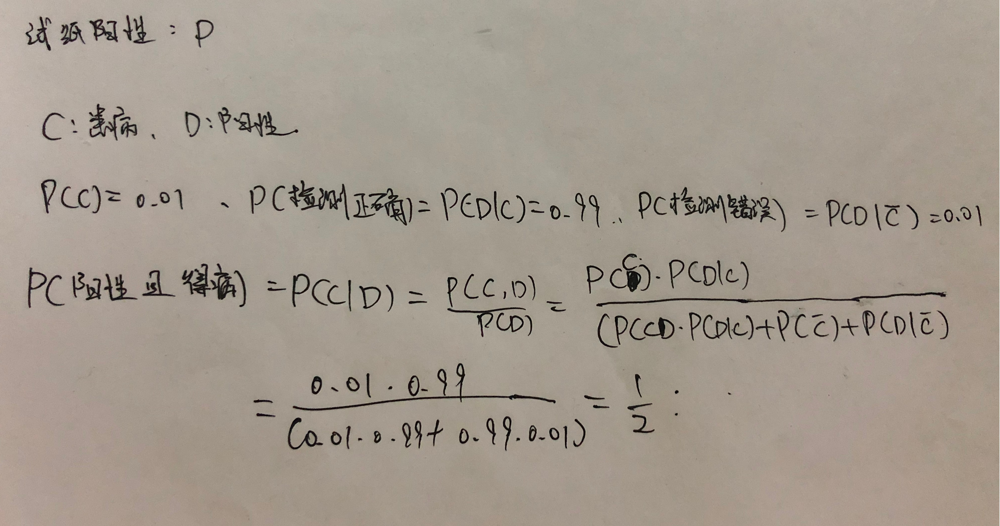
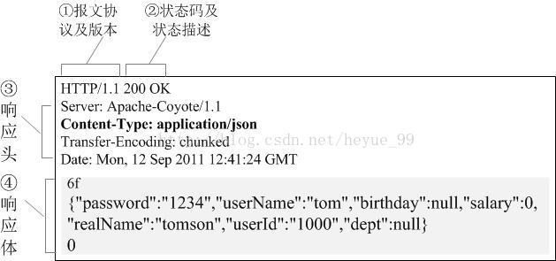

### new和malloc的区别

1. 都是在堆上面分配内存，但是malloc**不具备初始化功能**，new**具备初始化功能**（其实new的底层实现还是malloc，但是会使用**构造函数**来进行初始化）；

2. malloc是一个**函数**，需要**显式指定需要分配的字节数**，返回值是**void\*无类型指针**，因此需要进行强制类型转换；new是**运算符**，只需要指定所需要的的内存的类型，所需要的的字节数会自动计算，返回值为**指定类型的指针**；

3. malloc分配内存失败会**返回空指针**，new分配内存失败会**返回bad_alloc异常**；

   注意：如果发生了bad_alloc，可以通过设置set_new_handler来进行处理：

   **std::set_new_handler(no_memory);**

   这样处理之后，如果new失败了，就会去执行no_memory函数；

4. malloc分配的内存用free来释放，new对应delete，new[]对应delete[]；

5. new支持重载，比如new（nothrow）失败会返回空指针，const new，new（buffer）在指定的位置分配内存，这个new（buffer）是在指定的buffer上分配，**如果这个buffer是栈，那生成的对象也是在栈上了**；

6. 使用new分配的内存，禁止使用memcpy和realloc等函数，因为这俩都是进行**内存值的拷贝**，也就是说，如果是指针，那只是把指针copy了，是一种**浅拷贝**；正确做法应该是调用构造函数创建新对象来进行**深拷贝**。


### 红黑树

1. 是一种**自平衡的二叉查找树**，同时不是完美的平衡二叉树，左右子树之差有可能超过1；

2. 性质：

   1. 根节点肯定是黑色的；
   2. 每个节点只能是红色或者黑色；
   3. 叶子节点（是指null）肯定是黑色的；
   4. 任意两个连续的节点不能都为红色；
   5. **任意一个节点到达每个叶子节点经过的黑色节点必然相等；**
   6. 每个节点有一个指向父节点的指针；

3. 自平衡的操作：通过旋转和变色就可以了达到平衡。

   1. 左旋：以某个结点作为支点(旋转结点)，其右子结点变为旋转结点的父结点，右子结点的左子结点变为旋转结点的右子结点，左子结点保持不变。（跟平衡二叉树的旋转一样）
   2. 右旋：以某个结点作为支点(旋转结点)，其左子结点变为旋转结点的父结点，左子结点的右子结点变为旋转结点的左子结点，右子结点保持不变。
   3. 变色：结点的颜色由红变黑或由黑变红。

4. **红黑树查找**：跟二叉排序树一模一样，最坏时间复杂度为O（logn），此时刚好此次查找路径**红黑相间**。

5. **红黑树插入**：首先查找插入的位置，然后进行自平衡。

   1. 新节点插入是初始颜色为**红色**，所以最关键的就看父节点是什么颜色；
   2. **父节点为黑色**，直接插入；
   3. **父节点为红色，叔叔节点也是红色，**则将父节点和叔叔节点**设置为黑色**，祖父节点设置为**红色**，然后把祖父节点当做插入来看待，继续自平衡；
   4. **父节点为红色，叔叔节点是黑色或者不存在，且父节点是祖父节点的左节点，**由于父节点是红色的所以祖父节点必然是黑色的，进行**右旋**，同时注意，旋转后**祖父节点那个位置的节点还是黑色**的，然后**祖父节点那个位置的两个子节点都是红色**的；
   5. **父节点为红色，叔叔节点是黑色或者不存在，且父节点是祖父节点的右节点，**与上述情况类似，这个时候与平衡二叉树的LR相似，所以**先左旋后右旋**，结果跟4差不多；

6. **红黑树的删除**：首先查找要删除的节点，然后进行自平衡。

   1. 删除的节点**无子节点**，直接删除；

   2. 删除的节点**有一个子节点**，用子节点**替换**删除的节点；

   3. 删除的节点**有两个子节点**，用其**后驱（中序遍历的下一个，就是右子树的左下角那个节点）节点替换**删除节点；

      加上颜色特征：

      1. 替换节点是**红色**，将替代节点的值复制过去删除节点，**替代节点换成删除节点的颜色，**然后**递归**检查那个替代节点；
      2. 替换节点是**黑色**，且是**父节点的左子节点**，兄弟节点是**红色的**，


### topK问题（非常重要！！！）

给定1亿个数字，找出前100大的数字。

使用**堆排序**来解决，维护一个100个元素的**小顶堆**，这个堆的顶端就是这个100个元素的最小值。因此，只要将剩余的数字逐个与堆顶比较，**如果比堆顶大则将堆顶替换，然后调整堆。**直到最后就会剩余100个最大的元素。边插入边调整堆，复杂度为O（KlogK），然后剩余的N-K个点最坏情况下每次都要插入调整堆，时间复杂度为O（（N-K）logK），综上，总体时间复杂度为O（NlogK）。

代码：

```c++
#include<bits/stdc++.h>
using namespace std;
void fixheap(vector<int> &h) {
	int step = 0;
	while (step<h.size()/2) {
		int judge = 2 * step + 1;
		if (judge + 1 < h.size() && h[judge + 1] < h[judge])
			judge++;
		if (h[judge] > h[step])
			break;
		swap(h[step], h[judge]);
		step = judge;
	}
	return;
}
int main() {
	vector<int> wh{ 11,22,33,44,55,66,77,88,99,2,5,0,1,8,9,6,623 }, tempheap;
	int k = 5;
	for (int i = 0; i < k; ++i) {
		tempheap.push_back(wh[i]);
		fixheap(tempheap);
	}
	for (int i = k; i < wh.size(); ++i)
		if (wh[i] > tempheap[1]) {
			swap(wh[i], tempheap[0]);
			fixheap(tempheap);
		}
	for (int i = 0; i < k; ++i)
		cout << tempheap[i] << endl;//输出66 88 77 99 623
	return 0;
}
```

### topK问题（这里以找到第K大的数为例）有没有其他更好的解法？

**思路**：利用**快速排序的思想**，如果要找到第K大的数字，可以先把数组以mid划分为两半，一半小于等于array[mid]，一半大于array[mid]。①如果K<mid，说明**要寻找的K在左边**，只需要在左边中查找就ok；②如果K>mid，说明**要寻找的K在右边**，注意，此时要在右边寻找时，**由于已经确定了mid前的都是小于K的，所以在右边寻找K-mid大的数字**；注意了，快速排序的时间复杂度为O（nlogn），是通过**master定理计算的**，递归的快速排序为T（n）=2T（n/2）+f（n），f（n）是找到那个数的位置，以这个数分成两个T（n/2）。此外，选取基准可以通过**三数取中**的方法，即取头尾中间三个数作比较，用大小为中间的数作为基准来划分。

补充：**master定理**


**代码**

```
#include<bits/stdc++.h>
#include<map>
#include<unordered_map>
#include<thread>
#include<mutex>
#include<Windows.h>
//#include"Bank.h"
using namespace std;
int oneSort(int l, int r, vector<int> &wh) {
	if (l >= r)
		return l;
	int judge = wh[l], index = l;
	while (l < r) {
		while (l < r&&wh[r] >= judge)
			r--;
		while (l < r&&wh[l] <= judge)
			l++;
		swap(wh[l], wh[r]);
	}
	wh[index] = wh[l];
	wh[l] = judge;
	return l;
}
int main() {
	vector<int> wh{ 11,22,33,44,55,66,77,88,99,2,5,0,1,8,9,6,623 };
	int k = 6, left = 0, right = wh.size() - 1;
	while (1) {
		int partition = oneSort(left, right, wh);
		if (partition == k - 1) {//找到第k大的时候输出
			cout << wh[partition] << endl;
			break;
		}
		if (partition < k)
			left = partition + 1;
		else
			right = partition - 1;
	}
	return 0;
}
```

https://www.jianshu.com/p/e136ec79235c


### 内存对齐问题

为什么要考虑内存对齐问题？

可执行程序是由一系列CPU指令构成的，对于一些指令是需要访问内存的，且CPU不是按位读取内存的，而是按双字节。如果内存没有对齐，CPU取得数据时必须按照偏移量去读取所需要的的数据所谓的地址；如果对齐了内存，就可以直接获取所需要的的数据。虽然CPU本身就可以读取未对齐的内存，但是性能上有可能会受到影响；有些CPU甚至会抛出异常，而且对于别的一些平台可能不可移植。

那么内存对齐包含什么内容呢？

首先应该知道的是，**系统的默认对齐系数**：linux默认为#pragma pack（4），windows默认为#pragma pack（8）；没错，我们可以用#pragma pack（n）来指定对齐系数的大小；

第二，就是**偏移量**：简单来说，在32位操作系统中，32位代表4字节，所以每一块4字节里面需要一个offset偏移量来指定这个数据在这一块里面的那个地址开始，32位操作系统自然就是0~31；

第三，就是**三个原则**：

1. 结构体或者共用体中第一个数据的偏移量为0，此后的**偏移量必须是#pragma pack（n）指定的n和那个数据长度较小的那个的倍数**；
2. 结构体或者共同体内部数据对齐完毕后，**整个结构体和共同体也要对齐**。标准为#pragma pack（n）指定的n和**结构体和共同体内最长数据的长度**中较小的一个；
3. 如果结构体嵌套了，那就是套娃了。我们可以把嵌套的那个共同体当做一个成员，然后**先按照规则2求出来它的起始偏移量**，然后根据规则2计算整体偏移量，最后下一个元素再根据1来正常做对齐；

例子：

#pragma pack（4）

struct X{

​	int a；//长度4字节，与#pragma pack（n）比较，较小的是4，因此**偏移量应该是4的倍数**，这里是0，满足要求；所以a放在0~3这四位里面；

​	char b；//长度1字节，与#pragma pack（n）比较，较小的是1，因此**偏移量应该是1的倍数**，这里是4（**其实就是已经被人占用的长度**），满足要求；所以a放在4~4这一位里面；

​	short c；//长度2字节，与#pragma pack（n）比较，较小的是2，因此**偏移量应该是2的倍数**，这里是5，不满足要求，对齐为6；所以a放在6~7这两位里面；

​	char d；//长度1字节，与#pragma pack（n）比较，较小的是1，因此**偏移量应该是1的倍数**，这里是8，满足要求；所以a放在8~8这两位里面；

}

因为占用了0~8这9位，所以这个结构体的长度是9字节。首先计算整体对齐系数 =min （max（int，char，short）**（结构体内最长的那个结构）**，4**（由#pragma pack（n）指定）**） = min（4，4） = 4，因此应该是4的倍数，应该对齐为12，所以这个结构体要占12字节的空间。


#pragma pack（8）

struct X{

​	int a；//长度4字节，与#pragma pack（n）比较，较小的是4，因此**偏移量应该是4的倍数**，这里是0，满足要求；所以a放在0~3这四位里面；

​	char b；//长度1字节，与#pragma pack（n）比较，较小的是1，因此**偏移量应该是1的倍数**，这里是4，满足要求；所以a放在4~4这一位里面；

​	short c；//长度2字节，与#pragma pack（n）比较，较小的是2，因此**偏移量应该是2的倍数**，这里是5，不满足要求，对齐为6；所以a放在6~7这两位里面；

​	**//首先按照原则1计算，结构体Y内部最长是int = 4位，目前默认是8，因此偏移量应该是4的倍数，这里是8，满足要求；**

​	struct Y{

​		int a1；//长度4字节，与#pragma pack（n）比较，较小的是4，因此**偏移量应该是4的倍数**，这里是8，满足要求；所以a放在8~11这四位里面；

​		char b1；//长度1字节，与#pragma pack（n）比较，较小的是1，因此**偏移量应该是1的倍数**，这里是12，满足要求；所以a放在12~12这一位里面；

​		short c1；//长度2字节，与#pragma pack（n）比较，较小的是2，因此**偏移量应该是2的倍数**，这里是13，不满足要求，对齐为14；所以a放在14~15这两位里面；

​		char d1；//长度1字节，与#pragma pack（n）比较，较小的是1，因此**偏移量应该是1的倍数**，这里是16，满足要求；所以a放在16~16这一位里面；

​	}

**//结构体Y内部最长为int = 4位，默认为8位，因此偏移量应该是4的倍数，这里是17，不满足要求，对齐为20，下一个元素从21开始；**

​	char d；//长度1字节，与#pragma pack（n）比较，较小的是1，因此**偏移量应该是1的倍数**，这里是21，满足要求；所以a放在21~21这一位里面；

}

跟上述的计算类似，这里结构体X内最大的为int = 4（struct Y不算），默认为8，所以偏移量应该为4的倍数，这里是22，不满足要求，因此对齐为24；

**重要提示：**其实在vs里面测试，**如果只是嵌套声明了结构体，其实并不算大小**；也就是说：

```c++
struct A {
	int a;
	char b;
	short c;
	struct B
	{
		int d;
		char e;
		short f;
		char g;
		int h;
		long long i;
	};
};
```

sizeof（A）依然是8！

如果我们在A中塞入一个B i；那大小就会增加24，**因为B的大小就是24**；

要将B对齐，只要找到B中最大的成员来对齐就行，也就是longlong，必须是8的倍数来对齐；

所以到达short c的时候大小为8，是long long的倍数，所以是对齐了的，直接8+24=32即可；

最后，结构体A的对齐也是**用longlong来对齐，而不是结构体B**；


### char\*和char[]的区别

1. char\*是一个指针定义，char[]是一个数组定义。数组是一块连续的内存，所以可以通过sizeof求得整个字符串的长度，除以每个字符的长度可以得到字符串的长度；但是sizeof用于char\*只能得到指针的长度，并不能取得字符串的长度；
2. 第二个就是**分配的内存位置不同**。如果有初始化，char\*分配的是在常数区域**（一般内存区域分为5块：栈（一些局部变量等等）、堆（动态分配的内存）、静态存储区域（全局变量和static变量）、常量存储区域、自由存储区域）**的内存，因此初始化之后不能修改字符串的值；char[]分配的是栈上面的内存，因此可以改变字符串内部的值；
3. 第三个就是**读写的权限不同**。数组定义的数组名可以当作指向一块连续内存开头的地址，可以认为是一个指针。**但是只能是一个常数指针**，因为char[]初始化之后不能指向别的字符串，但是char\*可以指向别的数组；
4. 第四个就是**赋值的时刻不同**。因为指针定义指向一个常量字符串，所以**编译**的时候就已经分配了；数组定义的分配是需要等到**运行**时才会分配；
5. 第五个就是**存取效率不同。**在栈上面的读取比常数存储区域的读取要快，所以数组定义的字符串读取速度会比指针定义的字符串的读取速度快；（在栈中的数据我们可以直接在栈中读取，但是堆中的数据需要先读取指针指向的地址，然后才能到地址去读取数据）


### 堆和栈有什么区别？

1. 第一个是**管理的方式不同**。栈是由编译器自动分配的，用于存储局部变量，而堆是程序员申请分配的。并且，堆和栈属于两块不同的存储区域。
2. 第二个是**增长方向不同**。栈是由高地址往低地址分配的，而堆是由低地址往高地址分配的，栈和堆是相对生长的（可以理解为栈和堆是三文治的两块面包，争夺中间的空间，**目的应该是为了节省内存，相对生长可以充分利用内存空间**）。**同时，栈的大小一般是固定的，大概是1-2Mb；堆的大小一般大很多。**（这个可以用来判断分配在堆还是栈）
3. 第三个是**分配的效率不同**。**栈是一块连续的内存，只要申请的大小小于栈剩余空间**，就分配内存；而堆是**不连续的内存空间，当申请堆的空间的时候，会遍历空闲内存链表**，找到第一块大于等于申请空间的内存块返回给程序，多余的那部分内存将添加回链表，释放的时候再放回链表上；因此，**栈上的分配比堆上的分配高效。**
4. 第四个是**碎片问题**。由于栈的按一定顺序分配和释放的，所以不会存在中间有内部碎片这样的问题，因为某个栈变量释放的时候，其前面的所有变量都会被释放；反观堆，因为是程序员通过new和delete控制的，所以可能会存在大量的碎片（内部碎片），造成分配效率降低。


### C++中有哪些段

1. 一般可以分为TEXT段，DATA段和BSS段；其中TEXT段是只读的，DATA和BSS都是可读写的；
2. TEXT存放程序二进制码，编译时确定；
3. DATA段包括了STACK、HEAP、STATIC段，存放程序运行过程中的局部变量、一些全局变量和静态变量动态分配的变量等；
4. BSS段是一个比较特殊的段，用于存放**未初始化或初始化为0的**全局变量、静态变量，这块区域会**自动置0**，所以未初始化的全局变量静态变量有初值0；


### C++中有哪些存储区域

1. 栈，用于存放局部变量，由编译器自主分配和回收，大小一般为1-2MB；
2. 堆，用于存放动态分配的变量，由程序员控制其分配和回收，大小没有限制，理论上可以达到4GB；如果没有主动回收内存，可能会造成**内存泄漏**，程序结束后会自动收回；
3. 静态存储区域，用于存放全局变量和静态变量；
4. 字符串常量区，用于存放字符串常量，程序结束后自动收回，这块区域是只读的；
5. 程序代码区，存放程序的二进制码，这个区域是只读的；


### C++中static关键字的作用

1. 第一个是**改变变量的生命周期。**一个**局部变量**如果用static修饰，那这个变量的生命周期就变为程序的生命周期，并且存储在全局数据区域，但是其**作用域**不会改变。
2. 第二个是**静态变量只会被初始化一次。**如果再次进行初始化不会产生任何效果，如果没有进行初始化，其值为0；
3. 第三个是**隐藏**。如果存在多个文件同时编译，A文件和B文件中的同名全局变量可能会发生冲突；如果用static修饰一个全局变量，则该变量的作用域变为文件内，在别的文件**即使使用extern也无法获取该变量**；
4. 第四个是**用于修饰类成员变量和类成员函数。**如果修饰了类成员变量或者类成员函数，则其将属于整个类，而不属于任何一个对象；同时，静态成员变量也是之初始化一次，静态成员函数**只能访问静态成员变量**。但是非静态成员可以随意访问静态成员；因为静态成员函数属于整个类，所以没有this指针，所以无法访问具体对象的非静态成员变量。此外，静态类成员变量的初始化必须在类外进行，一般就是在类实现文件中初始化。


### 进程和线程的区别？

1. 进程是操作系统**资源分配**的基本单位，而线程是**处理器调度**和执行的基本单位；

2. 每个进程都有**独立的代码和数据空间（程序上下文）**，一个进程内可以包含多个线程，这些线程共享代码和数据空间，**但是每个线程都有自己独立的运行栈和程序计数器（PC）**；因此，线程之间切换的开销小。进程之间的切换会有较大的开销；

3. 因为线程共享进程的资源，所以某个线程发生错误会导致整个进程终止；而两个进程之间是不会相互影响的；

4. 父和子进程使用进程间通信机制，同一进程的线程通过读取和写入数据到进程变量来通信；

   


### 10亿QQ号，如何找出重复的那一个？

1. 使用**hash+set的方法：**
   1. 首先将所有QQ号对500取模，这样所有QQ号会被分成500组，最重要的是**相同的QQ号肯定在同一组内；**
   2. 然后每一组分别建立一个set，然后遍历自己分组的数据，就能找到那个重复的QQ号；
2. 使用**bitmap位图法：**
   1. 首先我们知道位图可以用一位来表示该数据是否存在，在这里我们用一位来表示QQ号是否存在；因此，假设QQ号都为10位的情况下，QQ号的范围为[10亿，100亿)，也就是说一共90亿个数字，我们用90亿位来表示，90亿位相当于11.25亿字节（**10亿字节=1GB**），也就是总共需要1.125GB内存；
   2. 内存不够的情况下，我们依然选择分组，**这里根据QQ号的首位数字分为1-9共9组；**如果还是太大就根据第二位继续细分；
   3. 从QQ号小的开始用bitmap记录其状态；由于文件间的QQ号是有序的，所以如果1开头的QQ号检查完了，我们可以情况刚才的内存用来记录2开头的QQ号；


### 手写strcpy, strcat, strcmp, memcpy等函数

1. 手写strcpy

   char\* Strcpy(char \*a, const char \*b) {
   	if (a == NULL || b == NULL) {
   		cout << "bad argument." << endl;
   		return NULL;
   	}
   	char \*mark = a;
   	while ((\*a++ = \*b++) != '\0')
   		continue;
   	return mark;
   }

2. 手写strcat

   char\* Strcat(char \*a, const char \*b) {
   	if (a == NULL || b == NULL) {
   		cout << "bad argument." << endl;
   		return NULL;
   	}
   	char \*mark = a;
   	while (\*a != '\0') {
   		a++;
   	}
   	while ((\*a++ = \*b++) != '\0')
   		continue;
   	return mark;
   }

3. 手写strcmp

   int Strcmp(const char \*a, const char \*b) {
   	if (a == NULL || b == NULL) {
   		cout << "bad argument." << endl;
   		return a==NULL;
   	}
   	while (\*a == *b) {
   		if (\*a == '\0')
   			return 0;
   		a++, b++;
   	}
   	return \*a - \*b;
   }

4. 手写memcpy

   void\* Memcpy(void \*a, const void \*b,size_t n) {
   	char \*pa = (char\*)a, \*pb = (char\*)b;
   	if (pa > (pb + n) || pa < pb) {//这里表示a的地址与b的地址没有冲突
   		while (n--)
   			\*pa++ = \*pb++;
   	}
   	else {**//如果b的末尾有部分跟a开头重叠，就从末尾开始复制**
   		pa = (char\*)(pa + n - 1);
   		pb = (char\*)(pb + n - 1);
   		while (n--)
   			\*pa-- = \*pb--;
   	}
   	return a;
   }


### 10进制转16进制

注意10进制转换16进制就是不断除以16，记录余数；然后取商继续除以16，记录余数；直到商为0，这个时候把商逆序就是结果了；

string ten2dex(const string &ori) {
	int temp = stoi(ori),remainder;
	string ans;
	while (temp != 0) {
		remainder = temp % 16;
		temp /= 16;
		if (remainder < 10)
			ans = to_string(remainder) + ans;
		else
			ans = char(55+remainder) + ans;**//A的ASCII码是65，因为remainder要先-10，所以直接+55就ok**
	}
	return ans;
}


### 伙伴算法

由于进程申请内存的大小是任意的，如果操作系统对malloc 函数的实现方法不对，将直接导致一个不可避免的问题，那就是**内存碎片。这些块虽然是空闲的，但是却小到无法使用**。随着申请和释放次数的增加，内存将变得越来越不连续。最后，整个内存将只剩下碎片，即使有足够的空闲页框可以满足请求，但要分配一个大块的连续页框就可能无法满足，所以减少内存浪费的核心就是尽量避免产生内存碎片。针对这样的问题，有很多行之有效的解决方法，其中**伙伴算法被证明是非常行之有效的一套内存管理方法**，因此也被相当多的操作系统所采用。

伙伴算法（Buddy system）**把所有的空闲页框分为11个块链表**，每块链表中分布包含特定的连续页框地址空间，比如第0个块链表包含大小为2^0个连续的页框，第1个块链表中，每个链表元素包含2^1个页框大小的连续地址空间，….，第10个块链表中，每个链表元素包含2^10个页框大小的连续地址空间；**每个链表元素代表4M的连续地址空间**。每个链表中元素的个数在系统初始化时决定，在执行过程中，动态变化。

   伙伴算法每次只能分配2的幂次页的空间，比如一次分配1页，2页，4页，8页，…，1024页(2^10)等等，**每页大小一般为4K，因此，伙伴算法最多一次能够分配4M的内存空间**。

**内存的分配过程：**

1. 如果需要分配4K，即一个页框大小的内存，**首先去链表0查看是否有空闲块**；
2. 如果有空闲块，分配成功；**如果没有链表块，查看下一级，即链表1是否有空闲块**；
3. 如果链表1有空闲块，则**将这块内存分成2块**，一块返回，一块给到链表0；如果没有则以此类推；
4. 如果请求分配的不是2次幂的大小，则会分配比该数要大一点的2次幂的块，**因此会产生内部碎片；**

**回收过程：**

1. 首先定义什么是伙伴，满足三个条件：**①两个块具有相同大小；②物理地址是连续的；③从同一个大块中拆分出来；**
2. 当我们回收到一个大小为b的块的时候，首先检查b的链表里面有没有空闲块，**如果有空闲块并且地址连续，**就将其合并成一个2b的块，然后以此内推，直到不能合或者得到一个2^10的最大块为止；


### linux中SSH是什么？

ssh服务是一个**守护进程，由系统后台监听客户端的连接**，进程名为sshd，端口为22。通过SSH客户端我们可以连接到运行了SSH服务器的远程机器上，也就是说，我们可以**通过ssh来远程控制我们的电脑或者服务器**。那么ssh协议的优点就是**数据传输是加密**的，可以防止信息泄露，而且数据传输是压缩的，可以提高传输速度。

1. 在命令行中输入“**ssh -l root 服务器IP**”可以连接到服务器，也可以使用“**ssh root@服务器IP**”连接到服务器。例如我们使用deepin1：

   ```bush
   ssh -p 22 deepin2@192.168.56.132
   ```

   这里的-p 22 表示22端口，可以忽略；deepin2是我们想连接的那个服务器的用户名，@后面的是deepin2的IP地址；后续还需要输入deepin2的密码；然后就可以直接运行cmd命令行来操作我们的服务器了；

2. **免密登陆：**

   1. 首先，配置公钥。在deepin1终端使用**ssh-keygen**生成公钥；
   2. 然后，上传公钥到服务器。在Deepin1终端中执行ssh-copy-id -p port user@remotr（ssh-copy-id -p 22 deepin2@192.168.56.132）可以让远程服务器记住我们；
   3. 现在连接deepin2不需要密码了；


### accept发生在三次握手哪个阶段？

答案是发生在**三次握手完成之后**。

服务器：申请socket==>setsockopt（可选）==>bind==>listen==>等待连接==>accept==>read==>write==>主动或者被动close；

客户端：申请socket==>setsockopt（可选）==>connect==>write==>read==>主动或者被动close；


### linux基础知识

&  表示任务在后台执行，如要在后台运行redis-server,则有 redis-server &

&& 表示前一条命令执行成功时，才执行后一条命令 ，如 echo '1‘ && echo '2'   

| 表示管道，上一条命令的输出，作为下一条命令参数，如 echo 'yes' | wc -l

|| 表示上一条命令执行失败后，才执行下一条命令，如 cat nofile || echo "fail"


### 如何实现一个单例模式？

单例模式，是一种常用的软件设计模式。在它的核心结构中只包含一个被称为单例的特殊类。通过单例模式可以保证系统中，**应用该模式的类一个类只有一个实例**。

单例模式分类：

- 饿汉式单例模式：在类加载时就完成了初始化，所以类加载比较慢、获取对象的速度快、以空间换取时间模式、**线程安全**；
- 懒汉式单例模式：在类加载时不初始化、按照需求创建实例、以时间换取空间模式；

具体方法是**将该类的构造函数声明为private**，同时复制构造函数和赋值运算符也声明为private，防止复制和赋值；如果要生成一个类对象必须通过我们的对外接口getinstance，然后声明一个static的类对象，根据需求可以选择饿汉式或者懒汉式的方法；

问题1：内存如何回收？

我们可以在private内声明一个struct，其析构函数判断instance如果不为空则delete，然后将其声明为静态成员变量，**利用程序结束时会自动释放静态变量的特点**实现对单例的析构；

问题2：线程安全吗？

不安全，所以需要用到一个互斥锁，但是简单地使用锁会导致多个线程阻塞在锁的获取，所以可以在加锁前判断instance==NULL，即double check。

代码（懒汉式）：

```cpp
class Singleton
{
  private:
    static Singleton *local_instance;
    static pthread_mutex_t mutex;
    Singleton(){
        cout << "构造" << endl;
    };
    ~Singleton(){
        cout << "析构" << endl;
    }
    class rememberFree{
        public:
        rememberFree(){
            cout << "成员构造" << endl;
        }
        ~rememberFree(){
            if(Singleton::local_instance != nullptr){
                delete Singleton::local_instance;
            }
        }
    };
    static rememberFree remember;

  public:
    static Singleton *getInstance()
    {
        if (local_instance == nullptr){
        	pthread_mutex_lock(&mutex);
        	if (local_instance == nullptr)
        	{
            	local_instance = new Singleton();
        	}
        	pthread_mutex_unlock(&mutex);
        }
        return local_instance;
    }
};

Singleton * Singleton::local_instance = nullptr;
pthread_mutex_t Singleton::mutex = PTHREAD_MUTEX_INITIALIZER;
Singleton::rememberFree Singleton::remember;
int main()
{
    cout << "单例模式访问第一次前" << endl;
    Singleton * s = Singleton::getInstance();
    cout << "单例模式访问第一次后" << endl;
    cout << "单例模式访问第二次前" << endl;
    Singleton * s2 = Singleton::getInstance();
    cout << "单例模式访问第二次后" << endl;
    return 0;
}
```


### 如何实现一个工厂模式？

工厂模式一般分为三种：**简单工厂模式、工厂方法模式、抽象工厂模式**。

1. 简单工厂模式：

   简单工厂模式，工厂类是创建产品的，它决定创建哪一种产品，就像领导决定采用那种技术方案样。举个例子，现在有宝马车和奔驰车两种车需要生产，但是只有一个工厂，且只能在同一时间生产一种车，这时就有工厂决定生产那种车了。**简单来说，就是根据给定的类型返回对应的类对象就ok了。**但是存在一个问题：每次增加车型的时候都需要修改工厂类，违反了开放封闭原则，即软件实体（类、模块、函数）可以扩展，但是不可修改。

   **优点**：工厂类中包含了必要的逻辑判断，可以根据用户的需求动态实例化相关的类；对客户端来说，去除了与具体产品的依赖。

   **缺点**：违背开放-封闭原则，添加新的产品时需要修改工厂类的内容。

   

   简单描述：我们以运算类为基类，派生了很多类，客户端通过工厂或者这些派生类，**要是要增加新的派生类需要修改工厂类，违反开放-封闭原则；**

   代码：

   ```bash
   #include <iostream>
   using namespace std;
   
   enum CarType{BENZ, BMW};
   
   class Car//车类
   {
   public:
       virtual void createdCar(void) = 0;
   };
   
   class BenzCar : public Car //奔驰车
   {
   public:
       BenzCar()
       {
           cout<<"Benz::Benz()"<<endl;
       }
       virtual void createdCar(void)
       {
           cout<<"BenzCar::createdCar()"<<endl;
       }
       ~BenzCar()
       {
   
       }
   };
   
   class BmwCar : public Car //宝马车
   {
   public:
       BmwCar()
       {
           cout<<"Bmw::Bmw()"<<endl;
       }
       virtual void createdCar(void)
       {
           cout<<"BmwCar::createdCar()"<<endl;
       }
   };
   
   
   class CarFactory //车厂
   {
   public:
       Car* createSpecificCar(CarType type)
       {
           switch(type)
           {
           case BENZ://生产奔驰车
               return (new BenzCar());
               break;
           case BMW://生产宝马车
               return (new BmwCar());
               break;
           default:
               return NULL;
               break;
           }
       }
   };
   
   int main(int argc, char** argv)
   {
       CarFactory carfac;
       Car* specificCarA = carfac.createSpecificCar(BENZ);//看到网上众多示例在new后没有delete，感觉不是特别严谨
       Car* specificCarB = carfac.createSpecificCar(BMW);
   
       delete specificCarA; delete specificCarB;
       
       return 0;
   }
   ```

2. 工厂方法模式

   针对简单工厂违反开放封闭原则出现的设计模式。不再只由一个工厂类决定哪一个产品类应当被实例化,这个决定权被交给子类去做。当有新的产品（新型汽车）产生时，只要按照抽象产品角色、抽象工厂角色提供的方法来生成即可（新车型可以用一个新类继承创建产品即可），那么就可以被客户使用，而不必去修改任何已有的代码。**简单来说，就是不再依赖于工厂去返回我们需要的对象，而是将工厂作为基类，根据我们的需求去派生出对应的工厂类，利用这个工厂类产生我们需要的对象。**

   **优点**：克服了简单工厂违背开放-封闭原则的缺点。

   **缺点**：每增加一个产品，需要多增加一个对应工厂的类，增加了额外的开发量。

   

   简单描述：以运算类为基类生成了很多派生类，对应地，我们用工厂类为基类派生了很多工厂类，**通过这些派生的工厂类来获取对应的运算类；**这样我们要新增一个运算类就对应新增一个工厂类就行，不修改原来的工厂类；

   代码：

   ```bash
   #include <iostream>
   using namespace std;
   
   class Car//车类
   {
   public:
       virtual void createdCar(void) = 0;
   };
   
   class BenzCar : public Car //奔驰车
   {
   public:
       BenzCar()
       {
           cout<<"Benz::Benz()"<<endl;
       }
       virtual void createdCar(void)
       {
           cout<<"BenzCar::createdCar()"<<endl;
       }
       ~BenzCar()
       {
   
       }
   };
   
   class BmwCar : public Car //宝马车
   {
   public:
       BmwCar()
       {
           cout<<"Bmw::Bmw()"<<endl;
       }
       virtual void createdCar(void)
       {
           cout<<"BmwCar::createdCar()"<<endl;
       }
   };
   
   
   class Factory//车厂
   {
   public:
       virtual Car* createSpecificCar(void) = 0;
   };
   
   class BenzFactory : public Factory//奔驰车厂
   {
   public:
       virtual Car* createSpecificCar(void)
       {
           return (new BenzCar());
       }
   };
   
   class BmwFactory : public Factory//宝马车厂
   {
   public:
       virtual Car* createSpecificCar(void)
       {
           return (new BmwCar());
       }
   };
   
   
   int main(int argc, char** argv)
   {
       Factory* factory = new BenzFactory();
       Car* specificCarA = factory->createSpecificCar();
       factory = new BmwFactory();
       Car* specificCarB = factory->createSpecificCar();
       
       delete factory; delete specificCarA; delete specificCarB;
       
       return 0;
   }
   ```

3. 抽象工厂模式

   如果一个工厂需要生产某产品的高端定制版，但是又不想重新定义一个工厂类，就出现了抽象工厂模式。

   **优点**：需求改变时改动最小；具体的创建实例过程与客户端分离，客户端通过抽象接口操作实例，产品的具体类名也被具体工厂的实现分离，不出现在客户端代码中（客户端只知道有一个抽象工厂，一个抽象的Engine和一个抽象的Type）。

   **缺点**；新增功能时，比如火车和飞机都有窗户，那就要增加3个类，还要修改2个具体的工厂类。

   

   简单描述：有多种不同类型的纯虚基类，派生出各式各样的派生类；我们的工厂也是一个纯虚基类，**但是这个基类中有多种产品的构造方法**，我们通过派生这个工厂来获取可以生成多种产品的派生类；
   
   代码：
   
   ```bash
   #include <iostream>
   using namespace std;
   
   class Car//车类
   {
   public:
       virtual void createdCar(void) = 0;
   };
   
   class BenzCar : public Car //奔驰车
   {
   public:
       BenzCar()
       {
           cout<<"Benz::Benz()"<<endl;
       }
       virtual void createdCar(void)
       {
           cout<<"BenzCar::createdCar()"<<endl;
       }
       ~BenzCar()
       {
   
       }
   };
   
   class BmwCar : public Car //宝马车
   {
   public:
       BmwCar()
       {
           cout<<"Bmw::Bmw()"<<endl;
       }
       virtual void createdCar(void)
       {
           cout<<"BmwCar::createdCar()"<<endl;
       }
   };
   
   class HighCar //高配版车型
   {
   public:
       virtual void createdCar(void) = 0;
   };
   
   class HighBenzCar : public HighCar //高配奔驰车
   {
   public:
       HighBenzCar()
       {
           cout<<"HighBenzCarBenz::Benz()"<<endl;
       }
       virtual void createdCar(void)
       {
           cout<<"HighBenzCar::createdCar()"<<endl;
       }
   };
   
   class HighBmwCar : public HighCar //高配宝马车
   {
   public:
       HighBmwCar()
       {
           cout<<"HighBmwCar::Bmw()"<<endl;
       }
       virtual void createdCar(void)
       {
           cout<<"HighBmwCar::createdCar()"<<endl;
       }
   };
   
   class Factory//车厂
   {
   public:
       virtual Car* createSpecificCar(void) = 0;
       virtual HighCar* createdSpecificHighCar(void) = 0;
   };
   
   class BenzFactory : public Factory//奔驰车厂
   {
   public:
       virtual Car* createSpecificCar(void)
       {
           return (new BenzCar());
       }
   
       virtual HighCar* createdSpecificHighCar(void)
       {
           return (new HighBenzCar());
       }
   };
   
   class BmwFactory : public Factory//宝马车厂
   {
   public:
       virtual Car* createSpecificCar(void)
       {
           return (new BmwCar());
       }
       virtual HighCar* createdSpecificHighCar(void)
       {
           return (new HighBmwCar());
       }
   };
   
   
   int main(int argc, char** argv)
   {
       Factory* factory = new BenzFactory();
       Car* specificCar = factory->createSpecificCar();
       HighCar* spcificHighCar = factory->createdSpecificHighCar();
       
       delete factory; delete specificCar; delete spcificHighCar;
       
       return 0;
   }
   ```


### 为什么有了二叉查找树、二叉平衡树还需要红黑树呢？不同应用场景如何选择红黑树和哈希表？

1. 二叉查找树：

   优点：有序；

   缺点：如果插入顺序不当，会退化成链表；

2. 平衡二叉树：

   优点：有序，且任意左右子树高度差不大于1；

   缺点：插入和删除的后处理太过复杂，在数据量极大的情况下需要花费大量时间重新平衡；

3. 红黑树：

   一种弱化版的平衡二叉树，不要求任意左右子树高度差不大于1，所以插入和删除的后处理相对简单点。

4. 那为什么不用hash要用红黑树呢？

   1. 查找速度：hash的查找速度是O(1),红黑树是O（logn）；
   2. 内存消耗：hash需要一大块内存来映射，所以会有未使用的内存；红黑树取得的内存就是已使用的内存；
   3. 插入和删除：hash是O（1），红黑树是O（logn）；
   4. 数据有序性：hash的数据是无序的，红黑树存储的数据是有序的；


### 什么是跳表？为什么Redis不用红黑树用跳表？

**redis里面的有序集合底层实现就是跳表**；跳表是一种带索引的链表，结合了数组查找的优点和链表插入删除的优点，查询、插入删除复杂度均为O（logn），也因此需要额外的空间存储索引。**还支持范围查找。**


如上图所示，最下面的才是存储N个数据的链表，第一级索引一般有N/2个节点，第二级一般有N/4个节点，因此第k层索引有N/（2^K）个节点。

1. 查找

   查找从最高级索引开始，当前节点小于查询值，说明在当前节点的后面，此时如果当前节点的next不为空，则继续查询；否则就转移到当前节点的down，即下一级索引继续查找；直到到达最后链表；**加入有h级索引，那么h级索引的节点数为N/（2^h）个，第h级有两个节点，不然没有意义；此时的索引的深度为h=logN-1，因此查找的最多查找logN次就能到达底层，每一层查找次数为常数，所以查找的时间复杂度为O（logn）。**

2. 插入

   首先从最高级节点查询插入的位置，由于插入数据之后也要在索引上添加新的节点，但是如果每次插入都严格按照定义去维护索引复杂度为特别高，所以**采用随机技术决定要在多少层索引添加节点**；例如，通过查询在原始链表找到插入的位置了，然后有0.5的概率插入到一级索引；然后又有0.5的概率插入到二级索引，也就是0.25的概率会插入到二级索引，因为一级没有的节点二级也不会有；因此用概率来保证i级索引只有（0.5）^i个节点。

3. 删除

   删除的同时必须将对应的索引节点也删除了，**从最高级索引开始查找，同时标记命中的节点，**然后开始全部删除；


### 字节跳动面试手撕代码

给定一个多边形各个点的坐标pi，每条边都是垂直或者水平的。给定一个k，将其周长分割成k段，返回每一段的端点坐标。


首先使用struct存储坐标（x，y），还有一个哈希表存储对应的变长，**注意这里不要漏了最后一段边长**；我的做法里面对应的lenwh[i]表示rectangle[i]和rectangle[i+1]之间的长度；

1. 首先用totallen统计出周长，然后计算平均每段的长度avglen，这个必须是double，因为不一定能整除；
2. 首先wh[0]这个点肯定是其中一个点，先入队；
3. 初始化judge=avglen，用judge判断是否应该到达下一段；如果judeg小于等于当前的line，说明这一条边上面有一个点，**注意这个点不知道是从坐标点向左还是向右，向上还是向下得到，所以要判断清楚**；获取完这一个点之后，将judeg+=avglen，这是到达下一个点的长度；
4. 如果judge大于当前的line，说明这一条边没用了，用当前的judge减去这一条边的长度，同时lineindex++，下一个循环会自动检查下一条边；

代码：

```c++
#include<bits/stdc++.h>
#include<map>
#include<unordered_map>
#include<thread>
#include<mutex>
#include<Windows.h>
//#include"Bank.h"
using namespace std;
/*
输入：
6 8
0 0
4 0
4 4
3 4
3 1
0 1
输出：
0，0
2，0
4，0
4，2
4，4
3，3
3，1
1，1
*/
struct Node {//这个点需要用double
	double x, y;
	Node(double x_ = 0, double y_ = 0) {
		x = x_;
		y = y_;
	}
};
int main() {
	int ordnum, divide, totallen = 0;
	cin >> ordnum >> divide;
	vector<Node> wh(ordnum), ans;
	unordered_map<int, int> line;
	for (int i = 0; i < ordnum; ++i) {
		cin >> wh[i].x >> wh[i].y;
		if (i){
			totallen += abs(wh[i].x - wh[i - 1].x) + abs(wh[i].y - wh[i - 1].y);
			line[i - 1] = abs(wh[i].x - wh[i - 1].x) + abs(wh[i].y - wh[i - 1].y);
		}
		if (i == ordnum - 1) {
			totallen += abs(wh[i].x - wh[0].x) + abs(wh[i].y - wh[0].y);
			line[i] = abs(wh[i].x - wh[0].x) + abs(wh[i].y - wh[0].y);
		}
	}
	ans.push_back(Node(wh[0].x, wh[0].y));//第一个点肯定是结果
	double avglen = totallen * 1.0 / divide, judge=avglen;
	int pointcount = 0, lineindex = 0;
	while (pointcount < divide - 1) {
		if (judge <= line[lineindex]) {//如果当前judge小于line，这一边肯定有一个点
			Node temp;
			if (wh[lineindex + 1].x == wh[lineindex].x) {
				temp.x = wh[lineindex].x;
				temp.y = wh[lineindex + 1].y > wh[lineindex].y ? wh[lineindex].y + judge : wh[lineindex].y - judge;
			}
			else {
				temp.y = wh[lineindex].y;
				temp.x = wh[lineindex + 1].x > wh[lineindex].x ? wh[lineindex].x + judge : wh[lineindex].x - judge;
			}
            ans.push_back(temp);
			judge += avglen;//每次加上avglen，下一次会判断下一个点是否还在这条边上
			pointcount++;
		}
		else//如果judge大于line，说明这条边没有了，减去这一条边的长度，检查下一条边
			judge -= line[lineindex++];
	}
	for (int i = 0; i < divide; ++i)
		cout << ans[i].x << "," << ans[i].y << endl;
    return 0;
}
```


### 你的WebServer里面主要的CPU占用和内存占用都用到哪里去了？

1. 由于压测客户端与服务器之间使用长连接，客户端接受http响应报文之后没有进行断开。**维持大量的长连接占用大量的系统内存，监听和connect是几乎不占内存的，占用内存的是滑动窗口的读写缓存；**
2. 维持大量的短连接，导致accept比较频繁，cpu占用率会大幅上升；或者epoll使用水平触发导致系统频繁进行轮询也会占用大量的cpu；
3. 系统中存在大量time_wait，导致多个端口被占用，最后无法建立tcp连接；


### 一条SQL执行很慢有什么原因？

1. 如果只是**偶尔查询很慢**

   1. 当我们要往数据库插入一条数据、或者要更新一条数据的时候，我们知道数据库会在**内存**中把对应字段的数据更新了，但是更新之后，这些更新的字段并不会马上同步持久化到**磁盘**中去，而是把这些更新的记录写入到 redo log （innoDB特有，mySQL只有binlog，binlog没有空间的限制）日记中去，等到空闲的时候，在通过 redo log 里的日记把最新的数据同步到**磁盘**中去。不过，**redo log 里的容量是有限的**，如果数据库一直很忙，更新又很频繁，这个时候 redo log 很快就会被写满了，这个时候就没办法等到空闲的时候再把数据同步到磁盘的，只能暂停其他操作，全身心来把数据同步到磁盘中去的，而这个时候，**就会导致我们平时正常的SQL语句突然执行的很慢**，所以说，数据库在在同步数据到磁盘的时候，就有可能导致我们的SQL语句执行的很慢了。
   2. 第二种情况是查询涉及的表或者行被加锁了，所以需要等待锁释放了才可以查询；

2. **查询一直很慢**

   1. **没有用上索引**。例如你的表中有字段a、b、c，但是只有a有索引，这个时候你以b或者c作为约束查询，那只能进行全表过滤，表很大的时候速度就会特别慢；

   2. **还是没有用上索引。**例如你的c字段有索引，但是你查询的约束为c - 1 = 1000，则不会使用索引，只有查询c = 1001才会用上c字段的索引；此外，当左侧使用了函数的时候，也会导致没有用上索引；（存疑，难道不会自动优化？）

   3. **数据库选错索引。主键索引和非主键索引是有区别的**，主键索引存放的值是**整行字段的数据**，而非主键索引上存放的值不是整行字段的数据，而且存放**主键字段的值**。在我们进行查询的时候，**系统会进行判断，是使用全表扫描一次完成；还是使用非主键索引扫描，两次完成；**系统的选择主要是根据**索引的区分度**，当一个索引上面不同的值越多，其区分度就越大；因此，区分度越大的索引，查询的效率就越高；但是每次都检查索引的区分度代价太大，**因此系统会通过采样来判断此索引的区分度**，如果采样预测的区分度很小，就会进行全表扫描，这样就很慢了；

      解决方法：

      ①select \* from T force index（primary） where c<100这一句强制使用a所谓索引来进行查询。

      ②先使用show index from T；查看索引的区分度；如果区分度不准确就使用analyze table T；


### 主键索引和非主键索引的区别？

1. 主键索引的**data域存放了对应一行的数据**，并且是有序的，所以是**聚簇索引**；
2. 非主键索引其**data域存放的是主键的值，所以当表被修改的时候，不需要进行大幅度的修改，甚至可以不修改；**但也因此需要再次索引才能得到整行数据，因此也称为二级索引，这个过程称为回表；
3. 主键索引不能为NULL，非主键索引可以为NULL；
4. 主键索引只能有一个，非主键索引可以有多个；


### 为什么主键索引最好使用自增？

由于对于B+树来说，如果每次插入的加点key都比之前要大，那就可以很方便地直接在最后面插入这个新的节点；如果新插入的节点key处于中间，那就可能需要重新调整B+树的结果，最坏的结果是存储该数据的那个页已经满了，需要进行页分裂才能完成调整。


### 打开一个url全过程？

1. 一般我们使用浏览器去浏览这个url，**首先，需要将域名解析为IP地址。**首先从浏览器缓存和操作系统hosts文件中查找是否存在所需的ip地址，如果没有，就需要通过UDP协议向本地域名服务器查询对应的IP地址，如果还是没有就需要向更高级的域名服务器查询；
2. 根据get、post等方法生成相应的http请求报文，如果浏览器有cookies还需要带上cookies使得该服务器的状态可以被服务器感知到；
3. 生成一个请求报文，然后在浏览器的缓存里面匹配，如果命中了，就直接从缓存取得响应报文；
4. 获得了对方的IP地址之后，就可以根据TCP协议通过三次握手与服务器建立TCP连接；
5. 如果我们使用的是HTTPS，还需要与服务器进行加密算法、压缩算法的协商，并交换密钥；
6. 然后将浏览器生成的HTTP请求报文分割成多个报文段，进行传输；
7. 在传输的过程中，TCP协议会使用流量控制和拥塞避免的相关算法，保证我们的报文段能够完整按序到达；
8. 如果我们源地址ip是在内网，经过运行了NAT协议的路由器时会进行ip地址转换；
9. 在物理层进行传输都是基于MAC地址的，这就需要ARP地址解析协议获取服务器的物理地址；在各个路由器之间跳转也需要对应的路由算法进行路由选择，例如OSPF开放最短路径优先路由算法搜索到达服务器的路径；路由器使用ARP协议将IP地址转换为MAC地址，最后通过PPP点对点协议在数据链路层上封装成帧，最后通过物理层传输到服务器；
10. 现在提供服务的一般都是一个代理服务器，通过代理服务器可以实现负载均衡、容错容灾等功能；我们的http请求最终会被代理服务器分配到一个真正的服务端为我们提供服务；
11. 服务器解析HTTP请求报文，如果能够通过安全验证、权限验证，服务器就会执行响应的服务，例如查询数据库、获取对应的页面等，然后生成对应的HTTP响应报文，返回给代理服务器，由它返回给客户端；
12. 浏览器收到的HTTP响应报文后首先在缓存里留存一份，然后渲染页面和数据，然后就能显示页面；
13. 如果是短连接，就通过四次挥手断开连接，如果是长连接，则保持连接；


### mySQL中int（4）和int（8）的区别？char（4）和varchar（4）的区别？

1. int（4）和int（8）：

   正常使用的话，他们并没有什么区别，**int(M)，这个M表示的是显示宽度**，只有在**加上关键字zerofill**的时候，才会有点儿效果比如int(4)，当插入的数据不够4位时，会在数据前面用0补满4位，当超过4位时；

   create table ‘test’（age int（2） **unsigned zerofill** not null default ‘00’）

   当输入的年龄小于2位的时候，前面会补一个0，**当输入的数字超过2位，不会缩小为2位，照常显示；**其实其实际存储都是4字节的一个int整型；

2. char（4）和varchar（4）：

   1. **char的长度是不可变的，而varchar的长度是可变的；**
   2. 定义一个**char[10]如果存进去的是‘abcd’,那么char所占的长度依然为10，除了字符‘abcd’外，后面跟六个空格**；而varchar[10]就立马把长度变为4了，取数据的时候，char类型的要用trim()去掉多余的空格，而varchar是不需要的；
   3. **char的存取速度还是要比varchar要快得多**，因为其长度固定，方便程序的存储与查找；但是char也为此付出的是空间的代价，因为其长度固定，所以难免会有多余的空格占位符占据空间，可谓是以空间换取时间效率，而varchar是以空间效率为首位的。
   4. char的存储方式是，对英文字符（ASCII）占用1个字节，对一个汉字占用两个字节；而varchar的存储方式是，对每个英文字符占用2个字节，汉字也占用2个字节，两者的存储数据都非unicode的字符数据。
   5. 对于varchar，**当数据长度小于255时，数据库采用1个字节记录varchar数据长度**，当数据长度>255时，需要用两个字节存储长度；
   6. char类型字段的最大长度是255，且255个字节可全部用于存储数据；vachar字段的类型最大长度是65535，但实际存储的数据长度要小于该值；


### mySQL中空值和NULL值有什么区别？

1. 空值不占空间，NULL值占空间；
2. 定义为NOT NULL的字段只能插入空值，不能插入null值；而NULL字段可以插入空值，也可以插入null值。
3. 可以发现 is not null 只会过滤为null值的列，而=会同时过滤空值和null值，所以要根据实际情况选择过滤方式。因此，**判断null值只能用 is null 或 is not null ，不能用 = 或 <>。**
4. 在进行count()统计某列的记录数的时候，如果采用的NULL值，会别系统自动忽略掉，但是**空值是会进行统计到其中的。 **
5. 当使用ORDER BY时，首先呈现NULL值。如果你用DESC以降序排序，NULL值最后显示。即**排序时默认NULL值比空值小**；
6. 当使用GROUP BY时，所有的NULL值被认为是相等的，故只显示一行。


### 进程、线程、协程、管程？

1、进程

进程是具有一定独立功能的程序关于某个数据集合上的一次运行活动,进程是**系统进行资源分配和调度的一个独立单位。每个进程都有自己的独立内存空间，不同进程通过进程间通信来通信**。由于进程比较重量，占据独立的内存，所以上下文进程间的切换开销（栈、寄存器、虚拟内存、文件句柄等）比较大，但相对比较稳定安全。

2、线程

线程是进程的一个实体,是**CPU调度的基本单位**,它是比进程更小的能独立运行的基本单位.**线程自己基本上不拥有系统资源,只拥有一点在运行中必不可少的资源(如程序计数器,一组寄存器和栈)**,但是它可与同属一个进程的其他的线程共享进程所拥有的全部资源。**线程间通信主要通过共享内存**，上下文切换很快，资源开销较少，但相比进程不够稳定容易丢失数据。

3、协程

**协程是一种用户态的轻量级线程，**协程的调度完全由用户控制。**协程拥有自己的寄存器上下文和栈**。协程调度切换时，将寄存器上下文和栈保存到其他地方，在切回来的时候，恢复先前保存的寄存器上下文和栈，直接操作栈则基本没有内核切换的开销，可以不加锁的访问全局变量，所以上下文的切换非常快。

4、管程

管程在功能上和信号量及PV操作类似，属于一种进程同步互斥工具，但是具有与信号量及PV操作不同的属性。使用管程可以将**分散在各进程中的临界区集中起来进行管理；防止进程有意或无意的违法同步操作；**所有进程都可以访问管程，但是**同一时刻只能有一个进程**访问管程；

**四者的区别：**

1. 多个进程间地址空间相互独立，如果其中一个进程崩溃了，其他进程不受影响；多个线程共享同一个进程的地址空间，如果其中一个线程崩溃了，整个进程就崩溃了；
2. 进程是资源配置的基本单位，线程是处理机调度的基本单位；
3. 协程可以通过yield来调用其它协程。通过yield方式转移执行权的协程之间**不是调用者与被调用者**的关系，而是彼此对称、平等的。**协程的生命期完全由他们的使用的需要决定。**
4. 线程和进程的切换都是内核态的，而协程的切换是用户态的，开销最小；


### HTTP状态码解析

| 状态码  | 含义                                                         |
| :------ | :----------------------------------------------------------- |
| 100     | 客户端应当继续发送请求。这个临时响应是用来通知客户端它的部分请求已经被服务器接收，且仍未被拒绝。客户端应当继续发送请求的剩余部分，或者如果请求已经完成，忽略这个响应。服务器必须在请求完成后向客户端发送一个最终响应。 |
| 101     | 服务器已经理解了客户端的请求，并将通过Upgrade 消息头通知客户端采用不同的协议来完成这个请求。在发送完这个响应最后的空行后，服务器将会切换到在Upgrade 消息头中定义的那些协议。 　　只有在切换新的协议更有好处的时候才应该采取类似措施。例如，切换到新的HTTP 版本比旧版本更有优势，或者切换到一个实时且同步的协议以传送利用此类特性的资源。 |
| 102     | 由WebDAV（RFC 2518）扩展的状态码，代表处理将被继续执行。     |
| **200** | **请求已成功，请求所希望的响应头或数据体将随此响应返回。**   |
| 201     | 请求已经被实现，而且有一个新的资源已经依据请求的需要而建立，且其 URI 已经随Location 头信息返回。假如需要的资源无法及时建立的话，应当返回 '202 Accepted'。 |
| **202** | **服务器已接受请求，但尚未处理。**正如它可能被拒绝一样，最终该请求可能会也可能不会被执行。在异步操作的场合下，没有比发送这个状态码更方便的做法了。 返回202状态码的响应的目的是允许服务器接受其他过程的请求（例如某个每天只执行一次的基于批处理的操作），而不必让客户端一直保持与服务器的连接直到批处理操作全部完成。在接受请求处理并返回202状态码的响应应当在返回的实体中包含一些指示处理当前状态的信息，以及指向处理状态监视器或状态预测的指针，以便用户能够估计操作是否已经完成。 |
| 203     | 服务器已成功处理了请求，但返回的实体头部元信息不是在原始服务器上有效的确定集合，而是来自本地或者第三方的拷贝。当前的信息可能是原始版本的子集或者超集。例如，包含资源的元数据可能导致原始服务器知道元信息的超级。使用此状态码不是必须的，而且只有在响应不使用此状态码便会返回200 OK的情况下才是合适的。 |
| 204     | 服务器成功处理了请求，但不需要返回任何实体内容，并且希望返回更新了的元信息。响应可能通过实体头部的形式，返回新的或更新后的元信息。如果存在这些头部信息，则应当与所请求的变量相呼应。 　　如果客户端是浏览器的话，那么用户浏览器应保留发送了该请求的页面，而不产生任何文档视图上的变化，即使按照规范新的或更新后的元信息应当被应用到用户浏览器活动视图中的文档。 　　由于204响应被禁止包含任何消息体，因此它始终以消息头后的第一个空行结尾。 |
| 205     | 服务器成功处理了请求，且没有返回任何内容。但是与204响应不同，返回此状态码的响应要求请求者重置文档视图。该响应主要是被用于接受用户输入后，立即重置表单，以便用户能够轻松地开始另一次输入。 　　与204响应一样，该响应也被禁止包含任何消息体，且以消息头后的第一个空行结束。 |
| **206** | **服务器已经成功处理了部分 GET 请求（HTTP1.1返回部分对象）。**类似于 FlashGet 或者迅雷这类的 HTTP 下载工具都是使用此类响应实现断点续传或者将一个大文档分解为多个下载段同时下载。 　　该请求必须包含 Range 头信息来指示客户端希望得到的内容范围，并且可能包含 If-Range 来作为请求条件。 　　响应必须包含如下的头部域： 　　Content-Range 用以指示本次响应中返回的内容的范围；如果是 Content-Type 为 multipart/byteranges 的多段下载，则每一 multipart 段中都应包含 Content-Range 域用以指示本段的内容范围。假如响应中包含 Content-Length，那么它的数值必须匹配它返回的内容范围的真实字节数。 　　Date 　　ETag 和/或 Content-Location，假如同样的请求本应该返回200响应。 　　Expires, Cache-Control，和/或 Vary，假如其值可能与之前相同变量的其他响应对应的值不同的话。 　　假如本响应请求使用了 If-Range 强缓存验证，那么本次响应不应该包含其他实体头；假如本响应的请求使用了 If-Range 弱缓存验证，那么本次响应禁止包含其他实体头；这避免了缓存的实体内容和更新了的实体头信息之间的不一致。否则，本响应就应当包含所有本应该返回200响应中应当返回的所有实体头部域。 　　假如 ETag 或 Last-Modified 头部不能精确匹配的话，则客户端缓存应禁止将206响应返回的内容与之前任何缓存过的内容组合在一起。 　　任何不支持 Range 以及 Content-Range 头的缓存都禁止缓存206响应返回的内容。 |
| 207     | 由WebDAV(RFC 2518)扩展的状态码，代表之后的消息体将是一个XML消息，并且可能依照之前子请求数量的不同，包含一系列独立的响应代码。 |
| 300     | 被请求的资源有一系列可供选择的回馈信息，每个都有自己特定的地址和浏览器驱动的商议信息。用户或浏览器能够自行选择一个首选的地址进行重定向。 　　除非这是一个 HEAD 请求，否则该响应应当包括一个资源特性及地址的列表的实体，以便用户或浏览器从中选择最合适的重定向地址。这个实体的格式由 Content-Type 定义的格式所决定。浏览器可能根据响应的格式以及浏览器自身能力，自动作出最合适的选择。当然，RFC 2616规范并没有规定这样的自动选择该如何进行。 　　如果服务器本身已经有了首选的回馈选择，那么在 Location 中应当指明这个回馈的 URI；浏览器可能会将这个 Location 值作为自动重定向的地址。此外，除非额外指定，否则这个响应也是可缓存的。 |
| **301** | **被请求的资源已永久移动到新位置，并且将来任何对此资源的引用都应该使用本响应返回的若干个 URI 之一。**如果可能，拥有链接编辑功能的客户端应当自动把请求的地址修改为从服务器反馈回来的地址。除非额外指定，否则这个响应也是可缓存的。 　　新的永久性的 URI 应当在响应的 Location 域中返回。除非这是一个 HEAD 请求，否则响应的实体中应当包含指向新的 URI 的超链接及简短说明。 　　如果这不是一个 GET 或者 HEAD 请求，因此浏览器禁止自动进行重定向，除非得到用户的确认，因为请求的条件可能因此发生变化。 　　注意：对于某些使用 HTTP/1.0 协议的浏览器，当它们发送的 POST 请求得到了一个301响应的话，接下来的重定向请求将会变成 GET 方式。 |
| **302** | **请求的资源现在临时从不同的 URI 响应请求。由于这样的重定向是临时的，客户端应当继续向原有地址发送以后的请求。**只有在Cache-Control或Expires中进行了指定的情况下，这个响应才是可缓存的。 　　新的临时性的 URI 应当在响应的 Location 域中返回。除非这是一个 HEAD 请求，否则响应的实体中应当包含指向新的 URI 的超链接及简短说明。 　　如果这不是一个 GET 或者 HEAD 请求，那么浏览器禁止自动进行重定向，除非得到用户的确认，因为请求的条件可能因此发生变化。 　　注意：虽然RFC 1945和RFC 2068规范不允许客户端在重定向时改变请求的方法，但是很多现存的浏览器将302响应视作为303响应，并且使用 GET 方式访问在 Location 中规定的 URI，而无视原先请求的方法。状态码303和307被添加了进来，用以明确服务器期待客户端进行何种反应。 |
| 303     | 对应当前请求的响应可以在另一个 URI 上被找到，而且客户端应当采用 GET 的方式访问那个资源。这个方法的存在主要是为了允许由脚本激活的POST请求输出重定向到一个新的资源。这个新的 URI 不是原始资源的替代引用。同时，303响应禁止被缓存。当然，第二个请求（重定向）可能被缓存。 　　新的 URI 应当在响应的 Location 域中返回。除非这是一个 HEAD 请求，否则响应的实体中应当包含指向新的 URI 的超链接及简短说明。 　　注意：许多 HTTP/1.1 版以前的 浏览器不能正确理解303状态。如果需要考虑与这些浏览器之间的互动，302状态码应该可以胜任，因为大多数的浏览器处理302响应时的方式恰恰就是上述规范要求客户端处理303响应时应当做的。 |
| **304** | **如果客户端发送了一个带条件的 GET 请求且该请求已被允许，而文档的内容（自上次访问以来或者根据请求的条件）并没有改变，则服务器应当返回这个状态码。**304响应禁止包含消息体，因此始终以消息头后的第一个空行结尾。 　　该响应必须包含以下的头信息： 　　Date，除非这个服务器没有时钟。假如没有时钟的服务器也遵守这些规则，那么代理服务器以及客户端可以自行将 Date 字段添加到接收到的响应头中去（正如RFC 2068中规定的一样），缓存机制将会正常工作。 　　ETag 和/或 Content-Location，假如同样的请求本应返回200响应。 　　Expires, Cache-Control，和/或Vary，假如其值可能与之前相同变量的其他响应对应的值不同的话。 　　假如本响应请求使用了强缓存验证，那么本次响应不应该包含其他实体头；否则（例如，某个带条件的 GET 请求使用了弱缓存验证），本次响应禁止包含其他实体头；这避免了缓存了的实体内容和更新了的实体头信息之间的不一致。 　　假如某个304响应指明了当前某个实体没有缓存，那么缓存系统必须忽视这个响应，并且重复发送不包含限制条件的请求。 　　假如接收到一个要求更新某个缓存条目的304响应，那么缓存系统必须更新整个条目以反映所有在响应中被更新的字段的值。 |
| **305** | **被请求的资源必须通过指定的代理才能被访问。**Location 域中将给出指定的代理所在的 URI 信息，接收者需要重复发送一个单独的请求，通过这个代理才能访问相应资源。只有原始服务器才能建立305响应。 　　注意：RFC 2068中没有明确305响应是为了重定向一个单独的请求，而且只能被原始服务器建立。忽视这些限制可能导致严重的安全后果。 |
| 306     | 在最新版的规范中，306状态码已经不再被使用。                  |
| 307     | 请求的资源现在临时从不同的URI 响应请求。由于这样的重定向是临时的，客户端应当继续向原有地址发送以后的请求。只有在Cache-Control或Expires中进行了指定的情况下，这个响应才是可缓存的。 　　新的临时性的URI 应当在响应的 Location 域中返回。除非这是一个HEAD 请求，否则响应的实体中应当包含指向新的URI 的超链接及简短说明。因为部分浏览器不能识别307响应，因此需要添加上述必要信息以便用户能够理解并向新的 URI 发出访问请求。 　　如果这不是一个GET 或者 HEAD 请求，那么浏览器禁止自动进行重定向，除非得到用户的确认，因为请求的条件可能因此发生变化。 |
| **400** | **1、语义有误，当前请求无法被服务器理解。除非进行修改，否则客户端不应该重复提交这个请求。 　　2、请求参数有误。** |
| 401     | 当前请求需要用户验证。该响应必须包含一个适用于被请求资源的 WWW-Authenticate 信息头用以询问用户信息。客户端可以重复提交一个包含恰当的 Authorization 头信息的请求。如果当前请求已经包含了 Authorization 证书，那么401响应代表着服务器验证已经拒绝了那些证书。如果401响应包含了与前一个响应相同的身份验证询问，且浏览器已经至少尝试了一次验证，那么浏览器应当向用户展示响应中包含的实体信息，因为这个实体信息中可能包含了相关诊断信息。参见RFC 2617。 |
| 402     | 该状态码是为了将来可能的需求而预留的。                       |
| **403** | **服务器已经理解请求，但是拒绝执行它。**与401响应不同的是，身份验证并不能提供任何帮助，而且这个请求也不应该被重复提交。如果这不是一个 HEAD 请求，而且服务器希望能够讲清楚为何请求不能被执行，那么就应该在实体内描述拒绝的原因。当然服务器也可以返回一个404响应，假如它不希望让客户端获得任何信息。 |
| **404** | **请求失败，请求所希望得到的资源未被在服务器上发现。**没有信息能够告诉用户这个状况到底是暂时的还是永久的。假如服务器知道情况的话，应当使用410状态码来告知旧资源因为某些内部的配置机制问题，已经永久的不可用，而且没有任何可以跳转的地址。404这个状态码被广泛应用于当服务器不想揭示到底为何请求被拒绝或者没有其他适合的响应可用的情况下。 |
| **405** | **请求行中指定的请求方法不能被用于请求相应的资源。**该响应必须返回一个Allow 头信息用以表示出当前资源能够接受的请求方法的列表。 　　鉴于 PUT，DELETE 方法会对服务器上的资源进行写操作，因而绝大部分的网页服务器都不支持或者在默认配置下不允许上述请求方法，对于此类请求均会返回405错误。 |
| 406     | 请求的资源的内容特性无法满足请求头中的条件，因而无法生成响应实体。 　　除非这是一个 HEAD 请求，否则该响应就应当返回一个包含可以让用户或者浏览器从中选择最合适的实体特性以及地址列表的实体。实体的格式由 Content-Type 头中定义的媒体类型决定。浏览器可以根据格式及自身能力自行作出最佳选择。但是，规范中并没有定义任何作出此类自动选择的标准。 |
| 407     | 与401响应类似，只不过客户端必须在代理服务器上进行身份验证。代理服务器必须返回一个 Proxy-Authenticate 用以进行身份询问。客户端可以返回一个 Proxy-Authorization 信息头用以验证。参见RFC 2617。 |
| **408** | **请求超时。**客户端没有在服务器预备等待的时间内完成一个请求的发送。客户端可以随时再次提交这一请求而无需进行任何更改。 |
| 409     | 由于和被请求的资源的当前状态之间存在冲突，请求无法完成。这个代码只允许用在这样的情况下才能被使用：用户被认为能够解决冲突，并且会重新提交新的请求。该响应应当包含足够的信息以便用户发现冲突的源头。 　　冲突通常发生于对 PUT 请求的处理中。例如，在采用版本检查的环境下，某次 PUT 提交的对特定资源的修改请求所附带的版本信息与之前的某个（第三方）请求向冲突，那么此时服务器就应该返回一个409错误，告知用户请求无法完成。此时，响应实体中很可能会包含两个冲突版本之间的差异比较，以便用户重新提交归并以后的新版本。 |
| 410     | 被请求的资源在服务器上已经不再可用，而且没有任何已知的转发地址。这样的状况应当被认为是永久性的。如果可能，拥有链接编辑功能的客户端应当在获得用户许可后删除所有指向这个地址的引用。如果服务器不知道或者无法确定这个状况是否是永久的，那么就应该使用404状态码。除非额外说明，否则这个响应是可缓存的。 　　410响应的目的主要是帮助网站管理员维护网站，通知用户该资源已经不再可用，并且服务器拥有者希望所有指向这个资源的远端连接也被删除。这类事件在限时、增值服务中很普遍。同样，410响应也被用于通知客户端在当前服务器站点上，原本属于某个个人的资源已经不再可用。当然，是否需要把所有永久不可用的资源标记为'410 Gone'，以及是否需要保持此标记多长时间，完全取决于服务器拥有者。 |
| 411     | 服务器拒绝在没有定义 Content-Length 头的情况下接受请求。在添加了表明请求消息体长度的有效 Content-Length 头之后，客户端可以再次提交该请求。 |
| 412     | 服务器在验证在请求的头字段中给出先决条件时，没能满足其中的一个或多个。这个状态码允许客户端在获取资源时在请求的元信息（请求头字段数据）中设置先决条件，以此避免该请求方法被应用到其希望的内容以外的资源上。 |
| 413     | 服务器拒绝处理当前请求，因为该请求提交的实体数据大小超过了服务器愿意或者能够处理的范围。此种情况下，服务器可以关闭连接以免客户端继续发送此请求。 　　如果这个状况是临时的，服务器应当返回一个 Retry-After 的响应头，以告知客户端可以在多少时间以后重新尝试。 |
| 414     | 请求的URI 长度超过了服务器能够解释的长度，因此服务器拒绝对该请求提供服务。这比较少见，通常的情况包括： 　　本应使用POST方法的表单提交变成了GET方法，导致查询字符串（Query String）过长。 　　重定向URI “黑洞”，例如每次重定向把旧的 URI 作为新的 URI 的一部分，导致在若干次重定向后 URI 超长。 　　客户端正在尝试利用某些服务器中存在的安全漏洞攻击服务器。这类服务器使用固定长度的缓冲读取或操作请求的 URI，当 GET 后的参数超过某个数值后，可能会产生缓冲区溢出，导致任意代码被执行[1]。没有此类漏洞的服务器，应当返回414状态码。 |
| 415     | 对于当前请求的方法和所请求的资源，请求中提交的实体并不是服务器中所支持的格式，因此请求被拒绝。 |
| 416     | 如果请求中包含了 Range 请求头，并且 Range 中指定的任何数据范围都与当前资源的可用范围不重合，同时请求中又没有定义 If-Range 请求头，那么服务器就应当返回416状态码。 　　假如 Range 使用的是字节范围，那么这种情况就是指请求指定的所有数据范围的首字节位置都超过了当前资源的长度。服务器也应当在返回416状态码的同时，包含一个 Content-Range 实体头，用以指明当前资源的长度。这个响应也被禁止使用 multipart/byteranges 作为其 Content-Type。 |
| 417     | 在请求头 Expect 中指定的预期内容无法被服务器满足，或者这个服务器是一个代理服务器，它有明显的证据证明在当前路由的下一个节点上，Expect 的内容无法被满足。 |
| 421     | 从当前客户端所在的IP地址到服务器的连接数超过了服务器许可的最大范围。通常，这里的IP地址指的是从服务器上看到的客户端地址（比如用户的网关或者代理服务器地址）。在这种情况下，连接数的计算可能涉及到不止一个终端用户。 |
| 422     | 从当前客户端所在的IP地址到服务器的连接数超过了服务器许可的最大范围。通常，这里的IP地址指的是从服务器上看到的客户端地址（比如用户的网关或者代理服务器地址）。在这种情况下，连接数的计算可能涉及到不止一个终端用户。 |
| 422     | 请求格式正确，但是由于含有语义错误，无法响应。（RFC 4918 WebDAV）423 Locked 　　当前资源被锁定。（RFC 4918 WebDAV） |
| 424     | 由于之前的某个请求发生的错误，导致当前请求失败，例如 PROPPATCH。（RFC 4918 WebDAV） |
| 425     | 在WebDav Advanced Collections 草案中定义，但是未出现在《WebDAV 顺序集协议》（RFC 3658）中。 |
| 426     | 客户端应当切换到TLS/1.0。（RFC 2817）                        |
| 449     | 由微软扩展，代表请求应当在执行完适当的操作后进行重试。       |
| **500** | **服务器遇到了一个未曾预料的状况，导致了它无法完成对请求的处理。一般来说，这个问题都会在服务器的程序码出错时出现。** |
| **501** | **服务器不支持当前请求所需要的某个功能。**当服务器无法识别请求的方法，并且无法支持其对任何资源的请求。 |
| **502** | **作为网关或者代理工作的服务器尝试执行请求时，从上游服务器接收到无效的响应。** |
| **503** | **由于临时的服务器维护或者过载，服务器当前无法处理请求。**这个状况是临时的，并且将在一段时间以后恢复。如果能够预计延迟时间，那么响应中可以包含一个 Retry-After 头用以标明这个延迟时间。如果没有给出这个 Retry-After 信息，那么客户端应当以处理500响应的方式处理它。 　　注意：503状态码的存在并不意味着服务器在过载的时候必须使用它。某些服务器只不过是希望拒绝客户端的连接。 |
| 504     | 作为网关或者代理工作的服务器尝试执行请求时，未能及时从上游服务器（URI标识出的服务器，例如HTTP、FTP、LDAP）或者辅助服务器（例如DNS）收到响应。 　　注意：某些代理服务器在DNS查询超时时会返回400或者500错误 |
| **505** | **服务器不支持，或者拒绝支持在请求中使用的 HTTP 版本。**这暗示着服务器不能或不愿使用与客户端相同的版本。响应中应当包含一个描述了为何版本不被支持以及服务器支持哪些协议的实体。 |
| 506     | 由《透明内容协商协议》（RFC 2295）扩展，代表服务器存在内部配置错误：被请求的协商变元资源被配置为在透明内容协商中使用自己，因此在一个协商处理中不是一个合适的重点。 |
| 507     | 服务器无法存储完成请求所必须的内容。这个状况被认为是临时的。WebDAV (RFC 4918) |
| 509     | 服务器达到带宽限制。这不是一个官方的状态码，但是仍被广泛使用。 |
| 510     | 获取资源所需要的策略并没有没满足。（RFC 2774）               |


### http和https的区别？

HTTP 属于超文本传输协议，用来在 Internet 上传送超文本，而 HTTPS 为安全超文本传输协议，在 HTTPS 基础上拥有更强的安全性，简单来说 HTTPS 是 HTTP 的安全版，是**使用 TLS/SSL （位于应用层和运输层之间）加密的 HTTP 协议**。

1. HTTP的默认端口号是80，HTTPS的默认端口号是443；

2. HTTP使用明文传输，HTTPS使用密文传输；

3. HTTPS在HTTP的基础上多加了一个SSL，安全套接字层；在开始数据传输之前，客户端与服务端需要进行双向身份验证，以及进行压缩算法、加密算法的协商；

4. 在决定了加密算法之后，需要交换密钥；具体过程为：

   ①客户端随机生成一段字符串，然后使用服务端的公钥进行加密，然后传输给服务端；

   ②服务端收到之后使用自己的私钥进行解密，这个字符串就是数据传输使用的密钥；

   ③交换密钥的阶段是非对称加密，进行数据传输时时候的是对称加密；

   一般使用的**非对称加密**的密钥交换算法是**RSA**, **数字签名摘要算法一般是SHA或者MD5** , 加密传输数据的**对称加密算法是DES**。

5. **SSL使用序列号来保护通讯方免受报文重放攻击。**这个序列号被加密后作为数据包的负载。在整个SSL握手中,都有一个唯一的随机数来标记SSL握手。 防止了攻击者嗅探整个登录过程，获取到加密的登录数据之后，不对数据进行解密, 而直接重传登录数据包的攻击手法。


### 有趣的智力题

1. 有32块石头，一个天平，石头重量不一，多少次找到最重的那一块石头？

   应该是31次，没什么捷径， 就一个一个量；

2. 刚找出来最重的那一块，那第二重那一块还要不要天平？多少次能找到？

   答案是4次。**这里在第1题我们建立了一棵树，可以想象一下32强晋级赛**；

   

   例如，这里有4块石头，我们比较了3次得到了1是最重的；**这个时候3就是第二重的吗？**不是的，3有可能是第三重的，因为2有可能是第二重的；因此**所有跟1比较过的石头和3这块石头加一起，**选出其中最重的石头；在右子树里面，3肯定是最重的；在左子树里面，第二重的石头肯定跟1比较过；因此32块石头的树深度为5，跟1比较过的有4块，加上右子树的顶端，5块石头，比较4次就能找到第二重的；

3. **一种流行病患病概率是1%，有一种检测试纸，检测的准确率是99%，我现在试纸检测阳性了，请问我患病的概率有多大？**

   

   这是一道贝叶斯估计的题目（**字节是不是就喜欢智力题**）：

   

   太有意思了；
   
4. **等比数列求和公式的推导**

   真的扯淡了，这都问：

   

   这里将Sn乘q，然后作差，右边只剩下an-a（n+1），左边是（1-q）Sn，所以就求出来了；

5. 有一个白色袋子一个黑色袋子，白色袋子里面有7个红球3个蓝球，黑色袋子里面有3个红球7个蓝球；**随机选择一个袋子，随机从里面抽一个球，并且放回**，问拿到的6个红球4个篮球都是黑色袋子里面取得的概率？

   


### 在C++中，声明 int const** const * const x 表示x是什么类型？

1. 最里层是一个\* const x，这是一个const 指针；
2. 外面的一层\* const（\* const x），括号里面在①里面说过了，是一个const指针，所以这里还是一个const 指针；
3. 最外层int const \*（\* const（\* const x））这里的int和const位置不重要，都是指这个int是const的；然后这里就是一个普通指针；
4. 综上所述，这是一个**const指针，指向一个const指针，指向一个普通指针，指向一个const int**；


### select、poll和epoll的区别[资料](https://www.cnblogs.com/aspirant/p/9166944.html)

1. select仅支持固定数量的fd，poll和epoll均不受fd的限制，poll使用链表存储，epoll使用一个fd来管理其他所有的fd；
2. select和poll均仅知道管理中的fd有事件发生，但是均无法确定是哪一个事件，因此要通过**O（n）的轮询来检查每一个fd；**epoll由于使用了回调函数的机制，每一个fd会自主调用回调函数，以此实现**O（1）的fd返回**；但是注意，**在所有fd都很活跃或者本身fd就很少的情况下，epoll可能不如select和poll；**
3. select和poll进行轮询时需要从用户态切换到内核态，同时需要拷贝所有的fd，因此有一定的开销；epoll则通过共享内存的方式避免了拷贝，因此效率较高；
4. 在实现上，epoll的epoll_wait其实就是检查消息链表是否为空，不为空则返回；每一个fd的回调函数就是收到相应事件响应的时候将自己挂在消息链表中；


### 消息中间件有什么作用？消息中间件可以解决什么问题？

　1. **流量削峰** 诸如双十一零点时淘宝的数据量陡增，服务器会承担极大的压力。我们不能以在数据量最大的时候所需要的资源数来配置资源，那样除了在某一段时间或某一刻数据量非常大，其他时间数据量都很小，会浪费很多资源。

　2. **异步处理** 为了实现快速响应用户，我们可以先完成必须的工作，而不必等待所有的工作做完。通常像通过邮件发送用户手册的任务可以稍后再做。

　3. **解耦**　多个系统为了减少相互依赖性，避免一个系统的改动引起其他系统的改动，可以使用消息中间件来达到目的。那么为什么使用消息中间件可以起到解耦的作用呢？
　　我们首先需要知道什么是耦合，耦合是指系统之间的依赖，比如A系统以来与B系统提供的接口。耦合分为7类，我们最常见的是数据耦合和标记耦合，耦合的7种种类可以参考[图解7种耦合关系](https://yanhaijing.com/program/2016/09/01/about-coupling/)
　　使用消息中间件作为中介之后，调用方和被调用方的依赖情况发生了一下的变化：
　　　a. 调用方不需要知道被调用方的接口名和参数，只需要将数据发送给消息中间件。
　　　b. 被调用系统参数的错误或者进程挂掉不会是调用方产生错误。

也就是调用方和被调用方的依赖关系装换为了调用方与消息中间件，消息中间件和被调用方的依赖关系。但是消息中间件的接口通常不会变化并且接口比较统一，所以耦合度就降低了。


### IP数据报的首部有什么？HTTP的请求报文和响应报文呢？





### sizeof和strlen的区别

1. sizeof()是运算符，strlen()是库函数

2. **sizeof()在编译时计算好了，strlen()在运行时计算**

3. sizeof()计算出对象使用的最大字节数，strlen()计算字符串的实际长度

   对于一个字符串“hello”，sizeof输出6，strlen输出5；因为sizeof把结尾'\0'也统计了，但是strlen不会统计；

4. sizeof()的参数类型多样化（数组，指针，对象，函数都可以），strlen()的参数必须是字符型指针（传入数组时自动退化为指针）


### 如何使用rand5生成rand7

关键的点在于等概率生成。可以先考虑，到底如何才能等概率生成rand7呢？**就是rand（7\*n）**，也就是说我们先rand21，然后对7取模即可；rand5可以生成1、2、3、4、5，全部减去1然后乘以5（**为了保证中间的空洞可以用5填补，所以必须乘以5**），就可以得到5、10、15、20、25，因此可以得到**等概率的1~25**；**我们这里截取1~21**，其他数字就再获取一遍；然后先加7再对7取模即可；

```c++
//题目本意：利用rand5()写一个函数生成等概率的1,2,3,4,5,6,7
int rand7(){
	int i = (rand5()-1)*5+rand5(); //等概率生成0-24
	while(i>21){
		i = (rand5()-1)*5+rand5();
	}//筛选1-21
	return i%7+1;
}
```

补充：如果要用rand7实现rand5，直接过滤掉6、7即可，

```c++
int rand5(){
    int i=rand7();
    while(i>5)
        i=rand7();
    return i;
}
```


### 描述一下redis的模型

redis是一个单线程模型，但是redis是支持**并发**的；其具体的实现是一个**IO多路复用+文件分发器+事件处理器；**


多个客户端可以连接到redis服务器，**请求连接本身就是一个事件**；redis从自己的epoll上面的监听socket收到一个连接请求；然后将其**放入文件分发器队列**，文件分发器队列根据事件类型选择对应的事件处理器；**这个文件分发器+事件处理器都是单线程的**，所以说redis是一个单线程模型；因此对于多个客户端的请求，都是串行执行的；

redis的并发解决方案是：**单线程多进程**；redis还是使用单线程模型，但是我们可以运行多个redis实例啊；例如CPU有四核，那我们运行四个redis不就行了吗；

**那么为什么redis的效率这么高？**

1. redis的读写是纯内存操作，没有硬盘IO；
2. 单线程没有线程切换时产生的开销；也不用考虑竞态条件；
3. redis使用多路IO复用技术，将读、写、关闭、连接都处理成事件；

**redis如何优化？**

redis的瓶颈不在于CPU，主要在于**内存和网络**；内存不够买就行了，但是网络是硬伤；首先来看看网络IO的耗时公式：

**网络IO主要延时**： 服务器响应延时 + 带宽限制 + 网络延时 + 跳转路由延时 + 本地接收延时 决定。（一般为几十到几千毫秒，受环境干扰极大）

其实在redis4就已经有**多线程**负责后台删除对象等操作；但是不得不说，网络IO还是占了redis很大一部分的时间；但是由于网络IO这部分操作不会影响数据库里面的数据，因此在redis6里面就**使用多线程来负责网络数据的读写和命令解析**，真正的数据库读写还是使用单线程来实现；


### redis和memcache的区别

1. 支持的数据类型不同，redis和memcache都支持key-value，但同时redis还支持链表、字符串、集合、哈希表、有序集合；

2. redis支持rdb和aof两种数据持久化方案；但是memcache不支持数据的持久化；出现故障之后memcache数据就会全部丢失，如果考虑数据的持久化就使用redis；

3. redis支持使用虚拟内存，所以redis能使用的空间大于内存；memcache能使用的空间就是本身的内存空间；

4. redis使用主从模式实现分布式存储，memcache可以使用一致性hash做分布式存储；

   科普：[一致性哈希](https://www.jianshu.com/p/528ce5cd7e8f)

   一般情况下，我们有5台服务器，对于一个文件a.png，我们可以hash（a.png）%6来获取这个文件在哪一个服务器上；但是当有一个服务器宕机或者有新的服务器加入的时候，就需要对所有数据rehash，这个开销是在太大了；因此就引入了一致性hash

   这里的取模不是服务器的个数，而是**2^32**，所以这个一致性hash可以支持**2^32**台主机；

   我们用一个圆来表示这个hash空间，最顶部是0，然后顺时针依次是1、2、....；

   然后我们将每一个服务器都hash一下，这个参数可以用主机的名称啊，MAC地址等等，**每一个服务器就会在这个圆上的某一个点**；

   当我们**查找a.png时**，就hash一下，到一个点，**然后顺时针遇到的第一个服务器**就是我们的目标服务器；如下图

   

   **节点的新增和删除**

   如果有服务器宕机或者新增了服务器，也只是影响了小部分的数据查询，后续再重新复制一波就行了；

   **数据倾斜**

   当服务器数量很少，可能百分之90的数据会放到一台机器上；我们可以使用多个虚拟节点来不表示同一台机器，**这样每一台机器在这个圆上就有很多个节点**；

5. memcache对数据的value要求小于1M，但是redis可以存放512M的value；

6. redis是单线程模型，所以使用单核；memcache是多线程的，可以使用多核；所以当读写数据量大的时候，memcache会比较快；

   memcache如何同步？

   使用CAS（Check and Set）保证数据一致性，使用**乐观锁**实现；在memcache对数据进行读写的时候先取得当前系统的版本号，在最终写入数据库的时候再取一次版本号，如果一致则写入，不一致则放弃操作；
   
7. 如下图就是大概的区别：

   

   


### 介绍一下RPC的流程

RPC（Remote Procedure Call）远端过程调用，**使得调用另一台主机上的函数就像调用本地的函数一样方便；**一般是采用C\S模型来实现；


在RPC调用中，**参数存放的堆栈地址，调用函数的地址等都是不同的；因此必须将其经过编码转换为可传输的格式，在服务方进行解码然后再进行调用；这里trpc的实现是使用一个map，key为方法名，value为方法的地址，因此可以通过函数名直接调用；**

一次完整的RPC调用流程（**同步调用情况下**）如下：

1）服务消费方（client）调用以本地调用方式调用服务；

2）client stub接收到调用后负责将方法、参数等组装成能够进行网络传输的消息体；

3）client stub找到服务地址，并将消息发送到服务端；

4）server stub收到消息后进行解码；

5）server stub根据解码结果调用本地的服务；

6）本地服务执行并将结果返回给server stub；

7）server stub将返回结果打包成消息并发送至消费方；

8）client stub接收到消息，并进行解码；

9）服务消费方得到最终结果。

由于一般这种都是并发的操作，因此我们需要stub作为proxy，进行**负载均衡、容灾容错**；

此外，还需要一个服务注册中心，例如**使用zookeeper作为服务注册中心**：

1. 服务提供方提供某服务的时候，需要在zk上进行注册；使用zk类似文档的存储结构可以将不同服务中的同名方法区别开来；**在对应服务的目录下存在服务器的ip地址，方便调用；**

2. 同时可以设置一个标志unavailable表示该服务不可用，实现延迟上线、优雅下线；

   **延迟上线：**server 向注册中心unavailableServer 注册，状态unavailable，此时整个服务处于**启动**状态，**不对外提供服务**，在服务验证通过，**预热**完毕，此时打开心跳开关**提供服务**。

   **优雅关机：**对 server 方进行**维护升级**，**直接关闭影响**到客户端的**请求**。先切断流量，再进行 server 下线。做法：**先关闭心跳开关**，**客户端感知**停止调用后，再**关闭服务**进程。

3. 心跳检测：

   用于应对非正常下线的情况，每30s访问一次服务，如果某个服务3次没有应答，自动下线该服务；**客户端还可以通过订阅功能感知服务的上线和下线；**


### 缓存穿透、缓存雪崩

1. **缓存穿透**

   首先要知道，我们查询数据的时候会先在缓存中查询，没有命中才会去数据库查，同时更新到缓存；存在一种情况，如果**某条数据在数据库中根本不存在**，那缓存中永远也不可能有这条数据，因此这种查询每次都会到数据库去查，会对数据库造成很大的压力；

   解决方法：

   ①在不存在的字段预设一个值，例如null；那么返回null的时候我们就知道不存在了，我们可以捕捉这个值来决定怎么做，或者存在缓存了，查缓存查到这个值就知道这个数据不存在了；

   ②**布隆过滤器**

   先说具体解决方法：

   将数据库里面所有的数据都映射到布隆过滤器里面，如果判断存在则进入缓存查询；不存在则直接返回；

   布隆过滤器实际上是一个**很长的二进制向量（每一位不是0就是1）和一系列随机映射函数**。布隆过滤器可以**用于检索一个元素是否在一个集合中**。它的优点是空间效率和查询时间都比一般的算法要好的多，**缺点是有一定的误识别率和删除困难**。

   **如何使用**

   对于任意一个数据，我们可以通过hash（数据）得到一个值n，用这个值n来表示布隆过滤器里面的第n位，我们将这一位置1；但是考虑到判断准确率的问题，一般会使用m个hash，这样，**一个数据会使得布隆过滤器m为置1**；

   当我们查找的时候，同样使用这m个hash，然后取检查布隆过滤器里面是否都是1；

   **注意：**主要有一个不是1，**数据肯定不存在**；全部都是1，**数据还是有可能不存在**；所以布隆过滤器肯定是不准的；

   **优点**

   1. 相比于其他数据结构，布隆过滤器的**内存需求巨低**，插入和查询都是O（1）；
   2. 数据安全，布隆过滤器**不保存任何数据**，只标记该数据是否存在；

   **缺点**

   1. 有一定的**误判率**，随着数据增加，误判率会上升；解决方法为**建立一个白名单**，用来标记必然存在的数据；
   2. **删除困难**；因为即使命中了，该数据也不一定存在于布隆过滤器里面，这时候删除那不就出事儿了？

2. **缓存雪崩**

   即缓存失效，一般是因为缓存中的数据**全部同时过期**，此时的查询全部都不会命中，因此全部都到数据库去查询，压力巨大；还有一种情况是缓存挂了；

   解决方法：

   ①如果是因为同时过期，可以设置过期时间的时候加上一个随机数，这样就不会同时过期了；

   ②缓存挂了其实不太可能，像redis的主从结构，哨兵等都使得redis高可用；


### 网页URL的去重，垃圾邮件的判别，集合重复元素的判别，查询加速（比如基于key-value的存储系统）

如果一个黑名单网站包含100亿个黑名单网页，每个网页最多占64B，设计一个系统，判断当前的URL是否在这个黑名单当中，要求额外空间不超过30GB，允许误差率为万分之一。

**如何计算在特定误判率下的bitarray的长度呢？**


通过计算，上面这个黑名单系统只需要25GB的空间就可以做到；


### Go中make（chan int）和make（chan int，1）有什么区别？

1. make（chan int）

   这是一个**No Buffer Channel**，也就是如果向这个管道send数据，**会一直阻塞直到有人receive；**也就是说，向下面这种：

   ```go
   package main
   
   import "fmt"
   
   func main() {
       var c = make(chan int)
       var a string
   
       go func() {
           a = "hello world"
           <-c
       }()
   
       c <- 0
       fmt.Println(a)
   }
   ```

   这里打印的a肯定是hello world，因为**c<-0这个向管道发送一个0的操作**会被阻塞，直到**<-c从管道中读取**，这就是无缓存的chan；

2. make（chan int，1）

   这个是**Buffer Channel**，这个管道自带缓存，**缓存大小为1\*int，也就是可以容纳一个int**；这种情况下我们send数据进管道会立刻返回，无需等待；所以上面的操作a经常会打印出来是空的；


### 什么情况下会产生野指针？

1. 声明了指针但是没有初始化；
2. 指针指向的对象已经被释放了，但仍然指向那一块非法内存；

**如何避免？**

1. RAII，声明指针的同时要进行初始化；
2. 释放对象之后记得将指针置空，ptr=nullptr；


### 结构体大小计算

struct A{

​	char a；

​	int b；

​	char c；

​	double d；

}

首先char长度为1，当前长度为0，0是1的倍数，所以总长度变成1；

int的长度为4，目前长度为1，1不是4的倍数，先对齐为4，然后加上b，总长度变为8；

char的长度为1，当前长度为8，8是1的倍数，所以直接加一，长度变成9；

double的长度为8，目前长度为9，9不是8的倍数，先对齐为16，然后加上d，总长度为24；

综上所述，这个结构体的长度为24；

**如何判断A a==A b？**

一般是重载==来比较每一个成员变量的值；

**是否可以使用memcmp?**

不行，由于内存对齐机制，变量中间的可能是乱码；如果非要用memcmp，①**初始化ab之前必须将内存清空**，这个时候就可以比较了；②取消内存对齐的机制；


### 中断和异常的区别


我们可以看到，系统调用是一种异常；一般而言，**中断是异步的，异常是同步的**；

中断：当我们启动设备进行IO之后，转而去执行别的事件；当IO完成，设备**向CPU发送中断报告**，然后CPU会根据预设条件决定如何处理；

异常：执行程序的过程中，我们遇到了除0错误、trap指令等，**CPU向程序发送一个信号SIGFPE**，程序会决定如何去处理这个信号；

如果处理异常的过程中，有中断产生怎么办？

会将信号存储在堆栈中，处理完这个异常之后，会顺序执行所有额中断和异常；

一些小区别：


### 如何实现linux系统调用劫持[blog](https://blog.csdn.net/sealyao/article/details/4569482)

系统调用劫持大概意思就是在进行系统调用之前，先执行你预设的代码，然后再去执行系统调用；

系统调用实际上是一个**0x80的软中断**，然后函数会转移到系统调用处理函数system_call()开始执行，该函数会根据系统调用到**内核符号表**里面查询相应函数的地址，然后执行系统调用；

在linux2.6以前，可以通过extern void\* sys_call_table[]来直接获取内核符号表；

例如mkdir的地址就是sys_call_table[SYS_mkdir]；我们可以写一个模块修改这一个地址实现劫持；

但是在内核2.6以后就不能直接导出内核符号表了，但是还是有办法找到这个表；

或者借助工具kprobes（内核调试技术），在检测到执行系统调用的时候，调用相应的回调函数来实现劫持；

​		Kprobes 是 Linux 中的轻量级装置，可以将断点插入到正在运行的内核之中。Kprobes 可以收集处理器寄存器和全局数据结构等调试信息。甚至可以使用 Kprobes 来修改寄存器值和全局数据结构的值。 Kprobes 向运行的内核中给定地址写入断点指令，插入一个探测器。 执行被探测的指令会导致断点错误。Kprobes 钩住（hook in）断点处理器并收集调试信息。Kprobes 甚至可以单步执行被探测的指令。

 内核编译中开启CONFIG_KPROBE_EVENTS=y.即可动态添加kprobe。

**工作原理 用户指定一个探测点，并把一个用户定义的处理函数关联到该探测点，当内核执行到该探测点时，相应的关联函数被执行，然后继续执行正常的代码路径。**


### 数据机构有哪些类型？

数组、堆、栈、队列、链表、散列表、树、图


### reactor和proactor的区别

1. reactor和proactor是IO多路复用的模式，其中reactor采用同步IO，proactor采用异步IO；
2. 在reactor模式下，事件分离器负责将就绪事件传递给相应的回调函数，由回调函数来完成实际的读写操作；
3. 在proactor模式下，事件分离器负责发起异步的读写操作，由操作系统来完成实际的读写操作；我们需要做的是提供一个缓冲区给系统用于IO操作；
4. 使用reactor模式的优点在于实现相对简单，对于耗时短的场景处理比较高效，对于耗时长的任务就会阻塞某个线程，并且需要注意读写事件必须保证彻底完成；proactor对于耗时长任务较多的情景性能会更好，但是必须操作系统支持异步IO操作；


### MyISAM和InnoDB的应用场景

1. 先说区别：事务、外键、锁粒度、索引结构、内存占用；

2. 如果需要使用事务、外键，则必须使用innodb；

3. 如果经常进行查询但是很少插入数据，使用myisam的效率会高点；如果经常需要更新插入数据，应该使用innodb；为什么innodb慢？

   1）数据块，INNODB要缓存，MYISAM只缓存索引块， 这中间还有换进换出的减少； 
   2）innodb寻址要映射到块，再到行，MYISAM 记录的直接是文件的OFFSET，定位比INNODB要快
   3）INNODB还需要维护MVCC一致；虽然你的场景没有，但他还是需要去检查和维护

4. myisam记录了整个表的总行数，innodb没有，所以innodb是需要全表扫描来获取总行数的；


### 数据库索引分类

index ----普通的索引,**数据可以重复**

fulltext----全文索引，用来对大表的**文本域(char，varchar，text)进行索引**。语法和普通索引一样。 

unique ----唯一索引,唯一索引,**要求所有记录都唯一**

primary key ----主键索引,也就是在唯一索引的基础上相应的列必须为主键，**全表唯一**


### SQL查询很慢如何优化

1. 添加索引；
2. 优化sql语句，保证能够使用索引；
3. 分表，避免单表数据过多导致查询缓慢（有点集群那味儿）；
4. 读写分离，使用主从结构；
5. 使用redis缓存数据，先再redis里面查找，没命中再到sql里面查；


### kafka如何实现高性能

1. 使用批处理技术提高系统吞吐量；kafka的消息生产者和消费者在发送信息和读取信息的时候都不是立即完成的，而是在合适的时候将所有信息一并处理，这样的好处在于一次磁盘IO就解决了多个请求；
2. kafka使用顺序写的技术来减少磁盘读取信息的寻址时间；kafka对于消息的写入和读取都是有序的，所以不会出现需要多次寻址才能读取到完整信息的情况；（kafka删除信息是通过将这个文件分成多个连续块，根据偏移量删除已经消费的数据，而不是覆盖写，覆盖写需要再次寻址）
3. 充分利用pagecache，kafka进行信息写入的时候首先会写入到页缓存，页缓存满了才会写入磁盘；如果消息消费速度较快，则可以直接存缓存读取；
4. 零拷贝技术，kafka可以将客户端请求的数据的复制次数减少为两次；第一次是从磁盘复制到页缓存，第二次是直接从页缓存复制到socket的缓冲区，然后就可以直接发送给客户端了；（省去了页缓存到程序空间和程序空间到socket缓冲的两次复制；）更重要的是，由于不用把数据复制到用户内存空间，DMA 控制器可以直接完成数据复制，不需要 CPU 参与，速度更快；


### 宏和模板的区别

1. 宏没有参数检查，仅仅是简单的字符替换；模板是根据给定的类型生成对应的函数，编译的时候会检查类型；

2. 在使用宏的情况下，使用自增操作需要小心，即使是条件判断语句也有可能自增两次；模板则生成对应的函数不会有这样的问题；

   ```c++
   #define max((a),(b)) (a)>(b)?(a):(b);
   
   int i=3,j=2,k=max(++i,j);//替换之后这里的i是5，因为自增了两次；
   ```

3. 编译出错的时候，错误会指向宏替换后的位置，而不是宏定义本身，使人困惑；


### 自旋锁

是为实现保护共享资源而提出一种锁机制。其实，自旋锁与互斥锁比较类似，它们都是为了解决对某项资源的互斥使用。**无论是互斥锁，还是自旋锁，在任何时刻，最多只能有一个保持者，也就说，在任何时刻最多只能有一个执行单元获得锁**。但是两者在调度机制上略有不同。**对于互斥锁，如果资源已经被占用，资源申请者只能进入睡眠状态。但是自旋锁不会引起调用者睡眠，如果自旋锁已经被别的执行单元保持，调用者就一直循环在那里看是否该自旋锁的保持者已经释放了锁**。

因此，自旋锁适用于锁的占用时间较短的情况，这种情况下自旋锁的效率高于互斥锁；另外，由于自旋锁会不断尝试加锁，所以会占用CPU资源；使用时应该加一个重试时间进行约束，当在规定时间内没有取得锁，就停止一段时间再重试；


### 子进程会继承父进程的锁吗

如果一个多线程程序的某个线程调用了fork函数，那么新创建的子进程里是不会自动创建和父进程相同数量的线程的，**它只是调用fork的那个线程的完整复制**。并且，**子进程会自动继承父进程中（包括父进程在调用fork之前创建的线程）互斥锁的状态**。也就是说，父进程中已经被加锁的互斥锁在子进程中也是被锁住的。这就引起了一个问题：子进程可能不清楚从父进程继承过来的互斥锁的具体状态（是加锁状态还是解锁状态）。这个互斥锁可能被加锁了，但并不是由调用fork函数的那个线程锁住的，而是由其他线程锁住的。**如果是这种情况，则子进程若再次对该互斥锁执行加锁操作就会导致死锁**。（简单来说，这两个是不同的锁了）

1. 父进程之前先加了锁，子进程继承了加锁的状态后，尝试加锁时被阻塞，即便3秒后父进程解了锁，子进程还是不能进行加锁操作，**因为fork之后子进程对父进程的动作是不可见的，因此子进程陷入了永远的阻塞状态**。
2. 父进程的一个子线程加锁后，子进程继承了互斥锁的状态，无法执行加锁操作，被阻塞。即便后来子线程解了锁，子进程还是继续阻塞。说明子进程只是继承了锁的状态，对后来的解锁动作并不可见。
3. 如果fork前子线程没加锁，fork后分别加锁解锁，他们的状态互不干扰，因为是不同的锁；


### 内存映像

当一个程序进入计算机的主存储器进行计算就构成了进程，主存储器中的进程到底是如何组成的？操作系统中把进程物理实体和支持进程运行的环境合称为进程上下文（process context）。当系统调度新进程占有处理器时，新老进程随之发生上下文切换，因此，进程的运行被认为是在进程的上下文中执行的。**在操作系统中，进程上下文包括三个组成部分**：
用户级上下文（user -level context）：由用户进程的程序块、用户数据块（含共享数据块）和用户堆栈组成的进程地址空间。
系统级上下文（system -level context）：包括进程的标识信息、现场信息和控制信息，进程环境块，以及系统堆栈等组成的进程地址空间。

寄存器上下文（register context）：由程序状态字寄存器、各类控制寄存器、地址寄存器、通用寄存器、用户栈指针等组成。

**简单的说，一个进程映像（Process Image）包括：**
**进程程序块**，即被执行的程序，规定了进程一次运行应完成的功能。通常它是纯代码，作为一种系统资源可被多个进程共享。
**进程数据块**，即程序运行时加工处理对象，包括全局变量、局部变量和常量等的存放区以及开辟的工作区，常常为一个进程专用。
**系统/用户堆栈**，每一个进程都将捆绑一个系统/用户堆栈。用来解决过程调用或系统调用时的信息存储和参数传递。
**进程控制块**，每一个进程都将捆绑一个进程控制块，用来存储进程的标志信息、现场信息和控制信息。进程创建时，建立进程控制块；进程撤销时，回收进程控制块，它与进程一一对应。

可见每个进程有四个要素组成：控制块、程序块、数据块和堆栈。


### TCP粘包问题？如何解决

发送端为了将多个发往接收端的包，更加高效的的发给接收端，于是**采用了优化算法（Nagle算法），将多次间隔较小、数据量较小的数据，合并成一个数据量大的数据块**，然后进行封包。**那么这样一来，接收端就必须使用高效科学的拆包机制来分辨这些数据。**

TCP粘包就是指发送方发送的若干包数据到达接收方时粘成了一包，从接收缓冲区来看，**后一包数据的头紧接着前一包数据的尾**，出现粘包的原因是多方面的，可能是来自发送方（**使用了nagle算法**），也可能是来自接收方（**缓存读取速度小于接收速度**）。

**如何处理？**

（1）发送方

对于发送方造成的粘包问题，可以通过关闭Nagle算法来解决，使用TCP_NODELAY选项来关闭算法。

（2）接收方

接收方没有办法来处理粘包现象，只能将问题交给应用层来处理。

（2）应用层

应用层的解决办法简单可行，不仅能解决接收方的粘包问题，还可以解决发送方的粘包问题。

解决办法：循环处理，应用程序从接收缓存中读取分组时，读完一条数据，就应该循环读取下一条数据，直到所有数据都被处理完成，但是如何判断每条数据的长度呢？

1. 格式化数据：**每条数据有固定的格式（开始符，结束符）**，这种方法简单易行，但是选择开始符和结束符时一定要确保每条数据的内部不包含开始符和结束符。
2. 发送长度：**发送每条数据时，将数据的长度一并发送，例如规定数据的前4位是数据的长度**，应用层在处理时可以根据长度来判断每个分组的开始和结束位置。

**UDP会存在粘包现象吗？**

TCP为了保证可靠传输并减少额外的开销（每次发包都要验证），采用了基于流的传输，**基于流的传输不认为消息是一条一条的，是无保护消息边界的**（保护消息边界：指传输协议把数据当做一条独立的消息在网上传输，接收端一次只能接受一条独立的消息）。**UDP则是面向消息传输的，是有保护消息边界的**，接收方一次只接受一条独立的信息，所以不存在粘包问题。

举个例子：有三个数据包，大小分别为2k、4k、6k，如果采用UDP发送的话，不管接受方的接收缓存有多大，我们必须要进行至少三次以上的发送才能把数据包发送完，但是使用TCP协议发送的话，我们只需要接受方的接收缓存有12k的大小，就可以一次把这3个数据包全部发送完毕。


### share_ptr底层实现


可以看到，share_ptr里面有两个指针，**一个指向管理的对象，一个指向一个类（这个类用来计数）**；初始化可以通过new或者指向某个对象的指针；**每一个share_ptr的普通构造函数会开启一个新的计数器，因此要使得计数正确增加应该调用拷贝构造函数**；


### 多线程如何调试死锁？

1. 可以通过coredump调试，记得使用ulimit -c unlimited打开core文件生成；然后程序coredump之后有个序号，直接根据序号打开响应的core文件；
2. 还可以使用kill -11 直接结束程序，这种方式会产生core文件；
3. 最简单的就是使用gdb开始调试，**然后info threads查看线程信息，最后使用thread X逐个查看线程**；进去之后**使用bt查看调用栈**，可以看到该线程停留在程序的哪一行；


### 如何实现进程的单例模式

第一种方法是通过**扫描进程列表比对进程名**来检测；

第二种方法是通过**枚举程序窗口**的方式；

第三种方法是采用**共享全局变量**来实现；

第四种方法是通过**创建互斥体**来实现；

注意：那么在这些方法中，**第一种和第二种方法是有缺陷的**，扫描进程列表比对进程名容易对相同进程名字的不同程序产生误报，枚举窗口不适用于无窗口程序且与扫描进程列表的方法也有相同的缺陷。

第三种是**先划定一块共享内存，在里面放置一个全局变量，每次生成就检查一下是否已经赋值**；

第四种是生成一个指定名字的互斥锁，如果已经存在会失败；


### 为什么要内存对齐？
1.平台原因(移植原因)：不是所有的硬件平台都能访问任意地址上的任意数据的；某些硬件平台只能在某些地址处取某些特定类型的数据，否则抛出硬件异常。
2.性能原因：数据结构(尤其是栈)应该尽可能地在自然边界上对齐。原因在于，为了访问未对齐的内存，处理器需要作两次内存访问；而对齐的内存访问仅需要一次访问。


### auto如何实现

使用模板类型推断。auto被一个虚构的模板类型参数T替代，然后进行推断，即**相当于把变量设为一个函数参数，将其传递给模板并推断为实参，auto相当于利用了其中进行的实参推断，承担了模板参数T的作用**。

唯一例外的是对初始化列表的推断，auto会将其视为std::initializer_list，而**模板则不能对其推断**；所以

auto	x	=	{1，2，3}会报错


### C++函数调用时程序做了什么（待补充）

这里可以使用gdb的disassemble进行反汇编查看执行过程

1. **首先将参数从右到左压栈**；
2. 首先给调用的函数弄一个栈，将主调函数的栈指针压到栈底；


### 三个线程轮流打印ABC

这里的judge控制打印什么字符，printcount控制大型多少次；**在C那里printcount--，因为打印C表示一轮的完毕**；

```c++
#include<bits/stdc++.h>
#include <thread>
#include <condition_variable>
using namespace std;
mutex mt;
int judge = 0, printcount = 3;
condition_variable cv;
void func1() {
	unique_lock<mutex> lock(mt);
	while (printcount) {
		while (judge != 0)
			cv.wait(lock);
		cout << "A" << endl;
		judge = 1;
		cv.notify_all();
	}
	return;
}
void func2() {
	unique_lock<mutex> lock(mt);
	while (printcount) {
		while (judge != 1)
			cv.wait(lock);
		cout << "B" << endl;
		judge = 2;
		cv.notify_all();
	}
	return;
}
void func3() {
	unique_lock<mutex> lock(mt);
	while (printcount--) {
		while (judge != 2)
			cv.wait(lock);
		cout << "C" << endl;
		judge = 0;
		cv.notify_all();
	}
	return;
}
int main()
{
	thread th2(func2);
	thread th3(func3);
	thread th1(func1);
	th1.join();
	th2.join();
	th3.join();
	return 0;
}
```


### 数据库limit（10000，5）会发生什么？如何解决

如果没有任何约束，**数据库会扫描前10005行，然后返回后5行；**

解决方法是使用建立了有序索引的属性进行order，然后再limit；下面是直接使用主键排序；

```SQL
select id,title from collect where id>=(select id from collect order by id limit 90000,1) limit 10;
#相当于limit 90000，10
```


### sql中exist和in的区别

**in 是把外表和内表作hash join，而exists是对外表作loop，每次loop再对内表进行查询。**

```sql
A：select * from t1 a where exists (select * from t2 b where b.id = a.id)
B：select * from t1 a where a.id in (select b.id from t2 b)
```

对于A，用到了t2上的id索引，**exists执行次数为t1.length，不缓存exists的结果集**。
对于B，用到了t1上的id索引，**首先执行一次in语句，然后将子查询结果缓存起来**，之后遍历t1表，将满足结果的加入结果集，所以执行次数为t1.length*t2.length次。

**in()适合B表比A表数据量小的情况；exists()适合B表比A表数据量大的情况；**

为什么呢？

因为in用到的是A表的索引，所以A表大就用in；相反就用exist；

**not in 和not exist呢？**

因为not in是**用不到索引**的，所以就是很普通的循环比对；但是not exist**可以用到索引**，所以用not exist必然更快；


### HTTP如何实现断点续传

1. http请求发过去之后，会从服务端收到响应报文，里面有几个键值对：

   ```sql
   HTTP/1.1 200 OK
   Content-Length=66667777
   Content-Ranges=bytes
   Content-Type=application/octet-stream
   ```

   这里返回码是200，还有一个**content-length**表示包体的大小；

2. 这个时候传了大半，掉线了，再次发请求

   ```sql
   GET /test.zip HTTP/1.1
   User-Agent: NetFox
   RANGE: bytes=44445555-
   ```

   这里有一个**range**表示我们想要哪一部分，（HTTP1.1可以直接只要部分对象）

3. 这时候服务端的返回也有所改变（状态码变成206）

   ```sql
   HTTP/1.1 206 ？
   Content-Length=66667777
   Content-Range=bytes 44445555-66667777
   Content-Type=application/octet-stream
   ```

   多了一个**content_range**表示这一次传输的是哪一部分；

4. 如果文件期间被修改了，可以通过**if-modified-since**来检查该文件是否已经修改过；


### 单机最大多少TCP连接

1. 客户端：client每次发起tcp连接请求时，除非绑定端口，通常会让系统选取一个空闲的本地端口（local port），该端口是独占的，不能和其他tcp连接共享。tcp端口的数据类型是unsigned short，因此**本地端口个数最大只有65536，端口0有特殊含义，不能使用，这样可用端口最多只有65535**，所以在全部作为client端的情况下，最大tcp连接数为65535，这些连接可以连到不同的server ip。

2. 服务端：server通常固定在某个本地端口上监听，等待client的连接请求。不考虑地址重用（unix的SO_REUSEADDR选项）的情况下，即使server端有多个ip，本地监听端口也是独占的，因此server端tcp连接4元组中只有remote ip（也就是client ip）和remote port（客户端port）是可变的，**因此最大tcp连接为客户端ip数×客户端port数，对IPV4，不考虑ip地址分类等因素，最大tcp连接数约为2的32次方（ip数）×2的16次方（port数），也就是server端单机最大tcp连接数约为2的48次方。**（考虑如何标记谁是对应的客户端，因为ip:port长度限制，所以最多连接2^48个连接）

3. **实际中：**在实际环境中，受到机器资源、操作系统等的限制，特别是sever端，其最大并发tcp连接数远不能达到理论上限。**在unix/linux下限制连接数的主要因素是内存和允许的文件描述符个数（每个tcp连接都要占用一定内存，每个socket就是一个文件描述符），另外1024以下的端口通常为保留端口。**对server端，通过增加内存、修改最大文件描述符个数等参数，单机最大并发TCP连接数超过10万 是没问题的，国外 Urban Airship 公司在产品环境中已做到 50 万并发 。在实际应用中，对大规模网络应用，还需要考虑C10K 问题。

   （简单来说就是，文件描述符够不够用、内存够不够）


### c++程序产生core dump的原因

产生core dump的原因：

1 数组访问越界。

2 使用非法的指针，使用了空指针调用成员对象或者野指针。

3 堆栈溢出，申请了超过可用容量的堆栈空间。

4 进行非法的强制类型转换；

 debug方法：

产生core_dump的错误后，可以通过设置ulimit -c ulimited来开启生成

core文件的功能，会在当前文件夹下面保存一个core文件，文件当中包含

产生错误时内存和寄存器的相关状态，方法开发人员进行错误的诊断。

可以使用gdb file core来查看。


### GET VS POST扩展：
1、多数浏览器对于POST采用两阶段发送数据的，先发送请求头，再发送请求体，即使参数再少再短，也会被分成两个步骤来发送（相对于GET）,也就是第一步发送header数据，第二部再发送body部分。Http是应用层的协议，而在传输层有些情况TCP会出现两次连接的过程，http协议本身不保存状态信息，一次请求一次响应。对于TCP而言，通信次数越多反而可靠性越低，能在一次连接中传输完需要的信息是最可靠的，所以尽量使用GET请求来减少网络耗时。如果通信时间增加，这段时间客户端于服务器端一直保持连接状态，在服务器侧负载可能会增加，可靠性会下降。
2、GET请求能够被cache，GET请求能够被保存在浏览器的浏览历史里面（密码等重要数据GET提交，别人查看历史记录，就可以直接看到这些私密数据）POST不进行缓存。
3、GET参数是带在URL后面，传统IE中URL的最大可用长度为2048字符，其他浏览器对URL长度限制实现上有所不同。POST请求无长度限制（目前理论上是这样）。
4、GET提交的数据大小，不同浏览器的限制不同，一般在2k-8k之间，POST提交数据比较大，大小靠服务器的设定值限制，而且某些数据只能用POST方法【携带】，比如file。
5、全部用POST不是十分合理，最好先把请求按功能和场景分下类，对数据请求频繁，数据不敏感且数据量在普通浏览器最小限定的2k范围内，这种情况使用GET。其他地方使用POST。


### const和define的区别

1. 编译器处理不同：宏定义是一个“编译时”概念，在预处理阶段展开（在编译时把所有用到宏定义值的地方用宏定义常量替换），不能对宏定义进行调试，生命周期结束于编译时期；
   const常量是一个“运行时”概念，在程序运行使用，类似于一个只读数据

2. 存储方式不同：宏定义是直接替换，不会分配内存，存储于程序的代码段中；
   const常量需要进行内存分配

3. 类型和安全检查不同：宏定义是字符替换，没有数据类型的区别，同时这种替换没有类型安全检查，可能产生边际效应等错误；const常量是常量的声明，有类型区别，需要在编译阶段进行类型检查；
4. 作用域不同：局部定义的const超出范围不可用；define即使是局部的定义依然可以使用；
5. 是否可以作为函数参数传递：宏定义不能作为参数传递给函数const常量可以在函数的参数列表中出现
6. 定义后能否取消：宏定义可以通过`#undef`来使之前的宏定义失效；const常量定义后将在定义域内永久有效


### redis如何保证缓存的数据跟数据库一致？

1. 不管先删除缓存后更新数据库还是先更新数据库后删除缓存，都会遇到数据不一致的问题；

2. 例如：①**先删redis后更新数据库**，并在DB更新前查询，读到脏数据存储在redis；②**先更新数据库后删redis**，万一写线程宕机了，缓存没删掉，那缓存还是脏数据；

3. 为了解决这个问题，我们使用**异步更新redis**的方法：

   ①我们的mysql如果有更新数据，则会产生一条binlog，**利用消息队列将这条binlog推送给redis**，redis再根据记录来更新；

   ②还有第二个方法，**双重删除**：

   先删除redis，然后更新数据库，**延迟500毫秒**，再次删除redis；这样如果有脏数据，也只会存在500毫秒；
   
4. 面试官提到，这个本身就会存在一个极短时间数据不同步的问题，这是允许发生的；如果要避免，我只能想到应用读取两次数据？或者加锁？


### c++11新特性

1. nullptr

   C语言中，可以将NULL隐式转换为任意类型，但是在C++中**默认NULL和0是没有区别的；**因此如果有两个重载的函数

   ```c++
   void foo(char *);
   void foo(int);
   ```

   调用foo（NULL）时，就会调用foo（int），因此，C++11引入nullptr，专门用于区分空指针和0；**nullptr 的类型为 nullptr_t，能够隐式的转换为任何指针或成员指针的类型，也能和他们进行相等或者不等的比较。**

2. 类型推导:auto

3. 智能指针

4. 可变参数模板

5. 右值引用和move

   ```c++
   string(string&& that)   // string&& is an rvalue reference to a string
   {
   data = that.data;
   that.data = 0;
   }
   ```

   **没有深度拷贝堆内存中的数据，而是仅仅复制了指针，并把源对象的指针置空**。事实上，我们“偷取”了属于源对象的内存数据。**由于源对象是一个右值，不会再被使用，因此客户并不会觉察到源对象被改变了**。

6. 初始化列表

7. 匿名函数

   > [ caputrue ] ( params ) opt -> ret { body; };

   1) capture是捕获列表；

   ​	**被捕获的变量在 lambda 表达式被创建时拷贝，而非调用时才拷贝**。如果希望lambda表达式在调用时能即时访问外部变量，我们应当使用引用方式捕获。**捕获this的目的是可以在lamda中使用当前类的成员函数和成员变量**。

   ```c++
   class A
   {
    public:
        int i_ = 0;
   
        void func(int x,int y){
            auto x1 = [] { return i_; };                   //error,没有捕获外部变量
            auto x2 = [=] { return i_ + x + y; };          //OK
            auto x3 = [&] { return i_ + x + y; };        //OK
            auto x4 = [this] { return i_; };               //OK
            auto x5 = [this] { return i_ + x + y; };       //error,没有捕获x,y
            auto x6 = [this, x, y] { return i_ + x + y; };     //OK
            auto x7 = [this] { return i_++; };             //OK
   };
   
   int a=0 , b=1;
   auto f1 = [] { return a; };                         //error,没有捕获外部变量    
   auto f2 = [&] { return a++ };                      //OK
   auto f3 = [=] { return a; };                        //OK
   auto f4 = [=] {return a++; };                       //error,a是以复制方式捕获的，无法修改
   auto f5 = [a] { return a+b; };                      //error,没有捕获变量b
   auto f6 = [a, &b] { return a + (b++); };                //OK
   auto f7 = [=, &b] { return a + (b++); };                //OK
       
       
   //lambda表达式的简单嵌套
   int mm = [](int x) { return [](int y) { return y * 2; }(x) + 6; }(5);
   std::cout << "mm:" << mm << std::endl; //输出mm:16
   
   //这也太神奇了，请看下面
   int x = 66;
   auto y = [&x](int x_) mutable ->decltype(x) {x = 87; cout << ++x << endl; return x_; };
   cout << y(88) << "--" << x << endl;//这里的x还是66，不管是直接赋值87还是++x都没有影响x的值；
   cout << x << endl;//这里就变成了88了，直接赋值和++都生效了；
   ```

   2) params是参数表；(选填)
   3) opt是函数选项；可以填mutable,exception,attribute（选填）
   	mutable说明lambda表达式体内的代码可以修改被捕获的变量，并且可以访问被捕获的对象的non-const方法。**如果希望去修改按值捕获的外部变量，需要显示指明lambda表达式为mutable。被mutable修饰的lambda表达式就算没有参数也要写明参数列表**。
   	exception说明lambda表达式是否抛出异常以及何种异常。
   	attribute用来声明属性。
   4) ret是返回值类型（拖尾返回类型）。(选填)
   5) body是函数体。

   lambda表达式的大致原理：每当你定义一个lambda表达式后，编译器会**自动生成一个匿名类**（这个类重载了()运算符），我们称为**闭包类型（closure type）**。那么在运行时，这个**lambda表达式就会返回一个匿名的闭包实例**，是一个右值。所以，我们上面的lambda表达式的结果就是一个个闭包。**对于复制传值捕捉方式，类中会相应添加对应类型的非静态数据成员**。在运行时，会用复制的值初始化这些成员变量，从而生成闭包。对于引用捕获方式，无论是否标记mutable，都可以在lambda表达式中修改捕获的值。

8. 区间迭代

9. 委托构造函数、继承构造函数


### pthread_detach()和pthread_join()

1. 每一个线程都处于joinable和unjoinable两种状态中的一种；当线程函数自己返回退出时或pthread_exit时都**不会释放**线程所占用堆栈和线程描述符（总计8K多）。**只有当你调用了pthread_join之后这些资源才会被释放**。若是unjoinable状态的线程，这些资源在线程函数退出时或pthread_exit时自动会被释放。

2. unjoinable属性可以在pthread_create时指定，或在线程创建后在线程中pthread_detach自己, 如：**pthread_detach(pthread_self())**，将状态改为unjoinable状态，确保资源的释放。或者将线程置为 joinable,然后适时调用pthread_join。设置了pthread_detach的线程不用使用join，会自动退出，**但是无法回收资源，也就是子线程有一些cout的东西就没有了；**

3. pthread_join()函数，以**阻塞**的方式等待thread指定的线程结束。当函数返回时，被等待线程的资源被收回。**如果线程已经结束，那么该函数会立即返回。并且thread指定的线程必须是joinable的。**

   ```c++
   #include <pthread.h>
   #include <stdlib.h>
   #include <unistd.h>
   #include <stdio.h>
    
   void *thread_function(void *arg)
   {
     int i;
     for ( i=0; i<8; i++)
    {
       printf("Thread working...! %d \n",i);
       sleep(1);
     }
     return NULL;
   }
    
   int main(void)
   {
     pthread_t mythread;//声明一个tid
    
     if ( pthread_create( &mythread, NULL, thread_function, NULL) )//创建一个子线程
    {
       printf("error creating thread.");
       abort();
     }
     if ( pthread_join ( mythread, NULL ) )//回收资源
    {
       printf("error join thread.");
       abort();
     }
    
     printf("thread done! \n");
     exit(0);
   }
   ```

   这里的输出是包含子线程的输出的，因为子线程是joinable的；

4. 如果主线程先退出了，只要不是return（return会结束进程）退出，其他线程不受影响，因为线程都是平级的；


### 如何取消字节对齐

1. 为了提高数据读取速度，结构体会进行内存对齐；例如CPU的字长是32位的，那一次就能读取4字节的数据；

2. 如果我有一个结构体如下

   struct A{

   ​	int a;

   ​	short b;

   }

   根据字节对齐，sizeof（A）=8；此时我有一个文件，文件中是一个int一个short共有100组，我能直接读取的时候存入结构体吗？

   不行，因为文件中没有对齐，读取的时候会出现错误；

   **解决方法**：

   1. 在VS中设置#pragma pack（1）表示按1字节对齐，相当于没有对齐；

   2. 使用\_\_attribute\_\_(packed)修饰结构体，即（这一招试过不行）：

      struct A{

      ​	int a;

      ​	short b;

      }\_\_attribute\_\_(packed)；


### 隐藏和重写的区别

1. 重写的函数前面必须由virtual修饰，这样才能正确实现多态；隐藏的函数前面必须不带virtual，这样才能隐藏；
2. 重写的函数名称、特征标都必须相同；隐藏只需要函数名称相同即可；


### 简述noncpoyable的实现原理和作用

1. 通过将类的构造函数和析构函数声明为protected，**保证子类可以正常初始化**；

2. 通过将类的拷贝构造函数、赋值运算符声明为private，**保证子类如果进行拷贝或者赋值，将无法完成基类部分的拷贝和赋值**；完整如下：

   ```c++
   class noncopyable {
   protected:
   	noncopyable();
   	~noncopyable();
   private:
   	noncopyable(const noncopyable&);
   	const noncopyable& operator=( const noncopyable& );
   };	
   ```

3. 但是在C++11中，引入了default、delete关键字，可以帮助我们简便完成这一功能：

   default**仅可用于可自动生成的六个成员函数，且构造函数必须是无参数的**；作用为自动生成系统默认的构造函数，省去了我们编写代码的时间；

   delete**仅可用于可自动生成的六个成员函数，且构造函数必须是无参数的**；作用为不允许系统自动生成该函数，当需要调用的时候，就不会隐式生成；因此可以这么写：

   ```c++
   class noncopyable
   {
    public:
     noncopyable(const noncopyable&) = delete;
     void operator=(const noncopyable&) = delete;
   
    protected:
     noncopyable() = default;
     ~noncopyable() = default;
   };
   
   ```

   即使是公有的也无法copy；

4. **如果派生类显式定义了拷贝构造函数，则noncopyable会失效**；因为会直接调用拷贝构造函数，该函数没有涉及到基类的复制，就可以通过编译；


### 什么是大端和小端

1. 定义

   

2. 大端的优点

   符号位在所表示的数据的内存的第一个字节中，便于快速判断数据的正负和大小；

3. 小端的优点

   内存的低地址处存放低字节，所以在强制转换数据时不需要调整字节的内容；如int转short，直接返回低地址的两个字节即可；

   CPU做数值运算时从内存中依顺序依次从低位到高位取数据进行运算，直到最后刷新最高位的符号位，这样的运算方式会更高效；

4. **如何判断系统是大端还是小端？**

   ```c++
   int main() {
   	int num = 0x78563412;
   	char ch = *(char*)&num;
   	if (ch == 0x12)
   		cout << "true" << endl;
   	else
   		cout << "false" << endl;
   	return 0;
   }
   ```

   我的电脑是true，也就是小端；**这里注意是按字节来判断，0x78才是一个字节，所以0x87654321是错的，应该是0x78563412**；

   ```c++
   // @Ret: 大端，返回true; 小端，返回false
   bool isBigEndian_2()
   {
       union uendian
       {
          int nNum;
          char cLowAddressValue;
       };
   
       uendian u;
       u.nNum = 0x12345678;
       
       if ( u.cLowAddressValue == 0x12 )     return true;
   
       return false;
   }
   ```

   这个是利用共用体的所有成员开始地址相同的特性来判断；

5. **如何切换大小端**

   ```c++
   // 实现16bit的数据之间的大小端转换
   void change16(uint16_t &x) {
   	uint16_t temp = x;
   	x = 0;
   	x += (temp & 0xff00) >> 8;
   	x += (temp & 0x00ff) << 8;
   } 
   
   // 实现32bit的数据之间的大小端转换
   void change32(uint32_t &x) {
   	uint32_t temp = x;
   	x = 0;
   	x += (temp & 0xff000000) >> 24;
   	x += (temp & 0x00ff0000) >> 8;
   	x += (temp & 0x0000ff00) << 8;
   	x += (temp & 0x000000ff) << 24;
   }
   ```

6. 补充说明

   由于**网络字节序一律为大端**，而目前个人PC大部分都是X86的小端模式，因此网络编程中不可避免得要进行网络字节序和主机字节序之间的相互转换；


### 64位操作系统和32位操作系统的区别

1. 寻址空间不同：32位仅可以寻址2^32次方即4GB的内存；但是64位系统可以寻址2^64次方的内存；
2. CPU数据处理速度不同：32位系统的CPU数据线为32根，一次读取4字节数据；64位系统的CPU数据线为64根，一次读取8字节数据；理论上速度会更快；


### 实现一个hashtable[blog](https://blog.csdn.net/weixin_30585437/article/details/97596735?utm_medium=distribute.pc_relevant_t0.none-task-blog-BlogCommendFromBaidu-1.add_param_isCf&depth_1-utm_source=distribute.pc_relevant_t0.none-task-blog-BlogCommendFromBaidu-1.add_param_isCf)

```c++
#include<bits/stdc++.h>
using namespace std;
/*
input:


output:


*/
class Hashtable {
private:
	struct Node {
		string key;
		int value;
		Node *next;
		Node(string key_, int val) {
			key = key_;
			value = val;
		}
	};
	int size;
	vector<Node*> data;
	int hash_length;
	int Hash(string x) {
		int temp = 0;
		for (int i = 0; i < x.length(); ++i)
			temp += abs(x[i] - 'A');
		return temp % hash_length;
	}
	Node* search_node(int index, string k) {
		Node *p = data[index];
		while (p) {
			if (p->key == k)
				return p;
			p = p->next;
		}
		return p;
	}
public:
	Hashtable(int len) {
		if (len == 0) {
			cout << "parameter <= 0." << endl;
			return;
		}
		hash_length = len;
		data = vector<Node*>(hash_length);
	}
	~Hashtable() {
		for (auto &item : data)
			delete item;
	}
	int search(string k) {
		int index = Hash(k);
		Node *item = search_node(index, k);
		if (!item) {
			cout << "item isn't exist" << endl;
			return -1;
		}
		return item->value;
	}
	bool insert(string k, int val) {
		int index = Hash(k);
		Node *p = search_node(index, k);
		if (p) {
			p->value = val;
			return true;
		}
		p = new Node(k, val);//p为空说明没有这个节点
		p->next = data[index];//头插法
		data[index] = p;//更改头部
		return true;
	}
};
int main() {
	Hashtable hs(11);
	cout << hs.search("kiki") << endl;
	hs.insert("kiki", 10);
	cout << hs.search("kiki") << endl;
	hs.insert("kiki", 20);
	cout << hs.search("kiki") << endl;
	hs.insert("yoyo", 30);
	hs.insert("caomeizhu", 40);
	cout << hs.search("yoyo") << endl;
	cout << hs.search("caomeizhu") << endl;
	cout << hs.search("gogo") << endl;
	return 0;
}
```

简单实现了一下，**rehash和质数hashsize列表都没有加**；这里需要注意：

stoi是将string转换为int，如果string本身就不是int会报错，即“hello”转换会报错；

atoi用于const char\*，对于string对象，可以先用c_str()转换再调用；


### 交换机的工作原理

交换机工作于OSI参考模型的第二层，即数据链路层。交换机拥有一条高带宽的背部总线和内部交换矩阵，在同一时刻可进行多个端口对之间的数据传输。

1. **学习**：交换机内部有一个MAC地址表，一个MAC地址对应一个接口，一个接口可以对应多个MAC地址，与接口相对应的MAC地址是指通过这个接口，交换机所能达到的所有MAC地址，当交换机一端有一个主机通过交换机发送数据，交换机首先查看数据帧的源MAC地址，如果有的话更新记录，如果本身MAC地址中没有相关记录，就将源地址与其进入的接口相关记录写在MAC地址表中。
2. **直接转发**：然后再来查看目的MAC地址，如果本身MAC地址表中有关于目的MAC地址与相应接口的记录，就从记录的接口转发出去。
3. **泛洪方式**：如果没有记录，交换机就向其他所有接口转发这个帧（除这个数据帧的入口），等到相应的主机单播回复之后，交换机记下回应数据帧的源MAC地址与对应接口，以方便下次转发。（**这个应该涉及到STP**）
4. **更新**：同时，交换机内部的MAC地址表只有300S的存在时间，定时五分钟会更新一次


### 伪并发和并发

1. 并发是指**多个事件在同一时间间隔内发生**；并行是**多个事件在同一时刻发生**；
2. 伪并发是指**单核处理器下的并发**，因此此时其实是单线程的，看起来像并发而已；真并发是**多核处理器下的并发**；


### 如何关闭一个子线程

1. 子线程调用pthread_exit；

2. 子线程调用return；

3. 主线程调用pthread_cancel()，这个并不是实时的，只有当子线程进行系统调用的时候才会被杀掉；如果子线程中没有系统调用，则需要在子线程加一行：

   pthread_testcancel();


### linux的内存模型[blog](https://mp.weixin.qq.com/s?__biz=MzIwMjM4NDE1Nw==&mid=2247483865&idx=1&sn=dfa63a467b620b6131acaef9ea6874a3&chksm=96de37aba1a9bebdcc097314f40ae633bd393253759ecd970ac84cdb41f18994da9405dbf356&token=1178579599&lang=zh_CN#rd)

1. 为了充分利用和管理系统内存资源，Linux采用虚拟内存管理技术，**利用虚拟内存技术让每个进程都有`4GB` 互不干涉的虚拟地址空间**。但是并不是程序开始运行的时候就有4GB，只有当程序在实际需要访问内存的时候才去建立虚拟地址与物理地址的映射，然后产生**缺页异常**触发换页；

2. 虚拟地址如何映射到物理地址？

   现在的程序都是段页式管理的，所以先找到段号，根据偏移量计算页号，最后得到物理地址；

   

3. 进程的4GB地址空间分为：**用户空间、内核空间**；

   

4. 3GB的**用户空间**主要分为5个不同的区域：

   ①代码段：存放代码，只读；

   ②数据段：存放**已初始化**的static和全局变量；

   ③BSS段：未初始化的全局变量，初值为0；

   ④堆：动态分配；

   ⑤栈：局部变量；

   

5. 1GB的**内核空间**主要分为3个区域：

   ①直接映射区：大小为896MB，**与物理内存一一对应**，也就是连续的，放在这里面的程序就是放在内存里面的；

   ②剩余的128MB称为高端内存线性地址空间，**直接与物理内存一一对应太浪费，用128MB来映射3G+128MB的物理内存**；

   

6. 内存的数据结构

   我们内存的5个区域，全部抽象成**vm_area_struct**进行管理，就是专门用于存储虚拟内存的结构；**同时使用链表和红黑树**来进行存储，链表用于遍历，红黑树用于快速定位；

   这些虚拟地址与物理内存没有简单的映射关系，**必须通过内核页表才可转换为物理地址或物理页**，它们有可能尚未被映射，当发生缺页时才真正分配物理页面。


### 虚拟地址如何映射到物理地址？

linux内核采用的是页式存储管理；每一个页大小为4KB，因此页内偏移量为2^12bit，也就是需要12位来表示页内偏移量；由**MMU**在运行时将虚拟地址映射成（或者说转换成）某个物理内存页面中的地址。具体过程如下：


1. 首先，我们知道，每个进程会有自己的**页目录**，为了保证速度，这个页目录放在内存；
2. CPU第一次访问，找到我们这个逻辑地址对应的页表的地址；
4. CPU第二次访问，找到我们这个逻辑地址对应的页是哪一页；当然，**如果这个页不在内存里就缺页中断**；
4. 先换页，换页完毕之后我们重新寻址；
5. CPU第三次访问，根据页内偏移找到我们这个数据；


### 关于虚函数的常见问题

1. **虚函数是动态绑定的**，也就是说，使用虚函数的指针和引用能够正确找到实际类的对应函数，而不是执行定义类的函数。这是虚函数的基本功能，就不再解释了。

2. **构造函数不能是虚函数**。而且，在构造函数中调用虚函数，实际执行的是父类的对应函数，因为自己还没有构造好, 多态是被`disable`的。

3. **析构函数可以是虚函数，而且，在一个复杂类结构中，这往往是必须的**。

4. **将一个函数定义为纯虚函数，实际上是将这个类定义为抽象类，不能实例化对象**。

5. **纯虚函数通常没有定义体，但也完全可以拥有**, 甚至可以显式调用。

   析构函数是可以定义为纯虚的，**但是必须实现**；因为编译器会生成隐含的调用链，这个链条中派生类的析构函数会调用基类的析构函数，所以基类的析构函数必须由定义体；因为纯虚函数不是指这个函数不会被调用，而是指这个类不会生成实例；所以我们可以强制调用纯虚函数，但是无法强制生成纯虚类实例；

6. **析构函数可以是纯虚的，但纯虚析构函数必须有定义体，因为析构函数的调用是在子类中隐含的**。

7. 非纯的虚函数必须有定义体，不然是一个错误。


### C++如何实现函数重载？C可以重载吗？如何调用C的库函数？

1. C++通过**名称修饰**实现函数重载，对于拥有不同参数个数和类型的函数会修饰成不同的函数，因此C++编译器就可以区分要调用的函数是哪一个

2. **C语言没有名称修饰**，本来是不支持函数重载的，但是通过**可变参数、宏**却可以实现重载；

   具体过程不详，大概就是通过宏可以获取最后一个参数的地址，然后逐渐进行处理即可；（那这只不过是参数数量变了，其实函数的功能根本没变啊）

3. C++要调用C的库函数，**但是C++会默认进行名称修饰**，这样就不能在库里面找到对应的函数了，怎么办？

   可以通过**extern “C”**来取消名称修饰，C++调用的C库函数都是用这个方法来兼容的；


### 为什么使用weak_ptr而不用原生指针？

按道理来说，weak_ptr是一个类对象，使用的效率必然低于原生指针，为什么还是要用？

1. 如果指向的**对象被析构**了，那么weak_ptr会**自动变成nullptr**；
2. 在必要的时候，可以通过lock（）方法，升级为shared_ptr；
3. 上述的都是原生指针做不到的；原生指针会变成野指针，也不能变成shared_ptr；


### vector的复制过程

1. 我们将元素push_back，其实是调用**对象的拷贝构造函数**，拷贝了一个对象放进去vector；
2. 不管是调用vector的拷贝构造函数还是赋值运算符，其实质都会进行**深拷贝**，即调用拷贝构造函数来进行复制；
3. vector的拷贝构造函数有两种，一种是POD类型直接**使用memcpy**，一种是非POD类型直接**拷贝构造函数**；
4. 此外，vector的clear**并不会释放内存**，只有析构的时候才释放；最多只是覆盖一下数据而已；


### linux下一个C++程序如何产生

一共分为4个步骤，看下图：


1. 预编译：

   （1）删除注释；（2）处理预处理指令；（3）将包含的头文件展开。

2. 编译：

   （1）语法分析；（2）语义分析；（3）汇总符号。

   符号：简单来说就是变量名；

3. 汇编：

   （1）将汇编指令翻译成二进制文件；（2）生成符号表。

   什么是符号表？

   符号表是一种用于语言翻译器（例如编译器和解释器）中的数据结构。**在符号表中，程序源代码中的每个标识符都和它的声明或使用信息绑定在一起，比如其数据类型、作用域以及内存地址。**

   符号表在编译程序工作的过程中需要不断收集、记录和使用源程序中一些语法符号的类型和特征等相关信息。这些信息一般以表格形式存储于系统中。如常数表、变量名表、数组名表、过程名表、标号表等等，统称为符号表。对于符号表组织、构造和管理方法的好坏会直接影响编译系统的运行效率。

   **符号表的属性**：1.符号名 2.符号的类型 3.符号的存储类别 4.符号的作用域及可视性 5.符号变量的存储分配信息 6.符号的其它属性 （1）数组内情向量 （2）记录结构型的成员信息（3） 函数及过程的形参 

4. 链接：

   （1）合并各个段；（2）调整段的起始位置；（3）合并符号表，并进行符号分析（只会解析global，不会解析local）；（4）进行符号重定位工作。

汇编产生的是.o文件，链接产生的是.out文件，其中有一些细微的区别：


1. TEXT：一般是用于存放程序里面的指令；
2. DATA：堆栈中的数据，已经初始化且不为0的静态变量和全局变量；
3. BSS：未初始化或者初始化为0的静态变量和全局变量；
4. RODATA：只读的数据（是不是代码）？


### Mysql、SqlServer、Oracle三大数据库的区别

1. mysql

   优点：

   1. 是一种完全开源的数据库，更新速度很快，并且兼容多种操作系统；
   2. 性能强，支持千万级别的数据；

   缺点：

   1. 不支持热备份；
   2. 缺乏存储程序的功能，即无法生成一个函数多次调用；

2. sqlserver

   优点：

   1. 微软研发的数据库，与windowsNT结合完美，提供简单易用的图形操作界面；
   2. 支持多平台运行，跨平台使用，但是windows下最稳定；

   缺点：

   1. 不是开源的数据库，要定制功能比较困难；
   2. 安全性稍弱，没有获得安全证书（是明文传输的意思？）

3. oracle

   优点：

   1. 满足所有工业级应用的要求，在亿级的数据库中性能更好；
   2. 安全性强；
   3. 支持多平台部署；

   缺点：

   1. 价格昂贵；
   2. 运维复杂；

   


### 数据库分片中，垂直分片和水平分片的区别？

1. 如果需要降低数据库的访问压力，**最好的方法还是加一块缓存**，所有查询先去缓存查，没有再到数据库；

2. **垂直分表**：可以把一个宽表的字段**按访问频次、是否是大字段的原则拆分为多个表**，这样既能使业务清晰，还能提升部分性能。拆分后，尽量从业务角度避免联查，否则性能方面将得不偿失。

   **水平分表**：可以把一个表的数据(按数据行)分到多个同一个数据库的多张表中，每个表只有这个表的部分数据，这样做能小幅提升性能，它仅仅作为水平分库的一个补充优化。

   **垂直分库**：可以**把多个表**按业务耦合松紧归类，分别存放在不同的库，**这些库可以分布在不同服务器**，从而使访问压力被多服务器负载，大大提升性能，同时能提高整体架构的业务清晰度，不同的业务库可根据自身情况定制优化方案。但是它需要解决跨库带来的所有复杂问题。

   **水平分库**：可以把一个表的数据(按数据行)分到多个不同的库，每个库只有这个表的部分数据，这些库可以分布在不同服务器，从而使访问压力被多服务器负载，大大提升性能。它不仅需要解决跨库带来的所有复杂问题，还要解决数据路由的问题。

3. 分表之后，其实还是在一台服务器上，并发量大一样扛不住；分库之后可以运行在多台机器上，解决了并发量大的问题，但是数据同步上面要多花心思；


### 分布式系统的CAP理论

分布式数据的设计要遵循CAP定理，即：一个分布式系统不可能同时满足**一致性( Consistency ) 、可用性 ( Availability ) 、分区容忍性 ( Partition tolerance ) **这三个基本需求，最多只能同时满足其中的两项，其中，分区容忍性是不可放弃的，所以一般分为CP和AP分布式系统；

1. 一致性：**确保分布式群集中的每个节点都返回相同的 、 最新的数据 。**一致性是指每个客户端具有相同的数据视图。有多种类型的一致性模型 ， CAP中的一致性是指线性化或顺序一致性，是强一致性；
2. 可用性：**每个非失败节点在合理的时间内返回所有读取和写入请求的响应**。为了可用，网络分区两侧的每个节点必须能够在合理的时间内做出响应；
3. 分区容忍性：**尽管存在网络分区，系统仍可继续运行并保证一致性**。网络分区已成事实。保证分区容忍度的分布式系统可以在分区修复后从分区进行适当的恢复；

其实在CAP理论上延伸出了一种BASE理论：

BASE是Basically Available(基本可用)、Soft state(软状态)和Eventually consistent(最终一致性)三个短语的缩写。BASE理论的核心思想是：即使无法做到强一致性，但每个应用都可以根据自身业务特点，采用适当的方式来使系统达到最终一致性。


### 分布式事务如何保证最终一致性

分布式事务是指：**分布式事务指事务的操作位于不同的节点上，需要保证事务的 AICD 特性。**

在分布式系统、微服务架构盛行的今天，一个事务涉及多个节点是很正常的现象，但是如何保证事务的ACID呢？

1. 2PC两阶段提交

   主要依赖于**协调者**；

   ①协调者向所有的节点发送**prepare**指令，收到指令的节点开始执行各自的事务，**完成后先不commit**，而是向协调者发送**done**；

   ②当协调者收到**所有节点的done**之后，就可以向所有节点发送**commit**指令，所有节点执行commit，然后发送**ACK**；

   ③当协调者收到所有的ACK后说明事务成功，否则发送**abort**指令，所有节点回滚；

   有可能遇到的问题：

   ①**单点故障**：协调者宕机会导致事务无法正常进行；

   ②协调者发送的指令仅部分到达：例如发送commit时有可能只有部分节点收到等情况；

   ③节点回送超时，协调者没收到done，会以为执行失败，导致回滚；

   ④**性能问题**：由于要保证数据一致性，所以整个事务依赖于最后完成操作的那个节点所需要的的时间，响应速度较快的节点会由于阻塞等待导致性能下降；

2. 3PC三阶段提交

   主要是在第二阶段协调者发送commit，如果超时没有收到commit，本地自动commit；

3. TCC事务

   TCC（try-comfirm-cancal），主要分为三个阶段：

   - Try 阶段主要是对业务系统做检测及资源预留
   - Confirm 阶段主要是对业务系统做确认提交，Try阶段执行成功并开始执行 Confirm阶段时，默认 Confirm阶段是不会出错的。即：只要Try成功，Confirm一定成功。
   - Cancel 阶段主要是在业务执行错误，需要回滚的状态下执行的业务取消，预留资源释放。

4. MQ事务消息

   利用消息中间件对应用进行解耦，并且可以解决各个节点相互等待的性能瓶颈；

   第一阶段Prepared消息，会拿到消息的地址。

   第二阶段执行本地事务；

   第三阶段通过第一阶段拿到的地址去访问消息，并修改状态；

   也就是说在业务方法内要向消息队列提交两次请求，一次发送消息和一次确认消息。

   如果确认消息发送失败了RocketMQ会定期扫描消息集群中的事务消息，这时候发现了Prepared消息，它会向消息发送者确认，所以生产方需要实现一个check接口，RocketMQ会根据发送端设置的策略来决定是回滚还是继续发送确认消息。这样就保证了消息发送与本地事务同时成功或同时失败。


### 多进程和多线程的区别

| 维度           | 多进程                                                       | 多线程                                 | 总结     |
| -------------- | ------------------------------------------------------------ | -------------------------------------- | -------- |
| 数据共享、同步 | 数据是分开的:共享复杂，需要用IPC;同步简单                    | 多线程共享进程数据：共享简单；同步复杂 | 各有优势 |
| 内存、CPU      | 占用内存多，切换复杂，CPU利用率低                            | 占用内存少，切换简单，CPU利用率高      | 线程占优 |
| 创建销毁、切换 | 创建销毁、切换复杂，速度慢                                   | 创建销毁、切换简单，速度快             | 线程占优 |
| 编程调试       | 编程简单，调试简单                                           | 编程复杂，调试复杂                     | 进程占优 |
| 可靠性         | 进程间不会相互影响                                           | 一个线程挂掉将导致整个进程挂掉         | 进程占优 |
| 分布式         | 适应于多核、多机分布 ；如果一台机器不够，扩展到多台机器比较简单 | 适应于多核分布                         | 进程占优 |

在父子进程、线程中继承的属性以及区别：

| 子进程继承父进程的属性：                                     | 子线程继承主线程的属性：                                     |
| ------------------------------------------------------------ | ------------------------------------------------------------ |
| 实际用户ID，实际组ID，有效用户ID，有效组ID；附加组ID；进程组ID；会话ID；控制终端；设置用户ID标志和设置组ID标志；当前工作目录；根目录；文件模式创建屏蔽字（umask）；信号屏蔽和安排；针对任一打开文件描述符的在执行时关闭（close-on-exec）标志；环境；连接的共享存储段；存储映射；资源限制； | **进程中的所有信息对该进程的所有线程都是共享的**；可执行的程序文本；程序的全局内存；堆内存；栈；文件描述符；信号的处理是进程中所有线程共享的（注意：如果信号的默认处理是终止该进程那么即使把信号传给某个线程也一样会将进程杀掉）； |
| 父子进程之间的区别：                                         | 子线程特有的：                                               |
| fork的返回值(=0为子进程)；进程ID不同；两个进程具有不同的父进程ID；子进程的tms_utime,tms_stime,tms_cutime以及tms_ustime均被设置为0；<br>**不继承父进程设置的文件锁；子进程的未处理闹钟被清除；子进程的未处理信号集设置为空集；** | 线程ID；一组寄存器值；栈；调度优先级和策略；信号屏蔽字；**errno变量；线程私有数据；** |


### C和C++的区别

1. C是面向过程的语言，C++是面向对象的语言；所以C++支持继承多态这种OOP语言必备的特性，因此C++可以实现很多强大的设计模式，这些是C语言无法实现的；

2. C和C++在动态内存管理上式不同的；C通过malloc和free来管理内存，C++通过new和delete来管理内存；

3. 在强制类型转换上，C仅支持使用小括号进行强制类型转换，C++还支持四种cast的类型转换；

4. C++支持带默认参数的函数、内联函数、**函数重载**等；

5. C和C++中的const作用有些不同

   ```c++
   const int a = 3;
   int *p = (int *)&a;
   *p = 5;
   cout << &a << endl;
   cout << a << endl;
   cout << p << endl;
   cout << *p << endl;
   ```

   在C++中，我们这样写的输出是什么呢？

   ```c++
   003BF808
   3
   003BF808
   5
   ```

   为什么地址一样，但是读出来的数据不同呢？

   C：在C语言中，定义一个const常量，**会立即分配内存存放这个常量**，这种情况下，我们可以通过一个指向同一个地址的指针去修改常量的值，所以在C语言中，上述的输出都会变成5；

   C++：在C++中，声明一个const常量，**不会立即分配内存给这个常量，而是将其加入符号表**，编译期间使用的时候直接在符号表查即可（有点像一个kv），那么什么时候会分配内存呢？只有当万不得已的时候才分配内存，像上面的p只是使用了a对应的地址，**这是临时分配的地址**，所以对这个地址的修改时合法的；但是输出的时候，**常量a仍然是从符号表查的**，所以输出还是3；

   那么C++中的const肯定会放进符号表吗？不是的，下面的情况都是可以直接用指针p修改常量的值：

   ```c++
   int b = 5;
   const int a = b;//可以通过指针p修改a的值
   
   const int &a = 3;//可以通过p修改a的值
   
   struct A{
       int a;
   }
   const A a = A{3};//自定义的类型可以通过p修改a的值
   ```

6. 输入输出的方式不同，C语言使用函数scanf和printf；C++使用重载了符号的类对象cin和cout；


### 内联函数、构造函数、静态成员函数可以定义为virtual吗？

答案是都不可以；

1. **内联函数是一个静态过程**，是在编译的时候直接在原地插入相应的函数代码；**虚函数是一个动态过程**，只有在运行的时候才能决定调用父类还是派生类的过程，所以编译的时候不会展开；

2. **构造函数用于创建对象，虚函数是基于对象存在前提下调用**；

   虚函数主要通过虚函数表实现多态，在执行派生类的构造函数时，**还不存在派生类对象，那怎么会有虚函数指针呢**？所以必然会先构造基类对象，然后才会构造派生类对象，所以构造函数用virtual没有必要；

   此外，如果在基类构造函数中调用派生类重写的函数，是不可行的；因为此时还没有派生类对象，所以找不到虚函数表，无法调用；

3. 静态成员函数属于整个类而不是某一个对象，**没有this指针，无法对对象类型进行判别**；虚函数需要根据调用方的类型进行选择，而静态成员函数并没有this指针，无法判断类型；


### 数据库建立索引的优缺点

优点：

1. 建立索引的初衷，加快数据的检索速度；
2. 通过索引可以保证数据的唯一性；
3. 加速表和表之间的连接；
4. 在使用分组和排序子句进行数据检索时，可以显著减少查询中分组和排序的时间；

缺点：

1. 索引需要时间空间去维护，随着数据量增大，索引文件也会增大；
2. 对数据的插入删除同时涉及索引的修改，所以效率会降低；


### sql注入

SQL注入即是指web应用程序对用户输入数据的合法性没有判断或过滤不严，攻击者可以**在web应用程序中事先定义好的查询语句的结尾上添加额外的SQL语句**，在管理员不知情的情况下实现非法操作，以此来实现**欺骗数据库服务器执行非授权的任意查询**，从而进一步得到相应的数据信息。

举例：

当用户输入用户名的时候，会构造一个sql语句去查询：

```sql
select 1 from xxx where username=$1 and password=$2;
```

这里的$1和$2分别是用户名和密码，如果返回是1说明登陆成功；

如果我们输入的用户名是

```sql
'' or 1=1 #
```

那生成的语句就是

```sql
select 1 from xxx where username='' or 1=1 # and password=$2;
```

这里面的#是注释符，此时必然会登陆成功，这就很坑爹了；

**如何防范**

1. **普通用户和管理员用户的权限严格区分**；对于普通的用户不允许其修改数据库的数据，防止被删库；
2. **使用参数化语句**；不要直接将用户的输入生成sql语句，而是通过参数的形式生成sql语句；
3. **输入过滤**；直接将用户输入的恶意内容、特殊符号直接过滤；


### docker相关[blog](https://mp.weixin.qq.com/s/_V0-SF-s0wgpecADoBTvPg)

Docker 是一个开源的应用容器引擎，让开发者可以打包他们的应用以及依赖包到一个可移植的镜像中，然后发布到任何流行的 Linux或Windows 机器上，也可以实现虚拟化。容器是完全使用沙箱机制，相互之间不会有任何接口。

**什么是docker镜像**

Docker镜像是Docker容器的源代码。换句话说，Docker镜像用于创建容器。使用build命令创建镜像，并且在使用run启动时它们将生成容器。镜像存储在Docker注册表中，registry.hub.docker.com因为它们可能变得非常大，镜像被设计为由其他镜像层组成，允许在通过网络传输镜像时发送最少量的数据。

**什么是docker容器**

Docker容器包括应用程序及其所有依赖项，但与其他容器共享内核，在主机操作系统的用户空间中作为**独立进程**运行。Docker容器不依赖于任何特定的基础架构：它们可以在任何计算机，任何基础架构和任何云中运行。

**什么是docker hub**

Docker hub是一个基于云的注册表服务，允许您链接到代码存储库，构建映像并测试它们，存储手动推送的镜像以及指向Docker云的链接，以便您可以将镜像部署到主机。它为整个开发流程中的容器发现，分发和变更管理，用户和团队协作以及工作流自动化提供了集中资源。

**docker容器的状态**

在任何给定的时间点，Docker容器都可以有四种状态。如下：

- 运行
- 已暂停
- 重新启动
- 已退出


### 实现一个计时器，每一秒打印一次时间，可以手动停止

这里其实涉及到两个线程，一个是每秒自动打印，一个是持续监控，有输入就停止计时；

所以这里打算用多线程实现这个计时器，**利用条件变量的超时特性**，首先在子线程中使用可超时条件变量，超时时间设置为1s，每次超时都打印一次数字；我们在主线程输入之后，就唤醒子线程的条件变量，使得子线程继续往下执行；

下面实现一个倒计时，可以中断并且重启倒计时：

```c++
#include<bits/stdc++.h>
#include<Windows.h>
#include<mutex>
using namespace std;
/*
input:


output:


*/
mutex m1, m2;
condition_variable cv1, cv2;
void func1() {
	int cal = 10;
	unique_lock<mutex> ulk1(m1), ulk2(m2);
	while (1) {
		while (cv1.wait_for(ulk1, chrono::seconds(1)) == cv_status::timeout) {
			cout << cal << endl;
			if (cal == 0)
				break;
			cal--;
		}
		if (cal == 0)
			break;
		cal = 10;
		cv2.wait(ulk2);
	}
	cout << "boom!" << endl;
	return;
}
int main() {
	thread p1(func1);
	string judge;
	while (cin >> judge) {
		if (judge == "stop")
			cv1.notify_one();
		else if (judge == "restart")
			cv2.notify_one();
		else
			break;
	}
	p1.join();
	return 0;
}
```


### 什么是关系型数据库和非关系型数据库？

关系型数据库：

关系型数据库，是**指采用了关系模型来组织数据的数据库，其以行和列的形式存储数据**，以便于用户理解，关系型数据库这一系列的行和列被称为表，一组表组成了数据库。用户通过查询来检索数据库中的数据，而查询是一个用于限定数据库中某些区域的执行代码。关系模型可以简单理解为二维表格模型，而一个关系型数据库就是由二维表及其之间的关系组成的一个数据组织。

非关系型数据库：

即数据并不是以关系模型组织的，例如：

列式：每一列就是一组数据；

键值对：很常见，redis就是一个键值对的非关系型模型；

文档型：每一个文档就是一组数据；


### 漏桶算法和令牌桶算法

1. 漏桶算法

   我们把数据看作是水，数据到达的服务器中有一块缓存用来存放数据；然后我们的服务器以一定的速率向后台服务器发送收到的数据：

   ①如果数据到达的速率低于漏桶发送速率，那漏桶不起作用，数据全部会按时到达；

   ②如果数据到达速率大于漏桶发送速率，那漏桶算法会起作用，数据会按照到达顺序按指定的速率发送，因此晚到达的数据会延迟发送；

   ③延迟发送的数据在缓存中，如果溢出就丢弃数据；

   

2. 令牌桶算法

   我们把令牌比喻成水，令牌会按照固定的速率放进桶里面，当桶装满了就会溢出；当我们发送数据的时候需要消耗令牌，例如一个令牌代表1字节，那发送n字节的数据就要消耗n字节令牌；**当数据太大令牌不够的时候，可以采取等待或者直接丢弃数据来处理**；

   

3. **漏桶和令牌桶的区别**

   漏桶算法会维持一个固定的速率发送数据，对于突发的流量高峰不敏感，因为其速率不会因此改变；

   令牌桶算法以桶中令牌的数量来限制数据流量，当此前的数据到达速率较低时，会不断积攒令牌；**因此当遇到流量高峰的时候，会急剧消耗令牌来发送数据**；因此令牌桶算法面对突发的流量高峰是敏感的，可以支持一段时间的流量高峰；


### 开发高并发系统的三把利器：缓存、限流、降级

1. 缓存很好理解，一种是暂时缓存到来的请求，一种是将热点数据保存起来，快速响应；
2. 限流也很好理解，就是上面的漏桶和令牌桶，或者kafka这种消息中间件；
3. 服务降级，得举个例子：淘宝秒杀的时候，查库存出订单的服务需求激增，但是那些查积分看个人信息的服务就没有流量，我们把这些没流量的服务降级了，较少它占用的服务器以及带宽，将省出来的内存、服务器、带宽全部给库存服务；


### 微服务的优缺点

微服务（或微服务架构）是一种云原生架构方法，其中单个应用程序由许多松散耦合且可独立部署的较小组件或服务组成。这些服务通常

● 有自己的堆栈，包括数据库和数据模型；

● 通过REST API，事件流和消息代理的组合相互通信；

● 和它们是按业务能力组织的，分隔服务的线通常称为有界上下文。

尽管有关微服务的许多讨论都围绕体系结构定义和特征展开，但它们的价值可以通过相当简单的业务和组织收益更普遍地理解：

● 可以更轻松地更新代码。

● 团队可以为不同的组件使用不同的堆栈。

● 组件可以彼此独立地进行缩放，从而减少了因必须缩放整个应用程序而产生的浪费和成本，因为单个功能可能面临过多的负载。

**优点**

1. 微服务是松耦合的，是有功能意义的服务，无论是在开发阶段或部署阶段都是独立的，两个服务之间没有依赖关系；

2. 微服务允许你利用融合最新技术，因为各个服务之间是独立的，对外只有接口进行交互，内部实现无关紧要；

3. 微服务架构具有高可用性，某个微服务异常不会导致所有微服务异常；
4. 服务架构下服务易于拓展，并且发布前也仅需要测试单个服务的功能；

**缺点**

1. 微服务架构下，各个服务可能在不同主机中运行，因此会涉及到rpc调用，有可能会成为系统的瓶颈；

2. 微服务之间可能存在部分可以重用的代码，但是为服务架构下只能多次开发相同功能的接口；
3. 由于需要监控的服务增加，所以运维上会遇到挑战；


### 目前C++的热点技术--C++20

1. 新增标识符：import、module

   **模块module**：

   - 没有头文件
   - 声明实现仍然可分离, 但非必要
   - 可以**显式**指定那些导出(类, 函数等)
   - 不需要头文件重复引入宏 (include guards)
   - 模块之间名称可以相同不会冲突
   - 模块只处理一次, 编译更快 (*头文件每次引入都需要处理*)
   - 预处理宏只在模块内有效
   - 模块引入顺序无关紧要

   

   **import头文件**

   - import <iostream>
   - 隐式地将 `iostream` 转换为模块
   - 加速构建, 因为 iostream 只会处理一次
   - 和预编译头 (PCH) 具有相似的效果

2. ranges

   - `Range` 代表一串元素, 或者一串元素中的一段
   - 类似 begin/end 对

   

3. **协程**

   - 它是一个函数

   - 具备如下关键字之一:

   - - `co_wait`: 挂起协程, 等待其它计算完成
     - `co_return`: 从协程返回 (协程 `return` 禁止使用)
     - `co_yield`: 同 python yield, 弹出一个值, 挂起协程, 下一次调用继续协程的运行
     - `for co_await` 循环体

   - 例如：

   - ```cpp
     for co_await (for-range-declaration: expression) statement
     ```

   **用处**

   - 简化如下问题的实现:

   - - generator
     - 异步I/O
     - 延迟计算
     - 事件驱动的程序

4. **原子智能指针**

   - 智能指针(shared_ptr)线程安全吗?

   - - **是**: 引用计数控制单元线程安全, 保证对象只被释放一次
     - **否**: 对于数据的读写没有线程安全

   - 如何将智能指针变成线程安全?

   - - 使用 `mutex` 控制智能指针的访问

     - 使用全局非成员原子操作函数访问, 诸如: std::atomic_load(), atomic_store(), …

     - - **缺点**: 容易出错, 忘记使用这些操作

     - C++20: atomic<shared_ptr<T>>, atomic<weak_ptr<T>>

     - - 内部原理可能使用了`mutex`
       - 全局非成员原子操作函数标记为不推荐使用(deprecated)

5. **自动合流(Joining), 可中断(Cancellable) 的线程**

   - std::jthread

   - - 头文件 <thread>

     - 支持中断

     - 析构函数中自动 Join

     - - 析构函数调用 `stop_source.request_stop()` 然后 `join()`

   - 中断线程执行

   - - 头文件 <stop_token>

     - `std::stop_token`

     - - 用来查询线程是否中断
       - 可以和`condition_variable_any`配合使用

     - `std::stop_source`

     - - 用来请求线程停止运行
       - stop_resources 和 stop_tokens 都可以查询到停止请求

     - `std::stop_callback`

     - - 如果对应的`stop_token` 被要求终止, 将会触发回调函数
       - 用法: std::stop_callback myCallback(myStopToken, []{ /* … */ });

   - 例子：

   - 

6. **C++20 同步(Synchronization)库**

   - 信号量(Semaphore), 维基百科请走[这里](https://link.zhihu.com/?target=https%3A//zh.wikipedia.org/wiki/%E4%BF%A1%E5%8F%B7%E9%87%8F)

   - - 头文件<semaphore>

     - 轻量级的同步原语

     - 可用来实现任何其他同步概念, 如: mutex, latches, barriers, …

     - 两种类型:

     - - 多元信号量(counting semaphore): 建模非负值资源计数
       - 二元信号量(binary semaphore): 只有一个插孔, 两种状态, 最适合实现`mutex`

   - `std::atomic` 等待和通知接口

   - - 等待/阻塞在原子对象直到其值发生改变, 通过通知函数发送通知

     - 比轮训(polling)来的更高效

     - 方法

     - - `wait()`
       - `notify_one()`
       - `notify_all()`

   - 锁存器(Latch)和屏障(Barrier)

   - - 辅助线程条件同步

   - **锁存器(Latches)**

   - - 头文件<latch>

     - 线程的同步点

     - - 线程将阻塞在这个位置, 直到到达的线程个数达标才放行, 放行之后不再关闭

     - 锁存器只会作用一次

   - 屏障(Barriers)

   - - <barrier>

     - 多个阶段

     - 每个阶段中

     - - 一个参与者运行至屏障点时被阻塞，需要等待其他参与者都到达屏障点, 当到达线程数达标之后
       - 阶段完成的回调将被执行
       - 线程计数器被重置
       - 开启下一阶段
       - 线程得以继续执行


### MapReduce

**Mapreduce是一个分布式运算程序的，是用户开发“基于hadoop的数据分析应用”的核心框架；**

**Mapreduce核心功能是将用户编写的业务逻辑代码和自带默认组件整合成一个完整的分布式运算程序，并发运行在一个hadoop集群上；**

为什么要MapReduce？

（1）海量数据在单机上处理因为硬件资源限制，无法胜任；（例如统计URL的个数，在内存中没有那么大的空间容纳所有的URL）

（2）而一旦将单机版程序扩展到集群来分布式运行，将极大增加程序的复杂度和开发难度；（确实很快可以想到分布式统计，但是又要开发分布式系统，很麻烦）

（3）引入mapreduce框架后，开发人员可以将绝大部分工作集中在业务逻辑的开发上，而将分布式计算中的复杂性交由框架来处理；

步骤：

（1）map：映射；决定分布式运算的并行度，你可以将整个数据map到多个节点，然后使用同一个逻辑进行运算；例如我们将所有的URL映射到多个节点，然后开始统计每一个URL出现的次数；

（2）reduce：汇总；将分布式的数据汇总到某一个节点；如果要统计全局的信息，那肯定就是将所有map到的节点都汇总到一个节点上；下图为解析


下图为例子：


### 银行的U盾原理

银行U盾就是一个**不可读取私钥的U盘**（保证了不可用一个U盾复制多个U盾），类似于一个黑盒子，所有跟私钥相关的非对称加密运算，数字签名，都只能在U盾内部计算，然后返回值；

过程：

1. 当我们要支付的时候，银行发送一个**冲击**，即一个由时间字串，地址字串，交易信息字串，防重放攻击字串组合在一起进行加密后得到的字串A；
2. U盾将跟据你的个人证书对字串A进行不可逆运算得到字串B，并将字串B发送给银行，即**响应**；（一般就是使用私钥将字串A加密）
3. 银行端也同时进行该不可逆运算，如果银行运算结果和你的运算结果一致便认为你合法，交易便可以完成，如果不一致便认为你不合法，交易便会失败。（一般就是使用客户端的公钥解密字串B，看看能否还原）


### 如何保证通信的安全性？

1. 最自然的想法是，甲必须对文件加密才能保证不被其他人查看其内容，那么 , 到底应该用什么加密技术，才能使合同传送既安全又快速呢 ? 
     可以采用一些成熟的对称加密算法 , 如 DES 、 3DES 、 RC5 等对文件加密。对称加密采用了对称密码编码技术，它的特点是文件加密和解密使用相同的密钥，即加密密钥也可以用做解密密钥，这种方法在密码学中叫做**对称加密算法**；

2. 如果黑客截获此文件，是否用同一算法就可以解密此文件呢 ? 
     不可以 , 因为加密和解密均需要两个组件 : 加密算法和对称密钥 , 加密算法需要用一个对称密钥来解密 , 黑客并不知道此密钥。 

3. 既然黑客不知密钥，那么乙怎样才能安全地得到其密钥呢？用电话通知，若电话被窃听，通过 Internet 发此密钥给乙，可能被黑客截获，怎么办 ? 
     方法是用非对称密钥算法加密对称密钥后进行传送。与对称加密算法不同，非对称加密算法需要两个密钥：公开密钥（ Public Key ）和私有密钥（ Private Key ）。公开密钥与私有密钥是一对，如果用公开密钥对数据进行加密，只有用对应的私有密钥才能解密；如果用私有密钥对数据进行加密，只有用对应的公开密钥才能解密。因为加密和解密使用的是两个不同的密钥，所以这种算法叫做非对称加密算法 ( 公 / 私钥可由专门软件生成 ) 。甲乙双方各有一对公 / 私钥，公钥可在 Internet 上传送，私钥自己保存。这样甲就可以用乙的公钥加密问题 1 中提到的对称加密算法中的对称密钥。即使黑客截获到此密钥，也会因为黑客不知乙的私钥，而解不开对称密钥，因此也解不开密文，只有乙才能解开密文。 

4. **既然甲可以用乙的公钥加密其对称密钥，为什么不直接用乙的公钥加密其文件呢？这样不仅简单，而且省去了用对称加密算法加密文件的步骤？** 
     不可以这么做。因为非对称密码算法有两个缺点 : 加密速度慢 , 比对称加密算法慢 10 ～ 100 倍 , 因此只可用其加密小数据 ( 如对称密钥 ) ，另外加密后会导致得到的密文变长。因此一般采用对称加密算法加密其文件 , 然后用非对称算法加密对称算法所用到的对称密钥。 

5. 如果黑客截获到密文，同样也截获到用公钥加密的对称密钥，由于黑客无乙的私钥，因此他解不开对称密钥，但如果他用对称加密算法加密一份假文件 , 并用乙的公钥加密一份假文件的对称密钥，并发给乙，乙会以为收到的是甲发送的文件，会用其私钥解密假文件 , 并很高兴地阅读其内容，但却不知已经被替换。换句话说，乙并不知道这不是甲发给他的，怎么办 ? 
     答案是**用数字签名证明其身份。**数字签名是通过散列算法 , 如 MD5 、 SHA-1 等算法从大块的数据中提取一个摘要。而从这个摘要中不能通过散列算法恢复出任何一点原文，即得到的摘要不会透露出任何最初明文的信息，但如果原信息受到任何改动，得到的摘要却肯定会有所不同。因此甲可以对文件进行散列算法得到摘要，并用自己的私钥加密 ( 因为非对称算法可逆，即用私钥可解开公钥加密的文件，**反之亦然** ) ，这样即使黑客截获也无用。因为黑客不会从摘要内获得任何信息，但乙却不一样，他可用甲的公钥解密，得到其摘要 ( 如果用甲的公钥能够解开此摘要，说明此摘要肯定是甲发的，因为只有甲的公钥才能解开用甲的私钥加密的信息 , 而甲的私钥只有甲自己知道 ) ，并对收到的文件 ( 解密后的合同文件 ) 也进行同样的散列算法，通过比较其摘要是否一样 , 就可得知此文件是否被篡改过 ( 因为若摘要相同，则肯定信息未被改动，这是散列算法的特点 ) 。这样不仅解决了证明发送人身份的问题，同时还解决了文件是否被篡改问题。 

6. 通过对称加密算法加密其文件，再通过非对称算法加密其对称密钥 , 又通过散列算法证明其发送者身份和其信息的正确性，这样是否就万无一失了 ? 
     回答是否定的。问题在于乙并不能肯定他所用的所谓甲的公钥一定是甲的 , 解决办法是用数字证书来绑定公钥和公钥所属人。 
     数字证书是一个经证书授权中心数字签名的包含公开密钥拥有者信息以及公开密钥的文件 , 是网络通信中标识通信各方身份信息的一系列数据，它提供了一种在 Internet 上验证身份的方式，其作用类似于司机的驾驶执照或日常生活中的身份证，人们可以在交往中用它来识别对方的身份。 
     最简单的证书包含一个公开密钥、名称以及证书授权中心的数字签名。一般情况下证书中还包括密钥的有效时间、发证机关 ( 证书授权中心 ) 名称、该证书的序列号等信息。它是由一个权威机构—— CA 机构，又称为证书授权 (Certificate Authority) 中心发放的。 CA 机构作为电子商务交易中受信任的第三方，承担公钥体系中公钥的合法性检验的责任。 CA 中心为每个使用公开密钥的用户发放一个数字证书，数字证书的作用是证明证书中列出的用户合法拥有证书中列出的公开密钥。 CA 机构的数字签名使得攻击者不能伪造和篡改证书， CA 是 PKI 的核心，负责管理 PKI 结构下的所有用户（包括各种应用程序）的证书，把用户的公钥和用户的其他信息捆绑在一起，在网上验证用户的身份。 
     因为数字证书是公开的，就像公开的电话簿一样，在实践中，发送者（即甲）会将一份自己的数字证书的拷贝连同密文、摘要等放在一起发送给接收者（即乙），而乙则通过验证证书上权威机构的签名来检查此证书的有效性（只需用那个可信的权威机构的公钥来验证该证书上的签名就可以了ps:权威机构公钥是公开的，可验证公钥机构的签名，进而证明证书中的公钥是可信的），如果证书检查一切正常，那么就可以相信包含在该证书中的公钥的确属于列在证书中的那个人（即甲）。 

7. 至此似乎很安全了。但仍存在安全漏洞，例如：甲虽将合同文件发给乙 , 但甲拒不承认在签名所显示的那一时刻签署过此文件 ( 数字签名就相当于书面合同的文字签名 ) ，并将此过错归咎于电脑，进而不履行合同，怎么办 ? 
     解决办法是采用可信的时钟服务 ( 由权威机构提供 ) ，即由可信的时间源和文件的签名者对文件进行联合签名。在书面合同中，文件签署的日期和签名一样均是十分重要的防止文件被伪造和篡改的关键性内容 ( 例如合同中一般规定在文件签署之日起生效 ) 。在电子文件中，由于用户桌面时间很容易改变 ( 不准确或可人为改变 ) ，由该时间产生的时间戳不可信赖，因此需要一个第三方来提供时间戳服务（数字时间戳服务（ DTS ）是网上安全服务项目，由专门的机构提供）。此服务能提供电子文件发表时间的安全保护。 
     时间戳产生的过程为 : 用户首先将需要加时间戳的文件用哈希编码加密形成摘要，然后将该摘要发送到 DTS ， DTS 在加入了收到文件摘要的日期和时间信息后再对该文件加密（数字签名），然后送回用户。因此时间戳 (time-stamp) 是一个经加密后形成的凭证文档，它包括三个部分：需加时间戳的文件的摘要， DTS 收到文件的日期和时间， DTS 的数字签名。由于可信的时间源和文件的签名者对文件进行了联合签名 , 进而阻止了文档签名的那一方 ( 即甲方 ) 在时间上欺诈的可能性 , 因此具有不可否认性。 

8. **总结**：

   甲方：

   1. 创建对称密钥 ( 相应软件生成，并且是一次性的 ) ，用其加密合同，并**用乙的公钥打包对称密钥**。（这里用到了乙方的公钥，因为对称密钥只可以给乙方） 
   2. 创建数字签名，对合同进行散列算法 ( 如 MD5 算法 ) 并产生原始摘要，甲**用自己的私钥加密该摘要**。（这里用到了自己的私钥，因为要证明我是甲方） 
   3. 最后 , 甲将加密后的合同、打包后的密钥、加密后的摘要 , 以及甲的数字证书 ( 由权威机构 CA 签发 ) 一起发给乙。

   乙方：

   1. 接收后，**用乙的私钥解密得到对称密钥** , 并用对称密钥解开加密的合同 , 得到合同明文。 
   2. 通过甲的数字证书获得属于甲的公钥 , 并用其解开摘要 ( 称做摘要 1) 。 （看看是不是甲方发过来的）
   3. 对解密后的合同使用和发送者同样的散列算法来创建摘要 ( 称做摘要 2) 。 
   4. 比较摘要 1 和摘要 2, 若相同 , 则**表示信息未被篡改 , 且来自于甲**。


### 什么是原子操作？i++是不是原子操作？

不是的，++i也不是自增操作。i++做了三次指令操作：

①第一次，从内存中读取i变量的值到CPU的寄存器；

②第二次，在寄存器中的i自增1；

③第三次将寄存器中的值写入内存；

例如A、B线程同时将i读取到寄存器，然后同时自增1，最后放回，结果就是只自增了一次。

那么如何避免这种情况呢？

1. 使用**总线锁**：在CPU1要做 i++操作的时候，其在总线上发出一个LOCK#信号，其他处理器就不能操作缓存了该共享变量内存地址的缓存，也就是阻塞了其他CPU，使该处理器可以独享此共享内存；

   但我们只需要对此共享变量的操作是原子就可以了，而**总线锁定把CPU和内存的通信给锁住了，使得在锁定期间，其他处理器不能操作其他内存地址的数据，从而开销较大**，所以后来的CPU都提供了缓存一致性机制，Intel的奔腾486之后就提供了这种优化。

2. 使用**缓存锁**：经常被读写的内存会被缓存到高速处理器中，这里面以行为单位，每一行为下面四种状态之一：

   **M：被修改的。处于这一状态的数据，只在本CPU中有缓存数据，而其他CPU中没有。同时其状态相对于内存中的值来说，是已经被修改的，且没有更新到内存中。
   E：独占的。处于这一状态的数据，只有在本CPU中有缓存，且其数据没有修改，即与内存中一致。
   S：共享的。处于这一状态的数据在多个CPU中都有缓存，且与内存一致。
   I：无效的。本CPU中的这份缓存已经无效。**

   当CPU1进行i++操作时，会锁住缓存，同时被操作的缓存行状态会改变；当CPU2要操作缓存的时候，**首先要检查对应缓存行的状态**，如果已修改或者已失效，需要重新读取其值，然后再进行i++操作；


### 连接池是什么？实现一个连接池，包括初始化、分配连接、回收连接、连接探活


### linux中文件系统的底层实现


### 联合索引的结构？为什么联合索引必须符合最左匹配原则？

先来看看联合索引的原理：


我们可以看到，**（name，age）作为联合索引也是使用B+树**，但是每个节点的key变成了两个值；

为什么使用联合索引需要最左匹配？

因为联合索引是按照最左属性有序排列的，第二个属性在第一个属性相同的情况下也会有序，但是整体上看第二个属性不一定是有序的，所以必须最左匹配；


### 分布式锁使用中，如果加锁线程挂了怎么办？

如果一个得到锁的线程在执行任务的过程中挂掉，来不及显式地释放锁，这块资源将会永远被锁住，别的线程再也别想进来：

解决方法：setnx的key必须设置一个超时时间，以保证即使没有被显式释放，这把锁也要在一定时间后自动释放。setnx不支持超时参数，所以需要额外的指令，expire（key，time）；

但是，又会遇到下面几种问题：

1、 setnx和expire的非原子性

​		手动保证这两个操作必然同时完成；

2、超时后使用del 导致误删其他线程的锁。

​		A线程持有锁，但是因为任务运行耗时较长，锁过期了。B线程获取到锁，B还没执行完，但是A执行完了，锁		被释放掉，误删除。

​		**这里使用watch dog机制**，如果线程没有在规定时间内完成任务，就延长它持有锁的时间；

3、加锁线程挂了，锁空转

​		暂时不详


### mysql如何选择要使用哪一个索引？

一条搜索语句的执行过程如下


1. 首先Mysql要解析SQL语句，并且进行优化，比如一些条件的合并，或者顺序调换等；
2. 首先预估全表扫描需要的成本是多少；mysql会通过抽样的方法来统计每一个属性的区分度，主要就是看这个属性不同的值有多少种；
3. 查询可用的索引有哪些，并且预估出所有能用的索引预估其所需要的成本是多少；例如辅助索引需要回表，所以其成本会更高一点；而如果是覆盖索引那就很好了；
4. 如果有条件约束可以更快统计出需要扫描的行数，从而选择最优的方法；
5. 当然，使用缓存是更好的办法；


### SQL问题

1. using where 和using index有什么区别？

   1. using index表示**覆盖索引**，可以直接从索引中获取所有需要的信息，不需要回表；
   2. using where表示**对检索结果进行了过滤**，大概的情况就是子表中有大量的rows，最后通过约束取出其中的某些符合条件的行；**一般都是回表了**；
   3. NULL表示**使用了索引**；
   4. using where;usingindex表示**即是覆盖索引也进行了过滤**；所查询的列都在索引中，但是**不满足最左匹配原则**，因此还需要用约束来过滤；
   5. using index condition表示**一种范围索引查询**，基于ICP，但是不属于覆盖索引；

   另：

   **什么是ICP？**

   即所索引条件下推（index condition pushdown）

   它能减少在使用 二级索引 过滤where条件时的回表次数 和 减少MySQL server层和引擎层的交互次数。在索引组织表中，使用二级索引进行回表的代价相比堆表中是要高一些的。

   也就是说各种各样的 where 条件，在进行处理时，分成了上面三种情况，一种条件会使用索引确定扫描的范围；一种条件可以在索引中进行过滤；一种必须回表进行过滤；

   在 MySQL5.6 之前，并不区分Index Filter与Table Filter，统统将Index First Key与Index Last Key范围内的索引记录，回表读取完整记录，然后返回给MySQL Server层进行过滤。

   而在MySQL 5.6之后，Index Filter与Table Filter分离，Index Filter下降到InnoDB的索引层面进行过滤，减少了回表与返回MySQL Server层的记录交互开销，提高了SQL的执行效率。

   所以所谓的 ICP 技术，其实就是 index filter 技术而已。只不过因为MySQL的架构原因，分成了server层和引擎层，才有所谓的“下推”的说法。所以ICP其实就是实现了index filter技术，将原来的在server层进行的table filter中可以进行index filter的部分，在引擎层面使用index filter进行处理，不再需要回表进行table filter。

   

2. where a=x and b=x order by c和where a=x and c=x order by b哪个效率更高？[blog](https://www.cnblogs.com/xiaoxi/p/8269289.html)

   1. where a=x and b=x order by c毫无疑问可以用到整个联合索引，我们用explain可以看到key使用的是联合索引，同时key_len=9表示用上了abc三个字段的索引；**这里的结果可以直接根据索引结果获取；**
   2. where a=x and c=x order by b虽然也用到了联合索引，**但是只是部分索引**，我们可以看到key_len一栏显示3，也就是值用到了一个字段的索引；**这里的结果是先通过b排序，然后在子表中庸c=x进行筛选；**
   3. 综上所述，第一个语句的效率更高，因为第二个语句其实order完还要在子表中筛选；

   


### 54张牌抽7张牌，里面有炸弹的概率

13\*C(3,50)/C(7 54)

分母表示总共有多少种情况，即54张取7张有多少种情况；

分子表示7张里面有4张相同，剩下的3张不同，即四张相同，剩余50张取3张；

总共有A~K一共13种情况，所以要乘13；


### linux系统如果发生死锁，系统如何解决？进程回退系统会选择回退哪个进程？

一般就是分为预防（破坏互斥、非剥夺、请求并保存、循环等待四个条件之一），避免（银行家算法），检测与解除（死锁定理）。

这里简单讲一下如果解除死锁：

1. 剥夺资源：使用挂起/激活机制挂起一些进程,剥夺它们占有的资源给死锁进程,以解除死锁,待以后条件满足时,在激活被挂起的进程. 

   　　　　由于死锁是由进程竞争资源而引起的,所以,可以从一些进程那里强行剥夺足够数量的资源分配给死锁进程,以解除死锁状态.**剥夺的顺序可以是以花费最小资源数为依据**.每次剥夺后,需要再次调用死锁检测算法,资源被剥夺的进程为了在得到该资源,必须重新提出申请,为了安全的释放资源,该进程就必须

   返回到分配资源前的某一点.通常使用的方法有:

    　(1)  欢迎算法，即恢复计算结果和状态.

    　(2)  建立检查点，主要是用来恢复分配前的状态.这种发放对实时系统和长时间运行的数据处理来说是一种常用技术.在实时系统中,经常在某些程序地址插入检查的程序段,即采用检查点的技术来验证系统的正确性,如发现故障,可从检查点重新启动.因此,在有些实时系统中,一旦发现死锁,可以在释放某进程的资源后,从检查点重新启动.

2. 撤销进程：撤销死锁进程.将它们占有的资源分配给另一些死锁进程,直到死锁解除为止.

    　　　可以撤销所有死锁进程,或者琢个撤销死锁进程,每撤销一个进程就检测死锁是否继续存在,若已没有死锁,就停止进程的撤销.

    　　　如果按照某种顺序依次撤销已死锁的进程,直到获得为解除死锁所需要的足够可用的资源为止,那么在极端情况下,这种发放可能造成除一个死锁进程外,其余的死锁进程全部被撤销的局面.

    　　　按照什么原则撤销进程?较实用而又简单的方法是撤销那些代价最小的进程,或者使撤销进程的数目最小.以下几点可作为衡量撤销代价的标准:

    　　　(1)  **进程优先数**,即被撤销进程的优先数.

    　　　(2)  **进程类的外部代价**.不同类型的进程可以规定出各自的撤销代价.系统可根据这些规定,撤销代价最小的进程,达到解除死锁的目的.

    　　　(3)  **运行代价**,即重新启动进程并运行到当前撤销点所需要的代价.这一点可由系统记帐程序给出

    　　　**优缺点：**撤销法的优点是简单明了,但有时可能不分青红皂白的撤销一些甚至不影响死锁的进程

    


### ES和db有啥区别

1. **db的索引是正向索引，而es是倒排索引；**

   **什么是倒排索引？**

   首先来了解什么是**正向索引**：一般的索引我们要统计某个单词出现的情况，都是先把所有文件列出来，然后每一个文件去扫描，最终统计出结果；如果这个过程反过来就是**倒排索引**：我们通过某个单词来找到包含这个单词的文档，并且可以知道每一个文档里面这个单词的频次以及位置，这就是倒排索引；

   示意图：

   

   上图中，由于中文没有英文那种天然的分界，因此**es内置了中文的分词器**，会将标题分割为有意义的单词，当然这里面的词语可以添加；

   ①每一个单词对应一个ID，还有这个单词的真实值；

   ②文档频率表示出现这个单词的文档的个数；

   ③**倒排列表**：（a；b；<c>）分别代表：a是文档ID；b是该文档中该单词出现的频率；c是该单词在该文档中出现的位置；

   **那么单词的数据结构是？**

   一般有两种：

   1. 哈希表+拉链法：每一个单词都有一个hash值，然后拉链解决冲突；
   2. B树或者B+树：这个跟mysql的索引就类似了；

   **为什么需要倒排索引？**

   像google和百度搜索，如果是正向索引，搜索“华为”要遍历所有的文档才能返回包含华为的文档，太慢了；所以都是使用倒排索引，可以根据“华为”这个关键词直接返回包含这个词的文档，还可以根据一些评分策略来排序；因此使用倒排索引可以解决高并发下的搜索返回慢的问题；

2. es不支持事务，所以数据的删除修改不能回滚；

3. mysql是一个关系型数据库，es是一个非关系型数据库；

4. ES是一款分布式的全文检索框架，底层基于Lucene实现，**天然分布式，p2p架构，不支持事务，采用倒排索引提供全文检索**。

5. 在DB中要新增属性必须修改表结构，在es里面新增数据不需要修改表结构，但是可以指定某个属性的类型；

6. **总结：**

   MySQL作为开源关系型数据库，应用范围非常广泛，非常适合于**结构化数据存储和查询**。在数据查询场景下，默认返回所有满足匹配条件的记录；如果业务数据为结构化数据，同时**不需要特别关注排名和智能分词模糊匹配查询**等特性，则建议采用关系型数据库如MySQL

   ES作为新生代NoSQL数据库代表之一，非常适合于**非结构化文档类数据存储**、更创新支持智能分词匹配模糊查询。如果业务数据为非结构化数据，同时**更关注排名和需要智能分词模糊匹配的特性**，则建议采用非关系型数据库如ES作为数据存储介质并使用配套搜索引擎。


### 快去看muduo，你的服务器得有些参考


### HTTP如何传输图片？以及如何上传图片？


