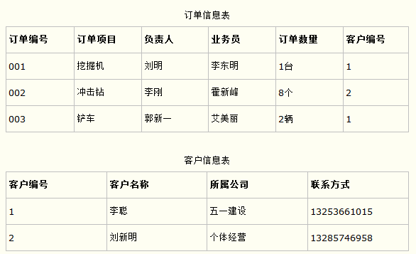
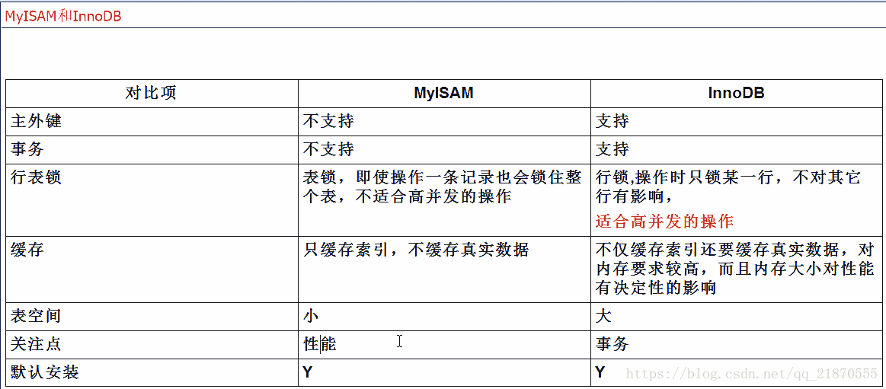
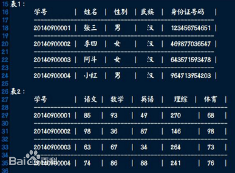

### 数据库系统

1. 数据库由里至外的组成为：计算机硬件、数据库管理系统、数据库、应用程序、数据库用户；

### 数据库的数据模型

1. 层次模型：用层次的结构表示实体之间的联系，特点是：

   ①只有根节点没有父节点；②其他节点有且只有一个父节点；

2. 网状模型：用图来表示实体之间的关系，特点是：

   ①有多个节点没有父节点；②至少有一个节点有多个父节点；

3. 关系模型：用二维表来表示实体间的联系，不仅可以表达一对多的关系还可以表达多对多的关系。重点讲解关系模型：

   ①关系：**一个关系就是一个没有重复行和列的二维表**；

   ②元组：**二维表的每一行称为一个元组**；

   ③属性：**二维表的每一列称为一个属性**；

   ④域：**属性的取值范围**；

   关系模型的优点：

   ①数据结构简单清晰；

   ②关系规范化，每个属性都不可再分，同时具有一定的联系；

   ③概念简单，操作方便；

### 关系数据库

1. 数据依赖分为：函数依赖（Function Dependency，FD）和多值依赖（Multivalued Dependency-MVD）；

2. **函数依赖**：即属性之间可能存在一定的制约关系，但是这种关系并不一定可逆。例如可以通过属性“身份证号”来判别“出生地”，反之则不可行，在这里“身份证号”称为这个函数依赖的决定属性集；

3. **主键**：表中经常有一个列或多列的组合，其值能唯一地标识表中的每一行。这样的一列或多列称为表的主键，通过它可强制表的实体完整性。当创建或更改表时可通过定义 PRIMARY KEY 约束来创建主键。一个表只能有一个 PRIMARY KEY 约束，而且 PRIMARY KEY 约束中的列不能接受空值。由于 PRIMARY KEY 约束确保唯一数据，所以经常用来定义标识列。

4. 第一范式：**第一范式要求关系中的属性必须是原子项，即不可再分的基本类型**，集合、数组和结构不能作为某一属性出现，严禁关系中出现“表中有表”的情况。 在任何一个关系数据库系统中，第一范式是关系模式的一个最起码的要求。

   第二范式：**第二范式指每个表必须有且仅有一个数据元素为主关键字(Primary key),其他数据元素与主关键字一一对应。**通常称这种关系为函数依赖(Functional dependence)关系，即表中其他数据元素都依赖于主关键字,或称该数据元素惟一地被主关键字所标识。第二范式是数据库规范化中所使用的一种正规形式。它的规则是要求数据表里的所有非主属性都要和该数据表的主键有完全依赖关系；如果有哪些非主属性只和主键的一部份有关的话，它就不符合第二范式。**简单来讲：就是除了主键以外的所有非主属性，应该都可以只根据主键得到一个唯一值，如果主键是多个属性，那么应该依赖于所有属性，而不是主键中一部分的属性，否则就不符合第二范式。**采用投影分解法将一个1NF的关系分解为多个2NF的关系，可以在一定程度上减轻原1NF关系中存在的插入异常、删除异常、数据冗余度大、修改复杂等问题。

   第三范式：**第三范式需要确保数据表中的每一列数据都和主键直接相关，而不能间接相关。**比如在设计一个订单数据表的时候，可以将客户编号作为一个**外键**和订单表建立相应的关系，而不可以在订单表中添加关于客户其他信息（比如姓名、所属公司）的字段，如下面这两个表所示的设计就是一个满足第三范式的数据库表。

   

## 快速准备面试

### 1. 什么是数据库的事务？

数据库事务( transaction)是**访问并可能操作各种数据项的一个数据库操作序列**，这些操作要么全部执行,要么全部不执行，是一个不可分割的工作单位。事务由事务开始与事务结束之间执行的全部数据库操作组成。

### 2. 数据库事务的四特性（统称为ACID）？

1. 原子性（Atomicity）：原子性是指**事务包含的所有操作要么全部成功，要么全部失败回滚**，因此事务的操作如果成功就必须要完全应用到数据库，如果操作失败则不能对数据库有任何影响。
2. 一致性（Consistency）：**几个并行执行的事务，其执行结果必须与按某一顺序串行执行的结果相一致**。
3. 隔离性（Isolation）：事务的执行不受其他事务的干扰，事务执行的**中间结果对其他事务必须是透明**的。
4. 持久性（Durability）：持久性是指一个事务一旦被提交了，那么对数据库中的数据的改变就是永久性的，即便是在数据库系统遇到故障的情况下也不会丢失提交事务的操作。

### 3. 数据库的一些异常情况

1. 脏读：是指一个事务读取了**未提交事务执行过程中的数据**。
2. 不可重复读：不可重复读是指对于数据库中的某个数据，一个事务执行过程中**多次查询返回不同查询结果**，这就是在事务执行过程中，数据被其他事务提交修改了。
3. 幻读：幻读是事务**非独立执行时**发生的一种现象，例如事务T1批量对一个表中某一列列值为1的数据修改为2的变更，但是在这时，事务T2对这张表插入了一条列值为1的数据，并完成提交。此时，如果事务T1查看刚刚完成操作的数据，发现还有一条列值为1的数据没有进行修改，而这条数据其实是T2刚刚提交插入的，这就是幻读。
4. **幻读与不可重复读的区别**：不可重复读是对一个数据进行查询的两次结果不一样，但是数据是存在的；幻读是查询的返回数量不一样，有增加或者减少，如果是减少就相当于第一次查询得到了不存在的数据，出现了幻觉；

### 4. 数据库的隔离级别

1. 读未提交：读未提交，顾名思义，就是可以读到未提交的内容。因此，在这种隔离级别下，查询是不会加锁的，也由于查询的不加锁，所以这种隔离级别的一致性是最差的，可能**会产生“脏读”、“不可重复读”、“幻读”**。

2. 读提交：InnoDB在该隔离级别(READ COMMITTED)写数据时，**使用排它锁**, 读取数据**不加锁**而是使用了MVCC机制。因此，在读已提交的级别下，都会通过**MVCC**获取当前数据的**最新**快照，不加任何锁，也无视任何锁(因为历史数据是构造出来的，身上不可能有锁)。**MVCC版本的生成时机**: 是每次**select**时。因此，该级别下还是**遗留了不可重复读和幻读**。

3. 可重复读：这是MySQL的默认事务隔离级别，它确保同一事务的多个实例在并发读取数据时，会看到同样的数据行。不过理论上，这会导致另一个棘手的问题：幻读 （Phantom Read）。InnoDB和Falcon存储引擎通过**多版本并发控制（MVCC，Multiversion Concurrency Control）机制解决了该问题**。但是**仍然会出现幻读**（mysql因为RR存在间隙锁和MVCC，不会存在幻读）。

   **MVCC(Mutil-Version Concurrency Control)，就是多版本并发控制。MVCC 是一种并发控制的方法，一般在数据库管理系统中，实现对数据库的并发访问。**在Mysql的InnoDB引擎中就是指在已提交读(READ COMMITTD)和可重复读(REPEATABLE READ)这两种隔离级别下的事务对于**SELECT操作会访问版本链中的记录**的过程。SELECT就是快照读，会读取历史版本的数据。

   在InnoDB中，给每行增加两个隐藏字段来实现MVCC，**存储的并不是时间，而是事务的版本号**，每开启一个新事务，事务的版本号就会递增。**MVCC会保存某个时间点上的数据快照**。这意味着事务可以看到一个一致的数据视图，不管他们需要跑多久。这同时也意味着不同的事务在同一个时间点看到的同一个表的数据可能是不同的。

   **MVCC如何处理查询？**

   SELECT InnoDB必须每行数据来保证它符合两个条件：
   1、InnoDB必须找到一个行的版本，它至少要和事务的版本一样老(**即它的版本号不大于事务的版本号**)。这保证了不管是事务开始之前，或者事务创建时，或者修改了这行数据的时候，这行数据是存在的。
   2、这行数据的**删除版本必须是未定义的或者比事务版本要大**。这可以保证在事务开始之前这行数据没有被删除。这里的不是真正的删除数据，而是标志出来的删除。真正意义的删除是在commit的时候。
   此外，插入、删除、更新的操作会有所变化：
   INSERT：InnoDB为这个新行记录当前的系统版本号。
   DELETE：InnoDB将当前的系统版本号设置为这一行的删除ID。
   UPDATE：InnoDB会写一个**这行数据的新拷贝**，这个拷贝的版本为当前的系统版本号。它同时也会将这个版本号写到旧行的删除版本里。
   **MVCC只工作在REPEATABLE READ和READ COMMITED隔离级别下**。READ UNCOMMITED不是MVCC兼容的，因为查询不能找到适合他们事务版本的行版本；它们每次都只能读到最新的版本。SERIABLABLE也不与MVCC兼容，因为读操作会锁定他们返回的每一行数据。

   **MVCC的优点和缺点**

   这个方案的缺点在于存储引擎必须为每一行存储更多的数据，做更多的检查工作，处理更多的善后操作。

   使用MVCC多版本并发控制比锁定模型的主要优点是在MVCC里， 对检索（读）数据的锁要求与写数据的锁要求不冲突， 所以**读不会阻塞写，而写也从不阻塞读。**

4. 串行化：这是最高的隔离级别，它通过**强制事务排序，使之不可能相互冲突**，从而解决幻读问题。简言之，它是在每个读的数据行上加上共享锁。在这个级别，可能导致大量的超时现象和锁竞争。且由于串行操作，并发性能大幅下降。

### mysql两种存储引擎的区别？

1. InnoDB：Innodb（mysql默认）引擎**提供了对数据库ACID事务**的支持，并且**实现了SQL标准的四种隔离级别**。该引擎还提供了**行级锁和外键约束**，它的设计目标是处理大容量数据库系统，它本身其实就是基于MySQL后台的完整数据库系统，MySQL运行时Innodb会在内存中建立缓冲池，用于缓冲数据和索引。但是该引擎不支持FULLTEXT类型的索引，而且它没有保存表的行数，当SELECT COUNT(\*) FROM TABLE时需要扫描全表。当需要使用数据库事务时，该引擎当然是首选。由于锁的粒度更小，写操作不会锁定全表，所以在并发较高时，使用Innodb引擎会提升效率。但是使用行级锁也不是绝对的，如果在执行一个SQL语句时MySQL不能确定要扫描的范围，InnoDB表同样会锁全表。

2. MyISAM没有提供对数据库事务的支持，也不支持行级锁和外键，**因此当INSERT(插入)或UPDATE(更新)数据时即写操作需要锁定整个表**，效率便会低一些。不过和Innodb不同，**MyISAM中存储了表的行数**，于是SELECT COUNT(\*) FROM TABLE时只需要直接读取已经保存好的值而不需要进行全表扫描。如果表的**读操作远远多于写操作**且**不需要数据库事务**的支持，那么MyISAM也是很好的选择。

3. 这两个引擎的主要区别？

   1、MyISAM是非事务安全的，而InnoDB是事务安全的

   2、MyISAM锁的粒度是表级的，而InnoDB支持行级锁

   3、MyISAM支持全文类型索引，而InnoDB不支持全文索引（**现在支持了**）

   4、MyISAM相对简单，效率上要优于InnoDB，小型应用可以考虑使用MyISAM

   5、MyISAM表保存成文件形式，跨平台使用更加方便

4. 如何选择使用哪一种引擎？

   1、MyISAM管理非事务表，提供高速存储和检索以及全文搜索能力，如果再应用中执行大量select操作，应该选择MyISAM

   2、InnoDB用于事务处理，具有ACID事务支持等特性，如果在应用中执行大量insert和update操作，应该选择InnoDB

5. 再列举一种存储引擎？

   MEMORY：所有的数据都在内存中，数据的处理速度快，但是安全性不高。如果需要**很快的读写速度**，对数据的安全性要求较低，可以选择MEMOEY。它对表的大小有要求，不能建立太大的表。所以，这类数据库只使用在相对较小的数据库表。

### 数据库的索引？

**索引是对数据库表中一列或多列的值进行排序的一种结构**，使用索引可快速访问数据库表中的特定信息。如果想按特定职员的姓来查找他或她，则与在表中搜索所有的行相比，索引有助于更快地获取信息。
索引的一个主要目的就是加快检索表中数据，亦即能协助信息搜索者尽快的找到符合限制条件的记录ID的辅助数据结构。

索引的分类：

**索引分为聚簇索引和非聚簇索引两种**，聚簇索引是按照数据存放的物理位置为顺序的，而非聚簇索引就不一样了；聚簇索引能提高**多行**检索的速度，而非聚簇索引对于**单行**的检索很快。

根据数据库的功能，可以在数据库设计器中创建三种索引：

1. 唯一索引：唯一索引是**不允许其中任何两行具有相同索引值**的索引。当现有数据中存在重复的键值时，大多数数据库不允许将新创建的唯一索引与表一起保存。数据库还可能防止添加将在表中创建重复键值的新数据。例如，如果在employee表中职员的姓(lname)上创建了唯一索引，则任何两个员工都不能同姓。

2. 主键索引：**数据库表经常有一列或多列组合，其值唯一标识表中的每一行**。该列称为表的主键。在数据库关系图中**为表定义主键将自动创建主键索引**，主键索引是唯一索引的特定类型。该索引要求主键中的每个值都唯一。当在查询中使用主键索引时，它还允许对数据的快速访问。

3. **唯一索引和主键索引的区别？**

   1）主键一定会创建一个唯一索引，但是有唯一索引的列不一定是主键；
   2）主键不允许为空值，唯一索引列允许空值；
   3）一个表只能有一个主键，但是可以有多个唯一索引；
   4）主键可以被其他表引用为外键，唯一索引列不可以；
   5）主键是一种约束，而唯一索引是一种索引，是表的冗余数据结构，两者有本质的差别；

4. 建立索引的优缺点？

   **优点：**通过建立索引可以**极大地提高在数据库中获取所需信息的速度**，同时还能提高服务器处理相关搜索请求的效率，从这个方面来看它具有以下优点：
   ①在设计数据库时，通过创建一个唯一的索引，能够在索引和信息之间形成一对一的映射式的对应关系，增加数据的惟一性特点。
   ②能提高数据的搜索及检索速度，符合数据库建立的初衷。
   ③能够加快表与表之间的连接速度，这对于提高数据的参考完整性方面具有重要作用。
   ④在信息检索过程中，若使用分组及排序子句进行时，通过建立索引能有效的减少检索过程中所需的分组及排序时间，提高检索效率。
   ⑤建立索引之后，在信息查询过程中可以使用优化隐藏器，这对于提高整个信息检索系统的性能具有重要意义。

   **缺点：**虽然索引的建立在提高检索效率方面具有诸多积极的作用，但还是存在下列缺点：
   ①在数据库建立过程中，需**花费较多的时间去建立并维护索引**，特别是随着数据总量的增加，所花费的时间将不断递增；
   ②在数据库中创建的索引需要**占用一定的物理存储空间**，这其中就包括数据表所占的数据空间以及所创建的每一个索引所占用的物理空间，如果有必要建立起聚簇索引，所占用的空间还将进一步的增加；
   ③在对表中的数据进行修改时，例如对其进行增加、删除或者是修改操作时，索引还需要进行动态的维护，这给数据库的维护速度带来了一定的麻烦；

### 什么是外键？

如果公共关键字在一个关系中是主关键字，那么这个公共关键字被称为另一个关系的外键。由此可见，外键表示了两个关系之间的相关联系。以另一个关系的外键作主关键字的表被称为主表，具有此外键的表被称为主表的从表。外键又称作外关键字。例如：

设F是基本关系R的一个或一组属性，但不是关系的主键，Ks是基本关系S的主键。如果F与Ks相对应，则称F是R的外键（外部关系的主键），并称基本关系R为参照关系，基本关系S为被参照关系或目标关系。

例如：

学号在成绩表（表1）中是主键，在学生表（表2）中是外键。**这里表2是主表，表1是从表。**

如果不使用外键，表1的学号字段插了一个值（比20140999999），但是这个值在表2中并没有，这个时候，数据库允许插入，并不会对插入的数据做关系检查。然而在设置外键的情况下，插入表1学号字段的值必须要求在表1的学号字段能找到。 同时，如果要删除表2的某个学号字段，必须保证表2中没有引用该字段值的列，否则就没法删除。这就是所谓的保持数据的一致性和完整性。如右图，如果表1还引用表2的某个学号，却把表1中的这个学号删了，表2就不知道这个学号对应的学生是哪个学生。

### B+索引和hash索引的区别？

Innodb和MyISAM默认的索引是Btree索引；而Memory默认的索引是Hash索引。

1. hash索引：Hash索引只能用于对等比较，例如=,<=>（相当于=）操作符。由于是一次定位数据，不像BTree索引需要从根节点到枝节点，最后才能访问到页节点这样多次IO访问，所以检索效率远高于BTree索引。 虽然hash索引很快，但是存在很多缺点：

   ①因为Hash索引比较的是经过Hash计算的值，所以**只能进行等式比较**，不能用于范围查询；

   ②Hash索引是将索引键通过Hash运算之后，将Hash运算结果的Hash值和所对应的行指针信息存放于一个Hash表中，**由于不同索引键存在相同Hash值，所以即使满足某个Hash键值的数据的记录条数，也无法从Hash索引中直接完成查询，还是要通过访问表中的实际数据进行比较，并得到相应的结果**；

   ③由于Hash索引中存放的是经过Hash计算之后的Hash值，而且Hash值的大小关系并不一定和Hash运算前的键值完全一样，所以数据库**无法利用索引的数据来避免任何排序运算**；

   ④**联合索引中，Hash索引不能利用部分索引键查询。**对于联合索引中的多个列，Hash是要么全部使用，要么全部不使用，并不支持BTree支持的联合索引的最优前缀，也就是联合索引的前面一个或几个索引键进行查询时，Hash索引无法被利用。

   ⑤对于选择性比较低的索引键，如果创建Hash索引，那么将会存在**大量记录指针信息存于同一个Hash值相关联**。这样要定位某一条记录时就会非常麻烦，会浪费多次表数据访问，而造成整体性能底下。

2. BTree索引：至于Btree索引，它是以**B+树**为存储结构实现的。其优点跟hash相对，

   ①BTree索引不仅可以被用在=,>,>=,<,<=和between这些比较操作符上，而且还可以用于like操作符；

   ②Btree索引中的最左匹配原则： Btree是按照从左到右的顺序来建立搜索树的。比如索引是(name,age,sex)，会先检查name字段，如果name字段相同再去检查后两个字段；

   ③在Innodb中尽量使用自增的主键，这样每次增加数据时只需要在后面添加即可，**非单调的主键在插入时会需要维持B+tree特性而进行分裂调整，十分低效**；

3. **InnoDB中的Btree和MyISAM中的Btree有什么区别？**

   ①MyISAM：索引的实现是一棵B+Tree，**data域保存数据记录的地址**。因此，MyISAM中索引检索的算法为首先按照B+Tree搜索算法搜索索引，如果指定的Key存在，则取出其data域的值，然后以data域的值为地址，读取相应数据记录。因此MyISAM的索引方式也叫做**非聚集索引**；

   ②InnoDB：一个重大区别是InnoDB的数据文件本身就是索引文件。在InnoDB中，表数据文件本身就是按B+Tree组织的一个索引结构，**这棵树的叶节点data域保存了完整的数据记录**。这个索引的key是数据表的主键，因此InnoDB表数据文件本身就是主索引。因此这种索引叫做**聚集索引**。

   ③第二个与MyISAM索引的不同是**InnoDB的辅助索引data域存储相应记录主键的值而不是地址**。好处是**InnoDB在移动行时，无需维护二级索引**，因为叶子节点中存储的是主键值，而不是指针。

4. 为什么InnoDB中需要建立二级索引？

   聚簇索引的叶子节点存储了一行完整的数据，而二级索引只存储了主键值，相比于聚簇索引，占用的空间要少。当我们需要为表建立多个索引时，如果都是聚簇索引，那将占用大量内存空间，**所以InnoDB中主键所建立的是聚簇索引，而唯一索引、普通索引、前缀索引等都是二级索引**；

### 索引的底层实现？为什么不采用B树、红黑树？

索引最大的特点就是提高查询的速度。因为索引有时候会非常大，通常都是存储在磁盘中的，所以查询的时候就会涉及磁盘IO，树的深度越深，磁盘IO的次数就越多，因此树的高度要尽可能浅。

①红黑树是一种自平衡的二叉树，在数据量相同的情况下红黑树更深，同时其节点的插入删除涉及复杂的平衡调整，因此不适合用作索引；

②B树/B+树 的特点就是每层节点数目非常多，层数很少，目的就是为了就少磁盘IO次数，但是**B树的每个节点都有data域（指针）**，这无疑增大了节点大小，发生磁盘IO的几率就更大。而B+树除了叶子节点其它节点并不存储数据，节点小，磁盘IO次数就少。

③B+树所有的Data域在叶子节点，一般来说都会进行一个优化，就是**将所有的叶子节点用指针串起来**。这样**遍历**叶子节点就能获得全部数据，这样就能**进行区间访问**啦。在数据库中基于范围的查询是非常频繁的，而B树不支持这样的遍历操作。

### 什么是索引的最左前缀原则？

①最左前缀匹配原则，mysql会**一直向右匹配直到遇到范围查询**(>、<、between、like)就停止匹配，比如a = 1 and b = 2 and c > 3 and d = 4 如果建立(a,b,c,d)顺序的索引，**d是用不到索引的**，如果建立(a,b,d,c)的索引则都可以用到，a,b,d的顺序可以任意调整。

②使用like通配符进行模糊查询的时候，通配符出现在开头则不使用索引。

explain SELECT * FROM test_table5 where address like '%东' 这个**不使用索引**，

explain SELECT * FROM test_table5 where address like '东%' 这个**使用了address索引**。

③mysql的最左前缀的原则，在建立**联合索引**时你放在**最左边的字段就能享受索引的支持**，即使没有单独为你建立索引，而**不是最左边的就不能单独享受这个索引的支持**了。例如：
两个字段（name,age）建立联合索引，如果where age=12这样的话，是没有利用到索引的；如果是where name=12这样就能使用索引了；查询条件where name=‘xxx’ and age=xx 这时的话，就利用到索引了，再来思考下where age=xx and name=’xxx‘ 这个sql会利用索引吗，按照正常的原则来讲是不会利用到的，但是**优化器会进行优化**，把位置交换下。这个sql也能利用到索引了。

### 什么是覆盖索引？

就是select的数据列**只用从索引中就能够取得，不必从数据表中读取**，换句话说查询列要被所使用的索引覆盖。

例如：

SELECT uid FROM tb WHERE gid = 1；

在表tb中插在gid为1的数据，返回其uid，其过程为首先查找gid为1的数据，然后取得数据之后再返回uid，一共需要两步才能完成查询；

而如果建立联合索引：

ALTER TABLE tb ADD INDEX gid_uid （uid，gid）；

SELECT uid FROM tb WHERE gid = 1；

这时候就会使用**覆盖索引**，因为索引中包含gid和uid，检索到gid为1的数据的时候可以直接返回uid，只需要一步就可以完成查询；

### 数据库的主从复制的几种方式？

**①同步复制:**

所谓的同步复制，意思是master的变化，必须等待slave-1,slave-2,...,slave-n完成后才能返回。 这样，显然不可取，也不是MySQL复制的默认设置。比如，在WEB前端页面上，用户增加了条记录，需要等待很长时间。

**②异步复制:**

如同AJAX请求一样。master只需要完成自己的数据库操作即可。至于slaves是否收到二进制日志，是否完成操作，不用关心,MySQL的默认设置。

**③半同步复制:**

master只保证slaves中的一个操作成功，就返回，其他slave不管。 这个功能，是由google为MySQL引入的。

**问题1：**master的写操作，slaves被动的进行一样的操作，保持数据一致性，那么slave是否可以主动的进行写操作？

> 假设slave可以主动的进行写操作，slave又无法通知master，这样就导致了master和slave数据不一致了。因此slave不应该进行写操作，至少是slave上涉及到复制的数据库不可以写。实际上，这里已经揭示了读写分离的概念。

**问题2：**主从复制中，可以有N个slave,可是这些slave又不能进行写操作，要他们干嘛？

> **实现数据备份:**
> 类似于高可用的功能，一旦master挂了，可以让slave顶上去，同时slave提升为master。
>
> **异地容灾:**比如master在北京，地震挂了，那么在上海的slave还可以继续。
> 主要用于实现scale out,分担负载,可以将读的任务分散到slaves上。
> 【很可能的情况是，一个系统的读操作远远多于写操作，因此写操作发向master，读操作发向slaves进行操作】

**问题3：**主从复制中有master,slave1,slave2,...等等这么多MySQL数据库，那比如一个JAVA WEB应用到底应该连接哪个数据库?

> 我们在应用程序中可以这样，insert/delete/update这些更新数据库的操作，用connection(for master)进行操作，
>
> select用connection(for slaves)进行操作。那我们的应用程序还要完成怎么从slaves选择一个来执行select，例如使用简单的轮循算法。
>
> 这样的话，相当于应用程序完成了SQL语句的路由，而且与MySQL的主从复制架构非常关联，一旦master挂了，某些slave挂了，那么应用程序就要修改了。能不能让应用程序与MySQL的主从复制架构没有什么太多关系呢？
> 找一个组件，application program只需要与它打交道，用它来完成MySQL的代理，实现SQL语句的路由。
> MySQL proxy并不负责，怎么从众多的slaves挑一个？可以交给另一个组件(比如haproxy)来完成。
>
> 这就是所谓的MySQL READ WRITE SPLITE，MySQL的读写分离。

**问题4：**如果MySQL proxy , direct , master他们中的某些挂了怎么办？

> 总统一般都会弄个副总统，以防不测。同样的，可以给这些关键的节点来个备份。

**问题5：**当master的二进制日志每产生一个事件，都需要发往slave，如果我们有N个slave,那是发N次，还是只发一次？如果只发一次，发给了slave-1，那slave-2,slave-3,...它们怎么办？

> 显然，应该发N次。实际上，在MySQL master内部，维护N个线程，每一个线程负责将二进制日志文件发往对应的slave。master既要负责写操作，还的维护N个线程，负担会很重。可以这样，slave-1是master的从，slave-1又是slave-2,slave-3,...的主，同时slave-1不再负责select。 slave-1将master的复制线程的负担，转移到自己的身上。这就是所谓的多级复制的概念。

**问题6：**当一个select发往MySQL proxy，可能这次由slave-2响应，下次由slave-3响应，这样的话，就无法利用查询缓存了。

> 应该找一个共享式的缓存，比如memcache来解决。将slave-2,slave-3,...这些查询的结果都缓存至mamcache中。

**问题7：**随着应用的日益增长，读操作很多，我们可以扩展slave，但是如果master满足不了写操作了，怎么办呢？

> scale on ?更好的服务器？ 没有最好的，只有更好的，太贵了。。。
> scale out ? 主从复制架构已经满足不了。
> 可以分库【垂直拆分】，分表【水平拆分】。

### 数据库里面有哪些锁？出现死锁如何解决？

**MySQL有三种锁的级别：**页级、表级、行级。

- **表级锁：**开销小，加锁快；不会出现死锁；锁定粒度大，发生锁冲突的概率最高,并发度最低。
- **行级锁：**开销大，加锁慢；会出现死锁；锁定粒度最小，发生锁冲突的概率最低,并发度也最高。
- **页面锁：**开销和加锁时间界于表锁和行锁之间；会出现死锁；锁定粒度界于表锁和行锁之间，并发度一般

**什么是死锁？**

**死锁:** 是指两个或两个以上的进程在执行过程中。因争夺资源而造成的一种互相等待的现象,若无外力作用,它们都将无法推进下去。此时称系统处于死锁状态或系统产生了死锁,这些永远在互相等待的进程称为死锁进程。

表级锁不会产生死锁.所以解决死锁主要还是针对于最常用的InnoDB。

**死锁的关键在于：**两个(或以上)的Session加锁的顺序不一致。

那么对应的解决死锁问题的关键就是：让不同的session加锁有次序。

**死锁的解决办法?**

1.查出的线程杀死 kill
SELECT trx_MySQL_thread_id FROM information_schema.INNODB_TRX;

2.设置锁的超时时间
Innodb 行锁的等待时间，单位秒。可在会话级别设置，RDS 实例该参数的默认值为 50（秒）。

生产环境不推荐使用过大的 innodb_lock_wait_timeout参数值
该参数支持在会话级别修改，方便应用在会话级别单独设置某些特殊操作的行锁等待超时时间，如下：
set innodb_lock_wait_timeout=1000; —设置当前会话 Innodb 行锁等待超时时间，单位秒。

3.指定获取锁的顺序

### 乐观锁和悲观锁是什么？select时怎么加排它锁？

**悲观锁（Pessimistic Lock）**:先获取锁，再进行业务操作。

即“悲观”的认为获取锁是非常有可能失败的，因此要先确保获取锁成功再进行业务操作。通常所说的**“一锁二查三更新”即指的是使用悲观锁。**通常来讲在数据库上的悲观锁需要数据库本身提供支持，即通过常用的select … for update操作来实现悲观锁。当数据库执行select for update时会获取被select中的数据行的行锁，因此其他并发执行的select for update如果试图选中同一行则会发生排斥（需要等待行锁被释放），因此达到锁的效果。select for update获取的行锁会在当前事务结束时自动释放，因此必须在事务中使用。

**补充：**
不同的数据库对select for update的实现和支持都是有所区别的，

- oracle支持select for update no wait，表示如果拿不到锁立刻报错，而不是等待，MySQL就没有no wait这个选项。
- MySQL还有个问题是select for update语句执行中所有扫描过的行都会被锁上，这一点很容易造成问题。因此如果在MySQL中用悲观锁务必要确定走了索引，而不是全表扫描。

**乐观锁（Optimistic Lock）:**

**1.**乐观锁，也叫乐观并发控制，它假设多用户并发的事务在处理时不会彼此互相影响，各事务能够在不产生锁的情况下处理各自影响的那部分数据。在提交数据更新之前，每个事务会先检查在该事务读取数据后，有没有其他事务又修改了该数据。如果其他事务有更新的话，那么当前正在提交的事务会进行回滚。

**2.乐观锁的特点先进行业务操作，不到万不得已不去拿锁。**即“乐观”的认为拿锁多半是会成功的，因此在进行完业务操作需要实际更新数据的最后一步再去拿一下锁就好。
乐观锁在数据库上的实现完全是逻辑的，不需要数据库提供特殊的支持。

**3.**一般的做法是**在需要锁的数据上增加一个版本号，或者时间戳**；

1. 使用数据版本（Version）记录机制实现，这是乐观锁最常用的一种实现方式。何谓数据版本？即为数据增加一个版本标识，一般是通过为数据库表增加一个数字类型的 “version” 字段来实现。当读取数据时，将version字段的值一同读出，数据每更新一次，对此version值加一。当我们提交更新的时候，判断数据库表对应记录的当前版本信息与第一次取出来的version值进行比对，如果数据库表当前版本号与第一次取出来的version值相等，则予以更新，否则认为是过期数据。

2. 乐观锁定的第二种实现方式和第一种差不多，同样是在需要乐观锁控制的table中增加一个字段，名称无所谓，字段类型使用时间戳（timestamp）, 和上面的version类似，也是在更新提交的时候检查当前数据库中数据的时间戳和自己更新前取到的时间戳进行对比，如果一致则OK，否则就是版本冲突。

**注意：**

- 乐观锁在不发生取锁失败的情况下开销比悲观锁小，但是一旦发生失败回滚开销则比较大，因此适合用在取锁失败概率比较小的场景，可以提升系统并发性能
- 乐观锁还适用于一些比较特殊的场景，例如在业务操作过程中无法和数据库保持连接等悲观锁无法适用的地方。

**总结：**
悲观锁和乐观锁是数据库用来保证数据并发安全防止更新丢失的两种方法，例子在select ... for update前加个事务就可以防止更新丢失。悲观锁和乐观锁大部分场景下差异不大，一些独特场景下有一些差别，一般我们可以从如下几个方面来判断。

- **响应速度：** 如果需要非常高的响应速度，建议采用乐观锁方案，成功就执行，不成功就失败，不需要等待其他并发去释放锁。'
- **冲突频率：** 如果冲突频率非常高，建议采用悲观锁，保证成功率，如果冲突频率大，乐观锁会需要多次重试才能成功，代价比较大。
- **重试代价：** 如果重试代价大，建议采用悲观锁。

### 触发器的作用？

触发器是一种特殊的存储过程，主要是通过事件来触发而被执行的。它可以**强化约束，来维护数据的完整性和一致性**，可以**跟踪数据库内的操作从而不允许未经许可的更新和变化**。可以联级运算。如，某表上的触发器上包含对另一个表的数据操作，而该操作又会导致该表触发器被触发。

### 物理日志redolog和逻辑日志binlog？

redo log是InnoDB引擎特有的日志，而binlog（归档日志）是Server层的日志。

他们之间有三个不同：

1. redo log是InnoDB引擎特有的；binlog是MySQL的Server层实现的，所有引擎都可以使用。
2. redo log是物理日志，记录的是“在某个数据页上做了什么修改”；binlog是逻辑日志，记录的是这个语句的原始逻辑，比如“给ID=2这一行的c字段加1 ”。
3. **redo log是循环写的，空间固定会用完；binlog是可以追加写入的**。“追加写”是指binlog文件写到一定大小后会切换到下一个，并不会覆盖以前的日志。

为什么需要两个日志？

InnoDB就可以保证即使数据库发生异常重启，之前提交的记录都不会丢失，这个能力称为**crash-safe**；而MySQL中的binlog并不具备crash-safe。

什么是**两阶段提交**？

存储引擎将这行新数据**更新到内存**（还没有写入磁盘）中，**首先将这个更新操作记录到redo log里面**，此时redo log处于prepare状态。然后告知执行器执行完成了，随时可以提交事务。**执行器生成这个操作的binlog，并把binlog写入磁盘**。执行器调用引擎的提交事务接口（这里写入磁盘，完成持久化），**引擎把刚刚写入的redo log改成提交（commit）状态，更新完成。**

为什么需要两阶段提交？

两阶段提交是跨系统维持数据逻辑一致性时常用的一个方案，可以防止在redolog和binlog之间系统崩溃时数据不一致的问题。

