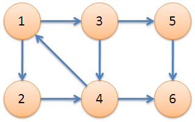
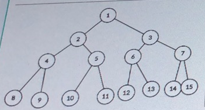

### 数对

## 题目描述

牛牛以前在老师那里得到了一个正整数数对(x, y), 牛牛忘记他们具体是多少了。

但是牛牛记得老师告诉过他x和y均不大于n, 并且x除以y的余数大于等于k。

牛牛希望你能帮他计算一共有多少个可能的数对。

## 输入描述:

```
输入包括两个正整数n,k(1 <= n <= 10^5, 0 <= k <= n - 1)。
```

## 输出描述:

```
对于每个测试用例, 输出一个正整数表示可能的数对数量。
```

示例1

## 输入

```
5 2
```

## 输出

```
7
```

## 说明

```
满足条件的数对有(2,3),(2,4),(2,5),(3,4),(3,5),(4,5),(5,3)
```

### 思路

对于x%y>=k，当y固定的时候，其实余数也固定了，为0~y-1，因此如果y<k，那么余数肯定小于k；

因此我们的循环从k+1开始，当y一定的时候，如果y>k，那么在余数0~y-1循环里会有y-k个数对符合情况，例如x==2，y==4，k==2时，有（2，3）和（2，4）符合条件；余数在0~y-1的循环的时候，x分别对应是0~y-1，如果x为y~2*y-1的时候，余数还是0~y-1；因此我们要找到在x<=n的情况下，有多少个这样的循环，答案是n/y个。因此这部分就是（n/i）\*（i-k）；

然后剩余的数字可能不满一个循环，要检查这部分是否有符合的数对，检查n%i>k，如果为true，说明有的，这一段的数量为n%i-k+1个，如果为false，说明这一段没有这样的数对。

### 代码

```c++
#include<bits/stdc++.h>
using namespace std;
int main()
{
	long long n, k;
	cin >> n >> k;
	long long sum = 0;
	if (k == 0)
	{
		sum = n * n;
	}
	else
	{
		for (long long i = k + 1; i <= n; i++)
		{
			sum += (n / i)*(i - k) + (n%i >= k ? n % i - k + 1 : 0);
		}
	}
	cout << sum << endl;
	return 0;
}
```


### 找父节点

假设有一棵无限深的满二叉树，其节点按层次排序，根节点为1，第二层为2，3，以此类推。此时给定一个序号x的节点（x<10^18），和一个层数k，返回x这个节点在k层的祖父节点的序号，如果这个k无意义则返回-1。

**思路**：这题最简单的想法是先找到x所在的层数，然后计算x-k，如果<=0返回-1；如果>0，则从x开始不断除以2找到父节点，但是肯定会超时。两个地方改变计算方法，①找到x所在的层数，由于（x<10^18），也就是说，差不多是2的0~64次方，我们用二分法来查找，直到2^l刚好大于x，那么x就在l层，这里要注意有些层数刚好是2的n次方，因此我们可以将x+1然后再计算，二分的时候注意不要死循环；②从x开始找父节点，其实就是不断除以2，所以直接将x进行位运算，右移x-k位就ok了；二分法最大的时间为log64，相当于O（1），然后位运算就是O（1），所以总的时间复杂度为O（1）。

**代码**

```c++
#include<bits/stdc++.h>
using namespace std;
int finditlevel(long long x) {
	int f = 0, r = 64, mid;
	long long temp = 1;
	while (f < r) {
		mid = (f + r + 1) / 2;//这里靠右所以才可以f = mid
		temp = pow(2, mid);
		if (temp <= x)//希望最终结果不要超过x，因此<=x
			f = mid;
		else
			r = mid-1;
	}
	return mid;
}
int main()
{
	int Q;
	scanf("%d", &Q);
	while (Q--) {
		long long x, k;
		scanf("%lld %lld", &x, &k);
		int level = finditlevel(x);
		int querytime = level - k;
		if (querytime <= 0) {
			printf("%d\n", -1);
			continue;
		}
		x = x >> querytime;
		printf("%lld\n", x);
	}
	return 0;
}
```


### 二维最接近点对问题

给定很多随机的二维的点，类型为double。找到最接近的点对，并且返回它们的距离。


### 1.给定一个字符串（最多包含8个字符），可能包含重复的字母，返回有多少种不同的排列组合。 

  **输入样例**：abc 

  **输出**：6 

  **tips**：如果字符串为空，输出0。 

  **思路**：类似于leetcode47题，枚举每一个字符所在的位置。为了不重复，需要保证相同字符的相对位置不变。因此，如果后面的字符跟当前字符相同，后面的字符必须在当前字符的后面；如果不相同，随便放。 只通过了百分之90，可能有空格得先去除。

```
#include<bits/stdc++.h>
using namespace std;
void dfs(int num,int step, string &s, int &cnt,vector<int> &jd) {
    if (num == s.size()) {
        cnt++;
        return;
    }
    for (int i = step; i < s.size(); ++i) {
        if (jd[i] == 0) {
            jd[i] = 1;
            if (num <(s.size()-1) && s[num] == s[num + 1])
                dfs(num + 1, i + 1, s, cnt, jd);
            else
                dfs(num + 1, 0, s, cnt, jd);
            jd[i] = 0;
        }
    }
    return;
}
int main() {
    string s;
    int cnt = 0;
    getline(cin, s);
    if (s.size() == 0) {
        cout << cnt << endl;
        return 0;
    }
    vector<int> jd(s.size(), 0);
    dfs(0, 0, s, cnt, jd);
    cout << cnt << endl;
    return 0;
}
```

  


### 2.给定一个字符串M和一个整数k，可以删除M中任意k个字符，返回字典序最小的那一个结果。  

   **输入样例**：bacaa  

​               1

   **输出**：acaa  

   **思路**：遍历这个字符串，类似于冒泡算法不断比较相邻的字符。如果遇到逆序对就删掉第一个字符，k--，然后继续比较剩余的字符；如果全部逆序对都删除了k仍然大于0，就删掉后面的剩余字符； 如果当前枚举的字符串比当前最优ans要大就不需要比较了，直接返回。这题AC

```
#include<bits/stdc++.h>
using namespace std;
void dfs(int num, int k, string M, string &ans) {
    if (k == 0) {
        ans = min(ans, M);
        return;
    }
    int i;
    for (i = num; i < M.size() - 1; ++i) {
        if (M[i] > M[i + 1]) {
            string temp = M;
            M = M.erase(i, 1);
            if (num == 0 && M < ans)
                dfs(num, k - 1, M, ans);
            else if (M < ans)
                dfs(num-1, k - 1, M, ans);
            M = temp;
        }
    }
    if (i == M.size() - 1 && k > 0)
        dfs(num, 0, M.erase(M.size() - k), ans);
}
int main() {
    string M, ans;
    int k;
    cin >> M >> k;
    ans = M;
    dfs(0, k, M, ans);
    cout << ans << endl;
    return 0;
}
```


### 3.A要去B的城市找他玩，但是去B的城市有很多路径，A身上的钱也有限，请你帮他找到去B的城市的最短路径，路费也要足够。城市之间有单向的路径，每条路径有一定的路费。这题默认A在1号城市，B在N号城市。输出最短路径。  

​         输入第一行为A身上的钱；


​         第二行为N，表示有N座城市；


​         第三行表示有R条路径；


​         接下来R行表示路径的信息：出发城市、到达城市、路径长度、路费；


   **输入样例**： 

```
5
6
7
1 2 2 4
2 4 3 3
3 4 2 4
1 3 4 1
4 6 2 1
3 5 2 0
5 4 3 2 
```

   **输出**：11（1->3->5->4->6）  

   **思路**：感觉是一道Floyd变体，直接暴力没想到过了，惊讶。更新路径的过程中比较路费，如果路费不足就不更新了，反正都不够钱走。time至少为2，因为有些路径第一次更新会失败。这题AC

```
#include<bits/stdc++.h>
using namespace std;
int main() {
    int coin, city, road, ans = 0x3f, time = 2;
    cin >> coin >> city >> road;
    vector<vector<vector<int>>> wh(city + 1, vector<vector<int>>(city + 1, vector<int>(2, 0x3f)));
    for (int i = 0; i < road; ++i) {
        int start, end, path, pay;
        cin >> start >> end >> path >> pay;
        wh[start][end][0] = path;
        wh[start][end][1] = pay;
    }
    while (time--) {
        for (int k = 1; k < wh.size(); ++k)
            for (int i = 1; i < wh.size(); ++i)
                for (int j = 1; j < wh.size(); ++j)
                    if (wh[k][i][0] + wh[i][j][0] < wh[k][j][0] && wh[k][i][1] + wh[i][j][1] <= coin) {
                        wh[k][j][0] = wh[k][i][0] + wh[i][j][0];
                        wh[k][j][1] = wh[k][i][1] + wh[i][j][1];
                    }
    }
    if (wh[1][city][0] <= ans && wh[1][city][1] <= coin)
        cout << wh[1][city][0] << endl;
    else
        cout << -1 << endl;
    return 0;
}
```


### 4. 有10首歌曲，我想随机播放，实现一个算法将实现；

真正的随机那必然是使用rand进行的，这里就给出一个方法：**平时用的时候记得加上<cstdlib>**

```c++
#include<bits/stdc++.h>
using namespace std;
void shuffle() {
	vector<int> wh(10, 0);
	for (int i = 0; i < 10; ++i)
		wh[i] = i;
	for (int i = 0; i < 10; ++i) {
		int newSeat = (100 * rand() / (RAND_MAX + 1)) / 10;//这里分母的10其实就是这个数组的长度
		swap(wh[i], wh[newSeat]);
	}
	for (int i = 0; i < 10; ++i)
		cout << wh[i] << " ";
	cout << endl;
}
int main() {
	srand(time(NULL));
	shuffle();
	return 0;
}
```

### 5.实现快速排序算法

这里使用的是两边往中间靠，然后交换一次的方法，这种方法需要注意**最后有两个值需要归位**；首先是vec[left]这个值就是我们用来分割的judge，最后肯定要舍去的，然后就是vec[l]一开始的judge就应该放在最终的位置；所以最后需要：

vec[left]=vec[l];

vec[l]=judge；

```c++
#include<bits/stdc++.h>
#include<map>
#include<unordered_map>
#include<thread>
#include<mutex>
#include<Windows.h>
//#include"Bank.h"
using namespace std;
void quickSort(int left, int right, vector<int> &vec) {
	if (right - left < 1)
		return;
	int l = left, r = right, judge = vec[left];
	while (l < r) {
		while (l < r&&vec[r] >= judge)
			r--;
		while (l < r&&vec[l] <= judge)
			l++;
		if (l < r)
			swap(vec[l], vec[r]);
	}
	vec[left] = vec[l];//需要注意的点
	vec[l] = judge;//需要注意的点
	quickSort(left, l - 1, vec);
	quickSort(l + 1, right, vec);
	return;
}
int main() {
	vector<int> Vec1{ 0,5,3,1,8,4,2,7,6,9,9,8,7,4,2,3,6,1,0,5 };
	quickSort(0,Vec1.size()-1,Vec1);
	for (int i = 0; i < Vec1.size(); ++i)
		cout << Vec1[i] << " ";
	cout << endl;
	return 0;
}
```


### 6.堆排序

这里的堆是从0开始的，所以是最纯正的；其实堆可以top-down调整也可以bottom-up调整；但是由于用于排序的时候，**肯定是top-down**调整的，因此为了方便，所有的节点统一都是top-down调整的；

首先要对堆进行调整，调整从**倒数第一个非叶子节点开始**，然后逐渐到达根节点；

然后每次都将最大值放在末尾，然后调整范围减一，调整一次推，以此类推就能实现堆排序；

```c++
#include<bits/stdc++.h>
using namespace std;
void heapAdjust(int index, int limit, vector<int> &vec) {
	for (int i = 2 * index + 1; i < limit; i = 2 * i + 1) {
		if (i + 1 < limit&&vec[i + 1] > vec[i])
			i++;
		if (vec[index] > vec[i])
			break;
		swap(vec[index], vec[i]);
		index = i;
	}
	return;
}
void heapSort(int limit, vector<int> &vec) {
	if (left >= right || vec.size() == 0)
		return;
	for (int i = limit / 2 - 1; i >= 0; --i)//初始化堆
		heapAdjust(i, limit, vec);
	for (int i = limit - 1; i > 0; --i) {//逐一提取最大值并调整
		swap(vec[0], vec[i]);
		heapAdjust(0, i, vec);
	}
	return;
}
int main() {
	vector<int> Vec{ 0,5,3,1,8,4,2,7,6,9,9,8,7,4,2,3,6,1,0,5 };
	heapSort(Vec.size(),Vec);
	for (int i = 0; i < Vec.size(); ++i)
		cout << Vec[i] << " ";
	cout << endl;
	return 0;
}
```


### 7.最大递增子序列（LIS）

给定一个数组，返回其中连续递增的子序列的最大长度，这个序列是可以不连续的，但是需要递增；

一般有两种动态规划的方法：

①LIS1：用dp[i]表示以wh[i]结尾的递增子序列的长度；更新方法为每一个dp[i]都要跟其前面的所有元素比较，当dp[i]>dp[j]，说明wh[i]可以放在wh[j]后面形成递增子序列，因此dp[i]=dp[j]+1；

②LIS2：用dp[i]表示长度为i的递增子序列的最后一个元素；初始化dp[1]=wh[0]，说明长度为1的子序列的末尾数字为wh[0]；由于我们遍历wh，对dp的更新不一定跟遍历同步，因此需要一个额外的计数器index=1；当wh[i]>dp[index]时，说明wh[i]可以放在dp[index]后形成递增子序列，因此dp[++index]=wh[i]；当遇到wh[i]<dp[index]时，我们用二分法找到dp[1]~dp[index]中第一个比wh[i]大的数字，如果dp[x]>wh[i]，说明dp[x]为末尾的递增子序列长度为x，但是wh[i]比dp[x]更小，更有可能增长递增子序列，所以取代dp[x]的位置；

```c++
#include<bits/stdc++.h>
#include<map>
#include<unordered_map>
#include<thread>
#include<mutex>
#include<Windows.h>
//#include"Bank.h"
using namespace std;
int LIS1(vector<int> &wh) {
	if (wh.size() < 2)
		return wh.size();
	vector<int> dp(wh.size(), 1);
	for (int i = 1; i < wh.size(); ++i)
		for (int j = 0; j < i; ++j)
			dp[i] = wh[i] > wh[j] ? max(dp[i], dp[j] + 1) : dp[i];
	int ans = 0;
	for (int i = 0; i < dp.size(); ++i)
		ans = max(ans, dp[i]);
	return ans;
}
int getFirstBigger(int limit, int target, vector<int> &dp) {
	int left = 1, right = limit;
	while (left < right) {
		int mid = left + (right - left) / 2;
		if (dp[mid] < target)
			left = mid + 1;
		else
			right = mid;
	}
	return left;
}
int LIS2(vector<int> &wh) {
	if(wh.size() < 2)
		return wh.size();
	int ans = 0, index = 1;
	vector<int> dp(wh.size(), 0);
	dp[index] = wh[0];
	for (int i = 1; i < wh.size(); ++i) {
		if (wh[i] > dp[index])
			dp[++index] = wh[i];
		else {
			int temp = getFirstBigger(index, wh[i], dp);
			dp[temp] = wh[i];
		}
	}
	return index;
}
int main() {
	vector<int> wh{ 2,3,1,4,5,3,9,5,1,4,7,8,5,2,0,1,4,5,7,8,2,9,3 };//7
	cout << LIS1(wh) << endl;
	cout << LIS2(wh) << endl;
	return 0;
}
```


### 8.最长公共子串（LCS）

给定两个数组（或者字符串都行），返回其中最长的公共子序列。

这是一道经典的dp题目；首先我们应该认识到，如果要使用dp，状态必须可转移；例如两个数组已经知道他们的公共子串了，两个数组各加一个元素，我们可以基于前面的结果来获得当前的结果，**每一次的结果均基于之前状态转移**，那就可以使用dp；在这里利用了类似的思路，dp[i，j]表示wh1[0~i-1]和wh2[0~j-1]的公共子串的长度，如果wh1[i-1]==wh2[j-1]，则dp[i，j]=dp[i-1,j-1]+1，很简单；如果不相等，**其结果最起码不会小于之前已有的子串长度**，因此dp[i,j]=max(dp[i-1,j],dp[i,j-1])；

如果要获得这个子串，我们需要另起一个数组来标记转移路径：

①direction[i,j]=1表示dp[i,j]从dp[i,j-1]来的；

②direction[i,j]=2表示dp[i,j]从dp[i-1,j]来的；

③direction[i,j]=3表示这是一个公共子串元素，dp[i,j]从dp[i-1,j-1]来的；

最后我们从最右下角出发，不断往回走，就等得到最长公共子串；

```c++
#include<bits/stdc++.h>
#include<map>
#include<unordered_map>
#include<thread>
#include<mutex>
#include<Windows.h>
//#include"Bank.h"
using namespace std;
void LCS(vector<int> &wh1, vector<int> wh2, vector<int> &wh3) {
	if (wh1.size()*wh2.size() == 0)
		return;
	vector<vector<int>> dp(wh1.size() + 1, vector<int>(wh2.size() + 1, 0)),direction(wh1.size() + 1, vector<int>(wh2.size() + 1, 0));
	for (int i = 1; i <= wh1.size(); ++i)
		for (int j = 1; j <= wh2.size(); ++j) {
			if (wh1[i - 1] == wh2[j - 1]) {
				dp[i][j] = dp[i - 1][j - 1] + 1;
				direction[i][j] = 3;
			}
			else {
				dp[i][j] = max(dp[i - 1][j], dp[i][j - 1]);
				direction[i][j] = dp[i - 1][j] > dp[i][j - 1] ? 2 : 1;
			}
		}
	int x = direction.size() - 1, y = direction[0].size() - 1;
	while (direction[x][y]) {
		switch (direction[x][y])
		{
		case 1:
			y--;
			break;
		case 2:
			x--;
			break;
		case 3:
			wh3.insert(wh3.begin(), wh1[x - 1]);
			x--, y--;
			break;
		default:
			break;
		}
	}
	return;
}
int main() {
	vector<int> wh1{ 2,3,1,4,5,3,9,5 }, wh2{ 7,3,6,3,5,3,9,6 }, wh3;//3,5,3,9
	LCS(wh1, wh2, wh3);
	for (int i = 0; i < wh3.size(); ++i)
		cout << wh3[i] << " ";
	cout << endl;
	return 0;
}
```


### 9.实现LRU算法

这个LRU算法是一个很经典的题目了。

有很多细节需要注意，首先，我们使用双端链表，**但是节点里面必须带有key**，因为我们需要通过节点来删除哈希表里面的数值；其次我们使用get或者put的时候，**访问到的节点都必须放到链表最前端**；最后，put有三种情况，第一种已存在的节点，直接替换value然后移到最前端；第二种满了，删除最后一个节点；第三种，没满，直接塞到最前端；注意，adjust里面需要注意节点是front或者rear的特殊情况，同时，**front和rear的pre和next不能置空；**

头文件：

```c++
#pragma once
#include<string>
#include<iostream>
#include<unordered_map>
#include<mutex>
#include<thread>
using namespace std;
struct Node {
	int val;
	int key;
	Node *pre, *next;
	Node(int key_, int val_) {
		key = key_;
		val = val_;
		pre = NULL;
		next = NULL;
	}
};
class LRUCache {
private:
	Node *front;
	Node *rear;
	int capacity;
	int size;
	unordered_map<int, Node*> wh;
public:
	LRUCache(int capacity_);
	~LRUCache();
	int Get(int key);
	void Put(int key, int value);
	void adjust(Node *node);
	int GetSize() { return size; }
	int GetCapacity() { return capacity; }
};
```

实现文件：

```c++
#include"Bank.h"
using namespace std;
void LRUCache::adjust(Node *node) {
	if (front == rear || front == node)
		return;
	node->pre->next = node->next;
	if (node != rear)
		node->next->pre = node->pre;
	else
		rear = node->pre;
	node->pre = NULL;
	node->next = front;
	front->pre = node;
	front = node;
	return;
}
LRUCache::LRUCache(int capacity_) {
	if (capacity_ <= 0) {
		cout << "illegal parameter capacity=" << capacity_ << endl;
	}
	capacity = capacity_;
	size = 0;
	front = NULL;
	rear = NULL;
}
LRUCache::~LRUCache() {
	wh.clear();
	while (front!=rear) {
		Node *temp = front->next;
		delete front;
		front = temp;
	}
	delete rear;
}
int LRUCache::Get(int key) {
	if (wh.find(key) != wh.end()) {
		adjust(wh[key]);
		return wh[key]->val;
	}
	return -1;
}
void LRUCache::Put(int key, int value) {
	if (wh.find(key) != wh.end()) {
		adjust(wh[key]);
		wh[key]->val = value;
		return;
	}
	if (size == capacity) {
		if (capacity == 0)
			return;
		size--;
		int delkey = rear->key;
		Node *temp = rear->pre;
		delete rear;
		rear = temp;
		wh.erase(delkey);
	}
	Node *newnode = new Node(key, value);
	if (front == NULL) {
		front = newnode;
		rear = newnode;
	}
	else {
		front->pre = newnode;
		newnode->next = front;
		front = newnode;
	}
	wh[key] = newnode;
	size++;
	return;
}
```

操作文件：

```c++
#include<bits/stdc++.h>
#include<map>
#include<unordered_map>
#include<thread>
#include<mutex>
#include<Windows.h>
#include"Bank.h"
using namespace std;
/*
input:


output:


*/
int main() {
	LRUCache lru(3);
	lru.Put(1, 5);
	lru.Put(2, 6);
	lru.Put(3, 7);
	cout << lru.Get(1) << endl;//5
	cout << lru.Get(2) << endl;//6
	cout << lru.Get(3) << endl;//7
	cout << "----------" << endl;
	lru.Put(1, 8);
	cout << lru.Get(1) << endl;//8
	cout << lru.Get(2) << endl;//6
	cout << lru.Get(3) << endl;//7
	cout << "------------" << endl;
	lru.Put(4, 9);
	cout << lru.Get(1) << endl;//-1
	cout << lru.Get(2) << endl;//6
	cout << lru.Get(3) << endl;//7
	cout << lru.Get(4) << endl;//9
	cout << "---------------" << endl;
	cout << lru.Get(2) << endl;//6
	cout << lru.Get(3) << endl;//7
	lru.Put(5, 10);
	cout << lru.Get(2) << endl;//6
	cout << lru.Get(3) << endl;//7
	cout << lru.Get(4) << endl;//-1
	cout << lru.Get(5) << endl;//10
	return 0;
}
```

-------------------------

**超简洁版LRU**

使用STL里面的list和unordered_map实现，过程就很简单了：

头文件

```c++
#pragma once
#include<string>
#include<iostream>
#include<unordered_map>
#include<list>
#include<mutex>
#include<thread>
using namespace std;
class LRUCache {
private:
	int capacity;
	int size;
	list<pair<int, int>> data;
	unordered_map<int, list<pair<int,int>>::iterator> wh;
public:
	LRUCache(int capacity_);
	~LRUCache();
	int Get(int key);
	void Put(int key, int value);
	int GetSize() { return size; }
	int GetCapacity() { return capacity; }
};
```

实现文件

```c++
#include"Bank.h"
using namespace std;
LRUCache::LRUCache(int capacity_) {
	if (capacity_ <= 0) {
		cout << "illegal parameter capacity=" << capacity_ << endl;
	}
	capacity = capacity_;
	size = 0;
}
LRUCache::~LRUCache() {
	wh.clear();
	data.clear();
}
int LRUCache::Get(int key) {
	if (wh.find(key) != wh.end()) {
		Put(key, wh[key]->second);
		return wh[key]->second;
	}
	return -1;
}
void LRUCache::Put(int key, int value) {
	if (wh.find(key) != wh.end()) {
		data.erase(wh[key]);
		size--;
	}
	else if (size == capacity) {
		wh.erase(data.back().first);
		data.pop_back();
		size--;
	}
	data.push_front({ key,value });
	wh[key] = data.begin();
	size++;
	return;
}
```


### 10.01背包

经典动态规划题目。

给定一个固定大小的背包，和很多有重量和价值的东西，问最多能装价值多少的东西。

首先我们知道dp[i,j]表示面对i物品的时候，容量为j的背包，最大的价值量为多少，这里分两种情况：

初始化，dp[i,0]和dp[0,j]都是0；

①j<wi，也就是说，清空我的背包也没有那多多空间来装，因此

dp[i,j]=dp[i-1,j]，装作没看到这个物品；

②j>=wi，能装得下，那就得看看值不值得装，因此

dp[i,j]=max(dp[i-1,j],dp[i-1,j-wi]+wi)，装作没看到好呢，还是先装了，然后剩余的j-wi空间去装前i-1个东西；

```sql
input:
5 10
2 3
4 5
5 8
6 10
3 5

output:
16
```

```c++
#include<bits/stdc++.h>
#include<map>
#include<unordered_map>
#include<thread>
#include<mutex>
#include<Windows.h>
//#include"Bank.h"
using namespace std;
int maxValue(int items, int capacity, vector<vector<int>> &wh) {
	vector<vector<int>> bag(items + 1, vector<int>(capacity + 1, 0));
	for (int i = 1; i <= items; ++i)
		for (int j = 1; j <= capacity; ++j)
			bag[i][j] = j < wh[i - 1][0] ? bag[i - 1][j] : max(bag[i - 1][j], bag[i - 1][j - wh[i - 1][0]] + wh[i - 1][1]);
	return bag[items][capacity];
}
int main() {
	int items, capacity;
	cin >> items >> capacity;
	vector<vector<int>> wh(items, vector<int>(2, 0));
	for (int i = 0; i < items; ++i)
		cin >> wh[i][0] >> wh[i][1];
	cout << maxValue(items, capacity, wh) << endl;
	return 0;
}
```


### 11.使用图求强连通分量

在**有向图**里面，如果两个节点互达，则称为强连通；在一个有向图中，所有的节点都互达，则称为强连通分量；



例如上图中，强连通分量就是1，2，3，4组成的有向图；

我们如何求出这个图中所有的强连通分量呢？

输入的6代表有6个几点，8代表有8条边，然后8行代表从x到y的有向边

输入为三个不同的连通分量

```sql
input:
6 8
1 2
1 3
2 4
3 4
3 5
4 1
4 6
5 6
output:
6
5
3 4 2 1
```

首先，先获取节点数nodes和边数edges；为了方便，我们将节点从1开始，数组的长度都+1（除了边数组）：

①judge[i]表示节点i是否在栈中；

②stack，将**还没有分成连通分量的节点存储起来**；

③enterOrder[i]表示节点i进入栈时候的序号，**仅与节点入栈的时间有关，越早入栈，数值越小**；

④rootOrder[i]表示**节点i属于rootOrder[i]节点为代表的连通分量**；

⑤edgesWh[i]表示从i出发能到达的节点；例如edgesWh[1]={2，3}表示节点1能到达节点2和节点3；

由于有可能这个图本身就是不通的，所以要检查每一个节点是否入栈，enterOrder[i]==0表示没有入过栈，就执行tarjan算法；

首先，初始化enterOrder[num]=rootOrder[num]=index++，**enterOrder是不会变的，rootOrder有可能改变；**

然后遍历从num出发的每一条边，如果：

①还没有入过栈，那就递归执行tarjan算法；**然后将rootOrder[num] = min(rootOrder[num], rootOrder[to])**；如果to这个节点会回到某个已经入栈的节点，说明这是一个连通分量，那么num这个节点应该也是属于这个连通分量的；

②to这个节点还在栈中，说明to这个节点跟num是同一个连通分量，所以更新rootOrder[num]，至于为什么不是rootOrder[to]，其实最终结果是一样的，不用纠结；

遍历完所有的边之后，检查enterOrder[num] == rootOrder[num]：

**如果相等，说明num是一个连通分量的根节点**，我们将**栈里面num及以前的元素输出**；这一堆元素就是一个连通分量；

```c++
#include<bits/stdc++.h>
using namespace std;
void tarjan(int num, int &index, vector<bool> &judge, vector<int> &enterOrder, vector<int> &rootOrder, stack<int> &st, vector<vector<int>> &edgesWh) {
	enterOrder[num] = rootOrder[num] = index++;
	st.push(num);
	judge[num] = true;
	for (auto to : edgesWh[num]) {
		if (enterOrder[to] == 0) {
			tarjan(to, index, judge, enterOrder, rootOrder, st, edgesWh);
			rootOrder[num] = min(rootOrder[num], rootOrder[to]);
		}
		else if (judge[to])
			rootOrder[num] = min(rootOrder[num], enterOrder[to]);
	}
	if (enterOrder[num] == rootOrder[num]) {
		int temp = st.top();
		st.pop();
		judge[temp] = false;
		while (temp != num) {
			judge[temp] = false;
			cout << temp << " ";
			temp = st.top();
			st.pop();
		}
		cout << temp << endl;
	}
	return;
}
int main() {
	int nodes, edges, index = 1;
	cin >> nodes >> edges;
	vector<bool> judge(nodes + 1, false);
	vector<int> enterOrder(nodes + 1), rootOrder(nodes + 1);
	stack<int> st;
	vector<vector<int>> edgesWh(nodes+1);
	for (int i = 0; i < edges; ++i) {
		int from, to;
		cin >> from >> to;
		edgesWh[from].push_back(to);
	}
	cout << "----------------" << endl;
	for (int i = 1; i <= nodes; ++i)
		if (enterOrder[i] == 0)
			tarjan(i, index, judge, enterOrder, rootOrder, st, edgesWh);
	return 0;
}
```


### 12. 状态压缩DP

**题目大意**
一个矩阵里有很多格子，每个格子有两种状态，可以放牧和不可以放牧，可以放牧用1表示，否则用0表示，在这块牧场放牛，要求两个相邻的方格不能同时放牛（不包括斜着的），即牛与牛不能相邻。问有多少种放牛方案(一头牛都不放也是一种方案)
**输入**
1<=n<=12，1<=m<=12

每一行的状态，1表示可以放牧，0表示不可以

**输出**
一个mod 100000007的整数

由于**每一个位置均有两种状态**，放牧或者不放牧；且**第i行如何放牧仅与第i-1行如何放牧有关**；

因此我们用一个二进制数来表示每一行的状态，例如：

数字5->101，表示第一行我们在位置0，2放牧，位置1不放牧；

dp[i，j]表示第i行放牧状态位j的时候，有多少种方法，例如：

dp[0，5]表示当第0行放牧状态位5->101的时候，总共有多少种方法；**（注意，这里的j有可能变化，例如这里第0行只有0，1，2，4，5放牧状态是允许的，因此我们将其组成一个state数组，这里的j就是state[j]了）**

解题思路：

①不断读取每一行的状态，judge[i]表示第i行的原始土地状态，例如：

​	judge[i]=5->101,也就是说，第i行在位置0，2是不允许放牧的，只有位置1允许放牧；

②状态存储，这里有cols列，所以状态有1<<cols种，例如：**（这里的x&(x<<1)如果相邻有1，结果肯定不为0，所以结果为0表示相邻没有1）**

​	这里有3列，所以有000~111一共8->1000种状态；

③初始化第一列的放牧状态数；用②中可行的放牧状态跟土地的状态judge**相与**，如果结果为0，表示该放牧状态在该土地情况下可行，初始化为1；

④从第2行开始检查：首先从②中可行的放牧状态与当前行的土地状态judge**相与**，如果可行，再跟上一行的放牧状态相与（**上一行的放牧状态跟我们当前行的放牧状态相邻不能有1，例如上一行为101，我们这一行为010可行，如果我们这一行为100就不可行**），如果还是可行，那么dp[i，j]+=dp[i-1，k]；

**这里可以剪枝：我们可以检查i-1行的状态可行的时候我们才进行计算；就是在k循环里面判断judge[i-1]&state[k]为0才进行state[j]&state[k]；**

⑤将最后一行所有放牧状态的可行数加起来就是我们的结果；

```sql
输入：
2 3
1 1 1
0 1 0

输出：
9

```

```c++
#include<bits/stdc++.h>
using namespace std;
int main() {
	int rows, cols, temp, stateCount=0, ans = 0;
	cin >> rows >> cols;
	vector<vector<int>> dp(rows, vector<int>((1<<cols), 0));
	vector<int> judge(rows),state;
	for (int i = 0; i < rows; ++i)
		for (int j = 0; j < cols; ++j) {
			cin >> temp;
			if (temp == 0)
				judge[i] += 1 << j;
		}
	for (int i = 0; i < (1 << cols); ++i)
		if (!(i&(i << 1))) {
			state.push_back(i);
			stateCount++;
		}
	for (int i = 0; i < stateCount; ++i)
		if (!(judge[0] & state[i]))
			dp[0][i] = 1;
	for (int i = 1; i < rows; ++i)
		for (int j = 0; j < stateCount; ++j)
			if (!(judge[i] & state[j]))
				for (int k = 0; k < stateCount; ++k)
					if (!(state[j] & state[k]))
						dp[i][j] += dp[i - 1][k];
	for (int i = 0; i < rows; ++i) {
		for (int j = 0; j < stateCount; ++j)
			cout << dp[i][j] << " ";
		cout << endl;
	}
	for (int i = 0; i < stateCount; ++i)
		ans += dp[rows - 1][i];
	cout << ans%10000007 << endl;
	return 0;
}
```


### 13. 定义：数值序列中包含2~16进制整数，如果序列中有一个数，与序列中其他任何一个数大小都不相等，则这个数叫做“异数”。请找出给定数值序列中所有的“异数”.

这道题就是考察我们对STL里面的函数的运用熟练程度，像stoi，find这些；然后有一个难点在于：**对于无重复的需要按输入顺序输出**；这里采用的方法是，使用一个vector装载每一个字符串对于的10进制数，同时用一个hash记录每一个数出现的次数；然后再从头开始检查这个vector，当这个数字在hash中出现的次数为一次的时候，对应下标的元素就是异数。

```sql
input:
10#15
4#32
4#33
8#17
10#15
16#F
END

output:
4#32
```

```c++
#include<bits/stdc++.h>
#include<unordered_map>
using namespace std;void findoutAbnormal(vector<string> &ab, vector<string> &wh) {
	unordered_map<int, int> judge;
	vector<int> afterTrans;
	for (int i = 0; i < wh.size(); ++i) {
		int step = wh[i].find('#'), temp = stoi(wh[i].substr(step + 1), NULL, stoi(wh[i].substr(0, step)));
		afterTrans.push_back(temp);
		judge[afterTrans[i]]++;
	}
	for (int i = 0; i < afterTrans.size(); ++i)
		if (judge[afterTrans[i]] == 1)
			ab.push_back(wh[i]);
	return;
}
int main()
{
	vector<string> abnormal,wh;
	string str;
	while (cin >> str) {
		if (str == "END")
			break;
		wh.push_back(str);
	}
	findoutAbnormal(abnormal, wh);
	if (abnormal.size() == 0)
		cout << "None" << endl;
	else
		for (int i = 0; i < abnormal.size(); ++i)
			cout << abnormal[i] << endl;
	return 0;
}
```

这里面需要**特别注意**stoi（a，b，c），表示将字符串a从b地址开始到末尾，全部转换成c进制的整数，这里的c是一个int表示进制；b是一个size_t指针，一般填NULL就行；


### 14. 有一个2D游戏，玩家只能在一维坐标上移动，且每次最多移动d步；有若干个球会从掉落，问最多能得多少分？

输入：

第一行：n（有多少个球）、d（每一次能移动的距离）

第二行：每一个球掉落的坐标，按照球掉落的顺序排序

第三行：每一个球的分值

```sql
input:
3 1
-1 1 3
1 1 3

output:
3
```

解析：这是一道动态规划，首先dp[i]表示到第i个球掉落的时候，我们可以得到多少分；首先进行初始化，即我们直接从起点0开始直接飞奔第i个球的时候能不能拿到这个球，如果可以则dp[i]=wh[i，1]，否则为0；然后我们从第i个球开始，**依次检查我们是否可以接住第j（j<i）个球，然后再赶回来接住第i个球**；这里的j必然小于i，因为我们不可能接住未来的球再返回来接住当前的球；如果可以，说明我们可以接住第j个球，然后再接住第i个球，所以dp[i]=max（dp[i]，judge+dp[j]），这里的judge是dp[i]的初始值（这里是不是wh[i，1]呢，应该是吧？），遍历完毕之后**就会得到当第i个球落地的时候，我们能取得的最大分值**；如果后面有一个球k，可以接住i然后再赶回去接住k，其实相当于接住了j，然后接住i，最后接住k；所以我们对于球i，只需要遍历0~i-1即可；

```c++
#include<bits/stdc++.h>
using namespace std;
int main() {
	int n, d, ans = 0;
	cin >> n >> d;
	vector<vector<int>> wh(n, vector<int>(2, 0));
	vector<int> dp(n, 0);
	for (int i = 0; i < n; ++i)
		cin >> wh[i][0];
	for (int i = 0; i < n; ++i)
		cin >> wh[i][1];
	for (int i = 0; i < n; ++i)
		if (abs(wh[i][0]) <= d * (i + 1)) {
			dp[i] = wh[i][1];
			ans = max(ans, wh[i][1]);
		}
	for (int i = 1; i < n; ++i) {
		int judge = dp[i];
		for (int j = i - 1; j >= 0; --j)
			if (abs(wh[i][0] - wh[j][0]) <= d * (i - j)) {
				dp[i] = max(dp[i], judge + dp[j]);
				ans = max(ans, dp[i]);
			}
	}
	cout << ans << endl;
	return 0;
}
```


### 15. 每一个物品有两种属性，x和y，我们从中选择若干个物品，使得我们任意取两个物品i和j，均有xi<xj且yi<yj，或者xi>xj且yi>yj；

输入第一行为测试用例的数量；

第二行为物品数量；

第三行属性x；

第四行属性y

```sql
input:
2
4
1 5 4 2
10 20 19 21
4
1 5 4 2
20 32 19 21

output:
3
3
```

这一题应该是找到一个子序列，使得x和y均为递增序列；**leetcode354原题；**去看看leetcode心得吧；


### 16.给定一个字符串s和一个字符串p，p是正则表达式，求s是否可以转换为p；“.”可以代表任意一个字符、“\*”可以代表前一个字符重复0~n次，即c\*可以代表空，或者c、cc等；“+”代表前一个字符的1~n次；

**leetcode第十题的魔改版**，但是换汤不换药，做法还是一致的；我们使用dp[i，j]表示s的前i个字符与p的前j个字符是否匹配；首先dp[0，0]=true，然后先检查dp[0，j]，如果p[j]=“\*”，则dp[0，j]=dp[0，j-2]；后续遍历过程中，如果p[i]=“+”，则当p的前一个字符与当前s的字符匹配时为true；“\*”同理，但是“\*”可以表示前面的字符为0个；

```sql
input:
mihoyo
mio+hoyo

mihoyo
mih.*o

output:
false

true
```

```c++
#include<bits/stdc++.h>
using namespace std;
/*
input:
mihoyo
mio+hoyo

mihoyo
mih.*o

output:
false

true
*/
int main() {
	string ori, exp;
	getline(cin, ori);
	getline(cin, exp);
	vector<vector<bool>> dp(exp.size() + 1, vector<bool>(ori.size() + 1, false));
	dp[0][0] = true;
	int orilen = ori.size(), explen = exp.size();
	for (int i = 2; i <= explen; ++i)
		if (exp[i - 1] == '*')
			dp[i][0] = dp[i - 2][0];
	for (int i = 1; i <= explen; ++i)
		for (int j = 1; j <= orilen; ++j) {
			if (exp[i - 1] == ori[j - 1] || exp[i - 1] == '.')
				dp[i][j] = dp[i - 1][j - 1];
			if (i > 1 && exp[i - 1] == '*')
				dp[i][j] = dp[i][j] || dp[i - 2][j];
			if (i > 1 && (exp[i - 1] == '+' || exp[i - 1] == '*') && (exp[i - 2] == ori[j - 1] || exp[i - 2] == '.'))
				dp[i][j] = dp[i][j] || dp[i][j - 1];
		}
	cout << ((dp[explen][orilen]) ? "true" : "false") << endl;
	return 0;
}
```


### 17. 一个2x2正方形左上角、右上角、左下角、右下角分别为0、A、B、C；扩增成4x4的话，左上角的2x2不变，右上角的2x2为左上角的2x2+A，左下角的2x2为左上角的2x2+B，右下角的2x2为左上角的2x2+C；可以无穷扩增；

最左上角的坐标为（1，1），请问给定（x，y），求出这个格子的数值是多少？结果%10^9；

输入第一行为A、B、C、query次数；然后每一行为一个query，x和y；

```sql
input:
1 2 3 5
3 3
5 6
6 1
8 3
8 8

output:
3
4
4
7
9
```

这题是找规律。我们可以先画一个图，看着图来说，下面是几个例子：

①对于（5，4），这个格子是A+A+B；这个格子是B+（1，4），而（1，4）是A+（1，2），（1，2）是A+（1，1），（1，1）为0；到此我们可以发现（5，4）=B+A+A，是正确的；这里首先找到了**不大于5的2的幂次方的最大值**，就是4，然后由于x>y，所以这里应该提取一个B，然后将x减去刚才的最大幂次方，得到（5，4）=B+（1，4）；后续的情况可以发现，当y>x的时候会取A，并且**不能让x或者y归零，所以2的幂次方只能小于x或者y**；那什么时候取C呢？

②对于（5，5），这个格子是C+（1，1）；可以发现，这里x和y同时减去4；

③反观（5，4），由于减去4会让归零，因此不能都减去4，所以只能x减去4；

**规律**：首先取得**小于x和y的2的幂次方的最大值**，judgex和judgey；如果judgex==judgey，说明可以抽出来一个C，然后x和y各自减去judgex和judgey；如果judgex大于judgey，那就是（5，4）的情况，此时judgex=4.judgey=2，这个时候只能抽出来一个B，然后x减去judgex，y不变；以此类推，直到（1，1）这个点；

```c++
#include<bits/stdc++.h>
using namespace std;
int maxTwo(long long x) {
	int f = 0, r = 64, mid;
	long long temp = 1;
	while (f < r) {
		mid = (f + r + 1) / 2;
		temp = pow(2, mid);
		if (temp >= x)
			r = mid - 1;
		else
			f = mid;
	}
	return pow(2, f);
}
int main() {
	long long a, b, c, query;
	cin >> a >> b >> c >> query;
	while (query--) {
		long long x, y, ans = 0;
		int judgex, judgey;
		cin >> x >> y;
		while (x > 1 || y > 1) {
			judgex = 0;
			judgey = 0;
			if (x > 1)
				judgex = maxTwo(x);
			if (y > 1)
				judgey = maxTwo(y);
			if (judgex == judgey) {
				ans = (ans + c) % 1000000000;
				x -= judgex;
				y -= judgey;
			}
			else if (judgex < judgey) {
				ans = (ans + a) % 1000000000;
				y -= judgey;
			}
			else {
				ans = (ans + b) % 1000000000;
				x -= judgex;
			}
		}
		cout << ans << endl;
	}
	return 0;
}
```


### 树形DP入门


说明一下输入：

第一行表示有n个员工；

第二行表示每一个员工来参加派对的快乐值；

剩余n-1行表示a是b的上司；

```sql
input:
9
10 5 6 7 1 2 4 4 5
1 2
1 3
1 4
2 5
2 6
3 7
3 8
4 9

output:
26
```

这里的最优解是大老板来了，中层不来，基层全部来，因此10+1+2+4+4+5=26；

**dp（x，0）表示x员工不来参加的快乐值，dp（x，1）表示x员工来参加的快乐值**；

首先我们必须找到大老板的下标，从大老板开始dfs；

由于每一个节点只会dfs一次，因此进入的时候初始化dp（x，0）和dp（x，1）；

**由于上司来与不来的快乐值取决于员工到底来没来，因此我们必须先算完员工才能算上司**；

所以这里每一个上司都要给自己的员工一次dfs；

当一个员工dfs完了，就可以计算**如果我不来，那dp（x，0）应该加上这个员工来或者不来的最大快乐值**，所以dp（x，0）=max（dp（son，0），dp（son，1））；如果我来了，那下属不允许来，所以do（x，1）+=dp（x，0）；**注意这里全部都是加**；

最后只要看看老板来与不来哪个快乐值大就行

```c++
#include<bits/stdc++.h>
using namespace std;
void dfs(int root, vector<vector<int>> &dp, vector<vector<int>> &sons, vector<int> &funny) {
	dp[root][0] = 0;
	dp[root][1] = funny[root];
	for (int i = 0; i < sons[root].size(); ++i) {
		int son = sons[root][i];
		dfs(son, dp, sons, funny);
		dp[root][0] += max(dp[son][0], dp[son][1]);
		dp[root][1] += dp[son][0];
	}
	return;
}
int main() {
	int nodes, root;
	cin >> nodes;
	vector<vector<int>> dp(nodes + 1, vector<int>(2, 0)), sons(nodes + 1);
	vector<int> judge(nodes + 1, 0), funny(nodes + 1, 0);
	for (int i = 1; i <= nodes; ++i)
		cin >> funny[i];
	for (int i = 1; i < nodes; ++i) {
		int u, v;
		cin >> u >> v;
		judge[v] = 1;
		sons[u].push_back(v);
	}
	for(int i=1;i<=nodes;++i)
		if (judge[i] == 0) {
			root = i;
			break;
		}
	cout << "root:" << root << endl;
	dfs(root, dp, sons, funny);
	cout << max(dp[root][0], dp[root][1]) << endl;
	return 0;
}
```


### 树形DP


输入第一行为节点数n；

接下来n-1行表示a是b的父节点；

```sql
input:
15
1 2
1 3
1 4
2 5
2 6
3 7
3 8
3 9
4 10
4 11
10 12
11 13
11 14
11 15

output:
5
```

```c++
#include<bits/stdc++.h>
using namespace std;
void dfs(int root, vector<vector<int>> &dp, vector<vector<int>> &edges) {
	dp[root][0] = 0;
	dp[root][1] = 1;
	int put = 0, notput = 0;
	for (int i = 0; i < edges[root].size(); ++i) {
		int son = edges[root][i];
		dfs(son, dp, edges);
		dp[root][0] += dp[son][1];
		dp[root][1] += min(dp[son][0], dp[son][1]);
	}
	return;
}
int main() {
	int nodes, root = 0;
	cin >> nodes;
	vector<vector<int>> dp(nodes + 1, vector<int>(2, 0)), edges(nodes + 1);
	vector<bool> judge(nodes + 1, false);
	for (int i = 1; i < nodes; ++i) {
		int u, v;
		cin >> u >> v;
		judge[v] = true;
		edges[u].push_back(v);
	}
	for(int i=1;i<=nodes;++i)
		if (judge[i] == 0) {
			root = i;
			break;
		}
	dfs(root, dp, edges);
	cout << min(dp[root][0], dp[root][1]) << endl;
	return 0;
}
```


### 链式存边法

num_edge为边的编号，每一条边是唯一的，不断递增；

head[from]表示from这个节点的第一条边；

结构体edge中：

edge.next表示与这条边**起点相同的**下一条边；

edge.to表示这条边的终点；

edge.dis表示这条边的权重或者距离啥的；

如何添加一条边呢？

```c++
void addedge(long long from,long long to,long long dis)//入边链式前向星 
{
    num_edge++;//编号
    edge[num_edge].next=head[from];//把next值改为此边编号
    edge[num_edge].to=to;//to和dis分别为对应的终点和长度
    edge[num_edge].dis=dis;
    head[from]=num_edge;//把这个边的始点的编号的head值改为前一个边的编号（指向）
    //如果是无向图，要反向加一遍，代码如下：
    num_edge++;
    edge[num_edge].next=head[to];
    edge[num_edge].to=from;
    edge[num_edge].dis=dis;
    head[from]=num_edge;
}
```


### 求树中两个节点的最近公共父节点

这就是经典的LCA算法，首先上题目。


这一题的输入如下：

```sql
input:
5 5 4
3 1
2 4
5 1
1 4
2 4
3 2
3 5
1 2
4 5

output:
4
4
1
4
4
```

**首先，这里需要使用上面的链式存边法把无向边存储起来**；这一题的基础知识，首先我们知道，如果一个节点往上跳2^N步得到的那个节点，相当于我们先跳2^（n-1）步，再跳2^（n-1）步；所以这里我们可以先使用一个dp将这些节点跳跃的节点记录下来：

dp（x，n）表示节点x上跳2^n次方得到的节点，所以更新的方式就是dp（x，n）=dp（dp（x，n-1），n-1）；

这里需要注意，**x上跳2^n步可能跳出根节点了**，我们直到，某个节点的子节点就是该节点序号\*2，因此我们可以先判断根节点往下跳2^n步到达的节点是否在我们判断的这个节点的下面，如果在下面，说明这个节点是不能往上跳2^n步的；**这里还需要借助depth（x）表示x节点的深度**；

depth（x）为其父节点的深度+1，这里初始化根节点为1，然后递归进行初始化就ok；

初始化完毕之后就是重点，**给定x和y，怎么找到其最近公共父节点**？

首先，y有可能就是x的父节点，或者x和y就是两棵子树上的点，但是深度不同；

所以**第一步就是让x和y到达深度相同的节点**；我们可以领x变成深度较大的一个点，然后不断检查dp（x，n）的深度，只要这个深度大于等于y，我们就往上挪，最终x和y的深度就是一致的；

第二步**找到这个最近公共父节点**，我们可以不断地让x和y靠近他们的公共父节点，如果dp（x，n）！=dp（y，n），也就是x和y同时上跳2^n步不会重合，那就挪，最终x和y的父节点就是同一个节点；最后返回dp（x，0）就是结果了；

```c++
#include<bits/stdc++.h>
using namespace std;
struct edge {
	int next,to;
};
vector<edge> edges(10000);
vector<vector<int>> dp(10000, vector<int>(10000, 0));
vector<int> depth(10000, 0), firstedge(10000, 0);
int numCount;
void addEdge(int from, int to) {//无向图的链式存边是双向的
	numCount++;
	edges[numCount].next = firstedge[from];
	edges[numCount].to = to;
	firstedge[from] = numCount;
	numCount++;
	edges[numCount].next = firstedge[to];
	edges[numCount].to = from;
	firstedge[to] = numCount;
	return;
}
void init(int root, int father) {
	depth[root] = depth[father] + 1;
	for (int i = 1; (1 << i) <= depth[root]; i++)//只要上跳2^i步不会跳出根节点就可以跳
		dp[root][i] = dp[dp[root][i - 1]][i - 1];
	for (int i = firstedge[root]; i; i = edges[i].next) {
		int son = edges[i].to;
		if (son == father)//如果有环，直接忽略
			continue;
		dp[son][0] = root;
		init(son, root);
	}
	return;
}
int lca(int x, int y) {
	if (depth[x] < depth[y])
		swap(x, y);
	for (int i = 20; i >= 0; --i) {//让x和y到达深度相同的两个节点
		if (depth[dp[x][i]] >= depth[y])
			x = dp[x][i];
		if (x == y)
			return x;
	}
	for (int i = 20; i >= 0; --i)//不断逼近公共父节点，最终x和y的父节点就是一样的
		if (dp[x][i] != dp[y][i]) {
			x = dp[x][i];
			y = dp[y][i];
		}
	return dp[x][0];//返回x的父节点就行
}
int main() {
	int nodes, query, root;
	cin >> nodes >> query >> root;
	for (int i = 1; i < nodes; ++i) {
		int u, v;
		cin >> u >> v;
		addEdge(u, v);
	}
	init(root, 0);
	while (query--) {
		int u, v;
		cin >> u >> v;
		cout << lca(u, v) << endl;
	}
	return 0;
}
```


### Trie前缀树

是一种特别重要的数据结构，**主要用于解决大数据问题中的数据统计、前缀检索等问题**，核心思想是以空间换时间；示意图如下：


每个节点的结构体为：

```c++
struct Node{
    string word；
    int path，end；
    Node* next[26];
};
```

其中word表示到达这一个节点的时候，单词是什么；

path表示，以这一个为前缀的字符串有几个；

end表示，以这个为结尾的字符串有几个（如果查找“hello”，到达节点o的时候end=1）；

来看一道题目leetcode211：

```sql
这道题题意是创建一个数据结构，能够有插入字符串和查找是否存在字符串的操作，但是查找操作需要支持模糊查找，即要满足如下的条件
addWord(“bad”)
addWord(“dad”)
addWord(“mad”)
search(“pad”) -> false
search(“bad”) -> true
search(“.ad”) -> true
search(“b..”) -> true
```

解法就是创建一个前缀树，如果遇到“.”，表示26个字母都要遍历一遍；

```c++
#include<bits/stdc++.h>
using namespace std;
struct Node {
	string word;
	int path, end;
	Node* next[26];
	Node(){
		word = "";
		path = 0;
		end = 0;
		memset(next, 0, sizeof(Node*) * 26);
	}
};
Node *root = nullptr;
void addWord(string str) {
	if (str.size() == 0)
		return;
	Node *now = root;
	for (int i = 0; i < str.size(); ++i) {
		int index = str[i] - 'a';
		if (now->next[index] == nullptr)
			now->next[index] = new Node();
		now = now->next[index];
		now->path++;
	}
	now->end++;
	return;
}
bool search(string str) {
	if (str.size() == 0)
		return false;
	Node *now = root;
	for (int i = 0; i < str.size(); ++i) {
		if (str[i] == '.') {
			for (int j = 0; j < 26; ++j) {
				str[i] = j + 'a';
				if (search(str))
					return true;
			}
			return false;
		}
		now = now->next[str[i] - 'a'];
		if (now == nullptr)
			return false;
	}
	return true;
}
int main() {
	root = new Node();
	addWord("bad");
	addWord("dad");
	addWord("mad");
	cout << (search("pad") ? "true" : "false") << endl;
	cout << (search("bad") ? "true" : "false") << endl;
	cout << (search(".ad") ? "true" : "false") << endl;
	cout << (search("b..") ? "true" : "false") << endl;
	return 0;
}
```


### 拼多多笔试

给定一个矩阵，0代表可行，1代表障碍、X代表起点，T代表终点；找到某个起点到终点的最短距离，并输出这个距离，然后再按照坐标从小到大的顺序输出最短距离的起点坐标；

```sql
input:
5 6
X00100
00000X
01T000
0X1010
00000X

output:
4
0 0 1 5
```

像上面这个就是（0，0）、（1，5）这两个X到达T的距离都为4；

**思路是BFS广度优先遍历**，由于起点很多，我们从终点出发，终点为0，然后不断往外扩散，到达起点时的距离就是起点到终点的坐标；wh用于存放这个矩阵的字符；origin用于存放所有起点的坐标；dis用于存放所有点到达终点的距离；q用于实现广度优先遍历；首先将终点入队，然后遍历四个边界的点，将符合条件的点更新dis并且入队；一直遍历到队列为空；最后找到最短距离并输出坐标；

```c++
#include<bits/stdc++.h>
using namespace std;
vector<vector<char>> wh(10005, vector<char>(10005, '-'));
vector<vector<int>> origin, dis(10005, vector<int>(10005, -1));
queue<pair<int, int>> q;
int rows, cols, goalx, goaly;
void round(pair<int, int> &p, int dist) {
	int x = p.first, y = p.second;
	if (x > 0 && wh[x - 1][y] != '1' && dis[x - 1][y] == -1) {
		dis[x - 1][y] = dist + 1;
		q.push({ x - 1,y });
	}
	if (y > 0 && wh[x][y - 1] != '1' && dis[x][y - 1] == -1) {
		dis[x][y - 1] = dist + 1;
		q.push({ x,y - 1 });
	}
	if (x < rows - 1 && wh[x + 1][y] != '1' && dis[x + 1][y] == -1) {
		dis[x + 1][y] = dist + 1;
		q.push({ x + 1,y });
	}
	if (y < cols - 1 && wh[x][y + 1] != '1' && dis[x][y + 1] == -1) {
		dis[x][y + 1] = dist + 1;
		q.push({ x,y + 1 });
	}
	return;
}
int main() {
	cin >> rows >> cols;
	for (int i = 0; i < rows; ++i)
		for (int j = 0; j < cols; ++j) {
			char ch;
			cin >> ch;
			wh[i][j] = ch;
			if (ch == 'X')
				origin.push_back(vector<int>{ i,j });
			else if (ch == 'T')
				goalx = i, goaly = j;
		}
	q.push({ goalx,goaly });
	dis[goalx][goaly] = 0;
	while (!q.empty()) {
		round(q.front(), dis[q.front().first][q.front().second]);
		q.pop();
	}
	sort(origin.begin(), origin.end());
	int minpath = INT_MAX, index = 0;
	for(int i=0;i<origin.size();++i)
		if (dis[origin[i][0]][origin[i][1]] < minpath) {
			minpath = dis[origin[i][0]][origin[i][1]];
			index = i;
		}
	cout << minpath << endl;
	for (int i = 0; i < origin.size(); ++i)
		if (dis[origin[i][0]][origin[i][1]] == minpath)
			cout << origin[i][0] << " " << origin[i][1] << " ";
	return 0;
}
```


### 拼多多笔试(会超时)

给定一块区域的rows和cols，只能用1x1和2x2的瓷砖铺满，不能重叠，问有多少种方法？

```sql
input:
2 4

output:
5
```

这是一道压缩状态DP，这里其实是枚举2x2的瓷砖，因为1x1是随便塞的。由于第0行没有约束，所以我们直接从第1行开始计算；首先得找到一个合法集合legalstatus，具体约束为①二进制中1的个数为偶数②二进制中1必须连续出现两次，不能仅出现一次；同时初始化dp（i，j）表示在第i行，状态位j的情况下，有多少种摆放方式；

我们可以知道转移方程为dp（i，j）=Σdp（i-1，k），其中j&k==0；第1行只要是legalstatus里面的状态均初始化为1；从第2行开始DP运算；最终结果为第rows-1行的和，即Σdp（rows-1，i）；

```c++
#include<bits/stdc++.h>
using namespace std;
int dp[10005][10005];
vector<int> legalstatus;
bool legal(int x) {
	int count = 0, temp = x;
	while (temp) {
		if (temp & 1)
			count++;
		temp >>= 1;
	}
	if (count % 2 == 1)
		return false;
	for (int i = 0; (x >> i) > 0; ++i) {
		if (((x >> i) & 1) == 0)
			continue;
		if ((x >> i + 1) == 0 || ((x >> i + 1) & 1) == 0)
			return false;
		i++;
	}
	return true;
}
int main() {
	int rows, cols;
	cin >> rows >> cols;
	memset(dp, 0, sizeof(dp));
	for (int i = 0; i < (1 << cols); ++i)
		if (legal(i)) {
			legalstatus.push_back(i);
			dp[1][i] = 1;
		}
	for (int i = 2; i < rows; ++i)
		for (int j = 0; j < legalstatus.size(); ++j)
			for (int k = 0; k < legalstatus.size(); ++k)
				if (dp[i - 1][legalstatus[k]] > 0 && (legalstatus[j] & legalstatus[k]) == 0)
					dp[i][legalstatus[j]] += dp[i - 1][legalstatus[k]];
	int ans = 0;
	for (int i = 0; i < legalstatus.size(); ++i)
		ans += dp[rows - 1][legalstatus[i]];
	cout << ans << endl;
	return 0;
}
```


### C++中STL实现堆的两种方式

1. 使用vector+仿堆函数push_heap和pop_heap来实现

   ```c++
   //入堆，调整maxheap，让最大值到0号位
   void enterHeap(vector<int> &heap, int num) {
   	heap.push_back(num);
   	push_heap(heap.begin(), heap.end(), less<int>());
   	return;
   }
   //出堆，调整maxheap，让最大值到达末尾
   int leaveHeap(vector<int> &heap) {
   	pop_heap(heap.begin(), heap.end(), less<int>());
   	int ans = heap.back();
   	heap.pop_back();
   	return ans;
   }
   int main() {
   	vector<int> maxheap;//大顶堆
   	enterHeap(maxheap, 1);
   	enterHeap(maxheap, 5);
   	enterHeap(maxheap, 2);
   	enterHeap(maxheap, 4);
   	cout << leaveHeap(maxheap) << endl;
   	cout << leaveHeap(maxheap) << endl;
   	cout << leaveHeap(maxheap) << endl;
   	cout << leaveHeap(maxheap) << endl;
   	return 0;
   }
   ```

2. 由于set和multiset本身就是红黑树存储的，所以用来实现堆是很合理的；

   ```c++
   //入堆，调整maxheap，让最大值到0号位
   void enterHeap(multiset<int, greater<int>> &heap, int num) {
   	heap.insert(num);
   	return;
   }
   //出堆，调整maxheap，让最大值到达末尾
   int leaveHeap(multiset<int, greater<int>> &heap) {
   	int ans = *heap.begin();
   	heap.erase(heap.begin());
   	return ans;
   }
   int main() {
   	multiset<int,greater<int>> maxheap;//大顶堆
   	enterHeap(maxheap, 1);
   	enterHeap(maxheap, 5);
   	enterHeap(maxheap, 2);
   	enterHeap(maxheap, 4);
   	cout << leaveHeap(maxheap) << endl;
   	cout << leaveHeap(maxheap) << endl;
   	cout << leaveHeap(maxheap) << endl;
   	cout << leaveHeap(maxheap) << endl;
   	return 0;
   }
   ```


### 统计1~n这些数字中，1出现了多少次？

这道题比较复杂，我们必须先推导一下怎么统计数据；例如给定的数字是21345：

①首先将1~21345分为1~1345和1345~21345两部分；

②**统计最高位**是1有多少种情况：1345~21345包含了10000~19999这一万个数字，这种情况下为10000；

​	如果是11345则包含了10000~11345这1346个数字，则有1345+1个数字；

③**然后剩余的4个位**中，我们随便选一个位置放1，其他位置可以放0~9十种情况；即1345~21345中，可以有21XXX、2X1XX、2XX1X、2XXX1这四种情况，并且这些X都可以随便填0~9；所以是time x C（1 4）x 10^3；其中这个time是最高位的数值，像这里就是2；因为最高位可以为0或者1，所以应该是2倍；

④剩余的1~1345我们直接将1345扔回这个函数，递归计算，最后返回总和；

```c++
class Solution {
public:
    int powerOfNum(int n){
        int res=1;
        while(n--)
            res*=10;
        return res;
    }
    int countOne(string str){
        int first=str[0] - '0', ans=0, power=0,len=str.length();
        if(len==1)
            return 1;
        int subnum=stoi(str.substr(1));
        power=powerOfNum(len-1);
        if(first==1)//这里后面的（len-1）就是C（1 4），powerOfNum（len-2）就是10^3；
            ans+=subnum+1+(len-1)*powerOfNum(len-2);
        else
            ans+=power+first*(len-1)*powerOfNum(len-2);
        if(subnum)
            ans+=countOne(to_string(subnum));
        return ans;
    }
    int countDigitOne(int n) {
        if(n<=0)
            return 0;
        return countOne(to_string(n));
    }
};
```


### 丑数-剑指offer49

如果一个数只包含质因子2、3、5，则这个数是一个丑数；输入一个n，返回第n个丑数；默认1是第一个丑数；

```sql
input:
10

output:
12
```

这一题一开始打算找规律，没想到规律太隐晦，无法推导，只能通过归纳总结的方法；

首先，我们可以推导出**下一个丑数必然是已存在的某个丑数乘以2、3、5得到的**；到底是2还是3还是5呢？不知道，所以三个都要试一遍；

我们对已存在的某一个丑数乘以2、3、5，**使得这个结果大于现在我们数组中最大的丑数**，那这三个数中较小的一个就是下一个丑数了；例如目前数组只有一个1，乘以2、3、5分别得到2、3、5，那么最小的是2，所以2是下一个丑数；

但是我们不能每次都遍历所有丑数去找到那个比最大丑数大的那个数吧；**所以我们使用next2表示wh[next2]\*2就会大于目前最大的丑数**，next3和next5效果相同，那么计算下一个丑数只需要用nextX指定下标的丑数就行；

```c++
class Solution {
public:
    int nthUglyNumber(int n) {
        if(n<=0)
            return 0;
        int wh[1700];
        memset(wh,0,sizeof(wh));
        int index=1,next2=0,next3=0,next5=0;
        wh[0]=1;
        while(index<n){
            int minnum=min(min(wh[next2]*2,wh[next3]*3),wh[next5]*5);
            wh[index++]=minnum;
            while(wh[next2]*2<=minnum)
                next2++;
            while(wh[next3]*3<=minnum)
                next3++;
            while(wh[next5]*5<=minnum)
                next5++;
        }
        return wh[n-1];
    }
};
```


### 数组中的逆序对

给定一个数组，其中有多少个逆序对？

```sql
input:
7 5 6 4

output:
5
```

这一题是基于分治的想法，跟归并排序类似；以7，5，6，4为例：

①首先一直细分到一个数字，返回0说明没有逆序对；

②当一个数字一组时，例如7，5；这明显是一个逆序对，所以返回1，**同时将它们的位置翻转，防止重复计数**；

③当两个数字一组时，例如5，7和4，6；此时每一组内都是有序的；我们从末尾开始比较，就是7和6比较；明显7大于6，**并且在数组4，6中，6及其前面的元素都是小于等于6的**，所以这里有2个逆序对7，6和7，4；

④然后将7放在整理后数组末尾；5小于6，没有逆序对，将6放入整理后数组；

⑤5大于4，也就是4及其前面的元素都可以组成逆序对，这里产生了1个逆序对；然后5放入整理后数组；

⑥最后返回子数组和刚才计算的逆序对的总和；

**注意：**

1. 每一次递归都要将num和copy换位，因为必须有一个数组用来**放置整理有序后的元素**，比较的时候nums不允许改变，所以这里使用两个数组交替用作nums；
2. copy开始时**必须完全复制nums**，因为是交替用作nums的，所以copy必须一开始跟nums一模一样；


```c++
class Solution {
public:
    int calReverse(vector<int> &nums,vector<int> &copy, int left,int right){
        if(left==right){
            copy[left]=nums[left];
            return 0;
        }
        int mid=(right-left)/2,lcount=calReverse(copy,nums,left,left+mid),rcount=calReverse(copy,nums,left+mid+1,right),count=0,index=right,lord=left+mid,rord=right;
        while(lord>=left&&rord>=(left+mid+1)){
            if(nums[lord]>nums[rord]){
                copy[index--]=nums[lord--];
                count+=rord-left-mid;
            }
            else
                copy[index--]=nums[rord--];
        }
        while(lord>=left)
            copy[index--]=nums[lord--];
        while(rord>=(left+mid+1))
            copy[index--]=nums[rord--];
        return count+lcount+rcount;
    }
    int reversePairs(vector<int>& nums) {
        if(nums.size()<=1)
            return 0;
        vector<int> copy(nums);
        return calReverse(nums,copy,0,nums.size()-1);
    }
};
```


### 如何找到数组中仅出现一次的两个数

一个数组中，只有两个数只出现了一次，别的数都是出现两次，如何找到这个数呢？要求时间复杂度O（n），空间复杂度O（1）；

```sql
intput:
4 1 4 6

output:
1 6
```

首先，我们知道，异或同一个数两次就会直接抵消，所以我们直接异或一遍所有数组，就会得到两个只出现一次的数的异或，关键在于如何区分这两个数；

如果两个数的同一个位都是1，那么异或之后会变成0，所以**异或的结果中，为1的那一位，这两个数的这一位肯定不同**；我们可以根据异或结果为1的那一位是否为1来将所有数字分为两组，这样只出现一次的数字就分在了不同的组，同时出现多次的数字肯定也分在了同一组；因此我们将两个组的异或结果结合就是最终结果了；

```c++
class Solution {
public:
    vector<int> singleNumbers(vector<int>& nums) {
        vector<int> ans(2,0);
        if(nums.size()<2)
            return ans;
        int judge=0,first=0;
        for(int i=0;i<nums.size();++i)
            judge^=nums[i];
        while(!((judge>>first)&1))
            first++;
        for(int i=0;i<nums.size();++i){
            if((nums[i]>>first)&1)
                ans[0]^=nums[i];
            else
                ans[1]^=nums[i];
        }
        return ans;
    }
};
```


### 剑指offer60

给定一个数字n，表示现在有n个骰子，返回这n个骰子能取得的所有值的概率；

```sql
input:
2

output:
[0.02778,0.05556,0.08333,0.11111,0.13889,0.16667,0.13889,0.11111,0.08333,0.05556,0.02778]

```

我们可以直到n个骰子能够取得的值的范围为n~6\*n；我们可以通过统计扔骰子取得每一个数值的次数，用次数/6^n来表示概率；

为了尽量压缩计算时间，我们交替使用两个数组来实现次数统计；

原理：当增加一个骰子，点数为n的出现次数为少一个骰子时点数为n-1、n-2.....n-6的和；例如当本来只有1个骰子，现在增加一个，那么点数为7的出现次数为一个骰子时1~6次数的总和，为6；因为一个骰子可以让点数增加1~6，所以想获得点数7，只需要少一个骰子时获得1~6即可；

**注意：**

①**因为每增加一个骰子，可得到的点数会+1，需要清空非法数据**；当骰子为1时，点数1出现的次数为1；当骰子为2时，点数1出现的次数为0；这一点每一次都要清空非法数据；此外，开始计算点数n的时候，要先把点数n的数据清空；

②**点数不能为0**；我们需要统计当前点数n-1~n-6的数据的和，但是n<6的时候，只能统计1~n-1的数据和；

③学到一个技巧：

```c++
int flag=0;
flag=1-flag//可以使得flag在0和1中不断变化
```

```c++
class Solution {
public:
    vector<double> twoSum(int n) {
        int maxNum=6,base=pow(maxNum,n);
        vector<double> ans;
        if(n<1)
            return ans;
        vector<vector<int>> wh(2,vector<int>(n*maxNum+1,0));
        int flag=0;
        for(int i=1;i<=maxNum;++i)
            wh[flag][i]=1;
        for(int i=2;i<=n;++i){
            for(int j=1;j<i;++j)
                wh[1-flag][j]=0;
            for(int j=i;j<=i*maxNum;++j){
                wh[1-flag][j]=0;
                for(int k=1;k<j&&k<=maxNum;++k)
                    wh[1-flag][j]+=wh[flag][j-k];
            }
            flag=1-flag;
        }
        for(int i=n;i<=n*maxNum;++i)
            ans.push_back(wh[flag][i]*1.0/base);
        return ans;
    }
};
```


### 剑指offer62

给定一个n个元素的环形链表，元素的值为0~n-1；从0开始，每次走m步，去掉停下时的节点，问最后剩下哪一个节点？

```sql
input:
5 3

outut:
3
```

我们模拟一下，前四次分别去掉了2、0、4、1四个节点，所以剩下3；

我们设**f（n，m）表示n个节点时，隔m步撤掉一个，最终剩下的节点编号**，可以直到n最小值为1，且此时必然有f（1，m）=0；

当我们去掉一个元素k之后，只剩下n-1个元素，由于f（n，m）的前提是**从下标为0的节点开始出发**，所以不能简单套用；

对于0~k-1，k+1~n-1这n-1个元素，通过p（x）=（x-k-1）%n可以转换为一个0~n-2的序列；并且可以得到反转换p反（x）=（x+k+1）%n；

如果f（n-1，m）的开始坐标等于一轮之后的那个节点，即k+1，则f`（n-1，m）=f（n，m）；

为了将k+1映射成0，我们使用了p（x）；因此只要使用反转换就可以得到

f（n，m）=p反（f（n-1，m））=（f（n-1，m）+k+1）%n

根据这个可以不断往下递推，我们也可以从n=1开始反向推导出f（n，m）；

```c++
class Solution {
public:
    int lastRemaining(int n, int m) {
        if(n<0||m<0)
            return 0;
        int ans=0;
        for(int i=2;i<=n;++i)
            ans=(ans+m)%i;
        return ans;
    }
};
```


### 剑指offer67

实现atoi，注意边界条件；

①数字前面的空格要去除；

②注意有可能有正负；

③超出int的范围就返回对应的INT_MIN或INT_MAX；

④遇到非数字字符就可以直接返回了；

```c++
class Solution {
public:
    long long getRealNum(string str, int step,int limit, bool flag){
        long long num=0;
        while(step<limit){
            if(str[step]<'0'||str[step]>'9')
                break;
            num=num*10+str[step++]-'0';
            if(flag&&num-1>INT_MAX){
                num=INT_MIN;
                flag=false;
                break;
            }
            else if(!flag&&num>INT_MAX){
                num=INT_MAX;
                break;
            }
        }
        return flag?-num:num;
    }
    int strToInt(string str) {
        long long ans=0;
        if(str.length()==0)
            return ans;
        int step=0,limit=str.length();
        while(step<limit&&str[step]==' ')
            step++;
        if(step<limit){
            bool flag=false;
            if(str[step]=='-'){
                flag=true;
                step++;
            }
            else if(str[step]=='+')
                step++;
            if(step<limit)
                ans=getRealNum(str,step,limit,flag);
        }
        return (int)ans;
    }
};
```


### 剑指offer68

1. 第一小问，给定一个**排序二叉树**和两个节点，找到公共父节点

   由于排序二叉树的左子树所有节点的值均小于当前节点的值，右子树所有节点的值均大于当前节点的值；所以如果当前节点的值小于两个节点，或者大于两个节点，说明这个点不是公共父节点；当前节点小就往右，大就往左；

   当找到第一个节点的值在两个节点之间的，那就是这个节点了

   ```c++
   /**
    * Definition for a binary tree node.
    * struct TreeNode {
    *     int val;
    *     TreeNode *left;
    *     TreeNode *right;
    *     TreeNode(int x) : val(x), left(NULL), right(NULL) {}
    * };
    */
   class Solution {
   public:
       TreeNode* lowestCommonAncestor(TreeNode* root, TreeNode* p, TreeNode* q) {
           if(!root||!p||!q)
               return NULL;
           int minnum=min(p->val,q->val),maxnum=max(p->val,q->val);
           while(root){
               if(root->val>=minnum&&root->val<=maxnum)
                   break;
               else if(root->val<minnum)
                   root=root->right;
               else
                   root=root->left;
           }
           return root;
       }
   };
   ```

2. 给定一棵**普通二叉树**，和两个节点，找到他们的公共父节点；

   这道题的思路适用于n叉树；

   我们从根节点出发，找到一条路径到达要寻找的节点，然后对比这两个路径，最后一个相同的节点就是公共父节点；

   通过DFS的方式找到路径，首先将当前节点入队，然后遍历所有子树，**如果所有子树都返回false，说明这个节点到不了任意一个节点**，所以pop掉；**只要有一个子树返回true，那就保留当前节点**，然后继续遍历；

   ```c++
   /**
    * Definition for a binary tree node.
    * struct TreeNode {
    *     int val;
    *     TreeNode *left;
    *     TreeNode *right;
    *     TreeNode(int x) : val(x), left(NULL), right(NULL) {}
    * };
    */
   class Solution {
   public:
       bool getList(TreeNode *root,TreeNode *&target,list<TreeNode*> &l){
           if(root==target){
               l.push_back(target);
               return true;
           }
           l.push_back(root);
           bool judge=false;
           if(root->left)
               judge=getList(root->left,target,l);
           if(!judge&&root->right)
               judge=getList(root->right,target,l);
           if(!judge)
               l.pop_back();
           return judge;
       }
       TreeNode* commonParent(list<TreeNode*> lp,list<TreeNode*> lq){
           list<TreeNode*>::iterator p=lp.begin(),q=lq.begin();
           TreeNode *ans=NULL;
           while(p!=lp.end()&&q!=lq.end()&&*p==*q){
               ans=*p;
               p++;
               q++;
           }
           return ans;
       }
       TreeNode* lowestCommonAncestor(TreeNode* root, TreeNode* p, TreeNode* q) {
           if(!root||!p||!q)
               return NULL;
           list<TreeNode*> lp,lq;
           getList(root,p,lp);
           getList(root,q,lq);
           TreeNode *ans=commonParent(lp,lq);
           return ans;
       }
   };
   ```


### 长度不超过5000的字符串S，输出所有不相同的子串字典序第K小的。如aabb, k =3, `a,aa,aab,aabb,ab，abb,b,bb`, 答案为`abb` （1<=k<=5）

思路就是利用set，**set默认按照升序排序，且自动去重**，因此使用set很容易得到答案

```c++
#include<bits/stdc++.h>
using namespace std;
/*
input:
aabb
3

output:
aab

*/
int main() {
	string str;
	int k;
	cin >> str >> k;
	set<string> wh;
	for (int i = 1; i <= str.length(); ++i)
		for (int j = 0; j <= str.length() - i; ++j)
			wh.insert(str.substr(j, i));
	set<string>::iterator iter = wh.begin();
	while (--k)
		iter++;
	cout << *iter << endl;
	return 0;
}
```


### 把n拆成a+b(a,b>=0), 使得a,b的所有数位之和最大。n<=1E12,T组输出，T<=100

```sql
input：
142
998
output：
25（拆成99+43，即9+9+4+3=25）
44（拆成899+99，即8+9+9+9+9=44）
```

就是一道贪心算法，首先看看这个数字是多少位的，然后取其最高位部分-1，剩余部分+1；例如998，3位数，取其最高位部分900，减一得899；剩余部分98，加一得99；然后将所有数位加起来即可；

```c++
#include<bits/stdc++.h>
using namespace std;
int main() {
	int x,digits=0,temp,judge=1;
	cin >> x;
	temp = x;
	while (temp) {
		temp /= 10;
		digits++;
	}
	temp = digits;
	while (--temp)
		judge *= 10;
	int ans = x / judge + 9 * (digits - 1) - 1;
	temp = x % judge + 1;
	while (temp) {
		ans += temp % 10;
		temp /= 10;
	}
	cout << ans << endl;
	return 0;
}
```


### n个模板并排放置，宽度都为1，长度为hi, (n<=5000, hi<=1E9)，每次可以横着刷或者竖着刷，刷一次不能有断层

```sql
input:
5
2 2 1 2 1
2
2 2

output:
3
2
```

可以理解为有一个大围栏，每一块木板宽度为1，长度如上所示；有一个宽度为1的刷子，每次可以横着或者竖着刷一个无限长的距离；问最少多少次能刷完；

思路是贪心。首先，每一次竖着刷一块木板，n次可以刷完，因此答案<=n；然后我们可以知道，如果要横着刷，那么横着的这一条肯定是最底层的，因为只有最底层才能得到最长连续的长条；当然每一次都可以竖着刷一条；我们用total标记还有多少单位木板没有刷，colmax表示这一次竖着刷能刷多少单位木板；rowmax表示这一次横着刷能刷多少单位木板；每次选择最优解刷，然后相应地减去刷完的部分和更新total；

```c++
#include<bits/stdc++.h>
using namespace std;
int main() {
	int n, total = 0, ans = 0;
	cin >> n;
	vector<int> wh(n, 0);
	for (int i = 0; i < n; ++i) {
		cin >> wh[i];
		total += wh[i];
	}
	while (total) {
		int rowmax = 0, colmax = 0, temp = 0, start = 0, colindex = 0, rowindex = 0;
		for (int i = 0; i < n; ++i) {
			if(wh[i]>colmax)
				colindex = i, colmax = wh[i];
			temp++;
			if (wh[i] == 0)
				start = i + 1, temp = 0;
			if(temp>rowmax)
				rowindex = start, rowmax = temp;
		}
		if (rowmax >= colmax) {
			total -= rowmax;
			for (int i = rowindex; i < rowmax; ++i)
				wh[i]--;
		}
		else {
			total -= colmax;
			wh[colindex] = 0;
		}
		ans++;
	}
	cout << ans << endl;
	return 0;
}

```


### 给一个长度不超过400的字符串，1E5个询问 ，每次询问一个区间的子串最少可以切分分成几个回文子串

```sql
input:
ababa 4
1 4
1 5
2 5
1 3

output:
2
1
2
1
```

这一题跟leetcode的132题有点像，问题就在于他指定分割的范围；首先使用dp标记任意区间的字符串是否是回文子串；然后我们使用partition[i]表示str[left-1...i-1]这一段最少分割段数；枚举的i表示当前计算的字符串的终点，枚举的j表示当前计算的字符串的起点；当str[j...i-1]是一个回文字符串的时候，partition[i-left+1]=partition[j]+1；由于这个partition[i]里面的i表示长度，因此需要进行适当的转换；

```c++
#include<bits/stdc++.h>
using namespace std;
int main() {
	string str;
	int left, right, query;
	cin >> str >> query;
	vector<vector<bool>> dp(str.size(), vector<bool>(str.size(), false));
	for(int i=0;i<str.size();++i)
		for (int j = i; j >= 0; --j) {
			if (i - j <= 1)
				dp[j][i] = str[i] == str[j];
			else
				dp[j][i] = str[i] == str[j] && dp[j + 1][i - 1];
		}
	while (query--) {
		cin >> left >> right;
		vector<int> partition(str.size() + 1, 0);
		for (int i = left; i <= right; ++i) {
			partition[i - left + 1] = i - left + 1;
			for (int j = left - 1; j < i; ++j) {
				if (dp[j][i - 1])
					partition[i - left + 1] = min(partition[i - left + 1], partition[j - left + 1] + 1);
			}
		}
		cout << "ans: " << partition[right - left + 1] << endl;
	}
	return 0;
}
```


### 给定两个链表，返回两个链表中均有出现的元素；

```sql
input:
6
6 5 4 3 2 1
5
6 5 3 2 1

output:
6 5 3 2 1
```

虽然要求是链表，但是我们使用数组来存储就行；首先使用哈希表记录出现过的元素；然后第二个链表直接检查哈希表，如果出现过就输出；

```c++
#include<bits/stdc++.h>
#include<map>
#include<unordered_map>
using namespace std;
int main() {
	int list1, list2, temp;
	scanf("%d", &list1);
	vector<int> ans;
	unordered_map<int,int> judge;
	for (int i = 0; i < list1; ++i) {
		scanf("%d", &temp);
		judge[temp] = 1;
	}
	scanf("%d", &list2);
	for (int i = 0; i < list2; ++i) {
		scanf("%d", &temp);
		if (judge[temp])
			ans.push_back(temp);
	}
	for (int i = 0; i < ans.size(); ++i)
		cout << ans[i] << " ";
	return 0;
}
```


### 给定一系列只包含数字和字母的字符串，和一个整数k，输出出现次数前k多的字符串和出现次数前k少的字符串，如果次数相同，则返按字典序返回小的；

```sql
input:
4 2
1
1
2
3

output:
1 2
2 1
2 1
3 1
```

这里首先使用一个哈希表来将所有的字符串出现的次数记录下来；然后使用两个优先队列，一个按照出现次数增序，一个降序；由于相同次数的按照字典序排序，所以对于次数相同的需要做一下特殊处理；

```c++
#include<bits/stdc++.h>
#include<map>
#include<unordered_map>
using namespace std;
struct Node {
	string str;
	int num;
	Node(string str_) {
		str = str_;
		num = 1;
	}
};
struct cmplarge {
	bool operator()(Node *a, Node *b) {
		if (a->num == b->num)
			return a->str > b->str;
		return a->num < b->num;
	}
};
struct cmpsmall {
	bool operator()(Node *a, Node *b) {
		if (a->num == b->num)
			return a->str > b->str;
		return a->num > b->num;
	}
};
int main() {
	unordered_map<string, Node*> wh;
	int stringTotal, k;
	scanf("%d %d", &stringTotal, &k);
	cin.get();
	while (stringTotal--) {
		string temp;
		getline(cin, temp);
		if (wh[temp] == NULL) {
			Node *newNode = new Node(temp);
			wh[temp] = newNode;
		}
		else
			wh[temp]->num++;
	}
	priority_queue<Node*, vector<Node*>, cmplarge> pqlarge;
	priority_queue<Node*, vector<Node*>, cmpsmall> pqsmall;
	for (auto it = wh.begin(); it != wh.end(); ++it) {
		pqlarge.push(it->second);
		pqsmall.push(it->second);
	}
	for (int i = 0; i < k; ++i) {
		Node *temp = pqlarge.top();
		cout << temp->str << " " << temp->num << endl;
		pqlarge.pop();
	}
	for (int i = 0; i < k; ++i) {
		Node *temp = pqsmall.top();
		cout << temp->str << " " << temp->num << endl;
		pqsmall.pop();
	}
	return 0;
}
```


### 有n个编号为0~n-1的人，分为m组，每个人可以不属于任何组或者属于多个组；如果我把消息告诉0号，所有跟他一组都会知道；然后知道的人所在的组也会知道；返回有多少人知道了这个消息；

```sql
input:
50 6
2 1 2
5 10 11 12 13 14
2 0 1
2 49 2
4 6 7 8 2
1 47

output:
7
```

我直接使用并查集做，将每一组里面的人都合并到一个集合中去；最后获取0的组id，然后遍历一遍所有元素的组id，相同则ans++，最后输出ans；**并查集的用法必须掌握，这一题是很好的实例；**

```c++
#include<bits/stdc++.h>
#include<map>
#include<unordered_map>
using namespace std;
int showParent(int num, vector<int> &collectSet) {
	int temp = num;
	while (temp != collectSet[temp])//temp就是num这个集合的代表人
		temp = collectSet[temp];
	while (num != temp) {//路径压缩，使得这个集合所有人的collectSet[i]==temp
		int numparent = collectSet[num];
		collectSet[num] = temp;
		num = numparent;
	}
	return temp;
}
void unionSet(vector<int> &collectSet) {
	int total, num1, num2;
	cin >> total;
	if (total < 2)
		return;
	cin >> num1;
	int par1, par2;
	while (--total) {
		cin >> num2;
		par1 = showParent(num1, collectSet);//这一行以及下面两行，就是执行两个集合合并的操作
		par2 = showParent(num2, collectSet);
		if (par1 != par2)
			collectSet[par2] = par1;
	}
	return;
}
int main() {
	int persons, groups;
	cin >> persons >> groups;
	vector<int> collectSet(persons + 10, 0);
	for (int i = 0; i < persons; ++i)
		collectSet[i] = i;
	for (int i = 0; i < groups; ++i)
		unionSet(collectSet);
	for (int i = 0; i < persons; ++i)
		showParent(i, collectSet);
	int parent = showParent(0, collectSet), ans = 0;
	for (int i = 0; i < persons; ++i)
		if (collectSet[i] == parent)
			ans++;
	cout<<ans<<endl;
	return 0;
}
```


### 给定n个元素的数组，这个n是一个偶数，返回去掉第i（0~n-1）个元素之后，剩余数字的中位数是多少；

```sql
input:
8
8 7 5 3 9 2 0 6

output:
5
5
6
6
5
6
6
5
```

这里因为是中位数，去掉一个数字之后，中位数只有两种可能，并且两种可能出现的次数一样，因此我们可以先将结果保存起来，看情况吧输出对应的结果；这里需要注意的是，原始的数组可能是无序的，所以必须有一个数组排序，另一个数组负责判断；

```c++
#include<bits/stdc++.h>
#include<map>
#include<unordered_map>
using namespace std;
int main() {
	int num;
	scanf("%d", &num);
	vector<int> wh(num, 0),judge(num, 0);
	for (int i = 0; i < num; ++i) {
		scanf("%d", &wh[i]);
		judge[i] = wh[i];
	}
	sort(judge.begin(), judge.end());
	int leftnum = judge[num / 2 - 1], rightnum = judge[num / 2];
	for (int i = 0; i < num; ++i) {
		if (wh[i] < rightnum)
			printf("%d\n", rightnum);
		else
			printf("%d\n", leftnum);
	}
	return 0;
}
```


### 给定一个数字n和一个字符串，字符串只包含B和R两种字母，每一种字母都有编号1~n；只能互换相邻的元素，最少多少次交换可以使得字符串中B和R分别是增序的呢？

```sql
input:
3
BRRBRB
2 3 1 1 2 3

output:
5
```


### 有一棵完全二叉树，给定两个节点，假设每一条边的距离为1，返回这两个点的距离

```c++
input:
3
1 2
4 14
8 5

output:
1
5
3
```

输入：

第一行，有n个测试用例；

下面n行就是节点的值；



首先我们观察一下可以知道：

第一层：1小于2^1；

第二层：2、3大于等于2^1，小于2^2；

第三层：4、5、6、7大于等于2^2，小于2^3；

...

对于一个给定的节点n，我们只要找到比n大的最小的2的幂次方2^m，就知道了n处于第m层；

如果两个节点不在同一层，我们将层数大的节点不断除以2，也就是不断往父节点走，这个时候每一次都distance++；

当两个节点在同一层，但是不是同一个节点的时候，我们将两个节点同时除以2，也就是两个节点都往父节点走，这个时候每一次distance+=2；

当找到公共父节点之后，直接输出distance即可；

```c++
#include<bits/stdc++.h>
using namespace std;
int getLevel(int x) {
	int f = 0, r = 31;
	while (f < r) {
		int mid = f + (r - f) / 2;
		if (pow(2, mid) <= x)
			f = mid + 1;
		else
			r = mid;
	}
	return f;
}
void getDistance(int f, int s) {
	int fDepth = getLevel(f), sDepth = getLevel(s), fatherDepth, distance = 0;
	if (fDepth > sDepth) {
		swap(fDepth, sDepth);
		swap(f, s);
	}
	while (fDepth < sDepth--) {
		distance++;
		s /= 2;
	}
	while (f != s) {
		distance+=2;
		f /= 2;
		s /= 2;
	}
	cout << distance << endl;
	return;
}
int main()
{
	int times;
	cin >> times;
	while (times--)
	{
		int first, second;
		cin >> first >> second;
		getDistance(first, second);
	}
	return 0;
}
```


