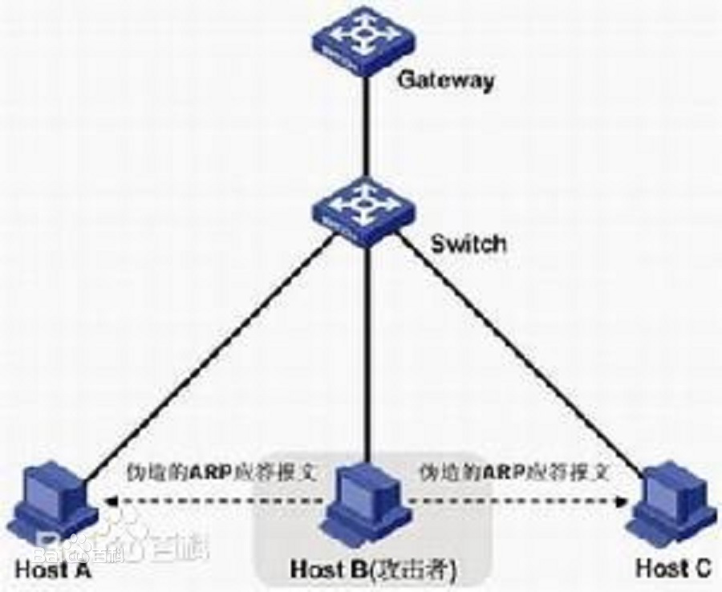

数据链路层：

1. PPP（Point to Point Protocol-点对点协议）

   点到点协议是为在同等单元之间传输数据包这样的简单链路设计的链路层协议。这种链路提供**全双工操作**，并按照顺序传递数据包。设计目的主要是用来通过拨号或专线方式建立点对点连接发送数据，使其成为各种主机、网桥和路由器之间简单连接的一种共通的解决方案。PPP具有以下功能：
   （1）PPP具有动态分配IP地址的能力，允许在连接时刻协商IP地址；
   （2）PPP支持多种网络协议，比如TCP/IP、NetBEUI、NWLINK等；
   （3）PPP具有错误检测能力，但不具备纠错能力，所以**ppp是不可靠传输协议**；
   （4）无重传的机制，网络开销小，速度快。
   （5）PPP具有身份验证功能。
   （6） PPP可以用于多种类型的物理介质上，包括串口线、电话线、移动电话和光纤（例如SDH），PPP也用于Internet接入。

　　PPP协议的组成由三部分组成：

　　（1）一个将IP数据报封装到串行链路的方法。PPP协议既支持异步链路（无奇偶的8比特数据），也支持面向比特的同步链路。IP数据报在PPP帧中就是其信息部分，这个信息部分的长度受最大传送单元MTU的限制。

　　（2）一个用来建立、配置和测试数据链路连接的链路控制协议LCP（Link Control Protocol），通信的双发可以协商一些选项。

　　（3）一套网络控制协议NCP，其中每一个协议支持不同的网络层协议，如IP，OSI的网络层，DECnet，以及AppleTalk等。

2. CSMA/CD（Carrier Sense Multiple Access with Collision Detection-载波侦听多路访问/冲突检测）

   CSMA/CD是一种争用型的介质访问控制协议。主要应用于现场总线Ethernet中。对于每一个站而言，一旦它检测到有冲突，它就放弃它当前的传送任务。换句话说，如果两个站都检测到信道是空闲的，并且同时开始传送数据，则它们几乎立刻就会检测到有冲突发生。它们不应该再继续传送它们的帧，因为这样只会产生垃圾而已；相反一旦检测到冲突之后，它们应该立即停止传送数据。快速地终止被损坏的帧可以节省时间和带宽。

   工作流程：

   1. 检测总线上是否有数据正在传输。如果有，则进入**退避**算法，进而反复侦听；如果没有，则按照X算法决定是否发送**（先听后说）**。

      这里的X算法包括：

      ①非坚持的CSMA：线路忙则等待一段时间（期间不检测），然后再侦听；不忙时立刻发送；**信道利用率低；**

      ②1坚持的CSMA：线路忙，持续监听；不忙时立刻发送；**容易发生冲突**；

      ③p坚持的CSMA：线路忙，持续监听；不忙时，有p的概率发送，1-p的概率继续监听；**比较复杂；**

   2. 如果信道在一定时段内寂静无声（称为帧间缝隙IFG），则该节点就开始传输**（无声则讲）**。

   3. 如果信道一直很忙碌，就一直监视信道，直到出现最小的IFG时段时，该节点才开始发送它的数据（有空就说）。

   4. 冲突检测，如果两个节点或更多的节点都在监听和等待发送，然后在信道空时同时决定立即（几乎同时）开始发送数据，此时就发生碰撞。这一事件会导致冲突，并使双方信息包都受到损坏。以太网在传输过程中不断地监听信道，以检测碰撞冲突（边听边说）。

   5. 如果一个节点在传输期间检测出碰撞冲突，则立即停止该次传输，并向信道发出一个“拥挤”信号，以确保其他所有节点也发现该冲突，从而摒弃可能一直在接收的受损的信息包（冲突停止，即一次只能一人讲）。

   6. 多路存取，执行退避算法，想发送的节点试图进行新的发送。

      这里的退避算法是一种叫二进制指数退避策略（Binary Exponential Back off Policy）的算法来决定不同的节点在试图再次发送数据前要等待一段时间（随机延迟）。

      M=0~(2^k-1)之间的一个随机数乘以512比特时间（例如对于10MbPS以太网，为51.2微秒），k为冲突（碰撞）的次数，M的最大值为1023，即当k=10及以后M始终是0~1023之间的一个随机值与51.2的乘积，当k增加到16时，就发出错误信息。

   7. 返回到第一步。

   CSMA的特征：

   ①简单；

   ②具有广播功能；

   ③平均带宽：f=F/n；

   ④绝对平等，无优先级；

   ⑤低负荷高效，高负荷低效；

   ⑥延时时间不可预测；

   ⑦传输速率与传输距离为一定值；

3. STP（Spanning Tree Protocol-生成树协议）

   可应用于计算机网络中树形拓扑结构建立，主要作用是**防止网桥网络中的冗余链路形成环路工作**。但某些特定因素会导致STP失败，要排除故障可能非常困难，这取决于网络设计 。

   STP的基本原理是，通过在交换机之间传递一种特殊的协议报文，**网桥协议数据单元（Bridge Protocol Data Unit，简称BPDU）**，来确定网络的拓扑结构。BPDU有两种，**配置BPDU**（Configuration BPDU）和**TCN（topology change notification-拓扑改变） BPDU，BPDU发送方式：组播**，组播MAC地址为0180-c200-0000。前者是用于计算无环的生成树的，后者则是用于在二层网络拓扑发生变化时产生用来缩短MAC表项的刷新时间的（由默认的300s缩短为15s）。该协议的原理是按照树的结构来构造网络拓扑，消除网络中的环路，**避免由于环路的存在而造成广播风暴问题。**
   其基本思想就是按照"树"的结构构造网络的拓扑结构，树的根是一个称为根桥的桥设备，根桥的确立是由交换机或网桥的BID（Bridge ID）确定的，BID最小的设备成为二层网络中的根桥。BID又是由网桥优先级和MAC地址构成，不同厂商的设备的网桥优先级的字节个数可能不同。由根桥开始，逐级形成一棵树，**根桥定时发送配置BPDU，非根桥接收配置BPDU，刷新最佳BPDU并转发。**这里的最佳BPDU指的是当前根桥所发送的BPDU。如果接收到了下级BPDU（新接入的设备会发送BPDU，但该设备的BID比当前根桥大），接收到该下级BPDU的设备将会向新接入的设备发送自己存储的最佳BPDU，以告知其当前网络中根桥；如果接收到的BPDU更优，将会重新计算生成树拓扑。当非根桥在离上一次接收到最佳BPDU最长寿命（Max Age，默认20s）后还没有接收到最佳BPDU的时候，该端口将进入监听状态，该设备将产生TCN BPDU，并从根端口转发出去，从指定端口接收到TCN BPDU的上级设备将发送确认，然后再向上级设备发送TCN BPDU，此过程持续到根桥为止**（TCN BPDU逐级向上传递，通知根桥拓扑发生变化）**，然后根桥在其后发送的配置BPDU中将携带标记表明拓扑已发生变化，网络中的所有设备接收到后将MAC表项的刷新时间从300s缩短为15s。整个收敛的时间为50s左右。

4. VLAN（Virtual Local Area Network-虚拟局域网）。

   虚拟局域网（VLAN）是一组逻辑上的设备和用户，这些设备和用户并不受物理位置的限制，可以根据功能、部门及应用等因素将它们组织起来，相互之间的通信就好像它们在同一个网段中一样，由此得名虚拟局域网。与传统的局域网技术相比较，VLAN技术更加灵活，它具有以下优点：

   **广播风暴防范、安全、成本降低、性能提高、提高人员工作效率、简化项目管理或应用管理、增加了网络连接的灵活性。**
   把同一物理局域网内的不同用户逻辑地划分成不同的广播域，每一个VLAN都包含一组有着相同需求的计算机工作站，与物理上形成的LAN有着相同的属性。**由于它是从逻辑上划分，而不是从物理上划分，所以同一个VLAN内的各个工作站没有限制在同一个物理范围中，即这些工作站可以在不同物理LAN网段。**由VLAN的特点可知，一个VLAN内部的广播和单播流量都不会转发到其他VLAN中，从而有助于控制流量、减少设备投资、简化网络管理、提高网络的安全性。

   例子：

   比如一个路由器只有一个用于终端连接的端口（当然这种情况基本不可能发生，只不过简化举例），这个端口被分配了192.168.1.1/24的地址。然而由于公司有两个部门，一个销售部，一个企划部，每个部门要求单独成为一个子网，有单独的服务器。那么当然可以划分为192.168.1.0~127/25、192.168.1.128~255/25。但是路由器的物理端口只应该可以分配一个IP地址，那怎样来区分不同网段了？这就可以在这个物理端口下，创建两个子接口---逻辑接口实现。

   VLAN划分依据：

   1. 按端口划分：例如将交换机上的n个接口直接分成两个VLAN；
   2. 按MAC地址划分：通过用户的MAC地址来划分，优点是不用在意物理上的距离；缺点是每个用户都要进行配置，此外如果更换一次显卡就要配置一次；
   3. 按网络层划分：根据不同层的协议来划分，例如按照IP地址划分；
   4. 按IP组播划分：一个组播就是一个VLAN；
   5. 基于规则的VLAN：**最灵活的划分VLAN的方法，具有自动配置的能力。**那么当一个站点加入网络中时，将会被“感知”，并被自动地包含进正确的VLAN中。同时，对站点的移动和改变也可自动识别和跟踪；

   VLAN之间如何进行通信？

   1. **集中式路由**策略是指所有VLAN都通过一个中心路由器实现互联。对于同一交换机（一般指二层交换机）上的两个端口，如果它们属于两个不同的VLAN，尽管它们在同一交换机上，在数据交换时也要通过中心路由器来选择路由。
      这种方式的优点是简单明了，逻辑清晰。缺点是由于路由器的转发速度受限，会加大网络时延，容易发生拥塞现象。因此，这就要求中心路由器提供很高的处理能力和容错特性。
   2. **分布式路由**策略是将路由选择功能适当地分布在带有路由功能的交换机上（指三层交换机），同一交换机上的不同VLAN可以直接实现互通，这种路由方式的优点是具有极高的路由速度和良好的可伸缩性。


网络层（IP（internet protocol））：

​	IP地址一般是32位，4字节的。一开始使用的是分类的IP地址，即把IP地址分为网络号和主机号；由于这样有时候太浪费IP地址并且可分的数量太少，逐渐淘汰了。A类IP的前缀是0（小于等于127），B类是10（前八位小于等于191且大于等于128），C类是110（大于等于192）。

IP数据报中检验和的工作原理，发送方将检验和置0，然后将IP数据报首部分为16位一组，使用反码算术运算求和，然后取反作为检验和。接收方将整个首部分成16位一组，利用反码算术运算求和，然后取反为0则无差错，否则出错丢弃。

**IP数据报的形式：首部**的长度一般固定为**20字节**，包含版本、首部长度、区分服务、总长度、标识、标志、片偏移、生存时间、协议、**首部检验和、源IP地址、目的IP地址**。

**首部检验和验证过程（反码求和）：**首先检验和部分为0，然后其余部位**直接相加**，如果**高位溢出，将其加到最低位。**例如记起来的和是0x9E70还有进位2，则将其加到最后，变成0x9E72。**对其取反放进检验和**，下次检查的时候全部加起来的和是0xFFFD还有进位2，溢出加到最低位就是0xFFFF。

```c++
 IP头：

  45 00    00 31

  89 F5    00 00

  6E 06    00 00（校验字段）

  DE B7   45 5D       ->    222.183.69.93   (源IP地址)

  C0 A8   00 DC       ->    192.168.0.220  (目的IP地址)

  计算：  

  4500 + 0031 +89F5 + 0000 + 6e06+0000 + DEB7 + 455D + C0A8 + 00DC =3 22C4 （结果大于16位,继续迭代计算)

  0003 + 22C4 = 22C7 //这里是需要注意的点

  ~22C7 = DD38      ->即为应填充的校验和

  当接受到IP数据包时，要检查IP头是否正确，则对IP头进行检验，方法同上：

  计算：

  4500 + 0031 +89F5 + 0000 + 6E06+DD38 + DEB7 + 455D + C0A8 + 00DC =3 FFFC

  0003 + FFFC = FFFF  //这里也是需要注意的点

  得到的结果是全1，正确。
```

 0. CIDR（无分类域间路由选择）：

    用斜线标记法，斜线后的数字表示前多少位表示网络号，剩余的表示主机号。地址匹配的方法：路由器中会有一个路由表，路由表包含了子网掩码以及对应的网络号；当收到一个IP数据报，提取其目的IP地址与掩码相与，然后与网络号对应，如果相同则匹配上了；如果出现多个匹配，则选择最长匹配，即网络号最长的那个匹配网络。

    二叉线索查找：路由表太大不好搜索，所以提出这个算法，跟哈夫曼算法有点类似。按照网络号的前缀来划分，每一个叶子节点表示一个网络号，因为IP地址为32位，所以最深的不超过32层。

1. ARP（地址解析协议）：

   ​	作用：已经知道一台主机的IP地址，找出其对应的硬件地址。实现方法：在每一台主机里维护一个ARP高速缓存，里面是本局域网里所有主机的硬件地址以及IP地址的映射。更新方法：如果需要将IP数据包发送到另一个局域网，则需要“广播ARP请求分组”，内容包括目的地IP、源地址IP和源地址物理地址；当对应IP的主机响应了，会回复一个“ARP响应分组”，内容包括本地址的IP和物理地址。此时这两个主机都会保存对方的IP地址和物理地址的映射。

2. ICMP（网络控制报文协议）

   作用：允许主机或路由器报告差错情况和有关异常情况的报告。

   1. ICMP差错报告报文：终点不可达、超时、参数问题（数据出错）、路由重定向。不发送的情况：收到ICMP差错报文；第一个分片后续的数据报片；多播地址；特殊地址。

   2. ICMP询问报文：回送请求和回答，时间戳请求和回答。**回送请求和回答的应用**：PING、trace（利用一个无法交付的IP数据报，从存活时间为1开始发送，一直到n，然后路过的路由都会返回“超时”，目的地会返回“终点不可达”，因此可以找到到达目的地的路径）。

   3. ICMP差错报文的特点：

      1. ICMP差错报文由路由器发送给源主机，因为包含了IP头部所以可以回送给源主机，同时报告差错情况；
      2. **ICMP只报告差错情况，不会执行任何处理措施，处理措施由源主机决定**；
      3. ICMP也是一种IP数据报，所以也可能会丢失、损坏或者被丢弃；
      4. ICMP报文包含产生错误的IP首部以及其数据区的前8个字节的数据；
      5. 为了防止ICMP差错报文过多影响网络性能，可以设定某些情况不发送ICMP差错报文。如：目的地址是回环、广播或多播；产生错误的不是IP数据报的第一个分片等；

      一些具体的例子：

      1. 信息不可达：包括中间网络不可达、主机不可达、协议不可达、端口不可达等。

         ICMP报文的类型为3，错误码为0-12；当然这个可以用来实现trace；

      2. 参数出错报文：IP数据报出错或者传输过程中出错等。

         ICMP报文的类型为12，错误码为0-1；

      3. 源站抑制报文：由于某个源地址发送信息过快，导致路由器来不及处理。就会发送源站抑制报文要求降低发送量。源主机收到后按一定的速率降低发送量；待不再收到源站抑制报文的时候逐步恢复；

      4. **重定向报文**：将源主机的IP数据报重定向至别的路由，一般的可能是该路径更短等。

         优点：保证主机持有一个动态的寻径表；

         缺点：只能用于同一个网络内的网关和主机交流；

         ICMP报文的类型为15，码为0-3；

      5. **回送请求与应答请求**：测试目的主机是否可达，应用就是ping。

         ICMP请求报文的类型为0，码为0；ICMP应答报文的类型为8，码为0；

      6. **时间戳请求应答**：用于同步两台主机的时钟。通过报文交换计算两主机之间的往返时间，从而同步时钟。

         ICMP请求报文的类型13，码为0；ICMP应答报文的类型为14，码为0；

      7. 地址掩码请求：用于获取当前网络的子网掩码。

         ICMP请求报文的类型17，码为0；ICMP应答报文的类型为18，码为0；

3. IGMP（网际组管理协议）

   **IP 多播**使用 IGMP 协议，IGMP 并非在互联网范围内对所有多播组成员进行管理，它不知道 IP 多播组包含的成员个数也不知道这些成员都分布在哪些网络上。
   
   IGMP 协议是让**连接在本地局域网上的多播路由器知道本局域网上是否有主机上的某个进程参加或退出了某个多播组**。
   
   如果一个主机要加入一个多播组，就向多播地址发送一个IGMP报文申请加入。


静态路由选择协议：

**待完善**

动态路由选择协议：

1. IGP（内部网关协议）

   1. RIP（路由信息协议）

      特点：仅和相邻的路由交换信息、交换内容为自己的全部信息、按固定时间更新。

      距离向量算法：表征当前路由器到达网络所需经过路由器的数量，1表示直接交付，否则为经过的路由n+1。更新方法：收到相邻的路由表信息后，将经过路由改成这个相邻的路由，然后距离+1。当自己的路由器没有到达网络net1的时候，把这个加进去；当自己有到达网络net2的时候且下一个路由还是该相邻路由的时候，不管距离增大还是缩小都更新；当有这个net3的时候且下一个路由不是该相邻路由，则选择更短的那一个。

   2. OSPF（开放最短路径优先）

      为了克服RIP坏消息（即某个网络突然变得不可达，但是RIP一直保存之前到达那个网络的最短路径）传得慢的缺点开发的。

      与RIP的不同：

      1. **只在链路状态发生变化时**才利用**洪泛法**向本自治系统的**所有路由**发送信息。即利用所有端口向附近的路由器发信息，接受到的路由将该信息继续往除了发信息来的路由以外的路由发信息，因此所有路由都收到了这个信息。RIP仅向相邻的路由发送。可靠的洪泛法是收到链路状态更新后回复“收到”，如果收到重复的，只给第一次收到的那个路由回复。
      2. 发送的信息包括**相邻路由器的链路状态**，包括我与谁相连和从我到达他产生的**“代价”**。RIP只有能到达的网络和下一个路由。
      3. 只有当链路状态发生变化的时候才发送信息，RIP是固定时间发。

      结果是：所有路由都建立了**链路状态数据库**，得到一张**全网的拓扑图**。

2. EGP（外部网关协议）

   1. BGP-（边界网关协议）

      目的是寻找一条比较好的路线而不一定是最优路线，采用了**路径向量路由选择协议**。方法：在每个自治系统AS中选择至少一个路由作为**BGP发言人**，跟别的AS建立TCP连接，交换路由的变更及差错等信息。每个BGP发言人必须运行BGP协议和OSPF或RIP协议。

      BGP报文内容：一般就包括到达网络net需要经过的AS，同时作为路由也有一个路由表。如果相邻的AS的BGP报文包含了我所在的AS则忽略这个报文（既然经过我到达的AS，那我的到达此AS的路径必然更短）。
   
3. VPN（Virtual Private Network-虚拟专用网）

   虚拟专用网络(VPN)的功能是：在公用网络上建立专用网络，进行加密通讯。在企业网络中有广泛应用。VPN网关通过对数据包的加密和数据包目标地址的转换实现远程访问。VPN可通过服务器、硬件、软件等多种方式实现。

   例如，让外地员工访问到内网资源，利用VPN的解决方法就是**在内网中架设一台VPN服务器**。外地员工在当地连上互联网后，通过互联网连接VPN服务器，然后通过VPN服务器进入企业内网。为了保证数据安全，**VPN服务器和客户机之间的通讯数据都进行了加密处理**。有了数据加密，就可以认为数据是在一条专用的数据链路上进行安全传输，就如同专门架设了一个专用网络一样，但**实际上VPN使用的是互联网上的公用链路，因此VPN称为虚拟专用网络**，其实质上就是利用加密技术在公网上封装出一个数据通讯隧道。有了VPN技术，用户无论是在外地出差还是在家中办公，只要能上互联网就能利用VPN访问内网资源，这就是VPN在企业中应用得如此广泛的原因。

**网络层本章重点203页。**


运输层：

**通信的真正端点不是主机而是主机中的进程**，网络层提供**主机间**的逻辑通信，运输层提供**进程间**的逻辑通信。运输层需要提供**差错检测**，IP数据报只检测其**首部**是否出错。

1. 无连接的UDP（用户数据报协议）：

   UDP在传送数据之前**不建立连接**，收到UDP报文之后**不需给出确认**。对比IP多出了**复用和分用**以及**差错检测**功能。

   **复用**：是指发送方**不同的应用程序**都可以使用同一个运输层协议进行传输；

   **分用**：是指接收方能够将收到的报文正确交付给相应的应用程序；

   **特点**：无连接、尽最大努力交付、面向报文、没有拥塞控制（网络拥塞发送方也不会减慢发送速度）、支持一对一和**一对多**等通信、首部开销小。

   **首部**包括源端口、目的端口、检验和、长度（包括数据部分）。检验和的计算不同于IP，需要计算整个UDP数据报。

2. 面向连接的TCP（传输控制协议）：

   TCP在传送数据之前**必须建立连接**，传输完毕后要释放，且不提供广播和多播。运输层使用协议端口号，是一种软件端口。**硬件端口**是不同硬件设备进行交互的端口，**软件端口**是应用层的各种协议进程和运输实体进行层间交互的一种地址。

   **特点**：面向连接、连接只有两个端点（TCP的端点叫做**套接字（socket）**，套接字=IP地址+端口号用冒号隔开）、可靠交付（数据无差错、不丢失、不重复、按序）、全双工通信（“全”表示接收和传送可以同时进行，“双工”表示接收和传送是双向的）、面向字节流。

   注：socket是个多义词，可表示运输层和运用层之间的socketAPI、操作系统内核中连网协议的berkeley实现等。

   1. 可靠交付的工作原理：假设A为发送方，B为接收方。B返回的**确认报文段**包含两个重要信息：**期望序号**和**窗口大小**。期望序号是指下一个希望收到的序号n，同时也表示n-1及以前的字节已经收到了；窗口大小表示B能接受的字节数目m，因此A发送的下一次分组范围为[n，n+m]。A在未收到确认之前必须保留窗口内的所有字节，以便实现超时重传。B的确认号只能**按序**发送，即就算收到n+1和n+2，但是没收到n，那B的确认号仍然是n。
   2. 停止等待协议：指每次发送完一个分组后就停止发送，等待对方确认后再继续发送下一个分组。假设A为发送方，B为接收方，B如果收不到分组或者分组错误就直接丢弃什么也不做，A如果超过一定时间没有收到确认则再次发送，这就是**超时重传**。**超时重传时间RTO（Retransmission Timeout）**是动态计算的，主要是计算一个加权的**平均往返时间RTTs（Round-trip Time）**，然后RTO比RTTs稍大一点。只要发生过超时重传，就增大RTO（一般为2倍），直到不再发生超时重传，才按原计划计算RTO。
   3. ARQ（Automatic Repeat-reQuest-自动重传请求）协议：为了在不可靠的网络上进行可靠通信。这里必须注意，超时必重传，收到必回复。如果遇到重复的分组直接丢弃，遇到重复的确认也直接丢弃。
   4. 连续ARQ协议：因为停止等待的信道利用率太低，所以一般会使用**流水线传输**，即一直发送分组，而不是等待确认才发送下一个。发送方会在发送分组的时候维持一个**发送窗口**，表示当前这n个分组可以连续发送，接收方采用**累计确认**来回复，只回复收到的**最后一个有序序号**。发送方收到这个序号的时候表示**此序号及以前的分组**全部正确发送，所以向前滑动窗口。

   三个问题：

   1. 滑动窗口：滑动窗口即上面的发送窗口，已经介绍了。在窗口大小减小到0的时候，会启动一个**持续计数器**，经过一段时间A会发送一个窗口探测报文段，让B返回现在的窗口大小，如果还是0则reset计时器，否则更新窗口值，主要为了解决B返回的确认报文段丢失的问题。
   
   2. 流量控制：主要思想是控制发送方发送数据的速率，使得接收方来得及接受数据。手段就是通过发送方维护一个发送窗口，接收方维护一个接受窗口，窗口大小由双方共同决定，以此控制数据传送的速率。
   
   3. 拥塞控制：拥塞是指网络中的资源，如带宽、交换节点中的缓存等无法满足需求的情况。所谓**拥塞控制**，就是防止过多的数据注入到网络中，使网络中的路由器不致过载。从大的方面看，可以分为**开环控制**和**闭环控制**：开环是指事先设计好策略，网络运行时不去干预；闭环是指网络运行的时候动态监测，然后采取措施。
   
      当前丢失分组的概率很低，所以**判断网络拥塞的依据是出现超时**，拥塞控制的四种算法：
   
      1. 慢开始
   
         发送方维持一个拥塞窗口cwnd，当网络拥塞的时候窗口值会变小，否则增大。慢开始是指刚开始不知道网络情况的时候，由小到大地增大窗口的数值。每当收到一个新的确认报文段的时候就加倍窗口大小。
   
      2. 拥塞避免
   
         思路是减缓拥塞窗口的增长速度。初始的时候会有一个慢开始门限ssthresh=n，当拥塞窗口<n的时候就使用慢开始的翻倍增长；当cwnd>n的时候就使用拥塞避免的线性增长（即不断+1）。当出现超时的时候，会将ssthresh设定为当时的cwnd/2，然后cwnd=1，从慢开始重新增加。
   
      3. 快重传
   
         该算法主要是为了**让发送方尽早知道发生了个别报文段的丢失**。此算法要求接收方要立即返回确认报文段，而不是自己要发送数据的时候捎带。假设A发送了M1-M6，其中M3丢失了，B发送了M1-2的确认报文段，然后收到了M4-6的报文段，此时B会发送3个M2的确认报文段，表示B收到了三个报文段，但是是失序的，有序的最后一个时M2。A收到4个重复的M2确认就知道网络没有发生拥塞，只是M3丢失了，所以立即重传M3。
   
      4. 快恢复
   
         快恢复与慢开始相对而言，当发生**超时**，应该执行**慢开始**算法，设ssthresh=cwnd/2，且cwnd=1；当发生**3个重复确认（不包括最开始的那个确认，也就是说总共收到的第四个）**，应该执行**快恢复**算法，设ssthresh=cwnd/2，且cwnd=ssthresh，立刻执行**拥塞避免**算法。
   
      由于接收方有一个接受窗口rwnd，最终的发送窗口取rwnd和cwnd中较小值。
   
   网络层的拥塞控制，由于路由器有一个队列缓存待发送的分组，一般是FIFO的，满了以后直接丢弃新来的分组，因此有可能同时导致多个TCP连接超时而慢开始，因此有以下算法：
   
   1. AQM（Active Queue Management-主动队列管理）
   
      在路由器缓存差不多满的时候就开始丢弃分组，提醒这个TCP发送方慢开始，这样就避免了多个TCP同时慢开始。


TCP的连接管理

1. TCP的连接过程叫做握手，由于A和B需要交换三个TCP报文段，所以称为**三次握手**。

   A和B中都建立有一个**传输控制块TCB**,

   ①当A要连接的时候，就发送一个不携带数据的报文，其中只包含**同步位SYN=1,序号seq=x**，进入SYN-SENT同步发送状态；

   ②B收到这个报文之后如果同意连接，则发送一个不携带数据的报文段，其中只包含**确认位ACK=1,同步位SYN=1，确认号x+1，序号seq=y**，进入SYN-RCVD同步收到状态；

   ③A收到这个确认后，还要发送确认收到报文段，这个可以携带数据，如果不携带数据，则只包含**确认位ACK=1,确认号y+1，序号seq=x+1**，至此，A和B都进入ESTABLISHED已建立连接状态；

2. 为什么A**还要发送一次确认**呢？考虑一种情况，A一开始发送的请求滞留在网络中，然后再次发送请求并且建立连接，然后释放了连接；然后滞留的请求到了B，B以为要建立连接，所以发送确认，由于A没有要建立连接，所以不会回复B，因此避免了建立一个没用的连接。

3. TCP连接的释放，称为**四次挥手或四次握手**。

   ①当A主动要求释放连接时，发送一个报文段只包含**终止位FIN=1，序号seq=u**，进入FIN-WAIT-1终止等待状态1；

   ②当B收到释放请求的时候，会先回复一个只包含**确认位ACK=1，确认号u+1，序号seq=v**，然后继续向A传输没传输完的分组，进入CLOSE-WAIT关闭等待状态，而A会进入FIN-WAIT-2终止等待状态2；

   ③当B的数据传输完成，就发送只包含**终止位FIN=1,确认位ACK=1,确认号u+1（同上一次），序号seq=w**，然后进入LAST-ACK最终确认状态；

   ④在A收到了B的终止报文段之后，要再次发送包含**确认位ACK=1，确认号w+1，序号（我上次发的+1）u+1**，进入TIME-WAIT时间等待状态。然后等待**2*MSL（Maximum Segment Lifetime-最长报文寿命）**的时间才会关闭连接，此时不能建立新的连接。

   ⑤B在收到A的确认之后就立即撤销相应的**TCB**，关闭连接，A要等待2*MSL后才撤销相关的TCB，关闭连接。

4. 为什么要等待**2*MSL**呢？①第一是为了保证A最后发送的那个报文段能到达B：因为B如果没收到就会超时重传终止报文，只有收到了A的确认报文B才能正常关闭；②第二是为了让**已失效的报文**全部消失，防止下次连接的时候突然收到之前发送的报文。因此一般B会比A更早关闭连接。

5. 此外，TCP还设有一个**保活计时器**。如果连接过程中A突然关机了，B不能一直等待。所以每次收到A发送的数据之后倒计时2h，如果2h内没有数据，就发送**探测报文段**，每75s一个，如果连续10次没有响应，则关闭连接。

**网络层本章重点252页。**


应用层：

应用层许多协议都是基于**客户服务器方式**，客户和服务器是指通信的两个**进程**，发送方是客户，接收方是服务器。

1. DNS（Domain Name System-域名系统）

   DNS是互联网使用的命名系统，用于从域名中解析出IP地址，把互联网上的主机名字转换为IP地址。DNS被设计成一个**联机分布式数据库系统**，大多数都在本地解析，少数需要联网。域名**每一个标号不超过63字符**、**不区分大小写**、**最右边的域名最高级，最左边最低级**、**总长度小于等于255个字符**。根域名服务器采用**任播**技术，即根域名服务器是一组主机，不管是什么主机向我发送报文，我都会给予无状态的、尽力而为的服务。

   本地域名服务器：本地域名服务器非常重要，因为当一台主机发出DNS查询的时候，就是发给本地域名服务器。主机向本地域名服务器的查询方式是**递归**：如果查询的域名不在本地域名服务器内，则本地域名服务器变成客户，向其他根域名服务器进行查询。本地域名服务器向根域名服务器的查询方式是**迭代**：如果根域名服务器不知道查询结果，就告诉本地域名服务器下一步跟谁查询，以此类推。主机与本地域名服务器，或者本地域名服务器与根域名服务器通信的方式是**UDP用户数据报**。

2. FTP（File Transfer Protocol-文件传输协议）

   FTP只提供文件传送的一些基本服务，使用**TCP可靠运输**，主要功能是减少不同操作系统下处理文件的不兼容。FTP中的客户和服务器要**建立两个并行的TCP连接，控制连接和数据连接**，控制连接只处理控制信息，数据连接只传输文件。

3. HTTP（HyperText Transfer Protocol-超文本传输协议）

   **URL（Uniform Resource Locator-统一资源定位符）**用来表示从互联网上得到的资源的位置和访问这些资源的方法，相当于一个文件名在网络范围的扩展。一般组成方式为**协议：//主机:端口/路径**，现在应用最广的协议是http和ftp，主机就是指域名，端口路径可以省略。**http的默认端口一般是80**，页面的最后的后缀一般是**HTML（Hyper Text Markup Language-超文本标记语言）**。

   HTTP是**无连接**（传输之前不需要建立HTTP连接），**无状态**（同一个客户第二次访问服务器的时候跟第一次一模一样）的。

   **代理服务器**又称为**万维网高速缓存**，用于存放近期的一些一一对应的http请求和响应，主机访问互联网之前先发送http请求给代理服务器，如果在代理服务器中有这个请求，则返回对应的响应；如果没有则代替主机向服务器发送http报文，然后先把这个请求和响应存放在自己的缓存里，再返回给主机。

   HTTP虽然是无状态的，但是可以利用**Cookies**来跟踪用户。当用户A访问某一服务器的时候，该服务器返回一个唯一的识别码，A收到这个响应后把这个识别码记下来，以后发送报文的时候都附上这个识别码，服务器就可以跟踪A的行为。

   HTML（超文本标记语言）、XML（Extensible Markup Language-可扩展标记语言）、XHTML（可扩展超文本标记语言）、CSS（Cascading Style Sheets-层叠样式表）。

   **层叠样式表**是一种用来表现HTML或XML等文件样式的计算机语言。CSS不仅可以静态地修饰网页，还可以配合各种脚本语言动态地对网页各元素进行格式化。CSS 能够对网页中元素位置的排版进行像素级精确控制，支持几乎所有的字体字号样式，拥有对网页对象和模型样式编辑的能力。

   GET 获取资源；POST 传递信息；PUT 上传文件；DELETE 删除文件；OPTIONS 查看当前URL支持的HTTP方法；HEAD 获取首部；

   **浏览器如何生成HTTP请求报文？**

   1. 浏览器获取超链接中的URL，提取其中的域名；
   2. 浏览器向本地DNS服务器请求该域名的IP地址；
   3. 获取IP地址成功，然后与目的主机建立TCP连接；
   4. 发送HTTP请求报文；
   5. 接收HTTP响应报文；
   6. 根据是否长连接决定是否断开；

   HTTP1.0使用的是**非持续连接**，每次请求文档就有2倍的RTT开销，另外客户和服务器每一次建立新的TCP连接都要分配缓存和变量，这种非持续连接会给服务器造成很大的压力。

4. HTTPS（Hyper Text Transfer Protocol over Secure Socket Layer-基于安全套接字协议的超文本传输协议）

   **HTTPS 主要由两部分组成：HTTP + SSL / TLS（Transport Layer Security，传输层安全协议），也就是在 HTTP 上又加了一层处理加密信息的模块。**服务端和客户端的信息传输都会通过 TLS 进行加密，所以传输的数据都是加密后的数据。**主要通过数字证书、加密算法、非对称密钥等技术完成互联网数据传输加密，**实现互联网传输安全保护。设计目标主要有三个：

   1. 数据保密性：保证数据内容在传输的过程中不会被第三方查看。
   2. 数据完整性：及时发现被第三方篡改的传输内容。
   3. 身份校验安全性：保证数据到达用户期望的目的地。

   首先，需要客户端和服务端进行**双向身份认证**，这是基于SSL完成的，主要内容为客户端和服务端交换证书察看是否是自己认可的机构签发的；然后，客户端和服务端需要**协商传输过程使用的加密算法**。其中包括非对称加密（分为公钥和密钥，如RSA）、数据签名摘要算法（为了防止伪造数据的，一般是SHA或者MD5）、对称加密（只有一个密钥，如DES），服务端收到请求之后，会选取安全性最高的一种，作为传输过程的加密算法。**注意，之后客户端会用服务端的公钥加密一个随机生成的字符串发给服务端**，服务端收到之后用自己的私钥解密，**之后使用这个字符串作为对称加密的密钥进行传输数据的加密。**SSL使用序列号来保护通讯方免受报文重放攻击。这个序列号被加密后作为数据包的负载。在整个SSL握手中,都有一个唯一的随机数来标记SSL握手。 这样防止了攻击者嗅探整个登录过程，获取到加密的登录数据之后，不对数据进行解密, 而直接重传登录数据包的攻击手法。

   HTTPS的优点：

   1. 使用 HTTPS 协议可认证用户和服务器，确保数据发送到正确的客户机和服务器；

   2. HTTPS 协议是由 SSL+HTTP 协议构建的可进行加密传输、身份认证的网络协议，要比 HTTP 协议安全，可防止数据在传输过程中被窃取、改变，确保数据的完整性；

   3. HTTPS 是现行架构下最安全的解决方案，虽然不是绝对安全，但它大幅增加了中间人攻击的成本；

      **拓展：**中间人攻击（Man-in-the-MiddleAttack，简称“MITM攻击”）是一种“间接”的入侵攻击，这种攻击模式是通过各种技术手段将受入侵者控制的一台计算机虚拟放置在网络连接中的两台通信计算机之间，这台计算机就称为“中间人”。**主要有DNS欺骗、会话劫持、代理服务器攻击；**

      

   HTTPS的缺点：

   1. 相同网络环境下，HTTPS 协议会使页面的加载时间延长近 50%，增加 10%到 20%的耗电。此外，HTTPS 协议还会影响缓存，增加数据开销和功耗；
   2. HTTPS 协议的安全是有范围的，在黑客攻击、拒绝服务攻击和服务器劫持等方面几乎起不到什么作用；
   3. 最关键的是，SSL 证书的信用链体系并不安全。特别是在某些国家可以控制 CA根证书的情况下，中间人攻击一样可行；
   4. 成本增加。部署 HTTPS 后，因为 HTTPS 协议的工作要增加额外的计算资源消耗，例如 SSL 协议加密算法和 SSL 交互次数将占用一定的计算资源和服务器成本。在大规模用户访问应用的场景下，服务器需要频繁地做加密和解密操作，几乎每一个字节都需要做加解密，这就产生了服务器成本。随着云计算技术的发展，数据中心部署的服务器使用成本在规模增加后逐步下降，相对于用户访问的安全提升，其投入成本已经下降到可接受程度；

5. SSL（Secure Sockets Layer-安全套接字协议）

   是为网络通信提供安全及数据完整性的一种安全协议。TLS与SSL**在传输层与应用层之间**对网络连接进行加密。**SSL的三个特性：保密、鉴别、完整性。**SSL协议可分为两层：

    **SSL记录协议（SSL Record Protocol）**：它建立在可靠的传输协议（如TCP）之上，为高层协议提供数据封装、压缩、加密等基本功能的支持。

    **SSL握手协议（SSL Handshake Protocol）**：它建立在SSL记录协议之上，用于在实际的数据传输开始前，通讯双方进行身份认证、协商加密算法、交换加密密钥等。

   SSL的工作流程：

   1. 握手协议

      1. 客户端向服务端发送client hello并等待服务端响应，服务端回送server hello报文；其中，client hello包含客户端支持的**SSL版本、用于生成主密钥的32字节随机数、会话ID、支持的加密算法、支持的压缩算法**；而server则会从其中选择一个加密算法，一个压缩算法携带在server hello中；
      2. 服务器鉴别与密钥交换，该阶段只有服务器发送消息。首先会发送服务器的证书和CA的链接，客户端可以到这个CA处查看这个服务器是否是真实的；然后服务器发送自己的公钥（仅当使用非对称加密的时候）；最后还有服务器支持的证书，用于鉴别客户端（可选）；
      3. 客户端鉴别与密钥交换，该阶段只有客户端发送消息。首先发送自己的证书（可选）；然后**随机生成一个字符串，用服务器公钥加密**，称为预备主密钥；
      4. 完成握手

   2. 记录协议

      记录协议在客户机和服务器握手成功后使用，即客户机和服务器鉴别对方和确定安全信息交换使用的算法后，进入SSL记录协议，记录协议向SSL连接提供两个服务：①保密性：使用握手协议定义的秘密密钥实现；②完整性：握手协议定义了MAC，用于保证消息完整性；

   3. 警报协议

      客户机和服务器发现错误时，向对方发送一个警报消息。如果是致命错误，则算法立即关闭SSL连接，双方还会先删除相关的会话号，秘密和密钥。每个警报消息共2个字节，第1个字节表示错误类型，如果是警报，则值为1，如果是致命错误，则值为2；第2个字节制定实际错误类型。

      **数字签名是怎么生成的？**（一般是MD5或者SHA）

      发送报文时，发送方用一个哈希函数从报文文本中生成报文摘要，然后用发送方的私钥对这个摘要进行加密，这个加密后的摘要将作为报文的数字签名和报文一起发送给接收方，接收方首先用与发送方一样的哈希函数从接收到的原始报文中计算出报文摘要，接着再用接收方的公钥钥来对报文附加的数字签名进行解密，如果这两个摘要相同、那么接收方就能确认该数字签名是发送方的。
      **数字签名有两种功效：**

      一是能确定消息确实是由发送方签名并发出来的，因为别人假冒不了发送方的签名。

      二是数字签名能确定消息的完整性。因为数字签名的特点是它代表了文件的特征，文件如果发生改变，数字摘要的值也将发生变化。不同的文件将得到不同的数字摘要。 一次数字签名涉及到一个哈希函数、接收者的公钥、接收者的私钥。

6. SMTP和POP3

   电子邮件两个最重要的协议是**SMTP（Simple Mail Transfer Protocol-简单邮件传送协议）**和**互联网文本报文格式**，SMTP是邮件发送协议，POP3（Post Office Protocol - Version 3-邮局协议）是邮件读取协议，这两个协议都是使用TCP进行传送的。

   注意，SMTP服务器必须24小时运行，并且有足够大的内存，所以一般是一个非个人主机。

   ①发件人调用用户代理UA来撰写邮件（UA利用SMTP发送邮件给SMTP服务器，服务器将邮件发送到对方邮件服务器，此时接收方的SMTP充当服务器，接收邮件）；

   ②发送方把邮件缓存，准备发送给接收方的邮件服务器；

   ③双方的SMTP建立连接，传送邮件；

   ④接收完毕后接收方把邮件放在邮箱里；

   ⑤收件人利用POP3读取邮件；

   **注意：**

   从**用户代理把邮件传送到邮件服务器，以及在邮件服务器之间的传送都要使用 SMTP**，但用户代理**从邮件服务器读取邮件时则要使用 POP3** 或 IMAP 协议。

   基于万维网的电子邮件使用户可以利用浏览器收发电子邮件，用户**浏览器和邮件服务器之间使用 HTTP 协议**，而邮件服务器之间的传送仍然使用 SMTP 协议。

7. DHCP（Dynamic Host Configuration Protocol-动态主机配置协议）（**利用UDP发送数据报文**）

   **指的是由服务器控制一段lP地址范围，客户机登录服务器时就可以自动获得服务器分配的lP地址和子网掩码。**

   当主机使用某一个协议的时候必须配置参数，由于这个参数经常是动态变化并且人工干预容易出错，所以就有了DHCP自动配置这些参数。当一台主机需要IP地址的时候就**广播**一个源IP地址为全0，目的IP地址为全1的**发现报文**；只有DHCP服务器对这个报文进行相应，先在其数据库内查找该主机的配置信息，如果没有找到则随机分配一个IP地址给该主机，返回一个**提供报文**。这个IP地址是临时的，持续时间称为**租用期**，时长由DHCP服务器决定。有时候会收到多个DHCP的响应，只能选择其中一个IP地址来使用。

8. 系统调用和应用编程接口API

   **API应用编程接口**是应用程序和操作系统之间的接口，当进程启动系统调用的时候，就把控制权传给操作系统，操作系统操作完成以后再把控制权还给应用程序。**socket套接字接口**是应用进程和运输层协议之间的接口，是应用进程为了获取网络通信服务而与操作系统进行交互的一种机制。在系统中有一个存放套接字描述符的表，套接字描述符一般有要使用的协议，本地的IP和端口，远地的IP和端口等。在服务器应用程序一般是**并发方式**工作的，当收到一个连接请求，就创建一个从属服务器进程并分配一个套接字接口，然后继续用原来的端口监听请求。当从属服务器的连接释放后，从属服务器会和套接字会自动撤销。

9. P2P文件系统

   **P2P体系结构**是指在这样的网络应用中，没有或只有极少的服务器，绝大多数的交互都是使用对等方式进行的。

   1. 集中目录服务器的P2P：有一个目录服务器维护一个动态的索引表，表中是相关资源的名称和IP地址，但是该服务器不保存任何资源。主机与其的交互方式仍然是客户-服务器方式，但是交互是跟另一台主机。

   2. 全分布式的P2P文件共享：没有一个集中的目录服务器，查找资源的方法是使用**洪泛法**在用户之间查询。以比特洪流（bitTorrent）为例，下载同一个文件的主机称为对等方，每一个对等方拥有不同的文件块，他们周期性地跟临近主机建立TCP连接交换文件块。在获取文件块的时候使用**最稀有的优先**技术，即优先下载我缺少的且临近服务器中总数量最少的那个文件块；在发送文件块的时候，优先给向我发送文件块速度最高的那个主机发送。

   3. 在P2P应用中，广泛使用的索引和查找技术是**DHT（Distributed Hash Table-分布式散列表）**。

      分布式散列表是分布式计算系统中的一类，用来将一个关键值（key）的集合分散到所有在分布式系统中的节点，并且可以有效地将消息转送到唯一一个拥有查询者提供的关键值的节点（Peers）。这里的节点类似散列表中的存储位置。分布式散列表通常是为了拥有极大节点数量的系统，而且在系统的节点常常会加入或离开（例如网络断线）而设计的。在一个结构性的延展网络（overlay network）中，参加的节点需要与系统中一小部份的节点沟通，这也需要使用分布式散列表。

      ①DHT 通常是直接拿业务数据的散列值作为 key，业务数据本身作为 value，一般的散列值会采取**大于128bit**；

      ②网络中的每个节点（电脑）都需要一个唯一的ID标识，这里采用跟①同构的key；

      路由器必须能够正确解析key对应的主机，所以需要新的路由算法，同时应该解决节点随时可能发生变化、数据流量巨大的情况。

      1. 硬hash算法：直接将hash（key），然后对节点数取余得到主机号。**严重依赖节点数量，如果节点变化可能会使得历史数据无法命中；**
      2. 一致性hash算法：为了解决硬hash的缺点。首先，将所有的节点映射到一个0~2^32这么多个点的圆上面，然后路由器hash（key）得到的值**顺时针**找到的第一个节点就是这个key对应的节点；如果有新的节点插入，只会-**局部**影响路由器的查找，大部分数据还是能命中的；**缺点是当节点较少的时候，很多映射会集中在一个节点。**解决方法是将同一台机器虚拟很多个节点平摊到圆上，这样就有很多个虚拟节点对应同一台机器；
      3. 预分桶算法：介于上述两种算法中间的算法。首先划分了固定数量的slot（插槽），然后key映射到那个slot就是那一个节点，增减节点就是自己找一个slot？（可能就是我预先分了10个slot，每个主机来了自己把自己的key使用hash（key）看看自己是哪一个slot，然后挂在这里面；当别人找你的时候hash（key）就会找到你了）

10. SNMP（Simple Network Management Protocol-简单网络管理协议）

    简单网络管理协议（SNMP） 是专门设计用于在 IP 网络管理网络节点（服务器、工作站、路由器、交换机及HUBS等）的一种标准协议，它是一种应用层协议。**由3个主要部分组成，分别是管理信息结构SMI（Structure ofManagement Information）（SMI定义了SNMP框架所用信息的组织和标识，为MIB定义管理对象及使用管理对象提供模板。）、管理信息库MIB（MIB定义了可以通过SNMP进行访问的管理对象的集合。）和管理协议SNMP（SNMP协议是应用层协议，定义了网络管理者如何对代理进程的MIB对象进行读写操作。）。**

11. NAT（Network Address Translation-网络地址转换）

    当在专用网内部的一些主机本来已经分配到了本地IP地址（即仅在本专用网内使用的专用地址），但现在又想和因特网上的主机通信（并不需要加密）时，可使用NAT方法。这种方法需要在专用网连接到因特网的路由器上安装NAT软件。装有NAT软件的路由器叫做NAT路由器，它至少有一个有效的外部全球IP地址。这样，**所有使用本地地址的主机在和外界通信时，都要在NAT路由器上将其本地地址转换成全球IP地址**，才能和因特网连接。**这是一种种通过使用少量的公有IP 地址代表较多的私有IP 地址的方式。**NAT的功能主要有两个：

    1. 宽带共享：多个计算机共享一个公共IP；
    2. 安全防护：NAT 之内的 PC 联机到 Internet 上面时，他所显示的 IP 是 NAT 主机的公共 IP，所以 Client 端的 PC 当然就具有一定程度的安全了，外界在进行 portscan（端口扫描） 的时候，就侦测不到源Client 端的 PC 。

    NAT的**实现方式**有三种：

    1. **静态转换：**是指将内部网络的私有IP地址转换为公有IP地址，IP地址对是一对一的，是一成不变的，某个私有IP地址只转换为某个公有IP地址。有多少内部IP就有多少公有IP；
    2. **动态转换：**是指将内部网络的私有IP地址转换为公用IP地址时，IP地址是不确定的，是随机的，所有被授权访问上Internet的私有IP地址可随机转换为任何指定的合法IP地址。有多个公有IP，也有多个内部IP，不一定相等；
    3. **端口多路复用（Port address Translation,PAT)**：是指改变外出数据包的源端口并进行端口转换，即端口地址转换（PAT，Port Address Translation).采用端口多路复用方式。内部网络的所有主机均可共享一个合法外部IP地址实现对Internet的访问，从而可以最大限度地节约IP地址资源。同时，又可隐藏网络内部的所有主机，有效避免来自internet的攻击。因此，目前网络中应用最多的就是端口多路复用方式。只有一个公有IP，有多个内部IP；

**应用层本章重点329页。**


WEB安全：

网络面临的威胁主要有被动攻击和主动攻击。

**被动攻击**指攻击者从网络上窃听他人的通信内容，也叫截获。在被动攻击中，攻击者只是观察和分析某一协议数据单元PDU而不干扰信息流。攻击者可以通过观察PDU的协议控制信息部分，了解正在通信的协议的地址和身份，通过研究PDU的长度和发送频度，了解所交换的数据的某种性质。这种攻击又叫做**流量分析**。

**主动攻击**包括：

- **篡改**：攻击者故意篡改网络上传输的报文，包括彻底中断传送的报文，甚至把完全伪造的报文发给接收端，这种攻击方式也叫做更改报文流。
- **恶意程序**：计算机病毒，能够传染其他程序的程序，主要通过修改其他程序来把自身或自身的变种复制进去完成。①计算机蠕虫，通过网络通信能把自己从一个结点发往另一个节点并且自动启动运行的程序。②特洛伊木马，它执行的功能并非声称的功能而是恶意程序，例如一个编译程序除了完成编译任务外还偷偷地复制源程序。③逻辑炸弹，当运行环境满足某种特殊条件时就会执行特殊功能的程序，例如当日期为22号且为周三的时候就会删除所有文件。④后门入侵，指利用系统实现中的漏洞通过网络入侵系统。⑤流氓软件，一种未经用户同意就在用户计算机上安装并损害用户利益的软件。
- **拒绝服务DoS**：攻击者向互联网上某个服务器不停地发送大量分组，使其无法提供正常服务甚至完全瘫痪。如果从互联网成百上千的网站一起攻击一个网站就叫做分布式拒绝服务DDoS，有时也叫网络宽带攻击。
- **ARP欺骗**：在使用以太网交换机的网络中，攻击者向某个以太网交换机发送大量的伪造源MAC的地址，以太网交换机收到这样的帧就把虚假的MAC源地址填入到交换表中，由于伪造的数量很大很快就填满了表，导致以太网交换机无法正常工作。

对于主动攻击可以采取适当的措施检测，对于被动攻击通常是检测不出来的。根据这些特点，得出计算机网络安全的主要目标如下：

①防止报文内容分析和流量分析。②防止恶意程序。③防止更改报文流和拒绝服务。

**安全的计算机网络有4个目标**：

①保密性，只有信息的发送方和接收方看得懂信息，这是最基本的要求，需要利用密码技术实现。

②端点鉴别，鉴别信息的发送方和接收方的真实身份，对于主动攻击非常重要。

③信息完整性，确保信息的内容没有被篡改过，和端点鉴别密不可分。

④运行安全性，通过访问控制来控制权限，规定每个用户的访问权限。


### 防火墙与入侵检测

恶意用户或软件通过网络利用系统的漏洞进行入侵，包括病毒、木马、DoS等。之前讨论的所有安全机制都不能有效的解决这些问题。

**防火墙**

一种访问控制技术，严格控制进出网络的分组，禁止任何不必要的通信，从而减少潜在侵入的发生。防火墙是一种特殊编程的路由器，安装在一个网点和网络中其余部分之间，目的是实施访问控制策略。策略是由防火墙单位自行制定的，一般防火墙内的网络叫做可信任网络，防火墙之外的网络叫做不可信网络。防火墙的主要技术分为**分组过滤**和**应用网关**。

**入侵检测IDS**

防火墙应用于入侵发生前，但防火墙不可能阻止所有入侵，所以需要第二道防线也就是入侵检测，应用于入侵发生时。

①基于特征的入侵检测，维持一个已知攻击特征的数据库，每个特征是一个于某种入侵活动相关联的规则集，缺点是只能检测已知攻击，对未知攻击束手无策。

②基于异常的入侵检测，通过观察正常运行的网络流量，学习正常流量的统计特性和规律，当检测到网络中的流量不合规律时就认为可能发生了入侵。


### OSI七层模型

1. 应用层

网络服务与最终用户的一个接口。

协议有：**HTTP FTP TFTP SMTP SNMP DNS TELNET HTTPS POP3 DHCP**

2. 表示层

数据的格式化、加密与解密、压缩与解压缩。（在五层模型里面已经合并到了应用层）

格式有，JPEG、ASCll、EBCDIC、加密格式等

3. 会话层

建立、管理、终止会话。（在五层模型里面已经合并到了应用层）

**对应主机进程，指本地主机与远程主机正在进行的会话**

4. 运输层

定义传输数据的协议端口号，以及流量控制和差错校验。

协议有：**TCP UDP，数据包一旦离开网卡即进入网络传输层**

5. 网络层

进行逻辑地址寻址，实现不同网络之间的路径选择。

协议有：**ICMP IGMP IP（IPV4 IPV6）**

6. 数据链路层

建立逻辑连接、进行硬件地址寻址、差错校验等功能。（由底层网络定义协议）

将比特组合成字节进而组合成帧，用MAC地址访问介质，错误发现但不能纠正。

7. 物理层

建立、维护、断开物理连接。（由底层网络定义协议）

